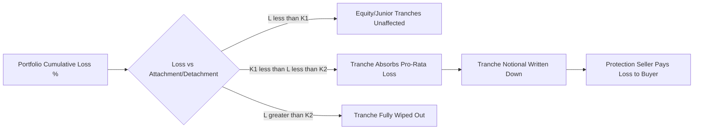

## CDS Indices and Index Tranches

### Overview

CDS Indices are standardized portfolios of single-name credit default swaps, providing a liquid, tradable proxy for aggregate credit risk in a defined market segment. Index Tranches subdivide the loss distribution of these portfolios into contiguous ranges (attachment/detachment points), allowing investors to take leveraged, correlation-sensitive exposure to specific segments of portfolio loss rather than the whole. Together they form the core infrastructure of the portfolio credit derivatives market and the primary vehicle through which correlation is traded as an asset class.

### CDS Index Fundamentals

**Key Points**

- Standardized, equally-weighted baskets of single-name CDS on a fixed number of Reference Entities, re-constituted ("rolled") on a semi-annual basis (typically March 20 and September 20)
- The two dominant index families: **CDX** (North American and Emerging Market reference entities, administered under Markit/IHS Markit, now part of S&P Global) and **iTraxx** (European and Asian-Pacific reference entities)
- Each new series ("on-the-run") replaces defaulted, downgraded, or otherwise ineligible names from the prior series based on published index rules

**Major Index Families**

| Index | Region | Constituents | Typical Tenor |
| --- | --- | --- | --- |
| CDX.NA.IG | North America Investment Grade | 125 names | 5Y (also 3Y, 7Y, 10Y) |
| CDX.NA.HY | North America High Yield | 100 names | 5Y |
| iTraxx Europe (Main) | European Investment Grade | 125 names | 5Y |
| iTraxx Crossover (XO) | European Sub-IG / Crossover | 75 names | 5Y |

Index quoting conventions follow the same fixed-coupon architecture introduced for single-name CDS under the Big Bang Protocol: contracts trade with a **standardized fixed coupon** (e.g., 100bp for IG, 500bp for HY), with the difference between the fixed coupon and the market-implied spread settled via an **upfront payment** at trade inception.

**Upfront Payment Approximation**

$$Upfront \approx (Spread - FixedCoupon) \times RiskyAnnuity \times Notional$$

where the Risky Annuity (or "risky PV01") reflects the present value of 1bp paid over the life of the contract, discounted for both interest rates and the survival probability of the underlying credit risk.

### Index Roll Mechanics

**Example**

When CDX.NA.IG rolls from Series 40 to Series 41:

1. Names that defaulted, were downgraded below investment grade, or ceased to meet eligibility criteria during Series 40's life are removed
2. Replacement names are selected via a dealer poll administered by the index sponsor, subject to liquidity and sector-balance rules
3. The new Series 41 becomes the "on-the-run" (most liquid) contract; Series 40 continues trading but liquidity migrates to the new series
4. Basis between old and new series ("roll basis") reflects the change in average credit quality of the reconstituted basket

### Index Tranches: Structure and Payout

**Key Points**

- A tranche isolates losses in the reference portfolio between an **attachment point** ($K_1$) and a **detachment point** ($K_2$), expressed as a percentage of total portfolio notional
- The tranche investor (protection seller) absorbs losses only once cumulative portfolio losses exceed $K_1$, up to $K_2$; below $K_1$ the tranche is unaffected, above $K_2$ it is fully wiped out
- Standardized CDX/iTraxx tranche structures divide the capital structure into: **Equity** (0–3%), **Junior Mezzanine** (3–7%), **Senior Mezzanine** (7–10% or 7–15%), **Senior** (10–15% or 15–30%), and **Super Senior** (30–100%), with exact breakpoints varying by index family and vintage

**Tranche Loss Function**

For a tranche with attachment $K_1$ and detachment $K_2$, given cumulative portfolio percentage loss $L$:

$$TrancheLoss(L) = \frac{\max(0, \min(L, K_2) - K_1)}{K_2 - K_1}$$

This expresses the tranche's loss as a fraction of its own notional, given the portfolio's realized cumulative loss $L$.

### The Role of Correlation

**Key Points**

- Tranche pricing depends critically on the **default correlation** assumed among the underlying names, not merely their individual default probabilities
- **Equity tranches** are short correlation: higher correlation reduces expected equity tranche loss (fewer "just enough" defaults spread evenly; risk polarizes toward either very few or many joint defaults, and the equity tranche's capped notional means it's insensitive to the tail beyond its exhaustion)
- **Senior/Super Senior tranches** are long correlation: higher correlation increases the probability of the systemic, correlated default scenario that would erode into senior loss layers
- **Mezzanine tranches** have comparatively ambiguous, often near-zero, first-order correlation sensitivity, since gains and losses from correlation shifts partially offset within the layer

[Inference] This directional sensitivity is why the market characterizes equity tranches as "short correlation" and senior tranches as "long correlation" positions — the terminology reflects the sign of the tranche's valuation sensitivity to a shift in the assumed correlation parameter, not a literal traded correlation instrument.

### Pricing Framework: The Gaussian Copula

**Key Points**

- The industry-standard (though widely critiqued) approach models joint default times using a **Gaussian copula**, linking each name's marginal default distribution through a single correlation parameter (or correlation matrix)
- The **one-factor Gaussian copula** decomposes each obligor's asset value into a common systemic factor $M$ and an idiosyncratic factor $Z_i$:

$$X_i = \sqrt{\rho} \cdot M + \sqrt{1-\rho}\cdot Z_i$$

where $M, Z_i \sim N(0,1)$ i.i.d., and $\rho$ is the pairwise asset correlation. Obligor $i$ defaults by time $t$ if $X_i$ falls below a threshold calibrated to match its marginal default probability at $t$.

- **Base Correlation**: rather than a single flat correlation across all tranches, the market quotes a **base correlation curve** — the implied correlation for a hypothetical 0%–$K$ equity tranche at each detachment point $K$, from which any arbitrary mezzanine tranche can be priced by differencing two base tranches

**Base Correlation Tranche Pricing**

For a tranche $[K_1, K_2]$, its value is derived from two synthetic 0%-to-$K$ equity tranches:

$$V_{[K_1,K_2]} = V_{[0,K_2]}(\rho_{K_2}) - V_{[0,K_1]}(\rho_{K_1})$$

using the base correlations $\rho_{K_1}$ and $\rho_{K_2}$ read off the market-implied base correlation skew/term structure for those specific detachment points.

### Correlation Skew

**Example**

Analogous to volatility skew in options markets, base correlation typically exhibits a "skew" across detachment points — implied correlation is not flat across $K$. Empirically, base correlation tends to rise with detachment point (a "correlation smile" or upward skew), reflecting the market's pricing of tail/systemic risk beyond what a single flat correlation assumption would capture. [Unverified] The precise shape and level of the skew is market-and-period dependent and should be sourced from current dealer marks or index tranche quote services rather than assumed constant.

### The "Correlation Crisis" and Model Limitations

**Key Points**

- The Gaussian copula was heavily criticized following the 2008 financial crisis for underestimating tail dependency (joint, systemic default risk), since the Gaussian distribution has thin tails relative to observed clustering of defaults in stress periods
- Alternative copulas (Student-t, double-t, Marshall-Olkin, random factor loading models) have been proposed to better capture fat-tailed joint default behavior, at the cost of additional parameters and reduced market standardization
- Base correlation itself is an internally inconsistent construct in a strict sense (it is not a "true" single correlation but a curve-fitting device across detachment points), a widely acknowledged limitation of the framework

[Inference] The persistence of base correlation as the market standard, despite its known theoretical shortcomings, likely reflects its tractability and the market's need for a consistent, arbitrage-free interpolation/quoting convention across the standardized tranche structure, rather than a claim that it is the most theoretically sound model available.

### Bespoke vs. Standardized Tranches

**Key Points**

- **Standardized tranches** reference the fixed CDX/iTraxx index composition and use exchange/dealer-published standardized attachment/detachment points, with reasonably liquid two-way quotes
- **Bespoke tranches** are customized both in underlying portfolio composition (client-selected names) and in attachment/detachment structure, tailored to investor risk appetite — historically a large pre-2008 CDO business line, now substantially reduced in liquidity and issuance volume
- Bespoke tranche pricing typically maps the bespoke portfolio's risk onto the standardized index base correlation skew via **portfolio loss matching** techniques (e.g., matching expected loss or a moment of the loss distribution to an equivalent point on the index skew)

### Risk Sensitivities of Tranches

**Key Points**

- **Delta** (spread sensitivity): tranches are quoted/hedged with a "tranche delta" relative to the underlying index — equity tranches carry the highest delta (most spread-sensitive per unit notional) due to leverage, decreasing through the capital structure
- **Gamma**: equity and junior mezzanine tranches exhibit significant convexity, especially as underlying spreads widen toward levels implying imminent attachment
- Delta-hedging a tranche position with the underlying CDS index is standard practice, but hedge effectiveness degrades under correlation regime shifts, since the index delta does not capture pure correlation risk

### Conclusion

**Conclusion**

CDS indices provide the standardized, liquid beta exposure to broad credit markets, while their associated tranches decompose that same portfolio's loss distribution into risk layers whose valuation is fundamentally a function of assumed default correlation rather than spread level alone. The base correlation framework, despite its acknowledged theoretical inconsistencies, remains the market's practical mechanism for quoting and interpolating tranche risk across the standardized capital structure, and understanding the directional correlation sensitivity of each tranche layer (short correlation at the equity level, long correlation at the senior level) is essential to interpreting and hedging these positions.

**Related Topics**

- Gaussian Copula Model Mechanics and Monte Carlo Simulation for Portfolio Credit Risk
- Expected Loss, Tranche Delta, and Hedge Ratio Calculation
- Synthetic CDOs and Bespoke Portfolio Structuring
- CDS Index Options (Payer/Receiver Swaptions on CDX/iTraxx)
- Correlation Skew Dynamics and the "Correlation Smile"
- Recovery Rate Assumptions and Their Impact on Tranche Pricing
- Counterparty Risk and CVA in Portfolio Credit Derivatives