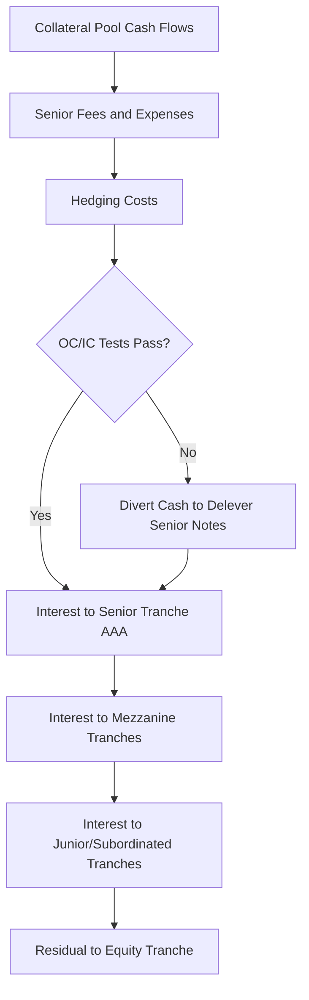

## Collateralized Debt Obligation Structures

### Overview

A Collateralized Debt Obligation (CDO) is a structured finance vehicle that pools a portfolio of credit-sensitive assets and redistributes the cash flows and credit risk of that pool into multiple tranches of securities with differing seniority, risk, and return profiles. CDOs transform a single, homogeneous pool of underlying risk into a heterogeneous set of claims, enabling investors with different risk appetites to gain exposure to distinct layers of the same portfolio's loss distribution. CDOs are structurally and economically related to index tranches but differ in that they typically involve actual funding, a special purpose vehicle (SPV), and real (cash) or synthetic collateral, with legal note issuance rather than purely derivative contracts.

### Core Structural Components

**Key Points**

- **Special Purpose Vehicle (SPV) / Issuer**: a bankruptcy-remote legal entity that holds the collateral pool and issues the tranched liabilities (notes)
- **Collateral Pool**: the underlying assets generating cash flows and credit risk — bonds, loans, CDS, or other CDOs
- **Capital Structure / Tranches**: liabilities issued by the SPV, ranked by seniority, each with its own attachment/detachment point in the loss waterfall
- **Collateral Manager**: (in actively managed structures) responsible for asset selection, ongoing surveillance, and trading within reinvestment guidelines
- **Trustee**: administers cash flows, tests compliance with structural covenants, and enforces waterfall mechanics
- **Waterfall**: the contractual priority of payments (interest and principal) governing how collateral cash flows are distributed among tranches and expenses

### Classification by Collateral Type

**Key Points**

- **CLO (Collateralized Loan Obligation)**: collateral pool of leveraged loans, typically broadly syndicated corporate loans; the dominant CDO sub-asset class in current markets
- **CBO (Collateralized Bond Obligation)**: collateral pool of high-yield or investment-grade bonds
- **CDO-Squared**: a CDO whose collateral pool consists of tranches issued by other CDOs, compounding correlation and model risk
- **Synthetic CDO**: collateral risk is referenced via CDS rather than physically-held bonds/loans (see Index Tranches); the SPV sells protection on a reference portfolio rather than purchasing cash assets
- **Cash CDO**: SPV directly purchases and holds the physical collateral assets, funding the purchase through note issuance

### Classification by Purpose/Motivation

**Key Points**

- **Balance Sheet CDO**: originated by a bank/originator to transfer credit risk of assets already on its balance sheet, achieving regulatory capital relief or risk transfer
- **Arbitrage CDO**: originated by an asset manager to capture the spread between the yield on the collateral pool and the (lower) blended cost of the issued liabilities, with the manager earning fees and the equity tranche capturing the residual arbitrage
- **Market Value CDO**: tranche payments depend on the mark-to-market value of the collateral pool (subject to periodic revaluation and forced-sale triggers), as opposed to...
- **Cash Flow CDO**: tranche payments depend solely on the contractual cash flows (interest/principal) generated by the collateral, with performance judged by collateral coverage tests rather than mark-to-market value — the dominant structure in the current CLO market

### The Waterfall Mechanism

**Key Points**

- Cash flows from the collateral pool are distributed in a strict priority order (the "waterfall"), typically separated into an **interest waterfall** and a **principal waterfall**
- Senior fees and hedging costs are paid first, followed sequentially by interest to each tranche from most senior to most junior, then principal repayment in similar seniority order (in the amortization/post-reinvestment period)
- **Coverage Tests** (Overcollateralization (OC) tests and Interest Coverage (IC) tests) act as structural circuit breakers: if a test fails, cash flows are diverted away from junior tranches/equity and redirected to pay down senior notes, deleveraging the structure to protect senior investors

**Overcollateralization Test**

$$OC\ Ratio = \frac{\text{Aggregate Collateral Balance (at test date)}}{\text{Aggregate Balance of Tranche and All Senior Tranches}}$$

If the OC Ratio for a given tranche falls below its covenanted trigger level, the waterfall diverts principal (and sometimes interest) proceeds to pay down the senior-most notes until the ratio is restored, at the expense of distributions to equity and junior mezzanine holders.

### Typical Capital Structure (Illustrative CLO)

**Example**

| Tranche | Rating (typical) | Attach % | Detach % | Coupon Type |
| --- | --- | --- | --- | --- |
| Class A (Senior) | AAA | 38% | 100% | Floating (SOFR + spread) |
| Class B | AA | 29% | 38% | Floating |
| Class C | A | 22% | 29% | Floating |
| Class D | BBB | 16% | 22% | Floating |
| Class E | BB | 11% | 16% | Floating |
| Subordinated/Equity | Unrated | 0% | 11% | Residual cash flow |

[Unverified] Exact attachment points, rating levels, and tranche thickness vary materially by vintage, manager, and collateral quality; the table above illustrates typical structural proportions rather than a specific deal's terms.

### CDO Lifecycle

**Key Points**

- **Ramp-Up Period**: initial period during which the collateral manager acquires the target portfolio using proceeds from note issuance
- **Reinvestment Period**: (for actively managed cash flow CDOs) principal proceeds from maturing/prepaying/sold collateral may be reinvested in new collateral, subject to eligibility criteria and coverage test compliance, rather than being passed through to noteholders
- **Amortization Period**: following the reinvestment period, principal proceeds are distributed sequentially to noteholders (senior-most first) rather than reinvested, progressively deleveraging the structure

### Equity Tranche Economics

**Key Points**

- The equity/subordinated tranche receives the residual cash flow after all senior obligations, fees, and coverage tests are satisfied — effectively a leveraged, first-loss position on the collateral pool
- Equity returns are driven by the **arbitrage** between the weighted average collateral yield and the weighted average cost of the rated liabilities, net of losses and manager fees
- Equity tranche value is highly sensitive to default timing, recovery rates, and — as with index tranches — the correlation structure of joint defaults within the pool

$$Equity\ Return \approx \frac{WAC_{collateral} - WAC_{liabilities} - Losses - Fees}{Equity\ Notional}$$

where $WAC$ denotes weighted average coupon/cost.

### Rating Agency Modeling Approach

**Key Points**

- Rating agencies (Moody's, S&P, Fitch) apply distinct quantitative frameworks to assign tranche ratings — e.g., Moody's Binomial Expansion Technique (BET) and CDOROM Monte Carlo simulation approaches, S&P's CDO Evaluator
- Models simulate (or approximate via a diversity score / default distribution) the joint default behavior of the collateral pool, incorporating default probability, recovery assumptions, and asset correlation, to estimate the expected loss to each tranche
- [Inference] The 2008 crisis is widely understood to have exposed material shortcomings in these models' correlation and tail-risk assumptions, particularly for structured-finance-collateral CDOs (CDOs backed by RMBS/ABS tranches rather than corporate credit), contributing to significant rating downgrades across the sector; this assessment reflects broad post-crisis consensus rather than a single documented mechanism.

### CDO vs. Synthetic Index Tranche: Key Distinctions

**Key Points**

- CDOs typically involve actual note issuance and funding (cash structures) or SPV-level derivative exposure (synthetic), whereas standardized index tranches are purely unfunded derivative contracts referencing the CDX/iTraxx index
- CDO collateral pools are often actively managed and can be static or dynamically substituted (within guidelines), while standard index tranches reference a fixed, publicly-defined index composition that only changes at semi-annual rolls
- CDO tranche liquidity and price transparency are generally materially lower than standardized index tranches, since each CDO deal has bespoke collateral and structural terms

### Risk Considerations

**Key Points**

- **Correlation Risk**: as with index tranches, junior/equity tranches are short correlation and senior tranches are long correlation with respect to the joint default behavior of the pool
- **Manager Risk**: performance of actively managed CDOs depends on the collateral manager's asset selection, trading, and workout skill, an idiosyncratic risk not present in static/index-referencing structures
- **Extension/Prepayment Risk**: reinvestment period length and underlying loan prepayment behavior affect the timing (and thus value) of cash flows to noteholders
- **Model/Rating Risk**: reliance on rating agency models for initial tranche ratings introduces risk that model assumptions (correlation, recovery, default timing) diverge materially from realized outcomes, as observed during the 2008 crisis for certain CDO sub-sectors

### Conclusion

**Conclusion**

CDO structures generalize the tranching logic of index tranches into a funded, often actively-managed vehicle with its own SPV, waterfall, and structural protections (coverage tests) designed to reallocate risk among noteholders as collateral performance evolves. While conceptually similar to synthetic index tranches in their reliance on portfolio loss distribution and correlation-sensitive tranche economics, CDOs differ meaningfully in funding mechanics, collateral management, structural triggers, and liquidity — distinctions that proved consequential during the 2008 financial crisis and continue to shape how CLOs (the dominant surviving CDO sub-asset class) are structured and rated today.

**Related Topics**

- CLO Manager Selection, Reinvestment Criteria, and Trading Guidelines
- Overcollateralization and Interest Coverage Test Mechanics in Detail
- CDO-Squared and Correlation Compounding Risk
- Rating Agency Models: Moody's BET/CDOROM vs. S&P CDO Evaluator
- Post-Crisis Regulatory Response: Risk Retention Rules for Securitizations
- Comparing CLO Equity Returns to Synthetic Index Tranche Equity
- Leveraged Loan Market Fundamentals and Loan-Level Credit Analysis