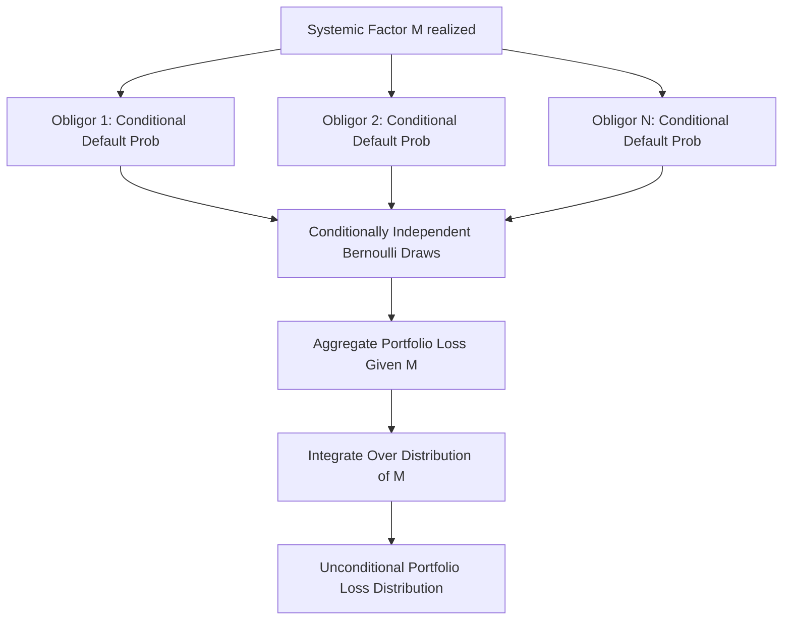

## Default Correlation and Copula Models

### Overview

Default correlation describes the tendency of multiple obligors within a credit portfolio to default in a related, non-independent manner, driven by shared exposure to systemic economic factors, sector-specific shocks, or direct contractual linkages. Copula models provide the mathematical machinery to construct a joint default-time distribution for a portfolio from individual (marginal) default probabilities plus a dependence structure, without requiring the marginals themselves to follow any particular joint distributional family. This framework underlies the pricing of nearly all portfolio credit derivatives, including CDS index tranches and CDOs.

### Why Default Correlation Matters

**Key Points**

- Individual single-name CDS pricing depends only on the marginal survival/default probability curve and recovery assumption for that one name — correlation is irrelevant
- Portfolio products (tranches, CDOs, basket default swaps, nth-to-default swaps) pay out based on the *joint* loss distribution of multiple names, so the dependence structure between defaults becomes a first-order pricing input, not a second-order refinement
- Two portfolios with identical marginal default probabilities can have vastly different tranche prices depending solely on the assumed correlation, since correlation reshapes the *distribution* of the number of joint defaults (independent defaults cluster near the expected value; highly correlated defaults produce a bimodal outcome — either very few or very many)

### Copula Theory Fundamentals

**Key Points**

- A copula is a function that couples univariate marginal distributions into a joint multivariate distribution, formalized by **Sklar's Theorem**: any joint distribution $F(x_1,...,x_n)$ can be written as $F(x_1,...,x_n) = C(F_1(x_1),...,F_n(x_n))$ for some copula function $C$
- This separation allows practitioners to specify marginal default probabilities from each name's own CDS curve independently, then impose a dependence structure via the copula, without the two choices constraining each other
- The copula fully captures the dependence structure; changing the copula family or its parameters while holding marginals fixed changes only the joint/tail behavior, not any individual name's standalone default probability

$$F(t_1,...,t_n) = C\big(F_1(t_1),...,F_n(t_n);\theta\big)$$

where $t_i$ are default times, $F_i$ are marginal default-time CDFs, and $\theta$ parameterizes the copula's dependence strength.

### The Gaussian Copula (One-Factor Model)

**Key Points**

- The market-standard approach (introduced by Li (2000) in a credit context, adapting a technique from actuarial science) maps each obligor's default time to a latent, normally-distributed "asset value" variable
- In the **one-factor** simplification, each obligor's latent variable decomposes into a common systemic factor and an idiosyncratic factor:

$$X_i = \sqrt{\rho}\,M + \sqrt{1-\rho}\,Z_i, \qquad M, Z_i \overset{iid}{\sim} N(0,1)$$

- Obligor $i$ is deemed to default by time $t$ if $X_i \leq \Phi^{-1}(F_i(t))$, where $F_i(t)$ is the obligor's marginal cumulative default probability by $t$ (from its CDS-implied survival curve) and $\Phi^{-1}$ is the inverse standard normal CDF
- $\rho$ is the pairwise asset correlation; $\rho = 0$ recovers independent defaults, $\rho = 1$ implies perfect co-movement (all names default simultaneously or none do)

**Conditional Independence Property**

Given a realization of the systemic factor $M$, each obligor's default becomes conditionally independent of every other obligor:

$$P(X_i \leq x \mid M) = \Phi\left(\frac{x - \sqrt{\rho}M}{\sqrt{1-\rho}}\right)$$

This conditional independence is what makes the one-factor Gaussian copula computationally tractable: the portfolio loss distribution can be computed by conditioning on $M$, applying standard binomial-type aggregation across names, then integrating over the distribution of $M$ — avoiding a full $n$-dimensional joint simulation for closed-form/semi-analytic pricing.

### Semi-Analytic Pricing via Conditional Recursion

**Example**

For a homogeneous portfolio (equal notional, equal marginal default probability $p$, equal recovery $R$) of $n$ names, conditional on $M$:

1. Compute the conditional individual default probability $p(M) = \Phi\left(\frac{\Phi^{-1}(p) - \sqrt{\rho}M}{\sqrt{1-\rho}}\right)$
2. The number of defaults conditional on $M$ follows a Binomial$(n, p(M))$ distribution
3. Compute the tranche loss for each possible number of defaults $k = 0,...,n$
4. Integrate (numerically, via Gauss-Hermite quadrature) over the distribution of $M$ to obtain the unconditional expected tranche loss:

$$E[\text{TrancheLoss}] = \int_{-\infty}^{\infty} \left[\sum_{k=0}^{n}\binom{n}{k}p(m)^k(1-p(m))^{n-k}\cdot \text{TrancheLoss}(k)\right]\phi(m)\,dm$$

This recursive/quadrature approach (closely related to Andersen-Sidenius-Basu's recursive algorithm) allows tranche pricing without full Monte Carlo simulation, making it the standard production method for index tranches. [Inference] The prevalence of this semi-analytic method in trading desk infrastructure is generally attributed to the significant speed advantage it offers for real-time quoting versus full Monte Carlo, though desks may still use simulation for validation, exotic tranche features, or heterogeneous portfolios where closed-form recursion is less tractable.

### Correlation Sensitivity and the "Correlation Smile"

**Key Points**

- **Compound correlation**: the single flat correlation $\rho$ that reprices a specific tranche $[K_1,K_2]$ to match its observed market price — suffers from non-uniqueness (multiple $\rho$ values can produce the same mezzanine tranche price) and non-monotonicity, limiting its practical usability
- **Base correlation**: the market-standard alternative, quoting implied correlation for hypothetical cumulative equity tranches $[0,K]$ at each detachment point $K$; any tranche can then be priced by differencing two adjacent base-correlation-implied equity tranche values, avoiding compound correlation's non-uniqueness problem
- Empirically, base correlation is not flat across $K$ (a flat curve would be predicted if the Gaussian copula with a single $\rho$ perfectly described the market) — it typically rises with detachment point, exhibiting a **correlation skew**, analogous to volatility skew in equity/rates options markets

[Unverified] The specific magnitude and shape of the skew varies by index, vintage, and market regime, and should be sourced from live market quotes rather than treated as a fixed constant.

### Limitations of the Gaussian Copula

**Key Points**

- **Thin tails**: the Gaussian distribution underweights the probability of extreme joint outcomes (many simultaneous defaults) relative to historically observed default clustering during systemic stress, understating senior tranche and super-senior risk in crisis scenarios
- **Static, one-period dependence**: the standard implementation does not naturally capture *time-varying* correlation (e.g., correlation rising specifically during stress periods) without extension
- **Lack of a true dynamic/multi-period consistency**: the model is often applied at a single time horizon rather than as a fully dynamic term-structure-consistent default process, creating potential inconsistencies when pricing bespoke maturities or forward-starting tranches
- **Base correlation is not a coherent single-parameter description**: since different $\rho$ values are needed at different detachment points to match market prices, the "correlation" being quoted is better understood as a curve-fitting/interpolation device than a literal, singular correlation parameter

[Inference] These limitations are widely credited (in post-2008 market commentary and academic literature) as a contributing factor — among several, including underwriting standards and rating agency assumptions — to the mispricing of senior CDO tranches referencing structured-finance collateral prior to the financial crisis; this remains an area of extensive academic and practitioner discussion rather than a single settled causal account.

### Alternative Copula Approaches

**Key Points**

- **Student-t Copula**: replaces the normal marginal/systemic factors with a Student-t distribution, introducing fatter tails and thus greater joint/tail default probability for a given correlation level; parameterized by both a correlation matrix and degrees-of-freedom (tail-thickness) parameter
- **Double-t Copula**: uses different degrees of freedom for the systemic factor versus the idiosyncratic factor, allowing more flexible independent control over systemic tail risk versus idiosyncratic tail risk
- **Marshall-Olkin (Common Shock) Models**: model dependence via shared "shock" processes that can simultaneously trigger default across multiple names, offering a more structurally intuitive representation of contagion/systemic events than a purely statistical copula parameterization
- **Random Factor Loading Models**: allow the factor loading $\sqrt{\rho}$ itself to be a (typically decreasing) function of the systemic factor $M$, generating higher effective correlation in downturns — directly addressing the static-correlation critique of the base Gaussian model
- **Archimedean Copulas** (Clayton, Gumbel, Frank): alternative copula families offering asymmetric tail dependence (e.g., stronger dependence in the lower/default tail than the upper tail), used in some academic and specialized quant contexts

[Unverified] Adoption of these alternatives varies significantly by institution and use case; the Gaussian copula (via the base correlation convention) remains the dominant market quoting standard for standardized index tranches despite the theoretical appeal of these alternatives, largely for consistency, tractability, and comparability with other market participants' marks.

### Estimating Default Correlation in Practice

**Key Points**

- **Asset correlation proxies**: equity return correlation is commonly used as an observable proxy for latent asset correlation, following the structural (Merton-style) interpretation underlying the Gaussian copula's latent variable
- **Historical default correlation**: estimated from realized joint default/rating transition data, though sparse tail events make statistically robust estimation difficult, particularly for high-grade names where historical defaults are rare
- **Market-implied correlation**: back solving from observed tranche prices (i.e., base correlation itself), reflecting the market's collective forward-looking assessment rather than a purely historical/statistical estimate
- **Sector and regional groupings**: many practical implementations use a multi-factor extension (rather than a single global factor $M$) with sector- or region-specific systemic factors plus a global factor, to better capture intra-sector versus inter-sector correlation differences

### Multi-Factor Extensions

**Key Points**

- Real-world portfolios span multiple sectors and geographies, motivating multi-factor generalizations of the one-factor model where each obligor loads on both a global factor and a sector-specific factor
- This captures the empirical observation that intra-sector default correlation (e.g., two airlines) is typically higher than inter-sector correlation (e.g., an airline and a utility), a distinction the single-factor model cannot represent
- The tradeoff is increased calibration complexity (more correlation parameters to estimate/calibrate) and loss of some closed-form tractability relative to the one-factor recursion

### Conclusion

**Conclusion**

Copula models, and the Gaussian one-factor copula in particular, provide the foundational technology for translating individual obligors' marginal default probabilities into a portfolio-level joint loss distribution, which is the essential input for pricing any correlation-sensitive credit product. While the base correlation convention built atop the Gaussian copula remains the market's practical standard for quoting standardized tranches, its well-documented limitations — thin tails, static dependence, and the internal inconsistency of a curve-fitting "correlation" — have motivated a substantial body of alternative modeling approaches, even as the original framework persists due to its tractability and its role as a shared market quoting language.

**Related Topics**

- Base Correlation Skew Interpolation and Arbitrage-Free Construction
- CDS Index Tranches: Pricing and Risk Sensitivities
- Nth-to-Default Basket Swaps and Basket Correlation Pricing
- Monte Carlo Simulation Methods for Portfolio Credit Risk
- Merton Structural Credit Risk Model and the Asset-Value Interpretation
- Multi-Factor and Sector-Correlation Modeling Approaches
- Post-Crisis Critiques of Correlation Models in Structured Finance