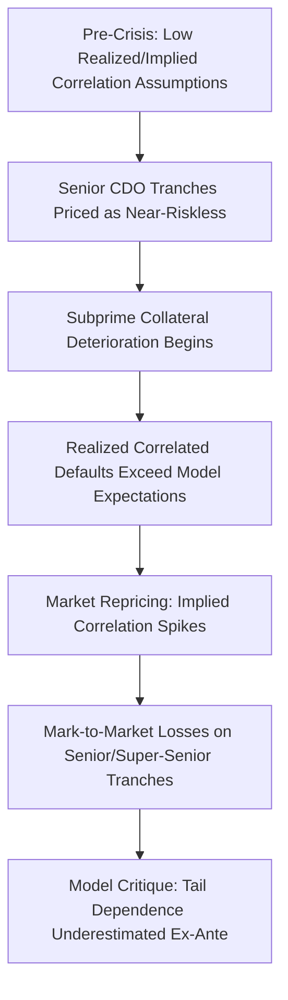

## The Gaussian Copula and Its Critiques

### Overview

The Gaussian copula is the mathematical model that, more than any other single technique, enabled the scaling of the portfolio credit derivatives market in the 2000s — providing a tractable way to price CDS index tranches and CDOs by translating individual default probabilities into a joint portfolio loss distribution via a single (or low-dimensional) correlation parameter. Its adoption, mechanics, and subsequent well-documented failures during the 2008 financial crisis make it one of the most scrutinized models in modern quantitative finance, often cited as a case study in model risk. This entry focuses specifically on the model's structural properties and the substantive critiques leveled against it, complementing the broader copula pricing mechanics covered elsewhere in this curriculum.

### Model Mechanics Recap

**Key Points**

- Each obligor $i$'s default is governed by a latent normally-distributed variable $X_i = \sqrt{\rho}M + \sqrt{1-\rho}Z_i$, where $M$ is a common systemic factor and $Z_i$ is idiosyncratic, both standard normal
- Obligor $i$ defaults by time $t$ if $X_i \leq \Phi^{-1}(F_i(t))$, where $F_i(t)$ is that obligor's marginal cumulative default probability (from its CDS curve) and $\Phi^{-1}$ is the inverse standard normal CDF
- Conditional on $M$, defaults are independent across obligors, which is what permits fast semi-analytic pricing via conditional recursion rather than full joint simulation

$$X_i = \sqrt{\rho}\,M + \sqrt{1-\rho}\,Z_i, \qquad M,Z_i \overset{iid}{\sim}N(0,1)$$

### Origin and Adoption

**Key Points**

- The technique was adapted into credit modeling by David X. Li (2000), drawing on survival-time copula methods already established in actuarial science and biostatistics for modeling joint lifetimes
- Rapid adoption followed because the model solved a genuine practical problem: pricing multi-name credit derivatives (basket swaps, CDO tranches) required a joint default distribution, and full structural or empirically-estimated joint models were either intractable or under-identified given sparse historical default data
- The model's popularity was driven substantially by tractability and the emergence of the base correlation quoting convention (see the dedicated entry on default correlation and copula models), which gave the market a standardized way to communicate tranche prices — not solely by claims of superior theoretical accuracy

[Inference] The rapid, industry-wide standardization around this single model — despite awareness among many quants of its theoretical simplifications even at the time — is generally attributed to the coordination value of having one shared market convention for quoting, more than to a consensus that it was the most realistic representation of joint default risk.

### Critique 1: Tail Dependence and the Underestimation of Joint Extreme Events

**Key Points**

- The multivariate Gaussian distribution exhibits **zero asymptotic tail dependence**: as the marginal threshold defining an "extreme" event becomes more extreme, the probability of two Gaussian-linked variables both exceeding it jointly goes to zero faster than for many other dependence structures
- In practical terms, this means the model understates the probability of many names defaulting together in a severe systemic event relative to historically observed default clustering during downturns
- This specifically understated the risk to senior and super-senior tranches, whose loss depends almost entirely on the far tail of the joint default distribution — precisely the region the Gaussian copula represents least accurately

**Illustration: Tail Dependence Comparison (svg_diagram)**

<svg xmlns="http://www.w3.org/2000/svg" viewBox="0 0 700 380">
<rect width="700" height="380" fill="none" />
<text x="350" y="25" text-anchor="middle" font-size="16" font-weight="bold" fill="#1a1a1a">Joint Tail Probability vs. Threshold Severity (svg_diagram)</text>
<line x1="70" y1="320" x2="650" y2="320" stroke="#333" stroke-width="1.5" />
<line x1="70" y1="320" x2="70" y2="60" stroke="#333" stroke-width="1.5" />
<text x="360" y="355" text-anchor="middle" font-size="13" fill="#333">Severity of Marginal Default Threshold →</text>
<text x="30" y="190" text-anchor="middle" font-size="13" fill="#333" transform="rotate(-90 30 190)">P(Joint Extreme Event)</text>
<path d="M 70 100 C 200 180, 350 280, 640 315" stroke="#c0392b" stroke-width="2.5" fill="none" />
<text x="450" y="270" font-size="12" fill="#c0392b" font-weight="bold">Fat-tailed copula (e.g., Student-t)</text>
<path d="M 70 100 C 150 250, 250 310, 640 319" stroke="#2980b9" stroke-width="2.5" fill="none" />
<text x="420" y="335" font-size="12" fill="#2980b9" font-weight="bold">Gaussian copula (tail dependence → 0)</text>
<circle cx="70" cy="100" r="4" fill="#1a1a1a" />
<text x="80" y="95" font-size="11" fill="#1a1a1a">Both curves start equal at moderate thresholds</text>
</svg>

### Critique 2: Static, Single-Period Dependence

**Key Points**

- The standard implementation fixes a single correlation parameter for the life of the trade, with no mechanism for correlation to rise specifically during periods of market stress — a phenomenon well documented empirically (correlations across assets and credits tend to increase in crises, sometimes termed "correlation breakdown" or "flight to quality" co-movement)
- The model is typically calibrated and applied at a single horizon (the tranche's maturity) rather than as a fully time-consistent dynamic process, which can create inconsistencies when the same portfolio must be priced across multiple tenors or for forward-starting exposures
- [Inference] This staticity is generally understood as a simplification made deliberately for tractability rather than an oversight, but it means the model does not endogenously generate the regime-dependent correlation behavior that dynamic/random factor loading extensions were later built to address.

### Critique 3: Base Correlation Is Not a True Single Parameter

**Key Points**

- To match observed market tranche prices, different correlation values are required at different detachment points — producing the base correlation "skew" rather than a flat curve
- This directly contradicts the premise of a single-parameter Gaussian copula fully describing the joint distribution: if it did, one correlation value would reprice every tranche on the capital structure simultaneously
- Base correlation is consequently best understood as an **interpolation and quoting convention** — a way of parameterizing market prices for comparison and hedging purposes — rather than validation of the underlying model's structural correctness

[Unverified] Whether this should be read as a fundamental flaw in the copula framework itself, or simply as evidence that a one-factor, single-correlation Gaussian specification is too parsimonious for real portfolios (with richer multi-factor or alternative-copula models potentially resolving the skew), remains a matter of ongoing modeling debate rather than settled consensus.

### Critique 4: Calibration and Parameter Estimation Difficulty

**Key Points**

- Asset correlation $\rho$ is not directly observable; practitioners typically proxy it using equity return correlation (via the structural/Merton interpretation) or back it out from market tranche prices, each approach embedding its own assumptions and potential biases
- Historical estimation of true default correlation is statistically fragile because joint default events, especially among investment-grade names, are rare, leaving limited data to distinguish competing correlation assumptions empirically
- This estimation uncertainty compounds with model uncertainty: even if the Gaussian copula functional form were accepted, disagreement over the correct correlation input level can produce materially different senior tranche valuations

### Critique 5: Pro-Cyclicality and Feedback Effects During the 2008 Crisis

**Key Points**

- As realized defaults and downgrades in structured-finance-collateral CDOs (particularly those referencing subprime RMBS tranches) began accumulating in 2007–2008, the market's *implied* correlation and loss assumptions repriced sharply, causing mark-to-market losses on senior tranches that the pre-crisis model calibrations had judged extremely unlikely
- [Inference] Post-crisis commentary widely characterizes this as evidence that the model's tail-risk understatement was not merely a theoretical concern but had material, realized pricing consequences — although the crisis is also broadly attributed to compounding factors beyond the copula model itself, including underwriting standard deterioration, rating agency assumptions on the underlying collateral, and correlation between the collateral pool and the broader housing/credit cycle that no single-period copula calibration was designed to anticipate.
- The widely-cited characterization of the Gaussian copula as the formula that "killed Wall Street" (from contemporaneous financial journalism) reflects this narrative, though many quantitative practitioners have argued this framing overstates the model's causal role relative to the broader set of contributing factors.

### Responses and Extensions Developed Post-Critique

**Key Points**

- **Student-t and double-t copulas**: introduce explicit fat tails via degrees-of-freedom parameters, directly targeting the tail-dependence critique
- **Random factor loading models**: allow the factor loading on the systemic factor to increase during adverse realizations of $M$, generating the empirically-observed rise in correlation during downturns without abandoning the one-factor structure entirely
- **Marshall-Olkin / common-shock models**: replace the purely statistical copula linkage with an explicit shared-shock mechanism, offering a more structurally interpretable form of contagion
- **Dynamic/multi-period credit portfolio models**: attempt to address the static-horizon critique by modeling the full term structure of joint default risk consistently, at the cost of significantly greater computational and calibration complexity

[Inference] None of these extensions has displaced the Gaussian copula/base correlation framework as the standardized market quoting convention for CDX/iTraxx index tranches, which suggests that the market's practical need for a common, tractable quoting language has continued to outweigh the theoretical appeal of more sophisticated alternatives for standardized (as opposed to bespoke or risk-management) applications — though this is an inference about market behavior rather than a documented industry-wide policy statement.

### Broader Lessons on Model Risk

**Key Points**

- The Gaussian copula episode is frequently used as a teaching case in model risk management: it illustrates how a model can be technically well-understood by its expert users (many quants were aware of its tail-dependence limitations well before 2008) while still becoming systemically important and mispriced in aggregate, due to standardization pressures, incentive structures, and the difficulty of unwinding a market-wide convention
- It also illustrates the distinction between a model being "wrong" in a narrow statistical sense versus being *used* in a way that amplifies systemic risk — the model's known limitations were arguably compounded by how broadly and confidently it was applied to novel collateral types (structured-finance CDOs) for which its assumptions were least tested
- [Speculation] Some practitioner and academic commentary has argued that the more durable lesson is less about the specific mathematical form of the copula and more about the risks of standardizing an entire market around a single tractable model without robust stress-testing of that model's tail behavior against alternative specifications; this is offered as one interpretive framing among several rather than an uncontested conclusion.

### Conclusion

**Conclusion**

The Gaussian copula's combination of tractability and standardization value made it the foundational pricing technology for the pre-crisis portfolio credit derivatives market, but its structural properties — zero tail dependence, static single-period correlation, and the internal inconsistency exposed by the base correlation skew — left it structurally ill-suited to capturing the correlated, systemic default risk that materialized in 2008. The model's persistence as the market quoting standard despite these well-known limitations, and the subsequent development of fatter-tailed and dynamic alternatives that have not displaced it for standardized products, together illustrate a recurring tension in quantitative finance between a model's theoretical completeness and its practical value as a shared market convention.

**Related Topics**

- Default Correlation and Copula Models: Full Mechanics and Alternatives
- Base Correlation Skew and Its Interpretation as a Quoting Convention
- Model Risk Management Frameworks in Derivatives Pricing
- The 2008 Financial Crisis: Structured Finance and Rating Agency Failures
- Random Factor Loading and Dynamic Correlation Models
- Structural (Merton) Credit Risk Models and Latent Asset Value Interpretations
- CDO-Squared Exposure and Compounding Correlation Assumptions