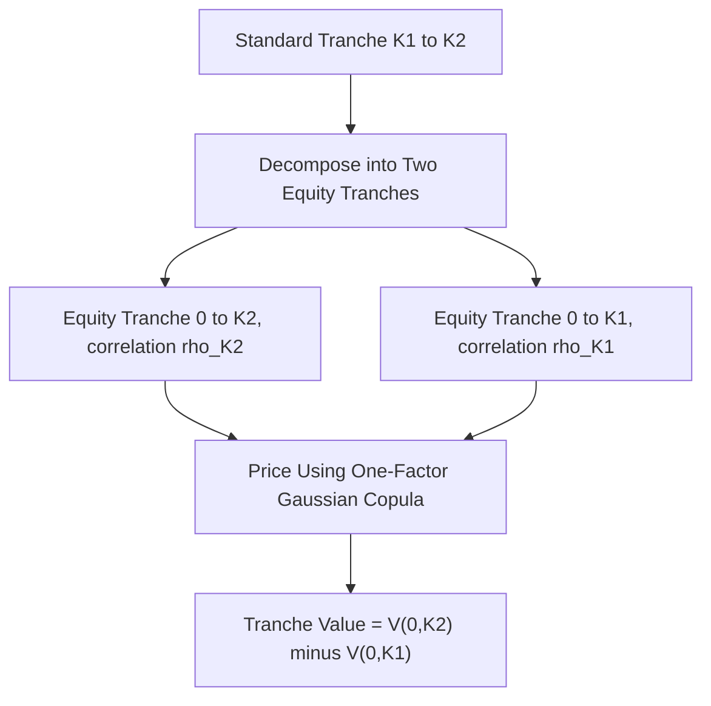

## Base Correlation and Tranche Pricing

### Overview

Base correlation is the market-standard convention for quoting and interpolating implied correlation across the standardized capital structure of CDS index tranches (CDX/iTraxx). It was developed specifically to overcome the non-uniqueness and non-monotonicity problems of the earlier "compound correlation" approach, by reformulating every tranche as the *difference* between two hypothetical equity ("0-to-K") tranches, each quoted with its own single correlation parameter. This entry focuses on the base correlation construction itself and its direct application to tranche pricing, building on the general copula/correlation framework covered elsewhere in this curriculum.

### The Problem Base Correlation Was Designed to Solve

**Key Points**

- **Compound correlation** attempts to find the single flat correlation $\rho$ that, when applied uniformly to a specific mezzanine tranche $[K_1, K_2]$, reproduces its observed market price
- For mezzanine tranches, the relationship between tranche value and correlation is **not monotonic** — tranche value can rise then fall (or vice versa) as $\rho$ increases, meaning a given market price may correspond to zero, one, or multiple compound correlation solutions
- This non-uniqueness makes compound correlation unreliable for interpolation (e.g., pricing an off-market or bespoke tranche by interpolating between quoted points) and for consistent risk management across the capital structure

### Base Correlation Construction

**Key Points**

- Rather than quoting mezzanine tranches directly, the market quotes correlation for a series of hypothetical **equity tranches**, each spanning from 0% up to a given detachment point $K$ (i.e., $[0, K]$)
- Equity tranche value is **monotonic** in correlation in a much better-behaved sense across the relevant range, making a unique correlation solution far more likely to exist for each detachment point
- Any real (non-equity) tranche $[K_1, K_2]$ on the standard grid is then priced as the **difference** between two such synthetic equity tranches, using the base correlation appropriate to each detachment point:

$$V_{[K_1,K_2]} = V_{[0,K_2]}(\rho_{K_2}) - V_{[0,K_1]}(\rho_{K_1})$$

- $\rho_{K_1}$ and $\rho_{K_2}$ are read from the market-quoted **base correlation curve** (correlation as a function of detachment point $K$) rather than assumed equal to each other

### Standard Detachment Points and the Base Correlation Curve

**Key Points**

- Standardized index tranches define a fixed set of detachment points on the capital structure (commonly 3%, 7%, 10%, 15%, 30%, and 100% for CDX.NA.IG-style structures, with variants by index family and vintage)
- The market quotes a base correlation value at each of these standard detachment points, forming a **base correlation curve** or "skew" across $K$
- Pricing a tranche whose detachment point falls between two standard points requires **interpolating** the base correlation curve itself, then applying that interpolated correlation to compute the synthetic equity tranche value at that point

**Example**

Suppose the quoted base correlation curve for an index is:

| Detachment (K) | Base Correlation |
| --- | --- |
| 3% | 18% |
| 7% | 24% |
| 10% | 29% |
| 15% | 35% |
| 30% | 48% |

To price the standard 7%–10% mezzanine tranche:

1. Compute $V_{[0,10\%]}$ using $\rho = 29\%$ in the one-factor Gaussian copula
2. Compute $V_{[0,7\%]}$ using $\rho = 24\%$
3. Tranche value $= V_{[0,10\%]}(29\%) - V_{[0,7\%]}(24\%)$

Note that two *different* correlation values are used for the two legs of the same tranche — this is the defining feature (and the source of the "inconsistency" critique) of the base correlation method relative to a theoretically pure single-correlation model.

### Interpolation Methodology

**Key Points**

- Because market-quoted points exist only at standard detachment levels, pricing bespoke or off-the-run detachment points requires an interpolation scheme across the base correlation curve
- Common approaches include linear interpolation directly on correlation, or interpolation on a transformed quantity (e.g., on expected tranche loss or on the "correlation smile" in a way designed to preserve arbitrage-free properties)
- A well-constructed interpolation should avoid producing **arbitrage** in the sense that expected tranche losses must be non-decreasing and appropriately convex in the detachment point $K$; naive linear correlation interpolation does not automatically guarantee this and can occasionally produce inconsistent (arbitrageable) synthetic prices at interpolated points

[Unverified] The specific interpolation methodology used varies by market participant and system implementation; some desks apply corrections or alternative parameterizations (e.g., interpolating on implied expected loss rather than raw correlation) specifically to preserve the required monotonicity/convexity of the loss curve. The precise technique in use for any given pricing system should be verified against that system's documentation rather than assumed standardized market-wide.

### Correlation Skew Shape and Interpretation

**Key Points**

- Base correlation typically **increases** with detachment point — lower correlation at the equity level ($K$ near 0-3%), rising toward higher levels for senior detachment points, producing an upward-sloping skew
- This shape reflects the market's collective pricing of tail/systemic risk: the senior part of the capital structure is priced as if defaults become more correlated once the "surprise" threshold represented by lower attachment points has already been breached, an effect the flat single-correlation Gaussian model cannot generate on its own
- The skew's existence is itself evidence against a literal single-parameter Gaussian copula interpretation of the market — if the model with one $\rho$ fully explained tranche prices, the base correlation curve would be flat by construction

[Inference] The persistent upward-sloping shape observed in practice is generally read by practitioners as the market pricing in a higher likelihood of systemic, correlated stress scenarios than the Gaussian copula with a single correlation parameter would generate, rather than as a claim that any particular alternative model perfectly explains the curve's shape.

### Risk Sensitivities Derived from Base Correlation

**Key Points**

- **Tranche delta**: sensitivity of tranche value to a parallel shift in the underlying index spread, typically computed by bumping index spreads and repricing both legs of the base correlation decomposition, holding base correlations fixed at each standard point (a common, though not universally agreed-upon, convention)
- **Correlation sensitivity ("correlation delta" or "rho sensitivity")**: computed by bumping the base correlation curve itself and observing the resulting change in tranche value — equity tranches show negative sensitivity to a correlation increase, senior tranches show positive sensitivity, consistent with their respective "short" and "long" correlation characterizations
- Because tranche value depends on *two* base correlations (at $K_1$ and $K_2$), full correlation risk management in practice involves sensitivities to the entire curve shape, not a single scalar correlation exposure

### Using Base Correlation for Bespoke Tranche Pricing

**Key Points**

- Bespoke tranches (referencing a client-specific portfolio rather than the standard index) cannot be quoted directly from index base correlation, since the underlying names and their proportions differ from the index
- The standard approach is a **mapping methodology**: match a risk characteristic of the bespoke portfolio (commonly expected loss, or a specific moment of the loss distribution) to an "equivalent" point on the index base correlation skew, then apply the corresponding correlation to price the bespoke tranche
- Common mapping conventions include matching on expected loss at the tranche's detachment point, or matching on a portfolio-level average spread/expected-loss adjustment ("Moody's mapping" and other named methodologies exist in practice); [Unverified] the specific mapping convention used varies by desk and is not fully standardized market-wide, so results for the same bespoke portfolio can differ across counterparties using different mapping assumptions.

### Limitations Specific to the Base Correlation Framework

**Key Points**

- **Not a true correlation parameter**: as noted, using two different $\rho$ values for the two legs of one tranche is a mathematical convenience for matching market prices, not evidence that the underlying one-factor Gaussian model with those two distinct parameters is internally consistent
- **Interpolation risk**: values for non-standard detachment points depend on the interpolation scheme chosen, introducing model/methodology risk distinct from market/spread risk
- **Extrapolation beyond quoted points**: pricing detachment points beyond the most senior quoted standard point (e.g., beyond 30% or 60% depending on index) requires extrapolation, which is inherently less reliable and can materially affect senior/super-senior tranche and CDO-squared valuations
- **Dependence on index liquidity**: the reliability of the base correlation curve itself depends on liquid, actively-traded quotes existing at each standard detachment point; during stressed or illiquid periods, quoted correlations may reflect wide bid-ask spreads or limited actual trading rather than a precisely observable market consensus

### Conclusion

**Conclusion**

Base correlation resolves the practical quoting and interpolation problems that made compound correlation unworkable, by reframing every tranche as a difference of two independently-correlated synthetic equity tranches rather than seeking one correlation to explain the whole capital structure. This makes it the market's functional standard for CDS index tranche quoting and bespoke mapping, even though the resulting curve — and its need for two different correlation inputs per tranche — is better understood as a calibration and interpolation device than as direct evidence of the underlying one-factor Gaussian copula's structural validity. Effective use of base correlation in practice therefore requires attention not only to the quoted curve itself, but to the specific interpolation and mapping methodology applied around it.

**Related Topics**

- Default Correlation and Copula Models: Foundational Mechanics
- The Gaussian Copula and Its Critiques
- CDS Indices and Index Tranches: Structure and Payout Mechanics
- Compound Correlation and Its Non-Uniqueness Problem
- Bespoke CDO Tranche Mapping Methodologies
- Arbitrage-Free Interpolation Techniques for Loss Distributions
- Tranche Delta Hedging and Correlation Risk Management