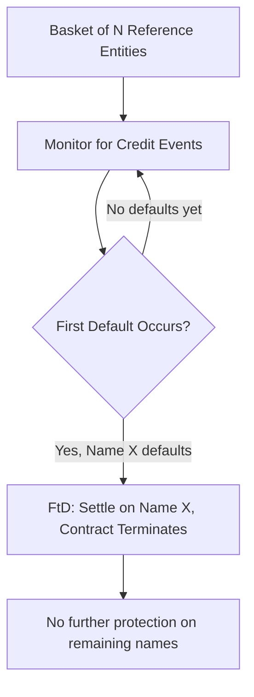

## Nth to Default Baskets

### Overview

An Nth-to-Default (NtD) basket is a credit derivative referencing a small, discrete portfolio of Reference Entities (typically 5 to 25 names), under which the protection seller's payout obligation is triggered specifically by the *n*-th default to occur within the basket, rather than by any default or by cumulative portfolio losses as in an index tranche. NtD baskets represent one of the earliest and structurally simplest forms of portfolio credit derivative, and remain a useful pedagogical bridge between single-name CDS and the more granular loss-tranching mechanics of index tranches and CDOs, while also continuing to see use in customized/bespoke correlation trading.

### Basic Structure and Payout Mechanics

**Key Points**

- The basket references a fixed, discrete list of names (unlike an index, which follows a standardized published composition)
- The protection buyer pays a periodic premium (spread) on the full basket notional until either (a) the *n*-th credit event occurs, triggering settlement and terminating the contract, or (b) the contract matures with fewer than $n$ defaults having occurred
- Upon the *n*-th default, the contract settles (cash or physical, per confirmation terms) based on that specific defaulted reference entity's recovery value, and the contract **terminates** — protection on the remaining, non-defaulted, un-triggered names ceases
- Common variants: **First-to-Default (FtD)**, **Second-to-Default (StD)**, and more generally **Nth-to-Default** for $n > 2$

**Example**

A 5-name First-to-Default basket references Names A, B, C, D, E, each with $10,000,000 notional exposure conceptually, but the FtD contract itself typically carries a single notional (e.g., $10,000,000) equal to one name's exposure:

1. Protection buyer pays a periodic premium calculated on the full $10,000,000 notional, reflecting the basket spread
2. If Name C experiences a credit event (e.g., Failure to Pay) before any of A, B, D, or E, the FtD triggers
3. Settlement occurs based on Name C's recovery value (via auction or bilateral valuation), and the contract terminates
4. No further protection exists on A, B, D, or E going forward — even if one of them later defaults, the (already-terminated) FtD contract does not respond

### Pricing Intuition: FtD as a Correlation-Sensitive Instrument

**Key Points**

- FtD spread is bounded between two extremes: if default correlation among basket names were **zero** (fully independent), the FtD spread approaches the **sum** of the individual CDS spreads of all basket names (since the basket is triggered by "any one of these independent events happening," maximizing the probability of an early trigger)
- If correlation were **perfect** (all names move in lockstep), the FtD spread approaches the spread of the **riskiest single name** in the basket, since a perfectly correlated basket effectively behaves like a single credit for default-timing purposes
- FtD spread is therefore a **decreasing function of correlation** — FtD is a fundamentally "short correlation" position, structurally similar in direction (though not magnitude or mechanism) to an equity tranche

$$Spread_{FtD}(\rho=0) \approx \sum_{i=1}^{n} Spread_i \qquad Spread_{FtD}(\rho=1) \approx \max_i(Spread_i)$$

[Inference] This bounding relationship is a standard theoretical result under the copula framework and is widely used as a sanity check on FtD pricing outputs, though the actual market-quoted spread for any real basket will sit somewhere between these two theoretical bounds depending on the calibrated correlation assumption, and will not exactly equal either bound in practice.

### Pricing via the Copula Framework

**Key Points**

- FtD/NtD pricing uses the same one-factor (or multi-factor) Gaussian copula machinery described elsewhere in this curriculum: each name's marginal default probability curve (from its own CDS) is combined with an assumed asset correlation to generate a joint default-time distribution
- Given the joint distribution, the FtD leg values follow directly: the **premium leg** is valued as the risky annuity up to the time of the first default (or maturity), and the **protection leg** pays out at the time of the first default based on that name's loss-given-default
- For small baskets (5–25 names), **full Monte Carlo simulation** of joint default times under the copula is computationally practical and commonly preferred over the recursive/quadrature approach used for larger, more granular index tranches, since basket heterogeneity (differing spreads, recoveries, and possibly differing pairwise correlations) is easier to handle name-by-name in simulation than in a closed-form recursion

**Simulation-Based Pricing Steps**

1. Simulate a large number of correlated default-time paths for all $n$ names using the copula (e.g., Gaussian copula with pairwise or one-factor correlation)
2. For each simulated path, identify the time of the *n*-th default (for FtD, $n=1$; for StD, $n=2$; etc.)
3. Discount and average the resulting premium leg cash flows (paid up to that default time) and protection leg payouts (paid at that default time) across all simulated paths
4. The fair FtD/NtD spread is the ratio of the expected discounted protection leg to the expected discounted risky annuity, analogous to single-name CDS spread calculation but conditioned on the joint default-time distribution

$$Spread_{NtD} = \frac{E[\text{Discounted Protection Leg Payout at }\tau_{(n)}]}{E[\text{Discounted Risky Annuity up to }\tau_{(n)}]}$$

where $\tau_{(n)}$ denotes the time of the *n*-th order statistic among the simulated default times.

### Comparing FtD, Mezzanine Tranches, and StD/Higher-Order Baskets

**Key Points**

- As $n$ increases from First-to-Default toward higher orders (Second-to-Default, Third-to-Default, etc.), the position becomes progressively **less** short-correlation and can even become long-correlation for sufficiently high $n$ relative to basket size, since triggering the *n*-th default in a small basket increasingly requires the kind of correlated, systemic stress scenario that benefits from higher assumed correlation
- This mirrors, at small-basket scale, the same directional logic seen in index tranches: "early" triggers (FtD, akin to equity tranches) are short correlation, while "late" triggers in the basket (akin to senior tranches) are long correlation
- Unlike index tranches, however, NtD baskets do not have a continuous loss-tranching structure — the basket pays out fully upon a single discrete triggering event (the *n*-th default) rather than absorbing losses proportionally across a loss layer, making the risk profile discontinuous/binary in nature rather than continuous

### Use Cases

**Key Points**

- **Yield enhancement**: investors selling FtD protection on a basket of moderately correlated names can earn a spread substantially above any individual constituent's CDS spread (reflecting the "sum of spreads" upper bound), an attractive yield-pickup trade when correlation is assessed as being lower than what the market spread implies
- **Customized/bespoke correlation views**: unlike standardized index tranches, NtD baskets allow investors and dealers to select bespoke reference entity lists, enabling targeted views on specific sector or name combinations rather than only the broad, fixed index composition
- **Capital structure arbitrage/relative value**: dealers may use NtD baskets in relative value trades against single-name CDS or index tranches, exploiting perceived mispricing in implied correlation between the bespoke basket and the standardized index skew

### Risk Management Considerations

**Key Points**

- **Correlation risk**: as with all portfolio credit products, FtD/NtD value is highly sensitive to the assumed default correlation among basket names, and this correlation is generally not directly observable, requiring proxy estimation (equity correlation, sector groupings, or mapping to the standardized index base correlation skew)
- **Jump-to-default risk**: because the entire notional's payout is triggered by a single discrete event, FtD/NtD positions exhibit significant "jump risk" — the position's mark-to-market can move abruptly and substantially on a single name's credit deterioration or default, more so than a proportionally-tranched instrument
- **Recovery rate assumption sensitivity**: settlement value depends on the specific defaulted name's recovery rate, introducing single-name recovery assumption risk into what is otherwise a multi-name correlation product
- **Liquidity**: bespoke NtD baskets are generally materially less liquid than standardized index products, since each basket's specific name composition is not fungible with any other basket or with the standard index

### Conclusion

**Conclusion**

Nth-to-Default baskets translate the core correlation-sensitivity intuition found throughout portfolio credit derivatives — that joint default dependence, not just individual default probability, drives multi-name product value — into a structurally simple, discretely-triggered instrument well suited to small, bespoke reference portfolios. Their well-defined theoretical correlation bounds (sum-of-spreads at zero correlation, worst-name spread at perfect correlation) make them a useful conceptual anchor for understanding correlation sensitivity more broadly, even as their discontinuous, single-trigger payout structure distinguishes their risk profile meaningfully from the continuous loss-tranching mechanics of index tranches and CDOs.

**Related Topics**

- Default Correlation and Copula Models: Simulation-Based Pricing Approaches
- CDS Indices and Index Tranches: Continuous Loss Tranching Compared to Discrete Triggers
- Base Correlation Mapping for Bespoke Portfolio Products
- Monte Carlo Methods for Multi-Name Credit Derivative Pricing
- Recovery Rate Assumptions in Credit Derivative Settlement
- Relative Value Trading Between Baskets, Tranches, and Single-Name CDS
- Jump-to-Default Risk Management in Credit Portfolios