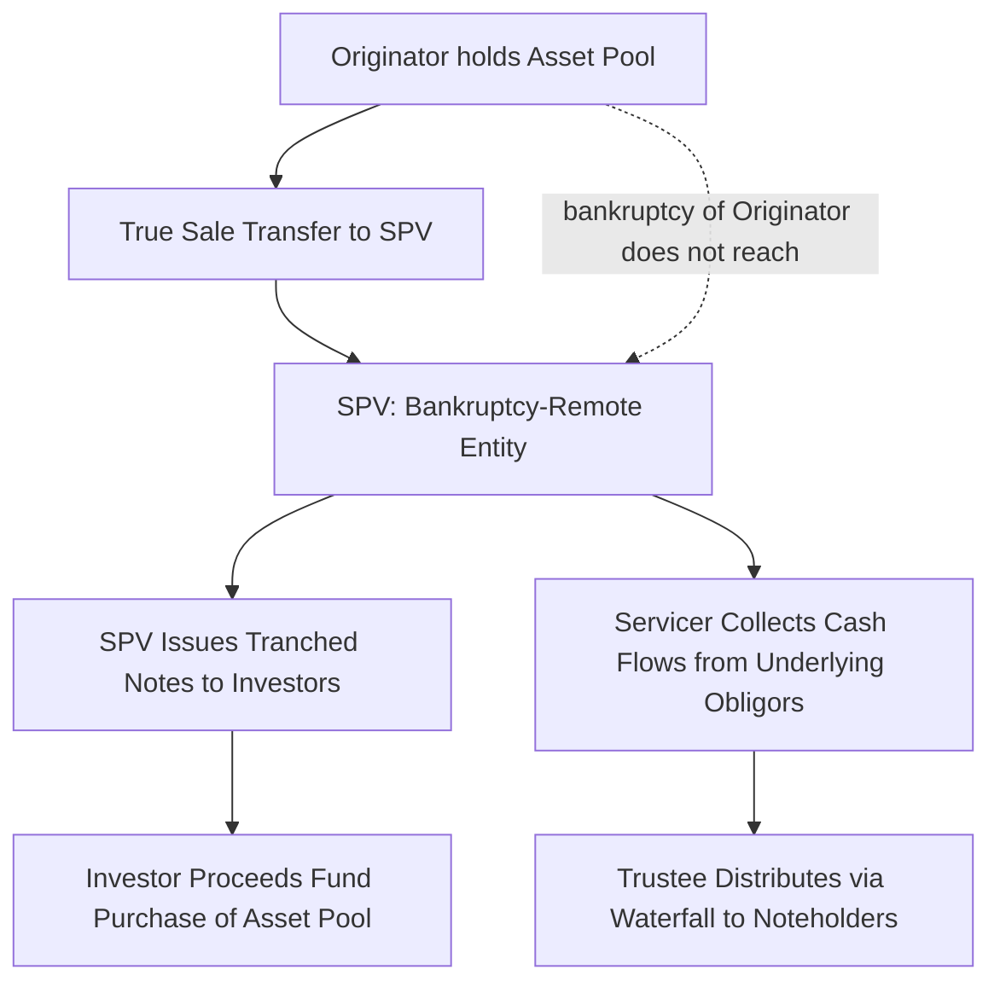

## Securitization Mechanics and Special Purpose Vehicles

### Overview

Securitization is the process of pooling cash-flow-generating financial assets (loans, receivables, leases, bonds) and repackaging their cash flows into tradable securities sold to investors. The Special Purpose Vehicle (SPV), also called a Special Purpose Entity (SPE), is the legal mechanism at the center of this process: a separately incorporated entity created specifically to hold the pooled assets and issue securities backed by them, structurally and legally isolated from the originator that created or sold the assets into the pool. This entry covers the legal, structural, and operational mechanics common to securitization generally, complementing the CDO-specific structural entry elsewhere in this curriculum.

### Purpose and Economic Rationale

**Key Points**

- **Funding/liquidity**: originators (banks, finance companies, corporates) convert illiquid, long-dated receivables (mortgages, auto loans, credit card receivables) into immediately realizable cash by selling them to an SPV that finances the purchase via note issuance
- **Risk transfer**: securitization moves credit risk of the underlying assets off the originator's balance sheet to capital markets investors, potentially achieving regulatory capital relief for regulated originators
- **Tranching for investor risk appetite**: pooling and tranching allows the same underlying asset pool to be sold to investors with heterogeneous risk/return preferences — from senior AAA-rated investors seeking capital preservation to subordinated/equity investors seeking leveraged yield
- **Maturity/liquidity transformation**: SPVs can convert a pool of illiquid, potentially long-dated assets into more standardized, liquid, and tradable securities

### The Special Purpose Vehicle: Legal Structure

**Key Points**

- **Bankruptcy remoteness**: the SPV is structured (typically as a trust, limited liability company, or similar entity, depending on jurisdiction) so that its assets are legally isolated from the originator's own credit risk — if the originator becomes insolvent, the SPV's assets are not part of the originator's bankruptcy estate
- **True sale opinion**: legal counsel typically issues an opinion confirming that the transfer of assets from the originator to the SPV constitutes a "true sale" rather than a secured loan, which is essential to achieving both bankruptcy remoteness and (for regulated originators) off-balance-sheet accounting/regulatory treatment
- **Non-consolidation opinion**: a separate legal opinion confirms that the SPV would not be "substantively consolidated" with the originator's estate in a bankruptcy proceeding, reinforcing the isolation of SPV assets from originator creditors
- **Restricted purpose/activities**: SPV governing documents strictly limit its permitted activities (holding the specified collateral, issuing the specified notes, entering only specified hedging/servicing arrangements) to minimize the risk of the SPV itself incurring unrelated liabilities

### Key Transaction Parties

**Key Points**

- **Originator**: the entity that originated or acquired the underlying assets and sells them into the securitization (e.g., a mortgage lender, auto finance company, or credit card issuer)
- **Sponsor/Depositor**: often a subsidiary of the originator, this entity may act as an intermediate transferee, purchasing assets from the originator and then transferring them to the SPV/issuing trust — an additional layer sometimes used to reinforce the true-sale/bankruptcy-remoteness analysis
- **SPV/Issuer**: the entity that holds the collateral pool and issues securities to investors
- **Servicer**: collects payments from underlying obligors, handles delinquency management and workouts, and remits collected cash flows to the trustee; may be the originator itself (common) or a third party
- **Trustee**: administers the transaction on behalf of noteholders, enforces the waterfall, monitors compliance with structural covenants, and holds a fiduciary-like administrative role
- **Rating Agencies**: assess and assign credit ratings to the issued tranches based on collateral quality, structural protections, and legal opinions
- **Underwriters**: place the issued securities with investors in the primary market

### Asset Classes Commonly Securitized

**Key Points**

- **RMBS (Residential Mortgage-Backed Securities)**: pools of residential mortgage loans; historically the largest securitization asset class, further divided into agency (government-sponsored enterprise-guaranteed) and non-agency/private-label RMBS
- **CMBS (Commercial Mortgage-Backed Securities)**: pools of commercial real estate loans
- **ABS (Asset-Backed Securities, narrower sense)**: auto loans/leases, credit card receivables, student loans, equipment leases, and other consumer/commercial receivables
- **CLOs**: leveraged loan pools (see the dedicated CDO entry for full structural treatment)
- Each asset class carries its own idiosyncratic collateral performance drivers (e.g., prepayment behavior for mortgages, revolving utilization for credit cards, residual value risk for auto leases)

### Credit Enhancement Mechanisms

**Key Points**

- **Subordination/Tranching**: junior tranches absorb losses before senior tranches, providing the senior notes with a cushion — the most fundamental and universal form of credit enhancement in securitization
- **Overcollateralization**: the collateral pool's face value exceeds the aggregate note balance issued against it, providing an additional buffer beyond subordination alone
- **Excess Spread**: the difference between the weighted average yield on collateral and the weighted average cost of issued liabilities (plus fees) can be trapped/retained within the structure (e.g., diverted to build additional overcollateralization) rather than distributed, functioning as a self-generated credit enhancement that accumulates over time
- **Reserve Funds/Cash Collateral Accounts**: cash reserves funded at closing (or built up over time from excess spread) available to cover shortfalls in collateral cash flow
- **External Credit Enhancement**: third-party guarantees, letters of credit, or bond insurance (historically monoline insurers) wrapping specific tranches — a technique whose prevalence and market acceptance has varied significantly across market cycles

### The Securitization Waterfall

**Key Points**

- As with CDOs, cash flows from the underlying collateral pool flow through a strict contractual **waterfall**, typically with separate priority schedules for interest and principal
- Senior fees (trustee, servicer) and hedging costs are paid first, followed by interest to tranches in seniority order, then principal in seniority order (subject to structural triggers)
- **Performance triggers** (delinquency triggers, cumulative loss triggers, similar in spirit to CDO coverage tests) can shift cash flow allocation — for example, converting from *pro rata* principal distribution across tranches to strictly *sequential* (senior-first) distribution if collateral performance deteriorates beyond specified thresholds, protecting senior investors at the expense of subordinated tranche cash flow timing

### Static vs. Revolving Structures

**Key Points**

- **Static pool** structures (common in RMBS, CMBS, and term ABS) fix the asset pool at closing (subject only to substitution for breach of representations/warranties), with principal collections passed through to investors as the pool amortizes
- **Revolving/master trust** structures (common in credit card ABS and some auto/dealer floorplan ABS) continuously add new receivables to the pool during a revolving period, since the underlying obligor relationships (e.g., credit card accounts) continuously generate new balances; principal collections during the revolving period are used to purchase new eligible receivables rather than being paid down to investors
- Revolving structures require additional early amortization triggers to protect investors if pool performance deteriorates, causing an automatic shift from revolving to amortizing cash flow treatment

### Servicing and Special Servicing

**Key Points**

- The **master/primary servicer** performs day-to-day collection, payment processing, and routine borrower interaction across the pool
- For pools that include (or develop) distressed/defaulted assets, a **special servicer** (common in CMBS) takes over workout, restructuring, or foreclosure/liquidation of specifically troubled loans, since this requires different expertise and incentive alignment than routine servicing
- Servicer quality and servicing agreement terms (including servicer advancing obligations — whether the servicer must advance delinquent payment amounts to the trust pending recovery) materially affect the timing and predictability of cash flows to investors, independent of the underlying collateral's ultimate credit performance

### Regulatory Considerations: Risk Retention

**Key Points**

- Following the 2008 financial crisis, risk retention rules (e.g., the U.S. Dodd-Frank Act's "skin in the game" requirements, and analogous EU/UK securitization regulation) generally require securitization sponsors to retain a specified minimum economic interest (commonly 5%) in the securitization, intended to align sponsor incentives with the credit performance of assets sold to investors
- [Unverified] The precise retention form (vertical slice, horizontal first-loss piece, or a combination — "L-shaped" retention) and the specific percentage and exemptions vary by jurisdiction and asset class, and current requirements should be verified against the applicable regulation in force at the relevant transaction date and jurisdiction rather than assumed uniform.
- Risk retention rules were a direct regulatory response to concerns that "originate-to-distribute" securitization models had weakened originator underwriting discipline when originators bore little residual exposure to the assets they sold

### Conclusion

**Conclusion**

Securitization mechanics rest on the legal architecture of the bankruptcy-remote SPV, which enables the isolation and repackaging of pooled asset cash flows into tranched securities tailored to differing investor risk appetites. The combination of true-sale and non-consolidation legal opinions, layered credit enhancement (subordination, overcollateralization, excess spread, reserves), and a strictly governed cash flow waterfall together constitute the structural toolkit that has been adapted across mortgage, consumer, and corporate loan asset classes — with post-crisis risk retention regulation now forming an additional, jurisdiction-specific layer of originator incentive alignment on top of the core structural mechanics.

**Related Topics**

- Collateralized Debt Obligation Structures (CLO/CDO-Specific Waterfall and Coverage Tests)
- RMBS and CMBS Structural Distinctions and Collateral Performance Drivers
- True Sale and Non-Consolidation Legal Opinions in Detail
- Credit Card ABS Master Trust Structures and Early Amortization Triggers
- Risk Retention Regulation: Dodd-Frank and EU Securitization Rules
- Rating Agency Methodologies for Securitization Tranches
- Servicer Advancing and Its Impact on Investor Cash Flow Timing