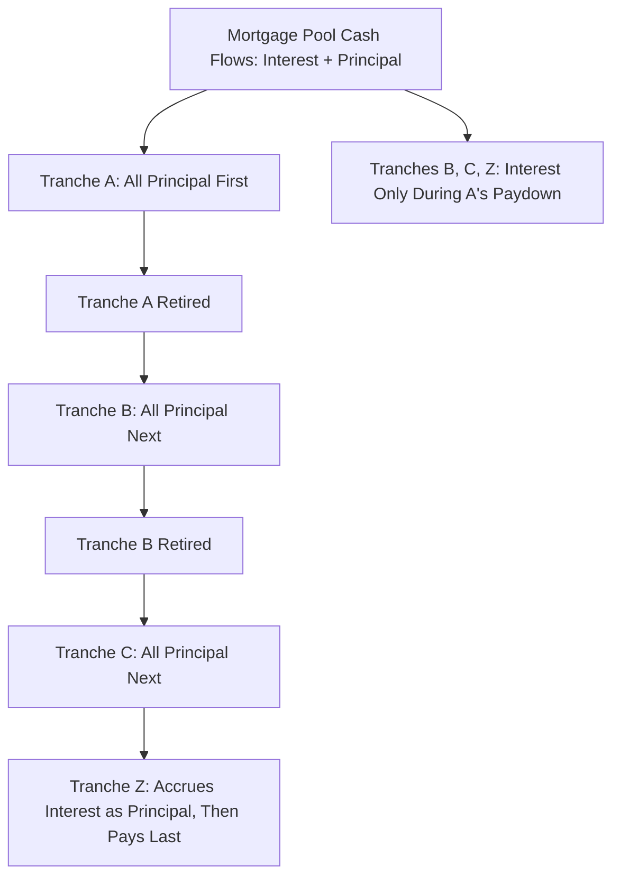

## Mortgage Backed Securities Structures

### Overview

Mortgage-Backed Securities (MBS) are securitizations backed by pools of mortgage loans, representing the largest and most structurally mature segment of the securitization market. MBS structures range from simple pass-through securities that distribute pro-rata shares of mortgage cash flows, to highly engineered Collateralized Mortgage Obligations (CMOs) that redirect prepayment and default risk across dozens of differentiated tranches. This entry covers the structural taxonomy, cash flow mechanics, and risk characteristics specific to mortgage collateral, building on the general securitization/SPV mechanics covered elsewhere in this curriculum.

### Agency vs. Non-Agency MBS

**Key Points**

- **Agency MBS**: issued or guaranteed by U.S. government-sponsored enterprises (Fannie Mae, Freddie Mac) or a government agency (Ginnie Mae), carrying an explicit or implied guarantee of timely principal and interest payment, which effectively removes underlying borrower credit risk from the investor's perspective (leaving primarily prepayment/extension risk)
- **Non-Agency/Private-Label MBS**: issued by private entities (banks, non-bank originators) without a government guarantee; investors bear actual underlying borrower credit risk, requiring credit enhancement (subordination, overcollateralization) as described in general securitization mechanics
- [Unverified] The precise nature of the Ginnie Mae guarantee (full faith and credit of the U.S. government) versus the Fannie Mae/Freddie Mac guarantee (historically an implied government backing, formalized through conservatorship since 2008) involves jurisdiction-and-era-specific legal and political detail that should be verified against current agency documentation rather than treated as static.

### Pass-Through Securities

**Key Points**

- The simplest MBS structure: investors receive a pro-rata share of all principal and interest cash flows from the underlying mortgage pool, net of servicing and guarantee fees, with no tranching of prepayment or credit risk
- All pass-through certificate holders in a given pool experience identical prepayment exposure — there is no redistribution of prepayment risk across different investor classes
- Agency pass-throughs (e.g., Fannie Mae or Freddie Mac MBS, Ginnie Mae MBS) are the most liquid and widely-held form, trading in the **TBA (To-Be-Announced)** forward market, where the specific pool delivered is not identified until shortly before settlement, based on standardized coupon/agency/maturity specifications

### Prepayment Risk: The Central Risk Factor in MBS

**Key Points**

- Unlike most other securitized asset classes, mortgage borrowers in most jurisdictions have the option to **prepay** (refinance or pay off) their loans at any time without penalty, creating **prepayment risk** — the uncertainty in the timing (not the amount) of principal return to investors
- Prepayments accelerate when interest rates fall (borrowers refinance into lower rates) and slow when rates rise, meaning MBS investors face **negative convexity**: they receive principal back faster (reinvesting at lower rates) exactly when rates have fallen, and slower (extension risk) exactly when rates have risen and existing lower-coupon assets are least valuable to hold
- Prepayment behavior is modeled using standardized prepayment speed conventions:
  - **PSA (Public Securities Association) model**: assumes conditional prepayment rate (CPR) ramping linearly from 0% to 6% over the first 30 months of loan age, then holding flat at 6% CPR thereafter (100% PSA); other multiples (e.g., 150% PSA, 200% PSA) scale this benchmark curve proportionally
  - **CPR (Conditional Prepayment Rate)**: annualized percentage of the remaining pool balance expected to prepay in a given period
  - **SMM (Single Monthly Mortality)**: the monthly equivalent of CPR, related by $SMM = 1-(1-CPR)^{1/12}$

$$SMM = 1 - (1-CPR)^{1/12}$$

### Collateralized Mortgage Obligations (CMOs)

**Key Points**

- CMOs restructure the cash flows of an underlying mortgage pass-through pool into multiple tranches with differentiated principal repayment priority and/or prepayment sensitivity, without changing the pool's aggregate credit risk (for agency CMOs, credit risk remains agency-guaranteed; the restructuring targets prepayment/timing risk specifically)
- The foundational insight: even though prepayment *timing* is uncertain for the pool as a whole, tranching can concentrate that uncertainty into specific classes, creating other classes with more stable, predictable cash flow profiles desired by different investor types (e.g., insurance companies seeking long, stable duration versus investors willing to bear prepayment volatility for yield)

**Sequential-Pay CMO Structure**

**Example**

A basic sequential-pay CMO structure directs all principal payments (scheduled plus prepayments) to the earliest tranche until it is fully retired, then to the next tranche, and so on:

1. Tranche A receives all principal until fully paid down, while Tranches B, C, and Z receive only interest during this period
2. Once Tranche A retires, Tranche B begins receiving principal (plus its own interest) until fully paid down
3. This continues sequentially through Tranche C
4. Tranche Z (the "accrual" or "Z-bond" tranche) receives no cash interest or principal until all prior tranches are retired — its accrued interest is added to its principal balance during this period, then it receives both interest and principal once earlier tranches have paid off

### PAC/Companion Structures

**Key Points**

- **Planned Amortization Class (PAC)** tranches are designed to receive a predictable, scheduled principal paydown as long as actual prepayments fall within a specified band (defined by an upper and lower PSA speed assumption at issuance) — the "PAC collar" or "structuring range"
- **Companion (or "support") tranches** absorb the prepayment variability that the PAC schedule is designed to avoid: if prepayments run faster than the PAC band's upper bound, companions absorb the excess principal; if slower than the lower bound, companions receive less principal so the PAC schedule can still be maintained
- This structure creates PAC tranches with substantially more stable average life and duration than the underlying collateral, at the cost of transferring that variability onto companion tranche holders, who require higher yield compensation for bearing concentrated prepayment risk
- **PAC II / PAC III** and multiple layered PAC structures extend this logic further, creating tiers of prepayment protection with correspondingly different stability/yield tradeoffs

### IO/PO Strips

**Key Points**

- **Interest-Only (IO) strips** receive only the interest cash flows from the underlying pool; their value is driven heavily by prepayment speed since faster prepayment shrinks the principal balance on which future interest accrues, directly reducing IO cash flows — IO holders generally prefer **slower** prepayments
- **Principal-Only (PO) strips** receive only principal cash flows (with no coupon); PO value benefits from **faster** prepayment, since it accelerates the return of principal that was purchased at a discount to par
- IO and PO strips exhibit strongly divergent, often opposite-signed sensitivity to interest rate movements via the prepayment channel, making them useful (though risky) building blocks for expressing specific prepayment/rate views or for hedging prepayment exposure elsewhere in a portfolio

### CMBS-Specific Structural Features

**Key Points**

- Commercial Mortgage-Backed Securities (CMBS) reference pools of commercial real estate loans (office, retail, multifamily, industrial, hospitality), which differ from residential mortgages in generally having **prepayment lockout periods, defeasance provisions, or prepayment penalties**, substantially reducing prepayment optionality relative to residential MBS
- Because commercial mortgage borrowers face these prepayment constraints, CMBS cash flow timing is comparatively more predictable than residential MBS, shifting the primary risk focus toward underlying **credit/default risk** of the commercial properties rather than prepayment risk
- CMBS commonly employs a **special servicer** for loans that become delinquent or default, distinct from the master servicer handling performing loans, reflecting the workout-intensive nature of commercial real estate defaults (which often involve property-level negotiation rather than simple foreclosure)
- CMBS capital structures typically use a sequential-pay, credit-tranched (rather than prepayment-tranched) waterfall, closer in spirit to general ABS/CDO subordination than to residential CMO prepayment engineering

### Risk Considerations Summary

**Key Points**

- **Prepayment/Extension Risk**: the central risk for agency residential MBS and CMOs, driven by borrower refinancing incentives relative to prevailing mortgage rates
- **Credit Risk**: the central risk for non-agency residential MBS and CMBS, driven by underlying borrower/property performance, requiring credit enhancement analysis akin to general ABS/CDO structures
- **Negative Convexity**: a defining characteristic of most mortgage-related instruments (particularly pass-throughs and IOs), meaning duration shortens when rates fall and extends when rates rise — the opposite of the convexity profile generally preferred by fixed income investors
- **Model Risk in Prepayment Assumptions**: since prepayment behavior depends on borrower behavioral assumptions (refinancing propensity, burnout effects, home price appreciation/mobility factors), CMO/MBS valuation is materially exposed to the accuracy of the prepayment model used, distinct from interest rate or credit model risk

### Conclusion

**Conclusion**

MBS structures apply the general securitization toolkit — pooling, tranching, and SPV-based bankruptcy remoteness — to a collateral type whose defining risk characteristic, prepayment optionality, is largely absent from other securitized asset classes. CMO engineering (sequential-pay, PAC/companion, IO/PO) exists specifically to redistribute this prepayment timing risk across investor classes with differing tolerance for it, in a manner distinct from the primarily credit-risk-focused tranching seen in CDOs, CLOs, and most ABS. Recognizing whether a given structure is principally managing prepayment risk (agency RMBS/CMOs) or credit risk (non-agency RMBS, CMBS) is the essential first step in analyzing any specific MBS structure's investor risk profile.

**Related Topics**

- Securitization Mechanics and Special Purpose Vehicles (General Framework)
- Prepayment Modeling: PSA, CPR, and Behavioral Refinancing Models
- Option-Adjusted Spread (OAS) Analysis for Mortgage-Backed Securities
- CMBS Loan-Level Underwriting and Special Servicing Workout Mechanics
- Negative Convexity and Duration/Extension Risk Hedging Strategies
- Agency Guarantee Structures: Fannie Mae, Freddie Mac, and Ginnie Mae Distinctions
- IO/PO Strip Trading Strategies and Prepayment Speed Views