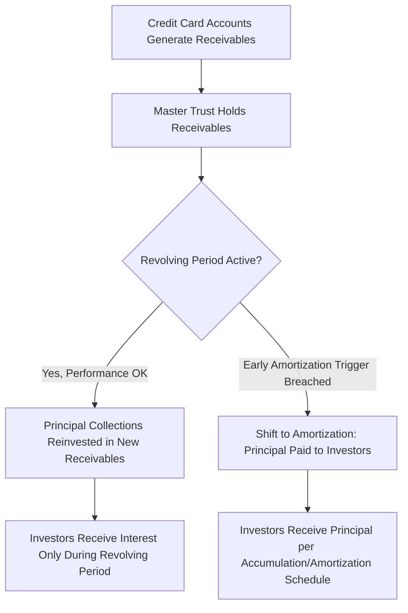

## Asset Backed Securities and Collateral Pools

### Overview

Asset-Backed Securities (ABS) apply securitization mechanics to non-mortgage consumer and commercial receivables — auto loans and leases, credit card receivables, student loans, equipment leases, and similar asset classes. While ABS shares the core SPV, tranching, and credit enhancement architecture common to all securitization, each collateral type carries distinct cash flow characteristics, risk drivers, and structural conventions shaped by the nature of the underlying obligor relationship. This entry surveys the major ABS collateral pool types and the pool-level analytical framework used to assess them, building on the general securitization mechanics and MBS-specific structures covered elsewhere in this curriculum.

### ABS vs. MBS: Structural Distinctions

**Key Points**

- Unlike residential mortgages, most ABS collateral types have **shorter contractual maturities** (typically 2–7 years for auto loans, revolving indefinitely for credit cards), reducing extension risk relative to 15–30 year mortgage pools
- Prepayment optionality varies significantly by asset class — auto loans and equipment leases carry some prepayment risk (though generally less rate-sensitive than mortgages, since consumer auto refinancing is less common and less rate-elastic than mortgage refinancing), while credit card receivables have no fixed maturity/prepayment concept in the traditional sense due to revolving structures
- ABS collateral pools are typically **more granular** (thousands to hundreds of thousands of individual obligors) than commercial real estate-backed CMBS pools (dozens to low hundreds of loans), supporting more statistically stable, pool-level actuarial-style loss modeling rather than loan-by-loan credit analysis

### Auto Loan and Lease ABS

**Key Points**

- Collateral consists of retail installment contracts (loans) or lease contracts on new/used vehicles, originated by captive finance companies (manufacturer-affiliated lenders), banks, or independent/subprime auto lenders
- **Prime vs. subprime auto ABS**: prime pools reference higher-credit-quality borrowers with correspondingly lower expected losses and thinner required credit enhancement; subprime pools require substantially more subordination/overcollateralization to achieve equivalent tranche ratings, given higher expected default frequency
- **Static pool** structure is standard: the pool of loans is fixed at closing, and principal collections amortize the notes sequentially or pro-rata (subject to performance triggers) as the underlying loans pay down
- **Residual value risk** is specific to auto **lease** ABS (as distinct from loan ABS): the securitization bears exposure to the vehicle's residual value at lease-end, which depends on used-vehicle market conditions at that future date — a risk dimension absent from loan-collateralized ABS

**Key Pool-Level Metrics for Auto ABS**

| Metric | What It Measures |
| --- | --- |
| Weighted Average Coupon (WAC) | Blended interest rate across pool loans |
| Weighted Average Maturity/Life (WAM/WAL) | Blended remaining term/expected average life |
| Cumulative Net Loss (CNL) | Total realized losses net of recoveries, as % of original pool balance |
| Extension Rate | Proportion of loans with extended/modified payment terms |

### Credit Card ABS: Master Trust Structures

**Key Points**

- Credit card receivables have no fixed maturity or amortization schedule at the individual account level, since cardholders continuously borrow and repay within their revolving credit line — this fundamentally differs from installment-loan collateral and motivates a distinct structural approach
- **Master trust** structures pool receivables from a large, continuously-refreshed set of credit card accounts, with new receivables generated by existing accounts automatically added to the trust
- The transaction is divided into a **revolving period** (principal collections are reinvested in purchasing new receivables rather than paid to investors) and a subsequent **accumulation/amortization period** (principal is paid to investors, either accumulated for a scheduled bullet payment or amortized on a controlled schedule)
- **Early amortization triggers** ("pay-out events") — tied to metrics like excess spread turning negative, seller/servicer default, or breach of specified portfolio yield/loss thresholds — cause the trust to shift immediately from revolving to amortizing treatment, protecting investors if pool performance deteriorates materially

### Key Credit Card ABS Metrics

**Key Points**

- **Monthly Payment Rate (MPR)**: the percentage of the outstanding receivables balance paid down by cardholders each month, a key indicator of portfolio cash flow generation and a component of early amortization trigger calculations
- **Charge-Off Rate**: annualized percentage of receivables written off as uncollectible, the primary credit performance metric
- **Portfolio Yield**: gross yield generated by the receivables pool (finance charges, fees), which combined with charge-offs and servicing costs determines **excess spread** — a critical early-warning indicator, since a sustained negative or declining excess spread is a common early amortization trigger

### Student Loan ABS

**Key Points**

- **Government-guaranteed/FFELP (Federal Family Education Loan Program) loans**: historically carried a U.S. government guarantee covering a substantial portion of principal and interest in default, materially reducing credit risk relative to unguaranteed private student loans (though FFELP origination itself ended in 2010, with outstanding FFELP ABS continuing to reference legacy-originated loans)
- **Private student loan ABS**: no government guarantee; credit risk depends on borrower/cosigner creditworthiness, similar in credit-analysis approach to other unsecured consumer ABS
- **Extension risk** is a notable feature of student loan ABS due to deferment, forbearance, and income-driven repayment provisions available to borrowers, which can extend actual loan life significantly beyond the scheduled repayment term — a structural risk factor distinct from prepayment risk and specific to this asset class's regulatory/borrower-protection framework
- [Unverified] The specific regulatory and program details governing deferment, forbearance, and income-driven repayment (both for legacy FFELP loans and current private loan programs) are subject to ongoing legislative and regulatory change, and should be verified against current program rules rather than assumed static.

### Equipment Lease and Other Commercial ABS

**Key Points**

- Collateral consists of leases on commercial equipment (aircraft, railcars, construction/industrial equipment, technology equipment), with cash flows derived from lease payments and, in operating lease structures, residual value realization at lease-end
- **Residual value risk** is often a more significant driver of expected loss/return than credit risk of the lessee for operating lease-structured pools, particularly for equipment types with volatile secondary markets or rapid technological obsolescence (e.g., certain technology/computer equipment)
- **Finance leases** (economically similar to secured loans, with the lessee expected to acquire/retain the asset) carry credit risk profiles closer to standard installment loan ABS, whereas **operating leases** (where the lessor retains meaningful residual asset risk) introduce the residual value dimension more prominently

### Pool-Level Analytical Framework

**Key Points**

- **Granularity and diversification**: highly granular pools (thousands of small-balance obligors) support statistically stable loss estimation via historical vintage/cohort performance analysis, in contrast to loan-level underwriting analysis more typical of CMBS
- **Vintage analysis**: performance is commonly tracked by origination "vintage" (the period in which loans were originated), since underwriting standards, economic conditions, and borrower behavior at origination materially affect that vintage's eventual loss curve — comparing current vintage performance against historical vintage benchmarks is a standard surveillance technique
- **Static pool loss curves**: cumulative losses plotted against pool "seasoning" (months since origination) for a fixed (static) cohort of loans, used to project ultimate losses for newer, less-seasoned pools by reference to how similar historical vintages have developed over time
- **Stress/scenario analysis**: rating agencies and investors apply stress multiples to base-case loss expectations (e.g., "2x base case" or specific rating-level stress scenarios) to assess tranche resilience under adverse economic conditions

### Credit Enhancement Sizing Considerations by Asset Class

**Key Points**

- Required credit enhancement (subordination plus overcollateralization/reserves) for a given rating level is calibrated to each asset class's expected loss distribution, loss severity, and historical volatility — subprime auto and unsecured consumer ABS typically require materially more enhancement than prime auto or government-guaranteed student loan ABS for equivalent target ratings
- **Excess spread capture mechanisms** (trapping excess spread to build additional overcollateralization when performance triggers indicate deterioration) are common across ABS asset classes as a self-adjusting enhancement mechanism, supplementing static enhancement levels set at closing

### Conclusion

**Conclusion**

Asset-backed securities extend the core securitization architecture — SPV isolation, tranching, credit enhancement, and a governed cash flow waterfall — across a diverse set of consumer and commercial receivable types, each requiring collateral-specific analytical adaptations. Revolving credit card receivables demand master trust structures and early amortization triggers absent from installment-loan asset classes; auto and equipment leases introduce residual value risk considerations distinct from pure credit risk; and student loans carry extension risk shaped by borrower-protection provisions specific to that sector. Effective ABS analysis therefore requires pairing the general securitization framework with granular, vintage-based, asset-class-specific performance analytics rather than a one-size-fits-all approach to collateral risk assessment.

**Related Topics**

- Securitization Mechanics and Special Purpose Vehicles (General Framework)
- Mortgage Backed Securities Structures (Comparative Prepayment/Credit Risk Focus)
- Vintage and Static Pool Loss Curve Analysis Techniques
- Master Trust Early Amortization Trigger Design and Mechanics
- Residual Value Risk Modeling in Lease-Backed Securitizations
- Rating Agency Stress Scenario Methodologies for Consumer ABS
- Excess Spread Capture and Self-Adjusting Credit Enhancement Mechanisms