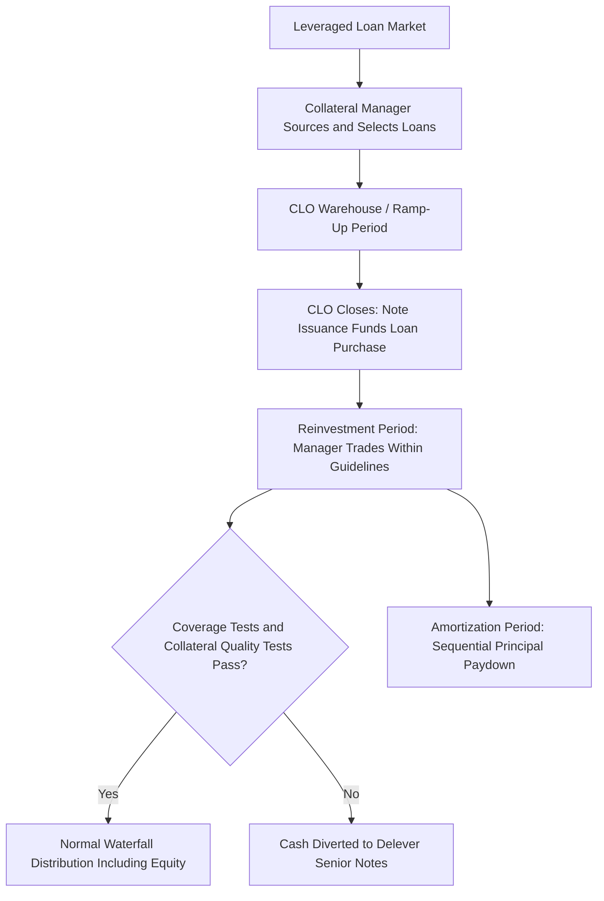

## Collateralized Loan Obligations

### Overview

Collateralized Loan Obligations (CLOs) are the dominant surviving sub-asset class of the broader CDO family, structured around pools of below-investment-grade, broadly syndicated leveraged loans rather than bonds, structured-finance tranches, or synthetic credit exposure. CLOs represent the primary institutional vehicle for financing and distributing leveraged loan risk in current credit markets, having grown substantially in scale and market importance since the 2008 crisis while other CDO sub-sectors (particularly structured-finance-collateral CDOs) contracted sharply. This entry focuses on CLO-specific structural conventions, collateral characteristics, and manager dynamics, building on the general CDO structural framework covered elsewhere in this curriculum.

### CLO Collateral: Leveraged Loans

**Key Points**

- The underlying collateral consists primarily of **first-lien senior secured leveraged loans** issued by below-investment-grade (typically B/BB-rated) corporate borrowers, most commonly originated in the broadly syndicated loan (BSL) market
- Leveraged loans are typically **floating-rate** instruments (historically referencing LIBOR, now predominantly SOFR-based following the LIBOR transition), which creates a natural asset-liability interest rate match with the CLO's own floating-rate note liabilities — a structural feature that distinguishes CLOs from fixed-rate-collateral CDO variants and reduces interest rate mismatch risk within the vehicle
- Loans are generally **senior secured**, ranking ahead of the borrower's unsecured bonds in the capital structure, which contributes to historically higher recovery rates upon default relative to unsecured corporate debt — a key input to CLO tranche loss modeling
- **Covenant-lite loans** (loans with reduced or no maintenance financial covenants, as opposed to traditional covenant-heavy structures) have become a substantial and growing share of the leveraged loan market over the past decade, a development frequently noted as reducing early-warning/creditor-intervention capability relative to historically covenant-heavier loan structures. [Unverified] The precise current market share of covenant-lite issuance fluctuates over time and by vintage, and should be checked against current league table/market data rather than assumed fixed.

### CLO Capital Structure

**Key Points**

- Follows the same general sequential subordination logic as other CDOs: senior AAA-rated notes at the top of the capital structure, descending through AA, A, BBB, BB-rated mezzanine tranches, down to unrated subordinated/equity notes at the bottom
- Typical attachment points place the equity tranche around 8–11% of the capital structure (varying by vintage and specific deal), with senior AAA notes typically comprising 60%+ of total deal size
- Nearly all rated CLO liabilities are **floating-rate** (SOFR plus a spread), matching the floating-rate nature of the underlying leveraged loan collateral
- The equity tranche captures the residual arbitrage between the collateral pool's loan yield and the blended cost of the rated liabilities, net of losses, hedging costs, and manager fees — structurally identical in concept to the general CDO equity return framework, applied specifically to leveraged loan collateral economics

### Active Management and the Collateral Manager

**Key Points**

- The overwhelming majority of CLOs are **actively managed** (as opposed to static), with a professional collateral manager responsible for initial portfolio ramp-up, ongoing trading during the reinvestment period, and workout of distressed/defaulted positions
- Manager compensation typically includes a **senior management fee** (paid ahead of most rated note interest in the waterfall) and a **subordinated/incentive management fee** (paid lower in the waterfall, and sometimes structured with an equity-return hurdle), aligning at least part of manager compensation with equity tranche performance
- **Manager track record and style** (e.g., relative-value trading activity, sector concentration preferences, historical default/loss experience across prior vintages) is a material component of CLO investment analysis, introducing an idiosyncratic manager-risk dimension not present in static or index-referencing structured credit products
- Manager reinvestment activity is constrained by structural collateral quality tests and eligibility criteria defined in the deal's indenture (see below)

### Structural Tests and Collateral Quality Covenants

**Key Points**

- **Overcollateralization (OC) and Interest Coverage (IC) tests**: function identically to the general CDO framework — breach diverts cash flow away from equity/junior tranches to delever senior notes, protecting senior note holders from further credit deterioration
- **Collateral Quality Tests**: CLO-specific covenants constraining portfolio composition during the reinvestment period, commonly including a **weighted average rating factor (WARF)** ceiling (limiting average credit quality deterioration), a **weighted average spread (WAS)** floor (ensuring adequate collateral yield to support liability costs), a **weighted average recovery rate (WARR)** floor, and diversity/concentration limits (industry sector caps, single-obligor caps, limits on second-lien loans, fixed-rate assets, or non-loan collateral buckets)
- **CCC bucket/haircut provisions**: loans downgraded to CCC or below are typically subject to a haircut in their contribution to OC test numerators beyond a specified basket size, penalizing excessive exposure to deeply distressed credits within the coverage test calculations

### CLO 1.0, 2.0, and Post-Crisis Structural Evolution

**Key Points**

- **CLO 1.0** (pre-2008 vintage) structures are generally associated, in retrospective market commentary, with somewhat different risk retention, disclosure, and structural protection conventions relative to subsequent vintages
- **CLO 2.0** (post-2008/2010 vintage onward) structures generally feature enhancements including shorter reinvestment periods, reduced use of certain higher-risk collateral buckets (e.g., structured-finance securities within the loan pool, which had been present in some pre-crisis CLO structures), and generally more conservative structural test calibration, alongside evolving risk retention regulatory requirements
- [Inference] The overall post-crisis evolution toward more conservative structural terms is broadly attributed to a combination of investor demand for greater protection following the 2008 experience and evolving regulatory requirements (including risk retention rules), rather than to a single specific reform, and the precise structural differences between any two specific vintages should be assessed deal-by-deal rather than assumed uniform across all "CLO 2.0" transactions.

### CLO Risk Retention and Regulatory Framework

**Key Points**

- CLOs have been subject to varying risk retention requirements across jurisdictions and time periods (e.g., U.S. Dodd-Frank risk retention rules, EU/UK securitization risk retention regulation), generally requiring the manager or an affiliated retention holder to maintain a specified minimum economic interest in the transaction
- [Unverified] U.S. risk retention requirements specific to open-market CLO managers have been subject to legal challenge and subsequent regulatory/judicial developments; current applicability should be verified against current regulation and any relevant case law rather than assumed static, given the history of change in this specific area.

### Rating Agency Approach to CLOs

**Key Points**

- Rating agencies apply CLO-specific adaptations of general structured credit default/loss modeling (e.g., Moody's CDOROM-style Monte Carlo simulation, S&P's CDO Evaluator), calibrated to leveraged loan default, recovery, and correlation assumptions specific to the syndicated loan market rather than to structured-finance or corporate bond collateral
- Loan-level factors specifically weighted in CLO collateral analysis include lien position (first-lien vs. second-lien), industry diversification, single-obligor concentration, and covenant structure (covenant-lite status), reflecting collateral-specific risk drivers distinct from those relevant to bond-collateralized CDOs

### CLO Equity: Risk/Return Profile

**Key Points**

- CLO equity is a leveraged, first-loss position on a diversified pool of leveraged loans, whose return depends on the spread arbitrage between loan yield and liability cost, realized default/recovery experience, and manager trading performance during the reinvestment period
- Because leveraged loans are floating-rate, CLO equity returns have historically exhibited different sensitivity to interest rate regime changes than fixed-rate-collateral structured credit equity, since rate moves affect both the loan collateral yield and the floating-rate liability cost in the same direction, partially offsetting net spread impact — though the offset is not perfect given differing reset timing/frequency and the fixed portion of liability spread costs
- [Inference] CLO equity returns are generally understood to be highly sensitive to the timing and severity of default cycles in the broadly syndicated loan market, given the leveraged, first-loss nature of the position, though realized outcomes vary substantially by specific vintage, manager, and the credit cycle experienced over that vintage's life.

### CLO Market Structure and Investor Base

**Key Points**

- CLO liabilities (particularly senior tranches) are held by a broad institutional investor base including banks, insurance companies, and dedicated structured credit funds, attracted to floating-rate exposure and historically strong realized performance of senior CLO tranches through prior credit cycles
- CLO equity and junior mezzanine tranches attract a narrower base of specialized structured credit investors, hedge funds, and the collateral managers themselves (who often retain equity positions, both for risk retention compliance and to align incentives with investors)
- CLO issuance volume and spread levels are sensitive to broader leveraged loan market conditions, loan supply/demand dynamics, and the relative cost of CLO liabilities versus alternative loan financing/investment vehicles

### Conclusion

**Conclusion**

CLOs apply the general CDO tranching and waterfall architecture to a collateral base — floating-rate, senior secured leveraged loans — whose structural characteristics (natural asset-liability rate matching, generally higher secured recovery rates, active manager-driven trading within collateral quality covenants) distinguish CLO risk analysis from other CDO sub-sectors. The central analytical dimensions specific to CLOs are collateral manager quality and track record, the specific collateral quality test calibration governing reinvestment period trading, and leveraged loan market credit cycle dynamics — factors that together determine both senior tranche resilience and equity tranche return realization across a CLO's life.

**Related Topics**

- Collateralized Debt Obligation Structures (General CDO Framework)
- Leveraged Loan Market Fundamentals and Covenant-Lite Structures
- CLO Coverage Tests and Collateral Quality Covenant Mechanics in Detail
- Weighted Average Rating Factor (WARF) Calculation and Portfolio Constraints
- CLO Equity Return Drivers Across Credit Cycles
- Risk Retention Regulation for CLO Managers: U.S. and EU/UK Comparison
- Rating Agency Modeling of Leveraged Loan Default and Recovery Assumptions