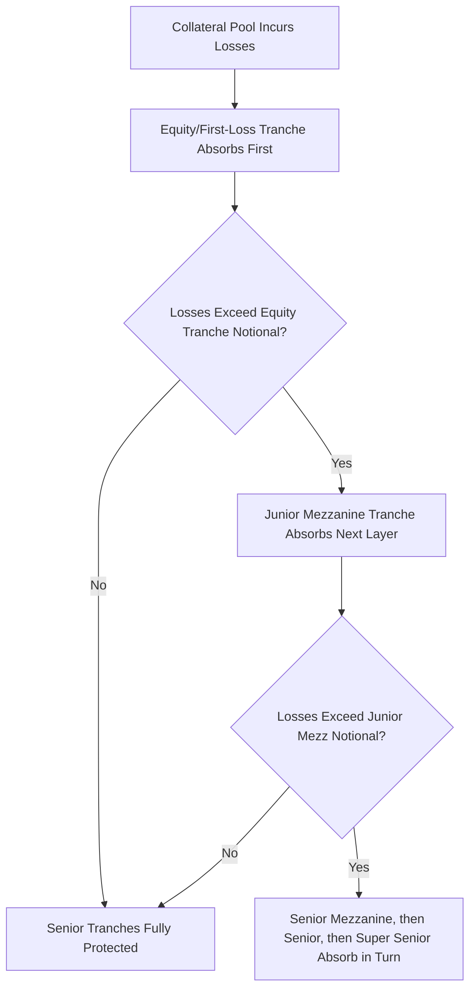

## Tranching Subordination and Credit Enhancement

### Overview

Tranching, subordination, and credit enhancement are the structural mechanisms by which a securitization or structured credit vehicle converts the uncertain aggregate loss profile of a single collateral pool into multiple securities with differentiated risk. While earlier entries in this curriculum have introduced these concepts within specific product contexts (CDOs, MBS, ABS), this entry provides the unifying analytical framework: the mathematics of loss allocation, the taxonomy of enhancement mechanisms, and the sizing methodology that connects a target tranche rating to a required level of structural protection.

### The Core Concept: Subordination as Loss Absorption Priority

**Key Points**

- Subordination establishes a strict priority order in which tranches absorb collateral pool losses: the most junior (subordinated) tranche absorbs losses first, up to its full notional, before any loss reaches the next tranche up the capital structure
- This is mathematically equivalent to each tranche $[K_1, K_2]$ (attachment to detachment, as a percentage of total pool notional) absorbing losses only once cumulative pool losses exceed $K_1$, described by the same tranche loss function used for index tranches and CDOs:

$$TrancheLoss(L) = \frac{\max(0,\ \min(L,K_2)-K_1)}{K_2-K_1}$$

- The senior-most tranche is therefore protected by the **combined notional of every tranche below it** — this cumulative protective layer, expressed as a percentage of total pool notional, is what market participants generally mean by a tranche's "subordination level" or "credit support"

### Taxonomy of Credit Enhancement Mechanisms

**Key Points**

- **Internal enhancement** mechanisms are generated from within the structure's own cash flows and collateral, without reliance on a third party:
  - **Subordination/tranching**: the foundational mechanism described above
  - **Overcollateralization**: collateral pool face value exceeds aggregate note balance, providing a buffer beyond subordination alone
  - **Excess spread**: the gap between collateral yield and liability cost (plus fees), which can be trapped and redirected to build additional overcollateralization when performance triggers indicate deterioration
  - **Reserve funds/cash collateral accounts**: cash reserves funded at closing or accumulated over time, available to cover collateral cash flow shortfalls
- **External enhancement** mechanisms involve a third party assuming some portion of the structure's risk:
  - **Financial guarantees/bond insurance**: a third-party guarantor (historically monoline insurers) wraps specific tranches, substituting the guarantor's credit quality for reliance on internal structural protection alone
  - **Letters of credit**: a bank-provided credit facility available to cover shortfalls, functioning similarly to a guarantee but typically for a specified capped amount
  - **Third-party guarantees on underlying assets**: distinct from transaction-level guarantees, this refers to guarantees attached to the underlying collateral itself (e.g., agency guarantees on mortgage loans within agency MBS)

[Unverified] The relative prevalence and market acceptance of external enhancement mechanisms, particularly monoline bond insurance, has varied substantially across market cycles and should not be assumed to reflect current market practice without checking current usage; monoline bond insurance in particular saw significantly reduced usage and provider capacity following the 2008 financial crisis.

### Sizing Enhancement to a Target Rating: Expected Loss Framework

**Key Points**

- Rating agencies size required subordination/enhancement for a target tranche rating by modeling the collateral pool's expected loss distribution and determining the attachment point at which the tranche's **expected loss** (probability-weighted average loss, not merely a worst-case scenario) falls within the tolerance associated with that target rating
- This generally involves: (1) estimating the pool's base-case expected loss and its distribution (informed by historical performance data, vintage analysis, and underwriting quality assessment), (2) applying rating-level stress multiples (e.g., a AAA-rated tranche might require resilience to loss scenarios several multiples of the base case, while a BB-rated tranche requires resilience to a comparatively smaller multiple), and (3) determining the attachment point at which the tranche's expected loss under the stressed distribution meets the target rating's expected loss threshold

$$E[\text{TrancheLoss}] = \int_0^1 TrancheLoss(\ell)\cdot f(\ell)\,d\ell$$

where $f(\ell)$ is the probability density of cumulative pool loss $\ell$, derived from the collateral-specific loss distribution model (e.g., a copula-based simulation for correlated multi-name pools, or an actuarial vintage-curve-based approach for granular consumer ABS pools)

### Example: Enhancement Sizing Intuition

**Example**

Consider a simplified pool with an expected base-case cumulative loss of 3% and a modeled loss distribution such that:

- A 5% attachment point (i.e., a tranche beginning above 5% cumulative loss) is estimated to have a sufficiently low expected loss to support a AAA rating, given the stress multiple applied to the base case
- A 2% attachment point might support a BBB rating, with materially higher expected loss given its exposure to a more probable range of the loss distribution
- The tranche spanning 0%–2% (equity/first-loss) absorbs all losses up to that point and would carry the highest expected loss and correspondingly no investment-grade rating (or no rating at all)

This illustrates why senior tranches require multiples of the base-case expected loss in subordination beneath them: the required cushion reflects not the expected outcome alone, but the tail of the loss distribution consistent with the very low default probability associated with the highest rating categories. [Inference] The specific stress multiples and methodology differ by rating agency and collateral type, and the illustrative figures above are for conceptual purposes only, not representative of any specific agency's published criteria.

### Waterfall Mechanics: How Subordination Is Operationally Enforced

**Key Points**

- Subordination is enforced through the **waterfall**: the contractual cash flow priority schedule that determines the order in which available collateral cash flows (and, upon loss recognition, principal write-downs) are allocated across tranches
- **Interest waterfall**: senior fees, hedging costs, then interest to tranches in seniority order — junior tranche interest can be **deferred or suspended** if senior obligations and coverage tests are not satisfied, distinct from the more severe principal write-down that occurs upon actual realized loss allocation
- **Principal waterfall**: principal proceeds are allocated per the applicable priority (sequential senior-first, or pro-rata subject to triggers), while realized collateral losses are allocated to tranche principal balances in reverse seniority order (junior tranches written down first)
- **Coverage tests (OC/IC)** act as forward-looking structural circuit breakers, diverting cash flow to delever senior notes *before* the point of realized loss allocation, providing an additional protective mechanism layered on top of the loss-allocation waterfall itself

### Pro-Rata vs. Sequential Principal Distribution

**Key Points**

- **Sequential-pay** structures direct all principal to the most senior outstanding tranche until it is fully retired, then to the next tranche — the most protective structure for senior investors, since subordination as a *percentage* of the remaining pool increases as the pool amortizes (junior tranches' absolute dollar cushion stays roughly fixed while total outstanding notional shrinks)
- **Pro-rata** structures distribute principal proportionally across multiple tranches simultaneously, which can erode the relative subordination cushion over time if not paired with performance triggers, since junior tranches are paid down alongside (rather than after) senior tranches
- Most modern structures use a **hybrid approach**: pro-rata distribution during a defined period subject to satisfactory performance triggers, converting automatically to sequential-pay if delinquency, loss, or other performance triggers are breached — protecting senior investors specifically when protection is most needed

### Interaction Between Enhancement Types

**Key Points**

- Subordination and overcollateralization are complementary, not redundant: subordination describes the *relative* priority ordering between tranches, while overcollateralization describes an *absolute* excess of collateral value over aggregate liabilities — a structure can have substantial subordination but still require overcollateralization if the collateral itself is expected to generate lower aggregate cash flow than the liabilities it backs
- Excess spread capture mechanisms function as a *dynamic*, performance-responsive supplement to the *static* enhancement levels (subordination, initial overcollateralization) fixed at closing — allowing a structure to self-strengthen if early performance signals show elevated risk, without requiring immediate external intervention
- Reserve funds/cash collateral accounts provide enhancement that is available **immediately** (already-funded cash) as opposed to subordination, which only provides protection as losses are actually allocated through the waterfall over time — a distinction relevant to structures needing protection against near-term cash flow timing mismatches specifically, rather than only against ultimate credit losses

### Rating Migration and Enhancement Erosion Over Time

**Key Points**

- Subordination levels are not static in percentage terms even in a static-pool structure: as the pool amortizes and senior tranches are paid down (in a sequential structure), the *percentage* subordination beneath remaining tranches can increase even without any additional enhancement being added, since realized losses have not yet consumed junior tranche notional at the same pace as senior paydown
- Conversely, if realized losses are running above the base case, subordination *erodes* faster than the natural amortization-driven increase would otherwise produce, and this erosion is precisely what performance/coverage triggers are designed to detect and respond to structurally
- [Inference] This dynamic — subordination percentage generally increasing over time in a well-performing static structure, absent adverse loss experience — is a widely cited rationale for why seasoned/well-performing securitization tranches are often viewed as carrying improving credit profiles over their life, though this is a general tendency rather than a guarantee, and depends entirely on realized collateral performance remaining within modeled expectations.

### Conclusion

**Conclusion**

Tranching, subordination, and credit enhancement together form the structural core that any securitization or structured credit vehicle relies upon to convert a single pool's uncertain aggregate loss outcome into differentiated securities matched to different investor risk tolerances. The distinction between internal mechanisms (subordination, overcollateralization, excess spread, reserves) and external mechanisms (guarantees, letters of credit), combined with an expected-loss-based sizing methodology and the operational enforcement of priority through the cash flow waterfall, provides the common analytical vocabulary that applies whether the specific structure in question is a CDO, CLO, RMBS, CMBS, or consumer ABS transaction.

**Related Topics**

- Collateralized Debt Obligation Structures: Waterfall Mechanics in Detail
- Securitization Mechanics and Special Purpose Vehicles
- Rating Agency Expected Loss Methodologies and Stress Multiple Calibration
- Overcollateralization and Interest Coverage Test Design
- Vintage and Static Pool Loss Curve Analysis
- Sequential vs. Pro-Rata Structures and Performance Trigger Design
- Excess Spread Capture as Dynamic Credit Enhancement