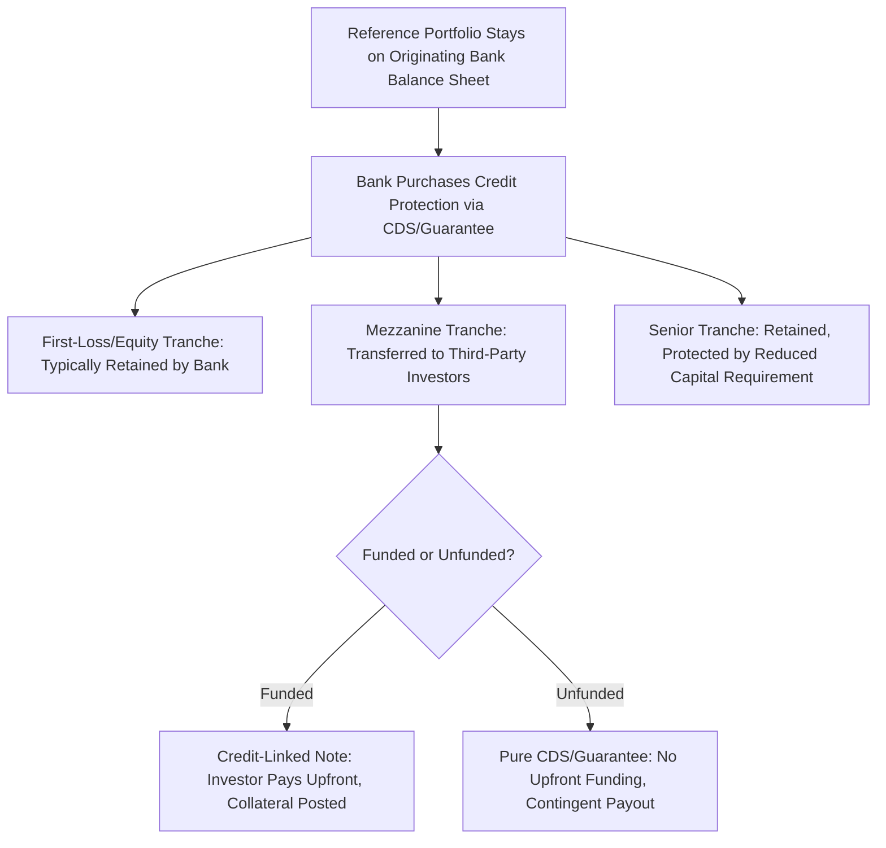

## Synthetic Securitization and Significant Risk Transfer

### Overview

Synthetic securitization achieves the risk-transfer objectives of traditional (cash) securitization without transferring legal ownership of the underlying assets. Instead, credit risk is transferred via derivative instruments — most commonly credit default swaps or financial guarantees — referencing a portfolio that remains on the originating bank's balance sheet. Significant Risk Transfer (SRT), a specific regulatory concept most developed in EU/UK bank capital regulation, refers to the standard that a synthetic (or traditional) securitization must meet to qualify for reduced regulatory capital requirements on the transferred exposures. This entry covers synthetic structuring mechanics and the SRT regulatory framework, building on the general securitization and CDO structural concepts covered elsewhere in this curriculum.

### Synthetic vs. Cash Securitization: Structural Distinction

**Key Points**

- In a **cash (true sale) securitization**, the originator sells the underlying assets to an SPV, which funds the purchase through note issuance — legal title to the assets transfers, and investor proceeds directly fund the asset purchase
- In a **synthetic securitization**, the originator retains legal ownership of the underlying assets on its balance sheet, and instead purchases credit protection referencing those assets (or a defined reference portfolio) via CDS or a financial guarantee — no asset sale occurs, and often no funded note issuance occurs on the full referenced notional either
- This distinction means synthetic securitization can achieve **credit risk transfer without funding transfer** (no need to raise cash equal to the full asset pool), making it comparatively efficient for originators primarily seeking regulatory capital relief rather than balance sheet funding/liquidity

### Structural Mechanics: The Protection Layer

**Key Points**

- The originating bank purchases credit protection on a reference portfolio (often a pool of corporate loans, SME loans, or other credit exposures already on its balance sheet) via a **credit default swap** or **financial guarantee**, referencing specified credit events (e.g., default, restructuring) on the underlying obligors
- Protection is typically **tranched**: the bank retains the senior-most risk (often unfunded, protected implicitly by regulatory capital held against it) and transfers a **mezzanine tranche** of risk to third-party investors, while the **first-loss/equity tranche** is frequently retained by the originating bank itself (both as a natural incentive-alignment mechanism and, historically, as a regulatory requirement in various jurisdictions)
- The mezzanine tranche transferred to investors can be structured either as:
  - **Funded** (via a Credit-Linked Note, or CLN, where investors pay cash upfront for the note and that cash serves as collateral/protection funding, similar economically to a funded CDO tranche), or
  - **Unfunded** (a pure CDS/guarantee, where the protection seller pays no upfront cash but is obligated to pay upon a triggering credit event, similar to unfunded index tranche protection)

### Motivations for Synthetic Structuring

**Key Points**

- **Regulatory capital relief**: the primary driver — by transferring the credit risk of a mezzanine tranche to third parties, the originating bank can (subject to meeting SRT/regulatory criteria) reduce the regulatory capital it must hold against the referenced exposures, freeing capital for other lending or business activities
- **No funding requirement for the full pool**: unlike cash securitization, synthetic structures do not require investors (or the bank) to fund the full reference portfolio notional, only the (typically much smaller) mezzanine tranche actually transferred — making synthetic structures comparatively capital-efficient for the originator to execute
- **Avoids client relationship disruption**: because legal ownership and servicing of the underlying loans remain with the originating bank, synthetic securitization does not require notifying underlying borrowers of a sale or transferring servicing relationships — often relevant for corporate/SME lending relationships the originator wishes to preserve
- **Flexibility on reference portfolio composition**: since no actual asset sale occurs, originators have some flexibility in defining the specific reference portfolio (subject to regulatory eligibility criteria), including potentially referencing a static or (within limits) a replenishing pool

### Significant Risk Transfer (SRT): Regulatory Framework

**Key Points**

- SRT is a regulatory standard, most explicitly codified in EU/UK bank capital regulation (implementing Basel securitization framework principles), that a securitization transaction (synthetic or traditional) must satisfy for the originating bank to recognize regulatory capital relief on the associated exposures
- The core regulatory concern SRT addresses: without a meaningful test, banks could structure "securitizations" that nominally appear to transfer risk while, in substance, retaining most of the economic risk (e.g., via retaining an outsized first-loss piece, or through call/repurchase provisions that effectively return risk to the originator) — SRT criteria are designed to prevent capital relief being granted for risk transfer that is more form than substance
- [Unverified] The precise SRT quantitative and qualitative tests (including specific thresholds for mezzanine tranche risk transferred and retained first-loss piece sizing) are set out in detailed regulatory technical standards (e.g., under EU Capital Requirements Regulation and related EBA guidance) that have been subject to periodic regulatory refinement; current specific thresholds and test mechanics should be verified against the currently applicable regulation and supervisory guidance in the relevant jurisdiction rather than assumed fixed.

### Typical SRT Test Approaches (Illustrative Framework)

**Key Points**

- Regulatory frameworks in this space generally apply some combination of:
  - A **quantitative mezzanine risk transfer test**: assessing whether a sufficiently large share of the mezzanine tranche's expected loss (as opposed to merely its notional) has been transferred to unaffiliated third parties
  - A **first-loss piece sizing constraint**: ensuring the retained first-loss/equity tranche is not sized so large (relative to the portfolio's expected loss) that it effectively absorbs substantially all realistic loss scenarios, which would mean the "transferred" mezzanine tranche investors bear negligible practical risk despite nominal tranche positioning
  - **Qualitative assessment** of whether structural features (early termination/call rights, excessive originator retained interest, or other provisions) undermine the substance of risk transfer even if quantitative thresholds are nominally met
- [Inference] The overall design intent of combining quantitative expected-loss-based tests with qualitative substance-over-form assessment is generally understood to reflect regulators' experience that notional-based tests alone can be circumvented by tranche structuring that shifts economic risk disproportionately toward a nominally-sized but practically loss-absorbing retained piece, though the specific test design and its effectiveness remain subjects of ongoing regulatory and academic discussion.

### Reference Portfolio and Collateral Considerations

**Key Points**

- Reference portfolios for bank-originated synthetic securitizations commonly consist of corporate loans, SME (small and medium enterprise) loans, project finance exposures, or other credit exposures for which the originating bank has particular regulatory capital relief motivation (e.g., exposures carrying comparatively high risk weights under standard regulatory capital calculation methods relative to the originator's assessed actual credit risk)
- Collateral/margin for the mezzanine protection (particularly in unfunded structures) may be posted by the protection seller, or held via an SPV-issued CLN structure where noteholder proceeds are held as cash collateral against the CDS/guarantee obligation — mirroring, at the individual transaction level, collateral posting practices seen in bilateral derivative markets more broadly
- Ongoing portfolio monitoring, replenishment rules (for revolving reference portfolios), and eligibility criteria governing which exposures can be added to or must be removed from the reference pool are typically specified in the transaction documentation, analogous to collateral quality tests in cash CLO structures but adapted to the synthetic/reference-portfolio context

### Counterparty and Basis Risk Considerations

**Key Points**

- Because the originating bank's capital relief depends on the *ongoing* performance of the protection arrangement, **counterparty credit risk on the protection seller/investor** is a material consideration — if the protection provider itself becomes unable to perform, the bank's risk transfer benefit could be undermined, a concern regulatory frameworks address through counterparty eligibility and (in some structures) collateralization requirements
- **Basis risk** can arise if the reference portfolio's defined credit events, valuation methodology, or eligible obligor criteria diverge in any way from the actual underlying loan exposures' economic risk, potentially creating gaps between the protection actually received and the originator's real economic exposure
- [Inference] These considerations are generally understood as part of why SRT frameworks include qualitative substance assessment alongside quantitative tests — a synthetic structure that nominally transfers risk via a counterparty with material default risk of its own, or with basis risk between reference and actual exposures, may not achieve the intended real-world risk transfer that the regulatory capital relief is meant to reflect.

### Synthetic CLOs and Balance Sheet CLOs

**Key Points**

- Synthetic securitization applied to corporate/SME loan portfolios by banks is sometimes referred to as a **synthetic CLO** or, in the balance-sheet risk transfer context specifically, a **balance sheet CLO** — distinguishing it from the **arbitrage CLO** structures (typically originated by asset managers purchasing loans in the broadly syndicated market, covered in the dedicated CLO entry) whose primary motivation is capturing collateral-liability yield arbitrage rather than originator capital relief
- Balance sheet synthetic CLOs and SRT transactions have grown as a bank capital management tool, particularly among European and UK banks operating under regulatory frameworks with well-developed SRT criteria, as an alternative or complement to raising capital directly or reducing lending volumes to manage regulatory capital ratios

### Conclusion

**Conclusion**

Synthetic securitization separates the credit risk transfer function of securitization from the funding/asset-sale function, allowing banks to manage regulatory capital against specific credit exposures through derivative-based protection while retaining legal ownership and servicing of the underlying assets. The Significant Risk Transfer framework exists specifically to ensure that capital relief obtained through such structures — synthetic or otherwise — reflects genuine, substantive risk transfer rather than a structuring exercise that nominally satisfies tranche mechanics while leaving the originator's real economic exposure largely unchanged, a regulatory concern that has shaped both the quantitative and qualitative design of SRT criteria in jurisdictions where the framework is most developed.

**Related Topics**

- Collateralized Loan Obligations: Balance Sheet vs. Arbitrage CLO Motivations
- Bank Regulatory Capital Frameworks: Basel Securitization Rules
- Credit-Linked Notes (CLN) Structuring and Collateral Mechanics
- Tranching, Subordination, and Credit Enhancement: General Framework
- Counterparty Risk Management in Synthetic Credit Structures
- EU/UK Securitization Regulation and SRT Regulatory Technical Standards
- Comparing Cash and Synthetic Securitization: Investor and Originator Perspectives