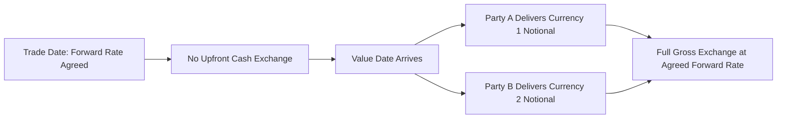
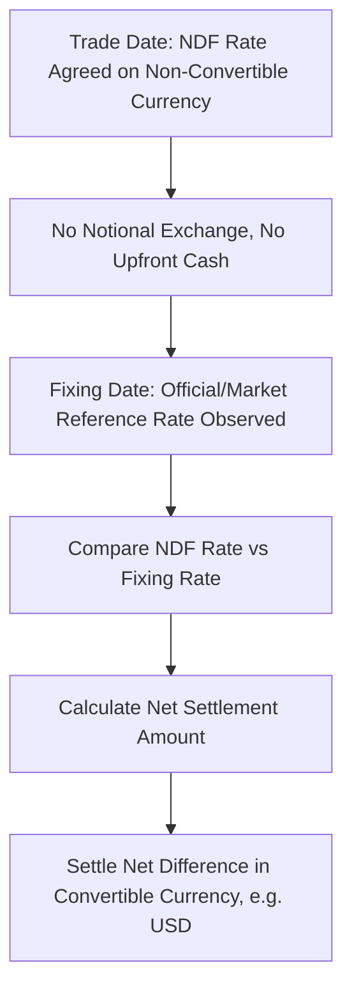

## FX Forwards and Non Deliverable Forwards

### Overview

FX forwards and Non-Deliverable Forwards (NDFs) are contracts obligating two counterparties to exchange currencies at a rate agreed today, for settlement at a specified future date. Both instruments serve the same core economic purpose — hedging or speculating on future currency movements without exchanging cash today — but differ fundamentally in settlement mechanics: deliverable forwards involve actual exchange of the underlying currencies, while NDFs settle only the net cash difference in a convertible currency, making them the standard tool for accessing currencies subject to capital controls or limited convertibility.

### FX Forward Fundamentals

**Key Points**

- An FX forward is a bilateral OTC contract to exchange a specified amount of one currency for another at an agreed **forward rate**, on an agreed **value date** (settlement date) in the future
- Unlike FX spot (settling typically T+2), forwards can settle at any future date — common standard tenors include 1-week, 1-month, 3-month, 6-month, and 1-year, though any custom date can be negotiated bilaterally
- At initiation, a forward is typically structured to have **zero initial value** (no upfront premium changes hands) by setting the forward rate at the level that makes the contract's net present value zero to both counterparties — this is distinct from FX options, which require an upfront premium

### Forward Rate Determination: Covered Interest Rate Parity

**Key Points**

- The forward rate is determined by **Covered Interest Rate Parity (CIRP)**, which ensures no arbitrage opportunity exists between borrowing/lending in two currencies and simultaneously hedging the FX exposure via a forward contract
- The forward rate reflects the **interest rate differential** between the two currencies over the contract's tenor, not a market forecast of the future spot rate — a common point of confusion, since the forward rate can differ substantially from where market participants actually expect spot to trade

$$F = S \times \frac{1+r_{quote}\times\frac{t}{360}}{1+r_{base}\times\frac{t}{360}}$$

where $F$ is the forward rate, $S$ is the current spot rate, $r_{quote}$ and $r_{base}$ are the interest rates for the quote and base currencies respectively, and $t$ is the tenor in days (day-count conventions vary by currency pair)

### Forward Points and Premium/Discount

**Key Points**

- The difference between the forward rate and spot rate is quoted as **forward points** (or "pips"), typically added to or subtracted from the spot rate rather than quoted as an outright rate in interbank markets
- A currency trades at a **forward premium** when its forward rate is higher than spot (typically the case for the currency with the *lower* interest rate, since CIRP implies the lower-yielding currency must appreciate forward to offset its yield disadvantage) and at a **forward discount** when the forward rate is lower than spot (typically the higher-yielding currency)
- This relationship is the FX-market expression of the same interest-rate-differential logic that underlies the general **covered interest arbitrage** relationship linking money markets and FX forward markets

**Example**

Suppose EUR/USD spot is 1.0850, with USD 3-month interest rates at 5.00% and EUR 3-month interest rates at 3.50% (annualized, actual/360 convention, 91-day tenor):

$$F = 1.0850 \times \frac{1+0.05\times\frac{91}{360}}{1+0.035\times\frac{91}{360}} = 1.0850\times\frac{1.012639}{1.008847} \approx 1.0891$$

The EUR trades at a forward **premium** against USD (forward rate above spot), consistent with EUR carrying the lower interest rate in this example — the forward points here are approximately +41 pips (1.0891 − 1.0850).

### Deliverable Forward Settlement

**Key Points**

- On the value date, both counterparties exchange the full **notional amounts** in their respective currencies at the agreed forward rate — e.g., Party A delivers USD and receives EUR, Party B delivers EUR and receives USD, each at the contractually fixed rate
- This requires that both currencies be **freely convertible and deliverable** across the relevant jurisdictions without regulatory restriction, and that both counterparties are willing/able to make full gross payment of notional (subject to standard settlement risk considerations, which CLS Bank's payment-versus-payment settlement infrastructure substantially mitigates for major currency pairs)
- Deliverable forwards are standard for the most heavily traded, freely convertible currency pairs (e.g., EUR/USD, USD/JPY, GBP/USD)

### Non-Deliverable Forwards: Structure and Rationale

**Key Points**

- NDFs reference a currency that is subject to **capital controls, convertibility restrictions, or limited offshore liquidity**, making full physical delivery of that currency impractical or legally restricted for many market participants (particularly non-resident/offshore counterparties)
- Rather than exchanging notional amounts, an NDF settles by comparing the contractually agreed forward rate against a **fixing rate** (an official or market-published reference rate for that currency, observed on a specified fixing date near the value date) and paying the **net difference** in a convertible currency (typically USD)
- Common NDF-traded currencies historically and currently include (subject to evolving convertibility status) the Chinese renminbi (CNY, traded via CNY NDFs referencing the onshore fixing, distinct from the more freely tradable offshore CNH), Indian rupee (INR), Brazilian real (BRL), Korean won (KRW), and various other emerging market currencies with capital control regimes; [Unverified] the specific list of currencies actively trading as NDFs, and the convertibility status of any given currency, changes over time as capital control regimes evolve, so current NDF eligibility and liquidity should be verified against current market data rather than assumed static.

### NDF Settlement Mechanics

**Key Points**

- On the **fixing date** (typically shortly before the value date), the relevant reference fixing rate for the non-convertible currency is observed from the specified official or market source (e.g., a central bank's published rate, or an interbank market fixing poll)
- The **settlement amount** is calculated as the difference between the contract's agreed NDF rate and the observed fixing rate, applied to the notional, and paid in the settlement currency (usually USD) by whichever counterparty is on the losing side of the rate movement

$$Settlement_{USD} = Notional_{local} \times \left(\frac{1}{F_{NDF}} - \frac{1}{Fixing}\right)$$

(the precise formula convention depends on whether notional is expressed in the local or settlement currency, and on the specific currency pair quoting convention — this expresses a common convention where notional is denominated in the non-convertible local currency and settlement is paid in USD)

**Example**

Suppose an NDF references USD/BRL with an agreed NDF rate of 5.20 and a notional of BRL 52,000,000 (i.e., approximately USD 10,000,000 equivalent at the contracted rate). At the fixing date, the observed BRL fixing rate is 5.40 (BRL has weakened against USD relative to the contracted rate):

1. Contract implies the counterparty long USD/short BRL would have received more USD per BRL sold under the original 5.20 rate than the fixing of 5.40 would provide
2. The net settlement is calculated based on the difference between 1/5.20 and 1/5.40 applied to the BRL notional, resulting in a USD-denominated cash settlement paid from the counterparty who benefited from the rate movement to the counterparty adversely affected — no BRL notional is physically exchanged
3. Both counterparties settle purely in USD, with no requirement for either party to source, hold, or deliver actual BRL

### Fixing Rate Sources and Basis Risk

**Key Points**

- The choice of fixing rate source is a critical contractual term, since it defines exactly what reference rate determines settlement — common sources include central-bank-published official rates, or rates derived from a poll of contributing banks' quoted rates for that currency
- **Fixing risk/basis risk** can arise if the published fixing rate diverges from the rate at which market participants could actually transact in either the onshore or offshore market around the fixing time, particularly during periods of market stress, restricted onshore liquidity, or official intervention in the fixing process
- [Inference] This fixing-rate dependency is generally understood as a structural feature (rather than a flaw) of the NDF market, since NDFs specifically exist because market participants often cannot access onshore markets directly — but it does mean NDF settlement outcomes are contingent on the continued availability, transparency, and market credibility of the specified fixing source, which can itself be a source of dispute or valuation uncertainty in stressed conditions.

### Uses of FX Forwards and NDFs

**Key Points**

- **Hedging transaction/translation exposure**: corporates with foreign-currency-denominated receivables, payables, or foreign subsidiary earnings use forwards/NDFs to lock in a known exchange rate for future cash flows or balance sheet translation, reducing FX-driven earnings volatility
- **Hedging investment exposure**: asset managers and investors holding foreign-currency-denominated securities use forwards (or NDFs, for restricted-currency markets) to hedge the currency component of their investment return, isolating the underlying asset's local-currency performance
- **Speculation/relative value positioning**: market participants can take outright directional views on currency movements, or relative value views on the interest rate differential itself (since forward points directly reflect that differential) without any underlying commercial hedging need
- **Accessing restricted markets synthetically**: NDFs specifically allow offshore investors and corporates to gain or hedge exposure to a restricted currency's movements without needing onshore market access, currency conversion permissions, or the ability to hold the restricted currency directly

### Credit and Counterparty Risk Considerations

**Key Points**

- Both FX forwards and NDFs carry bilateral **counterparty credit risk** — the risk that one party fails to perform (deliver notional in a deliverable forward, or pay the net settlement in an NDF) at maturity
- **Settlement risk** (Herstatt risk) is a specific concern for deliverable forwards given the gross exchange of full notional amounts, historically mitigated at the market-infrastructure level through **CLS Bank's payment-versus-payment (PvP) settlement system** for eligible currency pairs, which ensures that both legs of a currency exchange settle simultaneously or not at all
- NDFs, settling only a net cash difference rather than gross notional, carry comparatively lower settlement risk by construction (a smaller absolute cash amount changes hands), though bilateral counterparty credit risk on that net settlement obligation remains, and is managed via standard ISDA documentation, collateralization (variation margin under applicable uncleared margin rules), and counterparty credit assessment

### Regulatory and Documentation Framework

**Key Points**

- FX forwards and NDFs are typically documented under standard **ISDA Master Agreement** architecture, with product-specific confirmations referencing the FX and Currency Option Definitions (published by ISDA, EMTA, and other industry bodies) for standardized terms including business day conventions, fixing sources, and disruption event provisions
- **Disruption event provisions** are a particularly important documentation feature for NDFs specifically, since they specify fallback procedures if the designated fixing rate becomes unavailable, is suspended, or is deemed unreliable (e.g., due to market disruption, convertibility restrictions being imposed, or official rate publication ceasing) — a risk more relevant to NDFs than to deliverable forwards on freely convertible currencies

### Conclusion

**Conclusion**

FX forwards and NDFs both allow market participants to fix a future exchange rate today, governed by the same covered interest rate parity logic that determines forward pricing, but they diverge critically in settlement: deliverable forwards require full gross currency exchange and depend on the underlying currency's free convertibility, while NDFs settle only a net cash difference against a specified fixing rate, enabling exposure management for currencies subject to capital controls or limited convertibility. Understanding which mechanism applies to a given currency pair — and, for NDFs, the specific fixing source and disruption provisions governing settlement — is essential to correctly assessing both the market risk and the operational/basis risk embedded in any FX forward-type position.

**Related Topics**

- Covered Interest Rate Parity and Cross-Currency Basis
- FX Swaps: Combining Spot and Forward Legs
- Cross-Currency Basis Swaps and Long-Dated FX Hedging
- FX Options and Volatility Surface Construction
- CLS Bank Settlement and Herstatt/Settlement Risk Mitigation
- Emerging Market Currency Convertibility and Capital Controls
- ISDA FX and Currency Option Definitions and Disruption Fallbacks