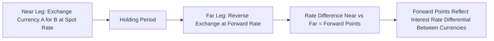
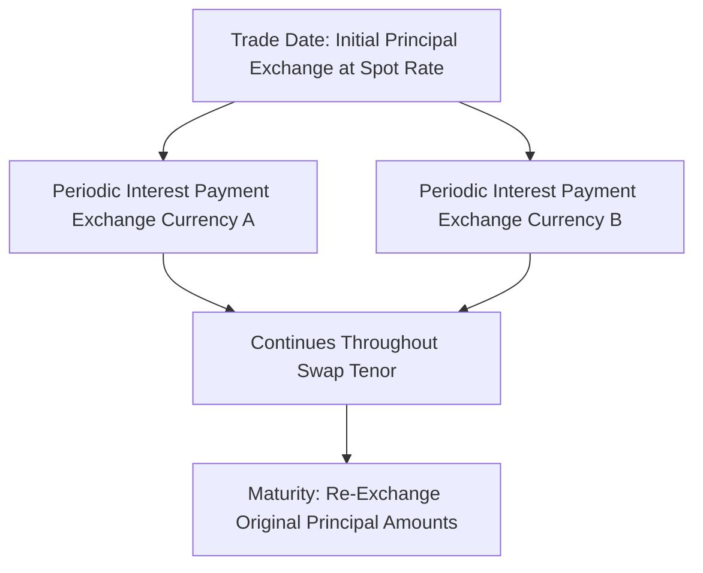

## FX Swaps and Cross Currency Swaps

### Overview

FX swaps and cross-currency swaps both involve exchanging two currencies with an agreement to reverse the exchange at a future date, but they differ fundamentally in what is being swapped: an FX swap exchanges principal only (at two different fixed rates, near-term and far-term), functioning primarily as a short-term funding/liquidity instrument, while a cross-currency swap exchanges both principal and periodic interest payments over a typically much longer tenor, functioning as a long-term hedging and funding tool that also transfers ongoing interest rate exposure between currencies.

### FX Swaps: Structure

**Key Points**

- An FX swap combines two simultaneous transactions between the same two counterparties: a **near leg** (typically a spot transaction, exchanging currencies at the current spot rate) and a **far leg** (a forward transaction, reversing the exchange at a future date at the forward rate)
- No interest payments are exchanged during the life of the swap — only the two principal exchanges (near and far) occur, making the FX swap economically equivalent to a **collateralized short-term loan** in one currency funded by borrowing in the other, with the interest rate differential embedded entirely in the difference between the near and far exchange rates (the forward points)
- FX swaps are overwhelmingly the largest segment of the FX derivatives market by traded volume, reflecting their central role in short-term funding, liquidity management, and hedging rollover activity across global money markets

### FX Swap Pricing and the Forward Points Relationship

**Key Points**

- The far-leg rate is determined by the same Covered Interest Rate Parity relationship covered in the FX forwards entry — the forward points embedded in the far leg reflect the interest rate differential between the two currencies over the swap's tenor
- Because an FX swap is economically a matched pair of borrowing and lending positions, the forward points effectively represent the **implied interest cost/benefit** of funding in one currency versus the other via this synthetic mechanism, rather than via direct unsecured borrowing in each currency separately

$$ForwardPoints = S\times\left(\frac{1+r_{quote}\times\frac{t}{360}}{1+r_{base}\times\frac{t}{360}}-1\right)$$

using the same notation as the FX forward pricing relationship, where $S$ is the near-leg (spot) rate

### FX Swap Use Cases

**Key Points**

- **Short-term funding/liquidity management**: banks and corporates use FX swaps to convert surplus liquidity in one currency into a needed currency for a defined period, then reverse the transaction once the funding need has passed — a core money-market/treasury desk function
- **Rolling forward hedges**: a market participant with an existing forward hedge approaching maturity, but wishing to extend the hedge, can use an FX swap to "roll" the position — the near leg closes out the maturing exposure at spot, and the far leg re-establishes a new forward position at a later date
- **Central bank and reserve management operations**: FX swaps are also used by central banks and monetary authorities for reserve management and, in some contexts, for providing or accessing foreign currency liquidity (e.g., central bank FX swap lines) — [Unverified] the specific current scope, counterparties, and terms of any such official-sector swap arrangements vary by central bank and time period and should be verified against current central bank communications rather than assumed static

### Cross-Currency Swaps: Structure

**Key Points**

- A cross-currency swap (CCS) involves an **initial exchange of principal** in two currencies at the prevailing spot rate, **periodic exchange of interest payments** (which can be fixed-for-fixed, fixed-for-floating, or floating-for-floating, depending on the specific swap structure) over the life of the swap, and a **final re-exchange of the original principal amounts** at maturity, typically at the same rate used for the initial exchange
- Unlike an FX swap, principal amounts in a cross-currency swap remain economically outstanding (and the associated FX risk on the principal itself persists) throughout the swap's life until the final principal re-exchange, and periodic interest cash flows are actually exchanged throughout the swap's tenor rather than being embedded entirely in the difference between two exchange rates
- Cross-currency swaps typically have materially **longer tenors** than FX swaps (commonly multi-year, often 2–30+ years) reflecting their use for long-term funding and hedging rather than short-term liquidity management

### Cross-Currency Basis

**Key Points**

- In a purely theoretical, frictionless market, a floating-for-floating cross-currency swap (e.g., exchanging SOFR-flat cash flows in USD for a corresponding floating rate in another currency) would require no additional spread beyond the respective reference rates, if covered interest rate parity held exactly using those reference rates
- In practice, cross-currency swaps trade with an additional spread — the **cross-currency basis** — added to one leg (typically the non-USD leg, in USD-versus-other-currency swaps) to clear the market, reflecting supply/demand imbalances for currency-specific funding that pure interest rate differentials do not fully capture
- A **negative cross-currency basis** for a given currency against USD generally indicates that market participants are willing to accept a lower yield on that currency's leg (effectively paying up) to obtain USD funding via the swap, reflecting a relative scarcity of USD funding availability through direct means relative to synthetic funding via the swap market — [Inference] this basis is widely attributed to structural and regulatory factors affecting bank balance sheet capacity to intermediate currency funding markets, though the precise magnitude and drivers of the basis at any point in time reflect a complex mix of factors that should be assessed against current market conditions rather than a single fixed explanation.

$$CCS\ Leg\ Payment = ReferenceRate + CrossCurrencyBasis$$

### Cross-Currency Swap Use Cases

**Key Points**

- **Long-term funding in a foreign currency**: a corporate or financial institution that can borrow attractively in its domestic currency but needs funding in a foreign currency can issue debt domestically and use a cross-currency swap to convert both the initial proceeds and the ongoing interest/principal obligations into the needed foreign currency — a classic "borrow where cheap, swap to where needed" strategy
- **Hedging foreign-currency-denominated debt or assets**: issuers of foreign-currency bonds, or holders of long-dated foreign-currency assets/liabilities, use cross-currency swaps to hedge both the principal FX exposure and the ongoing interest rate exposure over the full life of the underlying instrument, in contrast to a series of shorter-dated FX forwards which would need to be rolled repeatedly and would not by themselves hedge the interest-rate-differential-driven basis risk as directly
- **Asset-liability currency matching for financial institutions**: banks and insurers with currency-mismatched balance sheets (e.g., domestic-currency liabilities against foreign-currency assets, or vice versa) use cross-currency swaps to align the currency composition of assets and liabilities over long horizons

### Comparing FX Swaps and Cross-Currency Swaps

| Feature | FX Swap | Cross-Currency Swap |
| --- | --- | --- |
| Typical Tenor | Overnight to ~1 year | Multi-year (2–30+ years) |
| Interest Payments Exchanged | No — embedded in forward points | Yes — periodic exchange over life of swap |
| Principal Exchanged | Twice (near and far leg) | Twice (initial and final, same rate) |
| Primary Use | Short-term funding/liquidity | Long-term funding/hedging |
| Key Pricing Driver | Interest rate differential (forward points) | Reference rate differential plus cross-currency basis |

### Valuation Considerations

**Key Points**

- FX swap valuation follows directly from forward pricing mechanics: the near leg is valued at spot, and the far leg's value depends on the difference between the contracted forward rate and the currently prevailing forward rate for that remaining tenor, discounted appropriately
- Cross-currency swap valuation requires discounting the projected floating (or fixed) cash flows in each currency using currency-specific discount curves, **incorporating the cross-currency basis** into at least one leg's discounting or cash flow projection — a material complexity relative to single-currency swap valuation, since ignoring the basis can produce materially mispriced valuations, particularly for longer-dated swaps or currency pairs with a persistently wide basis
- Since the post-financial-crisis shift toward **multi-curve discounting frameworks** (using overnight-indexed/risk-free reference rate curves for discounting, separate from the curves used for projecting floating rate cash flows), cross-currency swap valuation in current market practice typically incorporates a dedicated cross-currency basis curve as a distinct input alongside each currency's own discounting and projection curves

### Credit and Counterparty Risk Considerations

**Key Points**

- Cross-currency swaps carry materially more counterparty credit exposure over their life than FX swaps, given their longer tenor and the ongoing exchange of both principal-linked FX risk and periodic interest payments — this is managed through standard ISDA/CSA collateralization frameworks, with variation margin (and, where applicable under uncleared margin rules, initial margin) posted to reflect the swap's changing mark-to-market value
- The **principal exchange feature** is a specific risk consideration distinguishing cross-currency swaps from same-currency interest rate swaps — settlement/delivery risk on the notional exchange dates (particularly the final re-exchange at maturity) requires the same settlement risk mitigation considerations (e.g., CLS Bank PvP settlement where applicable) as FX forwards

### Conclusion

**Conclusion**

FX swaps and cross-currency swaps both transfer currency exposure between counterparties via paired transactions with an agreed reversal, but they serve structurally distinct market functions: FX swaps are the workhorse short-term funding and liquidity instrument, with the interest rate differential embedded purely in forward points and no periodic interest exchange, while cross-currency swaps are long-term funding and hedging instruments involving actual periodic interest payment exchange and priced with reference to the cross-currency basis in addition to each currency's own reference rate curve. Understanding the cross-currency basis specifically is essential to cross-currency swap valuation and to interpreting what the swap market is signaling about relative currency funding conditions, distinct from what pure covered interest rate parity alone would predict.

**Related Topics**

- FX Forwards and Non-Deliverable Forwards: Covered Interest Rate Parity Foundations
- Cross-Currency Basis Drivers and Post-Crisis Regulatory Balance Sheet Constraints
- Multi-Curve Discounting Frameworks for Derivatives Valuation
- Central Bank FX Swap Lines and Official Sector Liquidity Provision
- CLS Bank Settlement and Principal Exchange Settlement Risk
- Long-Term Foreign Currency Funding Strategies for Corporates and Financial Institutions
- Interest Rate Swap Valuation and OIS Discounting Fundamentals