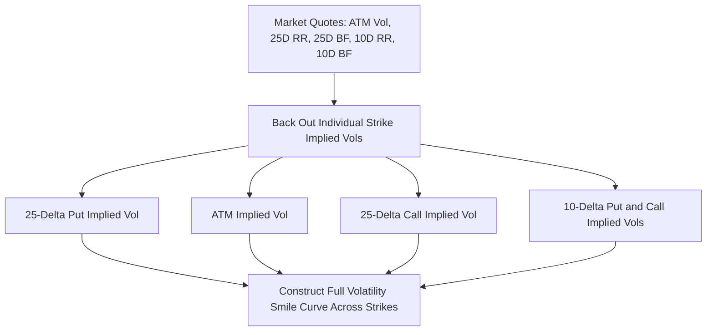

## FX Options and the Volatility Smile

### Overview

FX options grant the holder the right, but not the obligation, to exchange one currency for another at a specified rate on or before a future date, in exchange for an upfront premium. FX options markets have developed a distinctive quoting convention centered on **delta** rather than strike price, and exhibit a characteristic **volatility smile** (or smirk) across strikes that reflects the market's pricing of tail risk and skewness in currency movements. This entry covers FX option mechanics, market quoting conventions, and the structure and drivers of the FX volatility smile.

### FX Option Basics

**Key Points**

- A **call option** on a currency pair gives the holder the right to buy the base currency (equivalently, sell the quote currency) at the strike rate; a **put option** gives the right to sell the base currency (buy the quote currency) at the strike rate — critically, every FX option is simultaneously a call on one currency and a put on the other, so "call" and "put" terminology must always be stated relative to a specified currency
- FX options can be **European-style** (exercisable only at expiry) or **American-style** (exercisable any time up to expiry), with European-style being the market standard for most vanilla FX options, particularly in institutional/interbank markets
- Standard vanilla FX option pricing uses the **Garman-Kohlhagen model**, a direct extension of Black-Scholes that accounts for the fact that both currencies in the pair earn their own respective risk-free interest rate

$$C = S\,e^{-r_f T}N(d_1) - K\,e^{-r_d T}N(d_2)$$

$$d_1 = \frac{\ln(S/K)+(r_d-r_f+\sigma^2/2)T}{\sigma\sqrt{T}}, \qquad d_2 = d_1-\sigma\sqrt{T}$$

where $S$ is the spot rate, $K$ is the strike, $r_d$ is the domestic (quote currency) risk-free rate, $r_f$ is the foreign (base currency) risk-free rate, $\sigma$ is volatility, and $T$ is time to expiry

### FX Options Quoting Convention: Delta, Not Strike

**Key Points**

- Unlike equity or fixed income options markets, which typically quote and trade options by strike price, the FX options interbank market quotes options primarily by **delta** — market participants trade and quote "the 25-delta call" or "the 10-delta put" rather than a specific strike level
- This convention exists because delta-based quoting allows quotes to remain meaningful and comparable as spot moves, without needing to constantly requote strike levels — a given delta level corresponds to a consistent "moneyness" concept across changing spot levels
- Standard quoted delta points in the market include **25-delta** and **10-delta** risk reversals and butterflies (on both the call and put side), plus the **at-the-money (ATM)** point, typically defined via a delta-neutral straddle convention rather than strictly spot-equals-strike

### At-The-Money Conventions

**Key Points**

- FX markets use several distinct ATM conventions depending on the specific currency pair and market convention: **ATM spot** (strike set equal to current spot), **ATM forward** (strike set equal to the forward rate for that tenor — the most common convention for most currency pairs), and **ATM delta-neutral straddle** (strike set such that the call and put delta are equal in magnitude and opposite in sign, meaning a straddle at that strike has zero net delta)
- [Unverified] The specific ATM convention used varies by currency pair and market practice, and can differ between broker/interdealer conventions; the applicable convention for any specific quote should be confirmed rather than assumed uniform across all pairs.

### Risk Reversals and Butterflies: Quoting the Smile

**Key Points**

- A **risk reversal (RR)** is the volatility difference between an out-of-the-money call and an equivalent-delta out-of-the-money put (e.g., the 25-delta risk reversal = implied vol of 25-delta call minus implied vol of 25-delta put) — this single number captures the **skew** (asymmetry) of the volatility smile, indicating whether the market prices calls or puts richer at that delta level
- A **butterfly (BF or "fly")** is calculated from the average of the equivalent-delta call and put implied vols, minus the ATM implied vol (e.g., 25-delta butterfly = average of 25-delta call and put vols, minus ATM vol) — this captures the **curvature** of the smile, i.e., how much richer out-of-the-money options are relative to at-the-money, independent of skew direction
- Together, ATM vol, the 25-delta (and often 10-delta) risk reversal, and the 25-delta (and often 10-delta) butterfly constitute the standard minimal parameterization the interbank market uses to describe an entire volatility smile for a given tenor, from which the implied vols (and corresponding strikes) for the individual 25-delta call, 25-delta put, 10-delta call, and 10-delta put can be reconstructed

$$RR_{25\Delta} = \sigma_{25\Delta\,Call} - \sigma_{25\Delta\,Put}$$

$$BF_{25\Delta} = \frac{\sigma_{25\Delta\,Call}+\sigma_{25\Delta\,Put}}{2} - \sigma_{ATM}$$

### The Shape of the FX Volatility Smile

**Key Points**

- FX implied volatility typically exhibits a **smile** shape: implied volatility is lowest near at-the-money strikes and rises for both out-of-the-money calls and out-of-the-money puts, reflecting the market's pricing of a higher probability of large moves (in either direction) than a constant-volatility (Black-Scholes/Garman-Kohlhagen) lognormal model would imply
- The smile's **skew direction** (whether calls or puts on a given currency trade at higher implied vol) reflects the market's assessment of directional tail risk for that specific currency pair — for example, currency pairs perceived to have "crash risk" concentrated in one direction (such as a sharp depreciation of an emerging market currency during stress) will typically show a risk reversal skewed toward richer puts on that currency (protection against depreciation priced at a premium)
- [Inference] The specific sign and magnitude of skew for any given currency pair is regime- and pair-dependent, generally reflecting prevailing market perceptions of asymmetric risk for that specific pair at that specific time, rather than a fixed structural property of the smile that persists unchanged across all market conditions — current risk reversal levels should be checked against live market data rather than assumed to follow a fixed historical pattern.

**Illustration: Volatility Smile Shape (svg_diagram)**

<svg xmlns="http://www.w3.org/2000/svg" viewBox="0 0 700 380">
<rect width="700" height="380" fill="none" />
<text x="350" y="25" text-anchor="middle" font-size="16" font-weight="bold" fill="#1a1a1a">FX Implied Volatility Smile Across Delta (svg_diagram)</text>
<line x1="70" y1="320" x2="650" y2="320" stroke="#333" stroke-width="1.5" />
<line x1="70" y1="320" x2="70" y2="60" stroke="#333" stroke-width="1.5" />
<text x="360" y="355" text-anchor="middle" font-size="13" fill="#333">Delta (10P -- 25P -- ATM -- 25C -- 10C)</text>
<text x="30" y="190" text-anchor="middle" font-size="13" fill="#333" transform="rotate(-90 30 190)">Implied Volatility</text>
<path d="M 100 150 C 200 260, 330 300, 400 295 C 470 285, 550 220, 620 130" stroke="#2980b9" stroke-width="2.5" fill="none" />
<circle cx="100" cy="150" r="4" fill="#c0392b" />
<text x="90" y="140" font-size="11" fill="#c0392b">10-Delta Put</text>
<circle cx="240" cy="270" r="4" fill="#c0392b" />
<text x="200" y="285" font-size="11" fill="#c0392b">25-Delta Put</text>
<circle cx="400" cy="295" r="4" fill="#c0392b" />
<text x="380" y="313" font-size="11" fill="#c0392b">ATM</text>
<circle cx="530" cy="245" r="4" fill="#c0392b" />
<text x="500" y="260" font-size="11" fill="#c0392b">25-Delta Call</text>
<circle cx="620" cy="130" r="4" fill="#c0392b" />
<text x="580" y="120" font-size="11" fill="#c0392b">10-Delta Call</text>
</svg>

### Smile Construction and Interpolation

**Key Points**

- Since the market directly quotes only a handful of discrete delta points (ATM, 25-delta, 10-delta, each as a risk reversal/butterfly pair), pricing an option at an arbitrary strike or delta not directly quoted requires an **interpolation methodology** across the smile
- Common interpolation approaches include **Vanna-Volga** (a widely used market-practitioner technique that adjusts the Garman-Kohlhagen price for an arbitrary strike using the market prices of the quoted risk reversal and butterfly instruments, effectively hedging away the vega, vanna, and volga risk of an exotic or off-market-strike option using the liquid quoted instruments), **SABR** and other parametric stochastic volatility model fits, and **spline-based interpolation** directly on implied volatility or on strike-vs-delta mappings
- [Unverified] The specific interpolation methodology used varies by institution, by currency pair liquidity, and by the specific application (vanilla option pricing versus exotic option pricing may use different smile construction approaches even within the same institution), so the appropriate technique should be assessed for the specific pricing context rather than assumed universal.

### Tenor Structure: The Volatility Term Structure and Smile Dynamics

**Key Points**

- The volatility smile parameters (ATM vol, risk reversal, butterfly) are quoted across a full range of standard tenors (overnight, 1-week, 1-month, 3-month, 6-month, 1-year, and longer), together forming a **volatility surface** across both strike/delta and tenor dimensions
- ATM volatility term structure can be upward or downward sloping (or non-monotonic) depending on market expectations of near-term versus longer-term volatility, often influenced by known upcoming events (central bank meetings, elections, data releases) that create localized "bumps" in the short end of the term structure
- Risk reversals and butterflies also have their own term structure, and can behave quite differently at different tenors — for example, a currency pair might show a modest skew at short tenors but a more pronounced skew at longer tenors (or vice versa), reflecting different market perceptions of near-term versus longer-term directional risk

### Common FX Option Structures Beyond Vanilla

**Key Points**

- **Risk reversal (as a traded structure, not just a quoting convention)**: simultaneously buying a call and selling a put (or vice versa) at the respective market-quoted deltas, often used to express a directional view with reduced net premium cost relative to an outright vanilla option
- **Straddles and strangles**: combinations used to express views on volatility itself (magnitude of movement) rather than direction, since a straddle (long call and long put at the same strike) profits from large moves in either direction
- **Barrier options** (knock-in, knock-out) and **digital/binary options**: exotic structures common in FX markets, whose valuation requires the full smile (not just ATM vol) given their strong sensitivity to the volatility at specific strike/barrier levels, making smile-consistent pricing methodologies (such as Vanna-Volga) particularly important for these structures

### Practical Applications of the Smile

**Key Points**

- **Corporate and institutional hedging**: hedgers pricing or evaluating vanilla or exotic FX option hedges must reference the full smile (not a flat single vol assumption) to obtain market-consistent pricing, since using a single ATM vol for an out-of-the-money hedge would misprice the option relative to where it would actually trade in the market
- **Relative value and skew trading**: market participants can take views specifically on the *shape* of the smile (e.g., "the risk reversal is too rich/cheap relative to historical or model-implied levels") independent of a directional spot view, trading the risk reversal or butterfly structures directly
- **Risk management of option portfolios**: option desks managing inventories of FX options must manage not only delta and vega risk but also **vanna** (sensitivity of delta to volatility changes) and **volga** (sensitivity of vega to volatility changes) risk, both of which are directly related to the smile's skew and curvature respectively — this is precisely why Vanna-Volga adjustment techniques are named as they are and why smile dynamics matter operationally, not just for pricing individual trades

### Conclusion

**Conclusion**

FX options markets have developed a distinctive delta-based quoting convention (ATM, risk reversal, and butterfly at standard delta points) precisely because the market recognized early that implied volatility varies systematically across strikes, in a manner a single Garman-Kohlhagen volatility input cannot capture. This smile — its skew reflecting directional tail-risk perception and its curvature reflecting the market's pricing of larger-than-lognormal moves in either direction — must be interpolated and modeled consistently (via techniques such as Vanna-Volga or parametric stochastic volatility fits) to price vanilla options away from the directly quoted delta points and, especially, to price exotic and barrier structures whose value depends materially on the smile's specific shape rather than a single volatility number.

**Related Topics**

- FX Forwards and Non-Deliverable Forwards: Interest Rate Parity Foundations
- Garman-Kohlhagen Model Derivation and Assumptions
- Vanna-Volga Pricing Methodology for Exotic FX Options
- Barrier and Digital FX Option Structures and Smile Dependence
- Stochastic Volatility Models (SABR, Heston) Applied to FX Markets
- FX Volatility Surface Construction and Term Structure Dynamics
- Skew and Butterfly Relative Value Trading Strategies