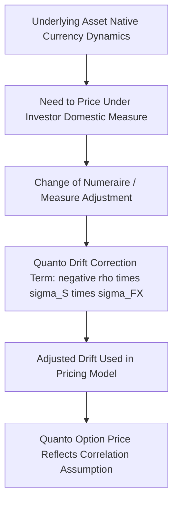

## FX Quanto and Composite Structuring

### Overview

Quanto and composite structures address a specific problem in cross-border derivatives: how to pay out an option or derivative based on an underlying asset denominated in one currency, when the investor wants exposure or settlement in a different currency. A **quanto** structure fixes the exchange rate used for conversion in advance (eliminating FX risk on the payout but embedding a specific correlation-dependent adjustment into pricing), while a **composite** structure simply converts the payout at the prevailing spot rate at settlement (leaving the investor exposed to FX risk on the payout amount). Both are foundational building blocks across equity, rates, and commodity derivatives whenever the underlying and the investor's desired settlement currency differ.

### The Core Problem: Currency Mismatch Between Underlying and Payout

**Key Points**

- Many derivatives reference an underlying asset (a stock index, a commodity, a bond) that is naturally denominated in a currency different from the currency in which the investor wants to receive their payout — e.g., a USD-based investor wanting exposure to the Nikkei 225 (JPY-denominated) without taking on JPY/USD exchange rate risk
- A **composite** (or "compo") structure handles this by calculating the option payoff in the underlying's native currency as normal, then converting that payoff amount into the investor's desired currency **at the prevailing spot FX rate at settlement** — the investor bears FX risk on the size of the payout itself, even though they were never exposed to FX risk on the underlying's day-to-day price moves in a hedging sense
- A **quanto** structure instead **fixes the FX conversion rate in advance** (typically at trade inception, though other fixing conventions exist), so the payout in the investor's currency is calculated by applying that fixed rate to the underlying-currency payoff — the investor now has zero FX risk on the payout amount, but this fixing convention has pricing implications tied to the correlation between the underlying asset and the FX rate

### Composite Option Payoff and Pricing

**Key Points**

- A composite option payoff is straightforward: compute the vanilla option payoff in the underlying's native currency, then multiply by the spot FX rate observed at expiry to convert to the investor's currency

$$Payoff_{composite} = \max(S_T - K, 0) \times FX_T$$

where $S_T$ is the underlying asset price at expiry (in its native currency), $K$ is the strike (also in native currency), and $FX_T$ is the spot exchange rate at expiry (units of investor currency per unit of native currency)

- Because the payout is simply the native-currency payoff scaled by a random, unfixed FX rate at expiry, pricing a composite option is comparatively close to pricing the underlying vanilla option and then separately accounting for the FX conversion — the composite structure introduces FX risk (and correspondingly, a higher volatility payout profile from the investor's perspective, since two sources of randomness — the underlying and the FX rate — both affect final payout size) without introducing the correlation adjustment central to quanto pricing

### Quanto Option Payoff and Pricing

**Key Points**

- A quanto option payoff applies a **pre-fixed exchange rate** (agreed at trade inception, sometimes called the "quanto factor" or fixed FX rate) to the native-currency payoff, rather than the rate prevailing at expiry:

$$Payoff_{quanto} = \max(S_T-K,0)\times FX_{fixed}$$

- Despite the FX rate being fixed and therefore introducing no direct FX randomness into the payout, quanto option pricing is **not** simply the vanilla option price scaled by the fixed rate — this is the most commonly misunderstood aspect of quanto structuring
- The critical pricing adjustment arises because, under the pricing measure appropriate for the investor's currency, the underlying asset's **effective drift must be adjusted** to account for the correlation between the underlying asset's returns and the FX rate's returns — this adjustment is known as the **quanto correction** or **quanto drift adjustment**

### The Quanto Drift Adjustment

**Key Points**

- When pricing a quanto derivative, the underlying asset must be modeled under the **investor's domestic risk-neutral measure**, not its own native risk-neutral measure — changing measures (via a change-of-numeraire argument) introduces an adjustment to the underlying's drift term proportional to the correlation between the underlying asset's returns and the FX rate's returns, and to the volatilities of both
- The quanto-adjusted drift for the underlying asset (in a standard lognormal/Black-Scholes-style framework) becomes:

$$\mu_{quanto} = r_d - q - \rho\,\sigma_S\,\sigma_{FX}$$

where $r_d$ is the domestic (investor currency) risk-free rate, $q$ is the underlying asset's dividend/carry yield, $\rho$ is the correlation between the underlying asset's returns and the FX rate's returns, $\sigma_S$ is the underlying asset's volatility, and $\sigma_{FX}$ is the FX rate's volatility

- The sign and magnitude of this correction term ($-\rho\sigma_S\sigma_{FX}$) directly reflects the correlation assumption: if the underlying asset and the FX rate are **positively correlated** (the underlying's native currency tends to strengthen when the asset itself rises), the quanto adjustment **reduces** the effective drift used for pricing, and vice versa for negative correlation

### Intuition Behind the Quanto Correction

**Key Points**

- The quanto correction exists because fixing the FX rate in advance effectively creates an implicit **hedge/unwind of the correlation** between the underlying and FX that a composite structure would otherwise leave exposed — the pricing model must account for how the fixed-rate conversion interacts with the joint dynamics of the underlying and FX rate to avoid an arbitrage opportunity
- [Inference] An intuitive (though simplified) way to think about this: if the underlying asset and its native currency are positively correlated, an investor holding an *unquantoed* (native currency) position benefits from a "double positive" effect when the asset rises (the asset itself is worth more, and its currency has also strengthened, if the investor were to convert at prevailing rates) — the quanto structure removes this favorable double-effect by fixing the conversion rate in advance, and the drift adjustment in pricing reflects the removal of that correlation-driven benefit (or, for negative correlation, the removal of a correlation-driven cost) that a spot-rate conversion would have delivered.

### Practical Correlation Estimation Challenges

**Key Points**

- Quanto pricing requires an estimate of the correlation between the underlying asset's returns and the relevant FX rate's returns — this correlation is not always stable, may be poorly estimated from limited historical data (particularly for less liquid underlying/currency combinations), and can shift materially during periods of market stress
- [Unverified] The specific correlation estimation methodology (historical realized correlation over a specified lookback window, implied correlation backed out from any liquid multi-asset structured products referencing the same underlying/FX combination, or a blend of approaches) varies by institution and by the specific underlying/currency pair's available market data, and should be assessed against the specific pricing context rather than assumed standardized.
- Because the quanto correction directly scales with the assumed correlation, mis-estimation of this correlation is a direct source of quanto mispricing risk — quanto structures are therefore sometimes characterized as carrying a distinct **quanto correlation risk** dimension that a composite structure (which uses spot-rate conversion and therefore does not require this drift-adjustment/correlation assumption in the same way) does not carry.

### Common Use Cases

**Key Points**

- **Cross-border equity index derivatives**: a classic and widely-cited example is a USD investor wanting exposure to a foreign equity index (e.g., Nikkei 225 futures/options quanto-settled in USD), removing the JPY/USD FX risk on the payout while still gaining Nikkei price exposure
- **Cross-border interest rate and bond derivatives**: quanto structures also apply to interest rate swaps, swaptions, and bond options where the reference rate or bond is denominated in a currency different from the desired settlement currency, requiring the same measure-change/drift-adjustment logic applied to the relevant rate or bond price process rather than an equity index
- **Structured notes and retail-distributed products**: quanto and composite features are commonly embedded within structured notes sold to investors seeking foreign asset exposure without direct FX exposure (quanto) or accepting FX exposure as a deliberate part of the product's risk/return profile (composite)
- **Commodity derivatives**: quanto structuring is also relevant where a commodity is priced in one currency (e.g., USD-denominated oil) but an investor in another currency wants exposure without the USD FX component

### Composite vs. Quanto: Choosing Between Structures

**Key Points**

- The choice between composite and quanto structuring reflects the investor's actual risk appetite: composite structures are appropriate when the investor is comfortable bearing (or specifically wants) FX exposure on the payout, generally accepting a comparatively more straightforward pricing framework; quanto structures are appropriate when the investor specifically wants to isolate the underlying asset's price exposure while eliminating FX risk on the payout, accepting in exchange the correlation-dependent pricing adjustment and the associated correlation estimation/model risk
- Because quanto structures embed a correlation assumption directly into pricing, the *cost* of a quanto structure relative to an unquantoed or composite equivalent can differ meaningfully depending on the sign and magnitude of the assumed correlation — a materially different economic cost from a composite structure's FX-exposure trade-off, meaning the two are not simply interchangeable "FX risk on or off" choices with identical underlying pricing otherwise

### Risk Management Considerations

**Key Points**

- Hedging a quanto position requires managing not only the underlying asset's delta/vega risk and the FX rate's own risk, but also the **correlation risk** between the two — a risk dimension not directly hedgeable via simple vanilla instruments in the same way delta or vega can be hedged with the underlying or vanilla options, often requiring correlation-sensitive multi-asset hedging instruments or accepting basis risk on the correlation assumption
- Composite positions, by contrast, primarily require managing the underlying asset's own risk plus a separate, more standard FX forward/option hedge on the expected payout size — a comparatively more modular hedging approach, though the FX hedge notional itself is uncertain in advance since it depends on the ultimate option payoff size (creating its own dynamic hedging complexity, distinct from quanto's correlation risk)

### Conclusion

**Conclusion**

Quanto and composite structures both solve the currency-mismatch problem inherent in cross-border derivatives, but through fundamentally different mechanisms with different risk implications: composite structures convert at the prevailing spot rate at settlement, leaving the investor exposed to FX risk on the payout size but avoiding correlation-dependent pricing complexity, while quanto structures fix the conversion rate in advance, eliminating payout FX risk but requiring a correlation-dependent drift adjustment in pricing and introducing a distinct, difficult-to-hedge correlation risk dimension. Recognizing which structure a given cross-border derivative uses — and, for quanto structures specifically, the correlation assumption embedded in its pricing — is essential to correctly valuing and risk-managing exposure to foreign-currency-denominated underlyings.

**Related Topics**

- FX Options and the Volatility Smile: Foundational Option Pricing Framework
- Change of Numeraire and Measure Change Techniques in Derivatives Pricing
- Cross-Border Equity Index Derivatives and Quanto Futures Structuring
- Multi-Asset Correlation Estimation and Correlation Risk Management
- Structured Notes: Embedding Quanto and Composite Features
- Quanto Adjustments in Interest Rate and Commodity Derivatives
- Hedging Correlation Risk in Multi-Asset Derivative Portfolios