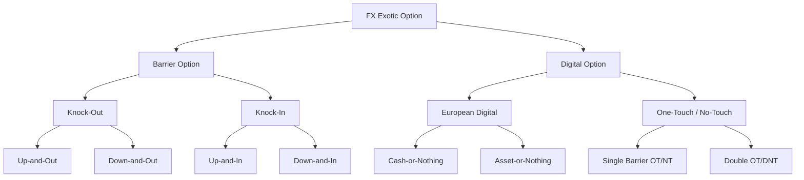

## FX Barrier and Digital Options

### Overview

FX barrier and digital options are exotic derivatives whose payoff depends on whether the underlying exchange rate crosses (or fails to cross) a predetermined level during the option's life, or on a discontinuous payoff structure, respectively. They are among the most heavily traded FX exotics due to their capital efficiency relative to vanilla options and their utility in expressing precise views on both direction and volatility.

**Key Points**

- Barrier options are path-dependent: the payoff depends on the underlying's trajectory, not just its terminal value
- Digital (binary) options pay a fixed amount or nothing, creating payoff discontinuities
- Both instrument classes are cheaper than vanilla equivalents (barriers) or exhibit extreme sensitivity near the strike/barrier (digitals)
- Pricing requires careful handling of discrete monitoring, boundary conditions, and volatility skew

### Barrier Option Taxonomy

Barrier options are classified along two independent dimensions: **knock-in vs. knock-out** and **up vs. down**, combined with the underlying option type (call/put).

**Knock-Out Options**

- Cease to exist (become worthless, or pay a rebate) if the barrier is touched before expiry
- **Up-and-Out (UAO)**: barrier above spot; option extinguished if spot rises to barrier
- **Down-and-Out (DAO)**: barrier below spot; option extinguished if spot falls to barrier

**Knock-In Options**

- Only come into existence if the barrier is touched before expiry; otherwise expire worthless
- **Up-and-In (UAI)**: barrier above spot; option activated if spot rises to barrier
- **Down-and-In (DAI)**: barrier below spot; option activated if spot falls to barrier

**In-Out Parity**

A foundational identity linking knock-in and knock-out variants with identical strike, barrier, and maturity:

$$\text{Knock-In} + \text{Knock-Out} = \text{Vanilla}$$

This holds because at expiry, exactly one of the two barrier conditions applies (barrier touched or not touched), and the sum of payoffs across both scenarios replicates the vanilla payoff. This parity is used both as a pricing shortcut and as a model-risk sanity check.

### Barrier Option Payoff Structures

For a European-style up-and-out call, monitored continuously, with strike $K$, barrier $B > K$, spot path $S_t$, and maturity $T$:

$$\text{Payoff} = \max(S_T - K, 0) \cdot \mathbb{1}_{\{\max_{0 \le t \le T} S_t < B\}}$$

For a down-and-in put with barrier $B < K$:

$$\text{Payoff} = \max(K - S_T, 0) \cdot \mathbb{1}_{\{\min_{0 \le t \le T} S_t \le B\}}$$

**Rebates**

Many barrier structures include a rebate — a fixed cash amount paid if the barrier is hit (for knock-outs) or if the barrier is *not* hit by expiry (for knock-ins). Rebates can be paid at the moment of breach ("rebate at hit") or deferred to expiry ("rebate at expiry"), which affects discounting and, under stochastic rates, valuation.

### Double Barrier Options

Double barrier (corridor) options have both an upper barrier $B_u$ and lower barrier $B_l$, knocking in or out if either is breached:

$$\text{Payoff (double KO call)} = \max(S_T - K, 0) \cdot \mathbb{1}_{\{B_l < \min_t S_t \text{ and } \max_t S_t < B_u\}}$$

These are common in range-bound FX views, particularly for pegged or managed-float currency pairs.

### Pricing: Closed-Form (Reiner-Rubinstein / Black-Scholes Barrier Formulas)

Under the standard Garman-Kohlhagen framework (Black-Scholes adapted for FX, with domestic rate $r_d$ and foreign rate $r_f$), continuously-monitored single barrier options admit closed-form solutions. Define:

$$\mu = \frac{r_d - r_f - \sigma^2/2}{\sigma^2}, \quad \lambda = \sqrt{\mu^2 + \frac{2r_d}{\sigma^2}}$$

The down-and-out call (for $B \le K$) can be expressed using the reflection principle, exploiting the fact that under geometric Brownian motion, the distribution of the running minimum has a known closed form via the method of images:

$$C_{DO} = C_{vanilla} - \left(\frac{B}{S_0}\right)^{2\mu+2} C_{vanilla}(S_0 \to B^2/S_0)$$

**[Inference]** In practice, quant desks rarely use these closed-form formulas directly for live pricing because they assume continuous monitoring, constant volatility, and flat rates — all violated by real markets — so PDE or Monte Carlo methods with local/stochastic volatility are standard. The closed-form formulas remain essential for sanity-checking numerical implementations and for quoting indicative levels.

### Discrete vs. Continuous Monitoring

Real-world barrier options are almost always monitored at discrete fixing times (e.g., daily at a specific cut, such as NY 10am or Tokyo fix) rather than continuously. Discrete monitoring makes the barrier "easier to avoid" than continuous monitoring, systematically changing value.

**Broadie-Glasserman-Kou Continuity Correction**

A widely used approximation adjusts the continuous-barrier formula to approximate discrete monitoring by shifting the barrier:

$$B_{adjusted} = B \cdot \exp\left(\pm \beta \sigma \sqrt{\Delta t}\right)$$

where $\beta \approx 0.5826$ (derived from the Riemann zeta function, $\beta = -\zeta(1/2)/\sqrt{2\pi}$), the sign is positive for up-barriers and negative for down-barriers, and $\Delta t$ is the time between monitoring points. This correction is a well-established, documented technique in the exotic FX options literature.

### Volatility Skew and Barrier Pricing

Barrier options are highly sensitive to the shape of the implied volatility smile/skew, not just at-the-money volatility, because the payoff depends on the probability of touching the barrier — which is materially affected by the skew in the wings.

**Vanna-Volga Method**

A widely used market-practitioner technique (not a full stochastic volatility model) that adjusts Black-Scholes barrier prices using the market prices of three vanilla hedging instruments: an ATM straddle, a risk reversal, and a butterfly (strangle). The adjustment is:

$$\text{Price}_{VV} = \text{Price}_{BS,ATM} + \sum_i w_i \left(\text{Price}_{i,market} - \text{Price}_{i,BS,ATM}\right)$$

where weights $w_i$ are derived by matching the Vega, Vanna, and Volga (Vomma) of the exotic to a replicating portfolio of the three vanillas. Vanna-Volga is popular for FX barriers specifically because FX markets quote liquid risk reversals and butterflies by convention (25-delta, 10-delta), making the three calibration instruments directly observable.

**[Inference]** Vanna-Volga tends to systematically overprice knock-out barriers relative to more rigorous local/stochastic volatility models because it does not fully account for the barrier's path-dependent interaction with the evolving skew; many desks apply an empirical scaling factor (often called a "p-factor") to the Volga/Vanna adjustment terms to correct for this.

### Local Volatility and PDE Pricing

For more rigorous pricing, especially of double barriers, window barriers, and barriers combined with other exotic features, a local volatility model (Dupire) calibrated to the full vanilla smile is solved via finite-difference PDE methods.

The Dupire local volatility PDE (in terms of the local volatility surface $\sigma_{loc}(K,T)$) is derived from vanilla option prices $C(K,T)$:

$$\sigma_{loc}^2(K,T) = \frac{\frac{\partial C}{\partial T} + (r_d - r_f)K\frac{\partial C}{\partial K} + r_f C}{\frac{1}{2}K^2 \frac{\partial^2 C}{\partial K^2}}$$

The barrier PDE is then solved on a grid with absorbing boundary conditions at the barrier(s) (for knock-outs) — the option value is set to zero (or the rebate) at grid nodes coinciding with the barrier. Careful grid placement at the barrier level is essential to avoid discretization bias, since a barrier falling "between" grid points introduces error.

### Digital (Binary) Options

Digital options pay a fixed, predetermined amount if a condition on the underlying is satisfied at (or, for American-style, during) the option's life, and zero otherwise.

**Cash-or-Nothing Digital Call**

$$\text{Payoff} = Q \cdot \mathbb{1}_{\{S_T > K\}}$$

where $Q$ is the fixed cash payout. Its price under Black-Scholes/Garman-Kohlhagen is directly related to the risk-neutral probability of finishing in-the-money:

$$V = Q \cdot e^{-r_d T} \cdot N(d_2)$$

**Asset-or-Nothing Digital**

Pays the underlying (or its cash equivalent) rather than a fixed amount, if in the money:

$$\text{Payoff} = S_T \cdot \mathbb{1}_{\{S_T > K\}}$$

**Relationship to Vanilla Spreads**

A cash-or-nothing digital can be replicated (approximately) as a tight call spread:

$$\text{Digital}_K \approx \frac{C(K - \epsilon) - C(K + \epsilon)}{2\epsilon}$$

As $\epsilon \to 0$, this becomes the negative derivative of the call price with respect to strike, $-\partial C/\partial K$. This replication is the standard method traders use to hedge digital risk and is also why digital pricing is acutely sensitive to the local slope of the volatility skew at the strike.

**One-Touch and No-Touch Options**

FX markets predominantly trade **path-dependent** digitals rather than European-style digitals:

- **One-Touch (OT)**: pays $Q$ if the barrier is touched at any point before expiry
- **No-Touch (NT)**: pays $Q$ if the barrier is *never* touched before expiry
- **Double One-Touch (DOT)**: pays $Q$ if either of two barriers is touched
- **Double No-Touch (DNT)**: pays $Q$ if neither barrier is touched — a very common structure for range-bound volatility views

By parity, $\text{One-Touch} + \text{No-Touch} = Q \cdot e^{-r_d T}$ (a discounted certain payment), since exactly one condition must hold at expiry.

### Pricing One-Touch Options

Under Garman-Kohlhagen with continuous monitoring, a one-touch paying $Q$ at expiry (deferred rebate) with barrier $B$ has closed form:

$$V_{OT} = Q e^{-r_d T} \left[ N(\eta d_1) + \left(\frac{B}{S_0}\right)^{2\mu} N(\eta d_2) \right]$$

where $\eta = 1$ for a down-touch and $\eta = -1$ for an up-touch, and $\mu$ is as defined earlier. Pay-at-hit variants require an additional adjustment to the discounting term since the payment timing is itself random.

### Digital Risk: The Pin Risk Problem

Digitals exhibit extreme, discontinuous Greeks near the strike/barrier at expiry — delta and gamma can become theoretically infinite as time-to-expiry approaches zero with spot near the strike. This is known as **pin risk**.

**Key Points**

- Near expiry, a small move in spot around the strike causes the option's value to jump discretely from 0 to $Q$
- Gamma near the strike/barrier spikes sharply, making delta-hedging unstable and potentially very costly
- Market makers typically manage this via the call-spread replication above, choosing $\epsilon$ (the "digital spread") wide enough to keep hedging costs bounded, effectively pricing in a liquidity/risk premium
- Barrier options near their barrier, close to expiry, exhibit analogous pin risk

### Greeks of Barrier and Digital Options

**Delta and Gamma Discontinuities**

Unlike vanilla options, barrier option Greeks can be discontinuous at the barrier. A knock-out call's delta can flip sign as spot approaches the barrier from below — the option loses value as spot rises (approaching extinction) even though a vanilla call's delta is always positive. This counterintuitive negative delta near the barrier is a defining risk-management challenge.

**Vega Sign Reversal**

Knock-out barrier options can have **negative vega** in certain regions of spot/time, because higher volatility increases the probability of the barrier being breached (extinguishing the option), which can dominate the usual positive effect of volatility on optionality. This is a critical distinction from vanilla options, which always have non-negative vega.

### Illustration: Up-and-Out Call Payoff and Value Profile

<svg xmlns="http://www.w3.org/2000/svg" viewBox="0 0 700 420" font-family="sans-serif">
<text x="350" y="25" text-anchor="middle" font-size="16" font-weight="bold">Up-and-Out Call: Payoff vs. Pre-Expiry Value (svg_diagram)</text>

<line x1="60" y1="360" x2="640" y2="360" stroke="black" stroke-width="1.5" />
<line x1="60" y1="360" x2="60" y2="50" stroke="black" stroke-width="1.5" />
<text x="650" y="365" font-size="12">Spot ($S_T$)</text>
<text x="30" y="45" font-size="12">Value</text>

<line x1="260" y1="360" x2="260" y2="50" stroke="#999" stroke-width="1" stroke-dasharray="4,4" />
<text x="255" y="380" font-size="12">K</text>

<line x1="480" y1="360" x2="480" y2="50" stroke="#c0392b" stroke-width="1" stroke-dasharray="4,4" />
<text x="465" y="380" font-size="12" fill="#c0392b">Barrier B</text>

<polyline points="60,360 260,360 480,140 480,360 640,360" fill="none" stroke="#2c3e50" stroke-width="2.5" />
<text x="330" y="130" font-size="12" fill="#2c3e50">Payoff at Expiry</text>

<path d="M 60,360 C 150,355 200,300 260,260 C 340,190 400,160 440,190 C 465,215 478,300 480,355" fill="none" stroke="`#2980b9`" stroke-width="2.5" />

<text x="330" y="230" font-size="12" fill="`#2980b9`">Value Before Expiry</text>

<path d="M 440,190 L 460,220" stroke="#8e44ad" stroke-width="1" marker-end="url(#arrow)" />
<text x="330" y="270" font-size="11" fill="#8e44ad">Negative delta region</text>
<text x="330" y="285" font-size="11" fill="#8e44ad">(value falls as spot → B)</text>
</svg>

### Windowed and Partial Barrier Options

Real-world FX barrier structures frequently modify the standard full-tenor monitoring:

- **Window Barrier**: the barrier is monitored only during a sub-interval $[t_1, t_2] \subset [0, T]$, not the full life of the option — used to isolate risk to a specific period (e.g., around a central bank meeting or data release)
- **Partial-Time Barrier**: similar concept, but typically referring to monitoring starting from inception until some time $t_1 < T$, or from $t_1$ to expiry
- **Discrete Fixing Barriers**: monitored only at specific dates (e.g., weekly), common in structured retail products

These require adjustments to the closed-form/PDE boundary conditions, since the absorbing condition only applies during the monitoring window; outside the window, the PDE reverts to a standard (non-absorbing) vanilla-like boundary.

### Common Structured Uses in FX

**Key Points**

- **Knock-out forwards**: cheaper or zero-premium alternative to vanilla forwards for corporate hedgers, with the trade-off of the hedge disappearing if the barrier is breached
- **Range accrual notes**: use digital/DNT-style payoffs to pay coupons contingent on the FX rate staying within a range
- **Target redemption forwards (TARFs)**: combine strips of digital-like knockout conditions with leveraged forwards; became notorious for mis-selling controversies (e.g., Asian corporates in 2008) due to poorly understood tail risk
- **Pivot/dual-currency deposits**: retail-oriented structures embedding digital payoffs tied to FX fixings

**[Unverified]** The precise notional share of FX exotics (barriers + digitals) versus vanilla options in the global OTC FX options market fluctuates by survey and period; practitioners commonly describe barriers as representing a substantial minority share of exotic FX volume, but this should be checked against current BIS Triennial Survey or industry data for a specific figure.

### Numerical Methods Summary

| Method | Best For | Limitations |
| --- | --- | --- |
| Closed-form (Reiner-Rubinstein) | Single barriers, flat vol, continuous monitoring | Ignores skew, discrete monitoring |
| Continuity-corrected closed-form | Discrete monitoring approximation | Still assumes flat vol |
| Vanna-Volga | Quick skew-aware pricing, liquid vanilla hedges | Ad hoc, known overpricing bias on KOs |
| PDE (local vol) | Full skew consistency, precise barrier placement | Computationally heavier, needs calibrated surface |
| Monte Carlo (with Brownian bridge) | Path-dependent/exotic combinations, double barriers | Slow convergence for barrier-touch probabilities without variance reduction |

**[Inference]** Monte Carlo pricing of barrier options requires a Brownian bridge correction to properly account for the probability of the path crossing the barrier *between* simulated time steps — naive discrete-time simulation without this correction systematically underprices knock-out probability (as it can miss "spike" barrier touches), a well-known issue but one whose materiality depends on the chosen time-step granularity.

### Worked Example

Consider a down-and-out USD put/JPY call (protecting a USD-based investor against JPY strength beyond a point, but cheaper than a vanilla put):

- Spot: $S_0 = 150.00$ USD/JPY
- Strike: $K = 145.00$
- Barrier: $B = 140.00$ (down-and-out)
- Maturity: $T = 0.25$ years (3 months)
- $\sigma = 10\%$, $r_d$ (USD) $= 5.0\%$, $r_f$ (JPY) $= 0.5\%$

Since $B < K < S_0$, this is a standard down-and-out put. The vanilla put premium would be computed first via Garman-Kohlhagen, then reduced by the "knock-out discount" reflecting the probability-weighted loss of value in paths that breach 140.00 before expiry. Because $r_d > r_f$ (positive carry differential favoring JPY depreciation, i.e., USD/JPY drift upward), the barrier-touch probability from a 150 spot down to a 140 barrier is relatively reduced by the positive drift, so the knock-out discount versus the vanilla put would be comparatively modest — this directional carry effect is a first-order consideration for FX barrier desks and is one of the reasons FX barrier pricing cannot be decoupled from the forward curve.

### Structural Comparison

**Related Topics**

- Vanilla FX Option Pricing (Garman-Kohlhagen Model)
- FX Volatility Smile Construction and Delta Conventions (25-delta RR/BF)
- Target Redemption Forwards (TARFs) and Accumulator Structures
- Local vs. Stochastic Volatility Models (Dupire, SABR, Heston)
- Brownian Bridge Monte Carlo Techniques for Path-Dependent Payoffs
- FX Forward Points and Covered Interest Rate Parity
- Structured Retail FX Products and Suitability/Mis-selling Regulation