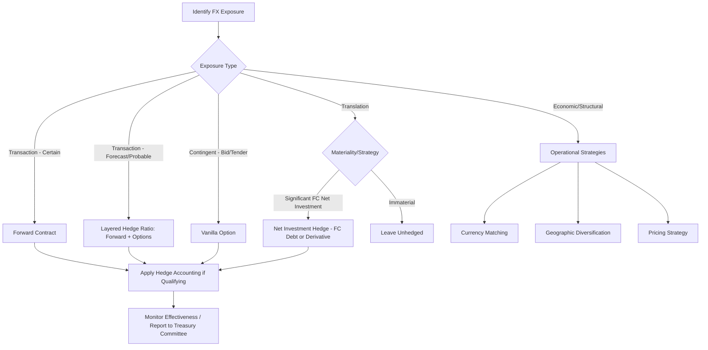

## FX Risk Management for Corporates

### Overview

FX risk management for corporates encompasses the identification, measurement, and hedging of foreign exchange exposures arising from international business activities. Unlike bank trading desks, which manage FX risk as a profit center, corporate treasury functions typically treat FX risk as a cost/volatility-reduction problem, hedging exposures that arise incidentally from commercial operations rather than from speculative positioning.

**Key Points**

- Corporate FX exposure is generally categorized into transaction, translation, and economic (operating) exposure
- Hedging objectives center on cash flow predictability, earnings stability, and covenant/budget-rate protection rather than profit generation
- Accounting treatment (hedge accounting under IFRS 9 or ASC 815) is often as significant a driver of hedging strategy design as the underlying economic risk
- Instrument choice trades off cost, flexibility, and accounting eligibility

### Taxonomy of Corporate FX Exposure

**Transaction Exposure**

Arises from specific, contractually-fixed foreign-currency cash flows — a sale invoiced in a foreign currency, a foreign-currency payable, a cross-border loan, or a committed but unbilled purchase order. This is the most direct and commonly hedged form of exposure because the cash flow amount and timing are known or highly certain.

**Translation Exposure**

Arises when a company with foreign subsidiaries consolidates financial statements into a reporting currency. Balance sheet items (assets, liabilities, net investment) denominated in foreign currency are translated at period-end or average rates, and this can create reported equity/earnings volatility even without any cash actually changing hands. Translation exposure is typically viewed as a non-cash accounting effect, and many corporates choose *not* to hedge it, on the basis that hedging a non-cash exposure with cash-settled derivatives introduces real cash risk to offset a paper risk — though net investment hedges are common for large, strategically significant foreign subsidiaries.

**Economic (Operating) Exposure**

The broadest and hardest-to-quantify category: the impact of exchange rate movements on the present value of future cash flows and competitive position, even absent any specific contracted foreign-currency transaction. For example, a US manufacturer competing against European exporters is economically exposed to EUR/USD even if it has no direct foreign-currency contracts, because a weaker EUR makes European competitors more price-competitive. Economic exposure is generally managed through strategic/operational means (diversifying production geography, currency-matching of costs and revenues, pricing strategy) rather than through financial derivatives, since it is diffuse, long-dated, and difficult to size precisely.

**Contingent Exposure**

A specific sub-case of transaction exposure where the underlying cash flow itself is uncertain — most commonly, FX risk on a bid for a foreign-currency contract that may or may not be won (e.g., an engineering firm bidding on a foreign infrastructure project). This exposure profile is naturally suited to options rather than forwards, since a forward would create an unwanted directional FX position if the bid is lost.

### Exposure Identification and Measurement

**Key Points**

- Treasury typically builds an FX exposure register aggregating expected foreign-currency cash flows by currency, by month/quarter, sourced from sales forecasts, AP/AR systems, and intercompany loan schedules
- Netting exposures across business units before external hedging (natural netting, or via an in-house bank/netting center) reduces gross hedging volume and transaction costs
- A key practical distinction is between **certain** exposures (invoiced, contracted) and **forecast/probable** exposures (budgeted sales not yet booked) — the latter typically require a lower hedge ratio and more caution around over-hedging
- Value-at-Risk (VaR) and cash-flow-at-risk (CFaR) frameworks are used to quantify the distribution of potential FX-driven P&L or cash flow outcomes, informing hedge ratio decisions

### Core Hedging Instruments

**FX Forwards**

The most common corporate hedging instrument: an obligation to exchange currencies at a pre-agreed rate on a future date. Forwards lock in a fixed rate, fully eliminating FX rate uncertainty for the hedged cash flow but also eliminating any upside from favorable rate moves.

- **Outright forward**: standard bilateral forward to a single date
- **Window forward**: allows drawdown of the forward at any point within a specified date range rather than a single fixed date, useful when the exact timing of the underlying cash flow is uncertain
- **Non-Deliverable Forward (NDF)**: cash-settled forward used for currencies with capital controls or limited convertibility, common for corporates with exposure to CNY, INR, KRW, BRL, and similar currencies

**FX Options**

Provide the right, not obligation, to exchange currency at a fixed strike, preserving upside participation at the cost of an upfront premium.

- **Vanilla puts/calls**: used when the corporate wants full protection against adverse moves while retaining favorable-move upside
- **Zero-cost collars**: combine a purchased option (protection) with a sold option (upside cap) structured so the premiums offset, avoiding upfront cash cost — the most common corporate options structure precisely because it avoids a P&L-visible premium line item
- **Participating forwards**: a variant allowing partial participation in favorable moves while providing full protection against adverse moves, financed by giving up some of the favorable-move upside rather than by capping it outright

**Cross-Currency Swaps**

Used primarily for longer-dated exposures, typically arising from foreign-currency debt issuance or intercompany loans — exchanging principal and interest cash flows in one currency for another over a multi-year term. Common for corporates that issue debt in a currency different from their functional currency to access deeper capital markets, then swap the proceeds and coupon obligations back to their operating currency.

### Zero-Cost Collar: Mechanics and Payoff

A zero-cost collar for a corporate exporter (e.g., a US company with EUR receivables, hedging EUR depreciation risk) typically combines:

1. **Buy a EUR put / USD call** at strike $K_1$ (protection floor)
2. **Sell a EUR call / USD put** at strike $K_2 > K_1$ (upside cap), with premium received offsetting the premium paid on the put

The net payoff at maturity, per unit of EUR receivable:

$$\text{Effective Rate} = \begin{cases} K_1 & \text{if } S_T < K_1 \\ S_T & \text{if } K_1 \le S_T \le K_2 \\ K_2 & \text{if } S_T > K_2 \end{cases}$$

Strikes $K_1$ and $K_2$ are chosen (typically by solving for the sold-option strike given a desired bought-option strike, or vice versa) such that the two premiums are equal, yielding zero net upfront cost. **[Inference]** In practice, exact zero cost is rarely achievable to the cent given discrete strike/pip conventions, so "zero-cost" collars in corporate practice are typically "near-zero-cost," with a small net premium either way considered immaterial.

### Illustration: Zero-Cost Collar Payoff Profile

<svg xmlns="http://www.w3.org/2000/svg" viewBox="0 0 700 380" font-family="sans-serif">
<text x="350" y="25" text-anchor="middle" font-size="16" font-weight="bold">Zero-Cost Collar: Effective Hedged Rate (svg_diagram)</text>
<line x1="60" y1="330" x2="640" y2="330" stroke="black" stroke-width="1.5" />
<line x1="60" y1="330" x2="60" y2="50" stroke="black" stroke-width="1.5" />
<text x="650" y="335" font-size="12">Spot at Maturity (S_T)</text>
<text x="20" y="45" font-size="12">Effective Rate</text>

<line x1="100" y1="310" x2="600" y2="90" stroke="#bdc3c7" stroke-width="1.5" stroke-dasharray="4,4" />
<text x="590" y="80" font-size="11" fill="#95a5a6">Unhedged spot</text>

<line x1="220" y1="330" x2="220" y2="60" stroke="#c0392b" stroke-width="1" stroke-dasharray="3,3" />
<text x="205" y="345" font-size="12" fill="#c0392b">K₁ (floor)</text>
<line x1="460" y1="330" x2="460" y2="60" stroke="#2980b9" stroke-width="1" stroke-dasharray="3,3" />
<text x="440" y="345" font-size="12" fill="#2980b9">K₂ (cap)</text>

<polyline points="100,230 220,230 460,120 600,120" fill="none" stroke="#27ae60" stroke-width="3" />
<text x="130" y="215" font-size="12" fill="#27ae60">Floor protection</text>
<text x="480" y="105" font-size="12" fill="#27ae60">Capped upside</text>
<text x="290" y="185" font-size="12" fill="#27ae60">Full participation</text>
<text x="290" y="200" font-size="12" fill="#27ae60">between K₁ and K₂</text>
</svg>

### Hedge Ratio Determination

**Key Points**

- Hedge ratio = proportion of forecast/committed exposure covered by derivatives; rarely 100% for uncertain forecast exposures due to forecast risk
- A common corporate approach is a **layered/rolling hedge program**: hedging a high percentage (e.g., 80–100%) of near-term (0–3 month) certain exposure, tapering to a lower percentage (e.g., 25–50%) for exposures 9–12+ months out, reflecting increasing forecast uncertainty at longer horizons
- Static treasury policy typically defines minimum/maximum hedge ratio bands by time bucket, reviewed periodically by a treasury/risk committee
- **[Unverified]** Specific hedge ratio percentages vary substantially by industry, company risk appetite, and treasury policy — the layered/tapering approach described is a commonly cited industry pattern, but there is no universal standard ratio and any specific numbers should be treated as illustrative rather than prescriptive

### Hedge Accounting: IFRS 9 and ASC 815

Hedge accounting allows a company to align the timing of derivative gains/losses with the underlying hedged item in the income statement, avoiding P&L volatility from marking the hedge to market on a different schedule than the underlying exposure is recognized. Without hedge accounting, a derivative's fair value changes hit P&L immediately each period, while the hedged forecast transaction has no corresponding offsetting entry until it occurs — creating "accounting mismatch" volatility even when the hedge is economically effective.

**Key Hedge Accounting Concepts**

- **Cash flow hedge**: used for hedging variability in cash flows of a forecast transaction or recognized asset/liability (the most common corporate FX hedge accounting model) — effective portion of derivative gains/losses is deferred in Other Comprehensive Income (OCI) and recycled to P&L when the hedged transaction affects earnings
- **Fair value hedge**: used for hedging changes in fair value of a recognized asset/liability (e.g., a foreign-currency-denominated firm commitment) — both the hedge and the hedged item are marked to market through P&L, offsetting each other
- **Net investment hedge**: used for hedging translation exposure on a net investment in a foreign operation — gains/losses on the hedge are deferred in OCI (specifically the foreign currency translation reserve/CTA) alongside the translation adjustment on the net investment itself

**Hedge Effectiveness Testing**

Under IFRS 9 (post-2018), the qualifying criteria replaced the older, stricter "80-125%" bright-line effectiveness test (used under the prior IAS 39 regime) with a more principles-based approach requiring an economic relationship between hedged item and hedging instrument, credit risk not dominating the value changes, and a hedge ratio consistent with actual risk management. This is a well-documented change in the accounting standard and materially eased hedge accounting qualification for many corporates versus the prior regime.

**[Inference]** ASC 815 (US GAAP) retains a more prescriptive quantitative effectiveness assessment framework relative to IFRS 9's qualitative economic-relationship test, though both standards were substantially reformed in the mid-2010s (ASU 2017-12 for US GAAP) to reduce the historical burden of hedge accounting documentation and effectiveness testing — practitioners should confirm current standard text for precise cross-jurisdictional differences given both frameworks continue to be refined.

### Natural Hedging and Operational Strategies

Before layering on financial derivatives, treasury functions typically evaluate operational/natural hedges that reduce gross exposure:

- **Currency matching**: sourcing costs (COGS, financing) in the same currency as revenues, so exposures naturally offset without derivatives
- **Netting**: consolidating intercompany and third-party exposures across business units to hedge only the net position externally, reducing gross transaction volume and cost
- **Leading and lagging**: adjusting the timing of foreign-currency payments/receipts to take advantage of anticipated favorable rate movements (though this shades into speculative behavior if not policy-governed, and is generally constrained by treasury policy to avoid discretionary market timing)
- **Invoicing currency strategy**: negotiating to invoice in the functional/reporting currency where commercially feasible, transferring FX risk to the counterparty (subject to competitive/commercial constraints)

### Structuring Considerations: Instrument Selection Framework

| Exposure Type | Certainty | Typical Instrument | Rationale |
| --- | --- | --- | --- |
| Invoiced receivable/payable | Certain | Forward | Fully eliminates rate risk on a known amount/date |
| Budgeted forecast sales | Probable, not certain | Options or partial-ratio forward | Avoids over-hedging risk if forecast doesn't materialize |
| Contingent bid/tender | Uncertain (binary) | Vanilla option | Avoids directional exposure if bid is unsuccessful |
| Long-dated FC debt | Certain (contractual) | Cross-currency swap | Matches multi-year principal/coupon schedule |
| Net investment in FC subsidiary | Ongoing/structural | FC debt as natural hedge, or NDF/forward for net investment hedge | Often left unhedged or hedged only partially given non-cash nature |

### Governance and Policy Framework

**Key Points**

- Corporate FX risk management operates under a board-approved treasury policy defining permitted instruments, counterparty credit limits, authorized hedge ratios by tenor bucket, and delegation of authority
- A clear separation is typically maintained between hedging (risk-reducing) and speculative positioning — most corporate treasury policies explicitly prohibit speculative FX trading, with all derivative transactions required to be linked to an identifiable underlying exposure
- Counterparty risk on OTC derivatives (particularly for options with positive mark-to-market value to the corporate) is managed via ISDA/CSA agreements, credit limits per bank counterparty, and increasingly via central clearing for standardized products where available
- Regular mark-to-market reporting and hedge effectiveness monitoring feeds into treasury risk committee review cycles, typically monthly or quarterly

### Common Pitfalls and Risk Considerations

**Key Points**

- **Over-hedging forecast exposure**: hedging a forecast sale that ultimately doesn't materialize leaves the company with an open, unintended FX derivative position that must be unwound, potentially at a loss
- **Basis risk**: hedging with an instrument or reference rate that doesn't perfectly match the underlying exposure's currency pair, timing, or index can leave residual risk
- **Rolling/extension risk**: window and flexible forwards used to match uncertain cash flow timing can create pricing and liquidity complications if the underlying transaction is delayed significantly beyond the hedge's tenor
- **Accounting complexity of option-based collars**: the time value component of purchased options often must be excluded from the hedging relationship under IFRS 9's "cost of hedging" provisions, introducing P&L volatility from the time value even when the intrinsic value hedge remains effective — this is a well-documented, deliberate feature of the current standard, not a workaround
- **Concentration/counterparty risk**: reliance on a small number of bank counterparties for large derivative notionals creates credit exposure that must be actively managed, particularly evident during banking-sector stress episodes

### Illustration: Corporate FX Hedge Decision Flow

### Worked Example

A US-based manufacturer has a confirmed EUR 10,000,000 receivable due in 6 months from a European customer, and functional currency USD.

**Exposure**: Transaction exposure, EUR receivable, certain (invoiced).

**Policy**: Treasury policy requires 100% hedging of certain exposures within a 12-month horizon.

**Instrument choice**: Given certainty of the cash flow, a forward is preferred over an option (no premium cost, and full protection is appropriate since there's no need to preserve upside optionality on a contractually certain, already-invoiced amount).

**Execution**: Sell EUR 10,000,000 forward / buy USD at the 6-month forward rate, say $1.0938$ (per the CIP-derived rate from the earlier worked example), locking in USD proceeds of $10,938,000$ regardless of where spot EUR/USD settles in 6 months.

**Accounting treatment**: Designated as a cash flow hedge of a firm commitment (the invoiced receivable); effective portion of the forward's fair value changes deferred in OCI until the receivable is collected, at which point the deferred amount is recycled to P&L alongside the actual FX gain/loss on settlement of the receivable, achieving offsetting P&L recognition and avoiding earnings volatility from the derivative's mark-to-market movements in interim periods.

### Related Topics

**Related Topics**

- FX Forward Pricing and Covered Interest Rate Parity
- Hedge Accounting under IFRS 9 vs. ASC 815: Detailed Comparison
- Cross-Currency Swaps: Structuring for Corporate Debt Hedging
- Cash Flow at Risk (CFaR) and Corporate Risk Quantification Frameworks
- FX Barrier and Digital Options (Structured Corporate Hedging Applications)
- Treasury Management Systems and FX Exposure Aggregation
- ISDA Documentation and Counterparty Credit Risk for Corporate Derivative Users