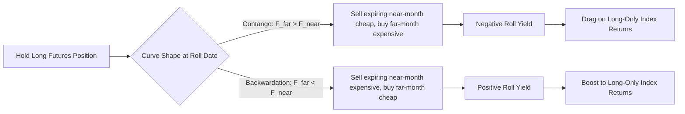

## Commodity Futures Curves Contango and Backwardation

### Overview

The commodity futures curve — the term structure of futures prices across delivery dates for the same underlying commodity — is a central object in commodity derivatives, encoding storage economics, supply/demand balances, and market expectations. Its shape, whether **contango** (upward-sloping) or **backwardation** (downward-sloping), has direct consequences for roll yield, storage economics, and the behavior of commodity index investors.

**Key Points**

- Contango: futures prices increase with maturity (near-month cheaper than far-month)
- Backwardation: futures prices decrease with maturity (near-month more expensive than far-month)
- The curve shape is driven primarily by the interaction of storage costs, convenience yield, and interest rates (cost-of-carry), unlike financial futures curves which are driven almost purely by interest rate/dividend differentials
- Curve shape has first-order impact on returns to passive long-only commodity index investors via "roll yield"

### The Cost-of-Carry Model

For a storable commodity, the no-arbitrage relationship between spot price $S_0$ and futures price $F_T$ for delivery at time $T$ is:

$$F_T = S_0 \cdot e^{(r + u - y)T}$$

where:

- $r$ = risk-free interest rate (cost of financing the physical position)
- $u$ = storage cost rate (warehousing, insurance, physical handling, expressed as a continuous yield)
- $y$ = **convenience yield** — the non-monetary benefit of holding the physical commodity rather than a futures contract

**Convenience Yield: The Key Differentiator from Financial Futures**

Convenience yield is the crucial term that distinguishes commodity futures pricing from financial futures pricing (equities, FX, rates). It represents the benefit of physical possession — the ability to avoid stockouts, keep a production process running, respond to unexpected demand spikes, or profit from short-term local supply disruptions — and is not directly observable but is inferred from the futures curve itself.

$$y = r + u - \frac{1}{T}\ln\left(\frac{F_T}{S_0}\right)$$

Convenience yield is inherently an inventory-dependent, option-like value: it tends to be high when inventories are low (scarcity increases the value of having physical supply on hand) and low or negligible when inventories are abundant (little value to holding physical stock when supply is plentiful and storage is easy).

### Contango Explained

**Definition**: $F_{T_2} > F_{T_1}$ for $T_2 > T_1$ — the futures curve slopes upward.

**Economic Interpretation**

Contango arises when storage costs and financing costs dominate convenience yield:

$$r + u > y$$

This is the "normal" condition for a storable commodity in ample supply — there is no scarcity premium (low convenience yield) and the full carrying cost of storage and financing must be compensated in the futures price. Markets with large, easily accessible inventories (e.g., precious metals, which are cheap to store and rarely scarce) are persistently and structurally in contango, since $y \approx 0$ for gold/silver most of the time given negligible industrial stockout risk.

**Contango and Roll Yield (Negative)**

An investor holding a long futures position and rolling it forward systematically (as most commodity index strategies do) experiences a **negative roll yield** in contango: as the near-month contract approaches expiry, the investor must sell it and buy the more expensive far-month contract, realizing a loss on each roll if spot prices are unchanged. This is a first-order driver of underperformance in long-only commodity index products during extended contango regimes — well documented in commodity index literature (e.g., the widely-cited divergence between GSCI-tracking products and spot commodity price indices during the 2009–2015 period of oil market contango).

### Backwardation Explained

**Definition**: $F_{T_2} < F_{T_1}$ for $T_2 > T_1$ — the futures curve slopes downward.

**Economic Interpretation**

Backwardation arises when convenience yield exceeds the carrying cost:

$$y > r + u$$

This typically occurs during periods of low inventory / tight physical supply, where the value of holding physical product now (to avoid production disruption, meet immediate demand, or capture scarcity value) outweighs the cost of financing and storing it. Backwardation is common in energy markets (particularly crude oil and natural gas) during supply disruptions, geopolitical tension, or seasonal demand spikes, and in agricultural markets ahead of harvest when current-crop supply is tight.

**Backwardation and Roll Yield (Positive)**

Conversely, in backwardation, rolling a long futures position generates **positive roll yield**: the investor sells the (relatively expensive) near-month contract and buys the (relatively cheap) far-month contract, capturing a gain on each roll. This positive roll yield is the theoretical basis of the **Theory of Normal Backwardation** (Keynes, 1930), which posits that commodity producers are natural short hedgers who must pay a risk premium to speculators willing to take the long side, structurally biasing futures prices below expected future spot prices.

### Illustration: Contango vs. Backwardation Curve Shapes

<svg xmlns="http://www.w3.org/2000/svg" viewBox="0 0 700 400" font-family="sans-serif">
<text x="350" y="25" text-anchor="middle" font-size="16" font-weight="bold">Futures Curve Shapes: Contango vs. Backwardation (svg_diagram)</text>

<line x1="70" y1="350" x2="640" y2="350" stroke="black" stroke-width="1.5" />
<line x1="70" y1="350" x2="70" y2="60" stroke="black" stroke-width="1.5" />
<text x="650" y="355" font-size="12">Contract Maturity</text>
<text x="30" y="55" font-size="12">Futures Price</text>

<path d="M 100,280 Q 300,220 580,120" fill="none" stroke="#2980b9" stroke-width="3" />
<circle cx="100" cy="280" r="4" fill="#2980b9" />
<circle cx="220" cy="245" r="4" fill="#2980b9" />
<circle cx="340" cy="205" r="4" fill="#2980b9" />
<circle cx="460" cy="165" r="4" fill="#2980b9" />
<circle cx="580" cy="120" r="4" fill="#2980b9" />
<text x="500" y="105" font-size="13" fill="#2980b9" font-weight="bold">Contango</text>
<text x="450" y="90" font-size="11" fill="#2980b9">(storage + financing &gt; convenience yield)</text>

<path d="M 100,150 Q 300,220 580,300" fill="none" stroke="#c0392b" stroke-width="3" />
<circle cx="100" cy="150" r="4" fill="#c0392b" />
<circle cx="220" cy="180" r="4" fill="#c0392b" />
<circle cx="340" cy="215" r="4" fill="#c0392b" />
<circle cx="460" cy="255" r="4" fill="#c0392b" />
<circle cx="580" cy="300" r="4" fill="#c0392b" />
<text x="420" y="320" font-size="13" fill="#c0392b" font-weight="bold">Backwardation</text>
<text x="380" y="335" font-size="11" fill="#c0392b">(convenience yield &gt; storage + financing)</text>

<line x1="100" y1="60" x2="100" y2="350" stroke="#999" stroke-width="1" stroke-dasharray="3,3" />
<text x="80" y="370" font-size="12">Spot / M1</text>
</svg>

### Curve Regimes Can Coexist and Shift Along the Curve

**Key Points**

- Real-world futures curves are frequently **not monotonic** — a curve can be in backwardation at the front end (near-term supply tightness) and contango further out (reflecting normalization expectations), or vice versa
- The front-end (prompt/near-month) spread is typically the most sensitive to immediate physical market conditions (inventory draws/builds, weather, geopolitical events), while the long end tends to reflect longer-run marginal cost of production and structural supply/demand balance expectations
- Curve shape can shift rapidly in response to inventory data releases (e.g., EIA weekly petroleum data for crude oil, USDA WASDE reports for agricultural commodities), making short-dated spreads (e.g., prompt-month vs. second-month, known as the "M1-M2 spread") closely watched trading signals in their own right

### Storage Costs and the "Convenience Yield as an Option" Framework

**[Inference]** A widely-used conceptual framework (originating in the academic literature, e.g., work building on Brennan and others) treats convenience yield as analogous to an option value — specifically, the option to benefit from potential future stockouts or localized shortages — implying convenience yield should be non-negative and higher when inventories are low and volatility of near-term supply/demand is elevated, consistent with the empirically observed inverse relationship between inventory levels and the degree of backwardation. This framing is well-established in academic commodity pricing literature, though the precise functional form and calibration vary across models (e.g., Gibson-Schwartz two-factor and three-factor stochastic convenience yield models).

### Commodity-Specific Curve Behavior

**Key Points**

- **Crude Oil (WTI/Brent)**: frequently alternates between contango and backwardation depending on OPEC+ supply decisions, global demand cycles, and storage capacity utilization; the dramatic April 2020 WTI negative-price episode was itself a symptom of extreme contango combined with physical storage capacity constraints at the Cushing, Oklahoma delivery point
- **Natural Gas**: exhibits pronounced seasonal curve shape (winter premium/summer discount pattern) layered on top of the general contango/backwardation dynamic, reflecting heating-season demand seasonality
- **Precious Metals (Gold, Silver)**: structurally almost always in contango, since storage is cheap, supply is abundant relative to demand for immediate physical delivery, and convenience yield is typically minimal — the gold futures curve is close to a pure cost-of-carry (interest rate) relationship, sometimes called "gold forward rate" (GOFO)-consistent pricing
- **Agricultural commodities**: exhibit strong seasonal patterns tied to planting/harvest cycles, with backwardation common ahead of harvest (current-crop scarcity) shifting to contango after a large harvest fills storage

### Roll Yield: Quantitative Decomposition

Total return to a long futures position over a holding period decomposes (approximately, for small time steps) into:

$$\text{Total Return} \approx \text{Spot Return} + \text{Roll Yield} + \text{Collateral/Interest Return}$$

**Roll Yield** specifically captures the price convergence effect as a futures contract approaches expiry and converges to spot — it is realized whenever a position is rolled from an expiring contract to a later-dated one at a different price, and its sign is determined by the curve shape at the roll point (negative in contango, positive in backwardation, as described above).

**[Inference]** This decomposition is a standard heuristic used in commodity index and CTA (managed futures) literature to attribute returns, but it involves some approximation (particularly around the precise definition of "spot return" for commodities where a continuously tradable spot reference may not exist) and different index providers/practitioners use somewhat varying precise methodologies for calculating realized roll yield.

### Commodity Index Construction and Curve Sensitivity

Major commodity indices (S&P GSCI, Bloomberg Commodity Index) roll their futures positions on a systematic schedule (e.g., GSCI rolls over a defined window each month). This mechanical, pre-announced rolling has been documented in academic and practitioner literature to create predictable, exploitable patterns around roll dates ("roll yield harvesting" strategies by sophisticated traders), and has motivated the development of "enhanced" or "optimized" commodity indices that use dynamic contract selection along the curve (e.g., selecting the point on the curve offering the most favorable roll yield, subject to liquidity constraints) rather than a fixed near-month rolling rule.

### Term Structure Trading Strategies

**Key Points**

- **Calendar spread trading**: taking a position on the shape of the curve itself (e.g., long the prompt month, short a deferred month) rather than outright directional commodity price exposure — profits from curve steepening/flattening or shifts between contango and backwardation
- **Basis trading**: exploiting the difference between the futures price and the cash/physical spot price, common among commercial hedgers and physical traders with storage access
- **Storage arbitrage**: when the curve is in sufficiently steep contango that the futures spread exceeds the actual cost of physical storage plus financing, commercial players with storage capacity can buy spot, store the commodity, and sell forward, locking in a riskless profit — this arbitrage mechanism is itself part of what constrains contango from becoming arbitrarily steep (a cap sometimes referred to informally as the "full carry" ceiling)
- Backwardation, by contrast, has no equivalent easy arbitrage cap on its steepness for non-storable commodities or scarce ones, since there is no symmetric "reverse storage" mechanism — you cannot borrow a physical commodity from the future the way you can finance holding it now

### Illustration: Roll Yield Mechanics

### Worked Example

Consider WTI crude oil with the following futures curve on a given date:

- M1 (prompt month): $78.50/bbl
- M2: $77.90/bbl
- M3: $77.40/bbl
- M6: $76.10/bbl
- M12: $74.80/bbl

This curve is in **backwardation** across the observed tenors ($F_{T}$ declining as $T$ increases), consistent with tight near-term physical supply/demand balance (e.g., low inventories at the delivery hub, strong near-term refinery demand) exceeding the combined cost of storage and financing.

Applying the convenience yield formula for the M1-M12 relationship (approximating with simple annualized terms, $T=1$ year, and assuming $r + u \approx 6\%$ for illustration):

$$y = r + u - \ln\left(\frac{F_{12}}{S_0}\right) \approx 0.06 - \ln\left(\frac{74.80}{78.50}\right) \approx 0.06 - (-0.0481) \approx 10.81\%$$

This implies a convenience yield of roughly $10.8\%$ annualized embedded in the curve — a high figure reflecting significant near-term scarcity value, consistent with the observed steep backwardation. An index investor rolling a long M1 position monthly into M2 in this environment would realize a small positive roll yield each month (selling M1 at $78.50 equivalent value, buying the cheaper M2), all else equal.

**[Inference]** This worked example uses simplified assumptions (flat $r+u$, ignoring seasonality effects specific to crude oil delivery mechanics like Cushing storage dynamics) for illustrative clarity; a rigorous convenience yield extraction in practice would account for the specific futures contract specifications, exact day-count conventions, and potentially a term structure of storage/financing costs rather than a single flat rate.

### Related Topics

**Related Topics**

- Cost-of-Carry Model and No-Arbitrage Futures Pricing
- Theory of Normal Backwardation (Keynes) and Hedging Pressure Hypothesis
- Gibson-Schwartz Stochastic Convenience Yield Models
- Commodity Index Construction Methodologies (GSCI, Bloomberg Commodity Index)
- Calendar Spread and Basis Trading Strategies
- Crude Oil Storage Economics and the April 2020 Negative WTI Episode
- Seasonality in Agricultural and Natural Gas Futures Curves