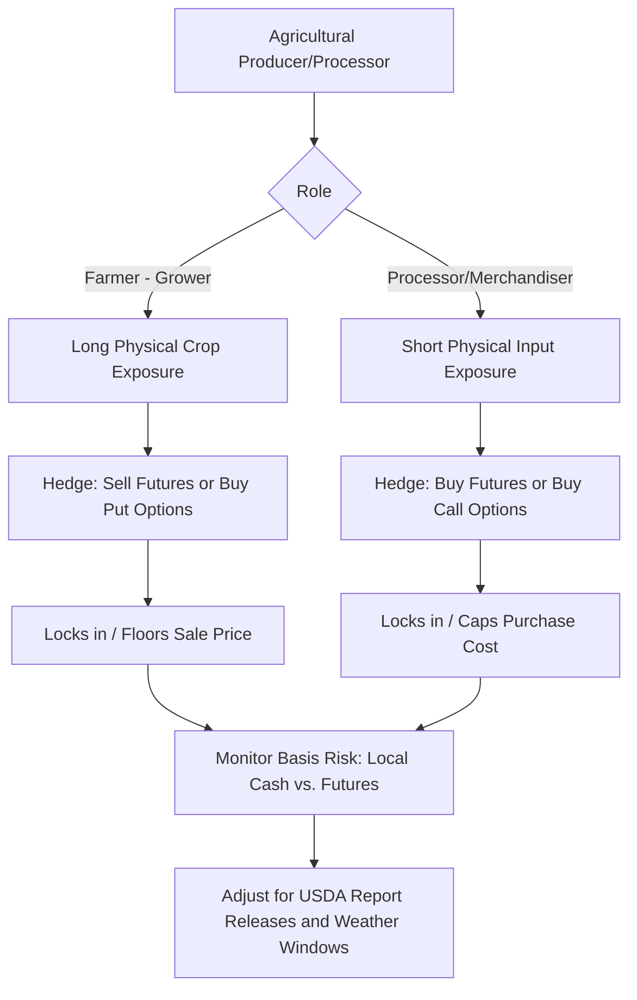

## Agricultural and Metals Derivatives

### Overview

Agricultural and metals derivatives cover two of the oldest and most established commodity derivatives complexes, with futures trading on agricultural commodities dating to the mid-19th century (Chicago Board of Trade) and organized metals trading dating to the founding of the London Metal Exchange in 1877. Despite this shared long history, the two complexes have distinct fundamental drivers — biological/seasonal cycles for agriculture versus industrial demand/mining supply for metals — that shape their curve behavior, volatility patterns, and hedging applications.

**Key Points**

- Agricultural derivatives are dominated by seasonal production cycles (planting, growing, harvest) and are highly sensitive to weather
- Metals derivatives split into precious metals (investment/store-of-value driven) and industrial/base metals (economic-cycle and inventory driven)
- Both complexes use the standard cost-of-carry and convenience yield framework, but with commodity-specific nuances in how storage and seasonality interact
- Exchange infrastructure differs meaningfully: CBOT/CME for most US agricultural products, LME for base metals (with its distinctive warehouse and prompt-date system), COMEX for precious metals

### Agricultural Derivatives

**Major Contract Groups**

- **Grains and oilseeds**: corn, soybeans, wheat, soybean meal, soybean oil — traded primarily on CBOT (part of CME Group); among the most liquid and widely followed agricultural futures globally
- **Softs**: coffee, cocoa, sugar, cotton, orange juice — traded primarily on ICE; often exhibit distinct supply concentration risk (production concentrated in specific geographic regions, e.g., cocoa in West Africa, coffee in Brazil/Vietnam)
- **Livestock**: live cattle, feeder cattle, lean hogs — traded on CME; distinct from crop commodities in having biological growth cycles rather than storage-based supply management, and generally much lower storability

**Seasonality and the Crop Cycle**

Agricultural futures curves exhibit strong, predictable seasonal patterns tied to the planting-growing-harvest cycle:

- **Pre-harvest period**: supply of the current crop year is fixed and depleting, often producing backwardation as the "old crop" nears exhaustion, particularly if the harvest outlook is uncertain
- **Harvest period**: a large influx of new supply typically drives spot/near-month prices down relative to more distant contracts, often producing contango as storage of the newly harvested abundant supply becomes the dominant economic consideration
- **New crop vs. old crop spreads**: futures contracts are often explicitly categorized as "old crop" (referencing the prior harvest, e.g., July corn) versus "new crop" (referencing the upcoming harvest, e.g., December corn), and the spread between them reflects expectations about the transition in supply conditions

**Weather Risk and Crop Reports**

**Key Points**

- Weather during critical growing-season windows (e.g., pollination period for corn, typically mid-summer in the Northern Hemisphere) is a dominant driver of price volatility, since yield outcomes are highly sensitive to conditions during these narrow biological windows
- USDA reports — particularly the monthly WASDE (World Agricultural Supply and Demand Estimates) and the quarterly Acreage and Grain Stocks reports — are major scheduled volatility events, often producing sharp price moves on release as the market updates supply/demand balance expectations
- Agricultural options markets often show elevated implied volatility heading into major weather-sensitive periods or scheduled USDA reports, reflecting anticipated information-driven price moves
- El Niño/La Niña climate cycles are widely monitored by agricultural traders for their historically documented influence on regional weather patterns affecting major growing regions (though the precise, commodity-specific impact varies by cycle and region, and should not be treated as a mechanically precise forecasting tool)

**Storage and Convenience Yield in Agriculture**

Agricultural storage costs are generally higher (as a proportion of value) than for metals, given physical bulk, spoilage risk, and the need for climate-controlled storage for many crops. Convenience yield in agriculture tends to be strongly cyclical, rising sharply ahead of harvest when old-crop stocks are low (reflecting genuine risk of running short before new supply arrives) and falling immediately after harvest when storage bins are full.

**Agricultural Options and Structures**

- **Vanilla options**: widely used by farmers (put options to establish a price floor while retaining upside) and grain merchandisers/processors (call options to cap input cost risk)
- **Basis contracts**: agricultural cash market trading frequently references "basis" — the difference between a local cash price and the relevant futures price — since agricultural commodities trade at different cash prices by region due to transportation costs and local supply/demand, distinct from the futures market's standardized delivery point
- **Crop insurance interaction**: in some markets (notably the US), government-subsidized crop insurance programs are explicitly linked to futures-derived price benchmarks (e.g., USDA Risk Management Agency programs referencing CBOT futures prices for revenue protection calculations), creating an important interaction between derivatives markets and agricultural policy

### Metals Derivatives: Precious Metals

**Key Contracts**

- **Gold**: COMEX (part of CME Group) futures and options are the dominant exchange-traded benchmark; also extensive OTC/London bullion market trading (LBMA gold price benchmark) and physical ETF holdings (e.g., major gold-backed ETFs) which interact with futures market dynamics
- **Silver**: COMEX futures; smaller market than gold but with a dual investment/industrial demand profile (significant industrial use in electronics, solar panels) that distinguishes its demand drivers from gold's predominantly investment/reserve-asset role
- **Platinum and Palladium**: NYMEX futures; heavily influenced by automotive catalytic converter demand (platinum historically more diesel-vehicle-linked, palladium more gasoline-vehicle-linked), making these markets more industrially cyclical than gold

**Key Points**

- Precious metals, especially gold, are structurally close to a "pure cost-of-carry" asset: storage costs are very low relative to value (dense, non-perishable, easily vaulted), and convenience yield is typically minimal since stockout risk (a genuine production/consumption disruption) is rarely a material concern for an asset held predominantly for investment/reserve purposes
- Gold futures curves are consequently usually in mild, stable contango, closely tracking the interest rate differential (sometimes analyzed via the "gold lease rate," conceptually analogous to a convenience yield/lending rate for physical gold)
- Gold is widely used as a portfolio diversifier and inflation/currency-debasement hedge, and its derivatives (futures, options, and increasingly gold-linked structured products) are used both by investors expressing this view and by mining companies hedging future production revenue
- Silver, platinum, and palladium exhibit meaningfully higher volatility than gold, reflecting smaller market size, lower liquidity, and greater sensitivity to industrial demand cycles

### Metals Derivatives: Base/Industrial Metals

**Key Contracts and Market Structure**

- **London Metal Exchange (LME)**: the dominant global exchange for base metals — copper, aluminum, zinc, lead, nickel, tin — with a distinctive contract structure featuring daily ("prompt date") expiries out to 3 months, then weekly and monthly dates further out, a legacy structure reflecting the exchange's historical role in physical metal trading and merchant financing
- **COMEX copper**: a significant alternative/competing copper contract, particularly relevant for US-based hedging and often showing a distinct (and closely watched) price differential versus LME copper
- **Shanghai Futures Exchange (SHFE)**: increasingly significant given China's dominant position as both a major producer and, especially, the largest consumer of most industrial metals

**Key Points**

- Base metals demand is closely tied to global industrial production, construction activity, and increasingly to the energy transition (copper and nickel demand growth linked to electric vehicle production and renewable energy infrastructure, aluminum demand linked to lightweighting trends and renewable infrastructure)
- LME warehouse inventory data (published daily, broken down by warehouse location) is one of the most closely watched inventory datasets in commodity markets, serving as a direct, high-frequency proxy for the convenience yield/backwardation dynamics discussed in the storage and convenience yield framework
- Base metals curves regularly shift between contango and backwardation in response to reported inventory changes, mine supply disruptions (strikes, geopolitical events in major producing countries like Chile for copper, Indonesia for nickel), and demand-side macro data (particularly Chinese manufacturing/construction indicators, given China's outsized share of global metals consumption)
- **[Inference]** The increasing role of metals like copper, lithium, cobalt, and nickel in the energy transition has been widely discussed in market commentary as a structural, longer-term demand driver distinct from the traditional industrial cycle, though the precise magnitude and timing of this demand shift remains genuinely uncertain and subject to significant forecasting disagreement across analysts, making this a topic where directional narrative should be distinguished from precisely quantifiable near-term price impact

### LME Contract Mechanics: A Distinctive Structure

The LME's date structure differs from most other futures exchanges and merits specific attention:

- **Cash (spot)**: settlement 2 business days forward
- **3-month date**: the most widely quoted and liquid LME reference price, historically linked to the traditional shipping time for metal from producing regions to LME-registered warehouses
- **Daily dates out to 3 months, weekly dates to 6 months, monthly dates beyond**: allows precise date-matching for commercial hedgers with specific delivery timing needs, a level of granularity uncommon on other exchanges
- **Ring trading and inter-office trading**: the LME retains an open-outcry "Ring" trading session alongside electronic trading, a historical relic of its physical trading floor origins that remains institutionally significant for official price-setting

**[Unverified]** Specific current details of LME trading session structure, ring trading practices, and warehouse policies are subject to periodic reform (the LME has made various changes to warehousing rules and trading structure in response to past controversies over warehouse queue lengths and reported inventory manipulation concerns) — current operational specifics should be verified against current LME documentation given the exchange's history of structural revisions.

### Illustration: Agricultural Seasonal Curve Pattern vs. Metals Inventory-Driven Curve

<svg xmlns="http://www.w3.org/2000/svg" viewBox="0 0 700 400" font-family="sans-serif">
<text x="350" y="25" text-anchor="middle" font-size="16" font-weight="bold">Agricultural Seasonal Pattern vs. Metals Inventory Cycle (svg_diagram)</text>

<line x1="60" y1="180" x2="320" y2="180" stroke="black" stroke-width="1" />
<text x="30" y="185" font-size="11">Price</text>
<path d="M 60,170 C 100,150 140,120 170,110 C 200,105 230,160 260,190 C 285,215 305,220 320,218" fill="none" stroke="#27ae60" stroke-width="2.5" />
<text x="80" y="100" font-size="11" fill="#27ae60">Pre-harvest tightness</text>
<text x="230" y="235" font-size="11" fill="#27ae60">Post-harvest abundance</text>
<text x="130" y="260" text-anchor="middle" font-size="12" font-weight="bold">Agricultural (seasonal cycle)</text>

<line x1="380" y1="180" x2="640" y2="180" stroke="black" stroke-width="1" />
<path d="M 380,120 C 420,140 450,170 480,175 C 520,180 550,150 580,130 C 600,118 620,125 640,140" fill="none" stroke="#8e44ad" stroke-width="2.5" />
<text x="390" y="105" font-size="11" fill="#8e44ad">Low LME stocks</text>
<text x="560" y="115" font-size="11" fill="#8e44ad">Stocks rebuild</text>
<text x="510" y="260" text-anchor="middle" font-size="12" font-weight="bold">Metals (inventory-driven, irregular)</text>

<text x="350" y="330" text-anchor="middle" font-size="12" fill="#555">Agriculture: predictable seasonal driver | Metals: irregular, inventory/supply-shock driven</text>

</svg>

### Comparative Summary

| Characteristic | Agricultural | Precious Metals | Base/Industrial Metals |
| --- | --- | --- | --- |
| Primary supply driver | Seasonal harvest cycle, weather | Mine production, recycling (stable) | Mine production, smelting capacity |
| Storability | Moderate (spoilage risk varies) | Very high (low cost, non-perishable) | High (durable, standard warehousing) |
| Demand driver | Food/feed/industrial consumption | Investment, jewelry, reserve asset | Industrial production, construction, EVs |
| Curve pattern | Strong seasonal pattern | Stable, mild contango | Variable, inventory/cycle-driven |
| Key exchange | CBOT, ICE | COMEX, LBMA (OTC) | LME, SHFE, COMEX (copper) |
| Key data driver | USDA WASDE, weather forecasts | Central bank policy, real rates, ETF flows | LME warehouse stocks, PMI data |

### Cross-Complex Trading Strategies

**Key Points**

- **Inter-commodity spreads**: e.g., corn-soybean spread (reflecting relative planting economics/acreage competition between the two crops), gold-silver ratio (a widely followed relative-value metric in precious metals), or copper-gold ratio (sometimes used as a macro/growth sentiment indicator, informally referred to in some market commentary as reflecting relative industrial vs. safe-haven demand)
- **Crush spreads (agricultural)**: soybean crush spread — the margin between soybean futures and the combined value of soybean meal and soybean oil futures (the products of processing/"crushing" soybeans) — used by processors to hedge processing margin risk, analogous in structure to the crack spread in oil refining
- **Location and quality spreads**: differences in futures prices for the same underlying commodity at different delivery locations or of different quality grades, actively traded by commercial participants with specific delivery/quality needs
- **[Inference]** The copper-gold ratio and similar cross-commodity indicators are commonly cited in market commentary as informal macro signals, but their predictive reliability as forward-looking indicators is a matter of ongoing debate among practitioners and should be treated as one input among many rather than a standalone, mechanically reliable forecasting tool

### Illustration: Agricultural Hedging Decision Flow

### Worked Example: Soybean Crush Spread

A soybean processor evaluates the economics of processing (crushing) soybeans, given:

- Soybean futures: $13.50/bushel
- Soybean meal futures: $390/short ton
- Soybean oil futures: $0.52/lb

Standard conversion: one bushel of soybeans (60 lbs) yields approximately 44 lbs of meal (0.022 short tons) and 11 lbs of oil, plus processing loss.

**Crush margin (simplified, per bushel)**:

$$\text{Crush} = (0.022 \times 390) + (11 \times 0.52) - 13.50 = 8.58 + 5.72 - 13.50 = \$0.80/\text{bushel}$$

A positive crush margin of $0.80/bushel indicates processing is currently economically favorable (product value exceeds input cost), incentivizing processors to run crush capacity at high utilization. A processor concerned about this margin compressing (e.g., soybean input costs rising faster than meal/oil product prices) could lock in the current favorable margin using a combination of futures positions — buying soybean futures while selling meal and oil futures — replicating the physical crush economics in the derivatives market, a structure commonly referred to as putting on a "board crush."

### Related Topics

**Related Topics**

- Storage Cost and Convenience Yield in Commodity Pricing
- Commodity Futures Curves: Contango and Backwardation
- Energy Derivatives: Oil, Gas, and Power
- LME Warehouse System and Base Metals Inventory Dynamics
- USDA WASDE Reports and Agricultural Fundamental Analysis
- Crack, Crush, and Spark Spreads: Processing Margin Hedging
- Gold-Silver Ratio and Cross-Commodity Relative Value Indicators