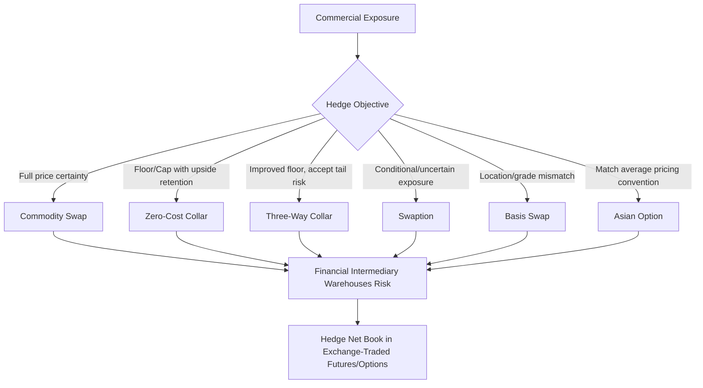

## Commodity Swaps and Structured Hedges

### Overview

Commodity swaps and structured hedges are the OTC instruments through which commercial producers, consumers, and financial intermediaries manage commodity price risk over extended periods, typically layering multiple derivative building blocks (swaps, options, and combinations thereof) to achieve specific risk-transfer objectives that standardized exchange-traded futures cannot fully address.

**Key Points**

- Commodity swaps exchange a floating (market-referenced) price for a fixed price over a series of periods, without physical delivery in most cases (cash-settled against a reference index)
- Structured hedges combine swaps, options, and other derivatives to tailor payoff profiles to specific risk tolerances, budget constraints, or accounting objectives
- These instruments are predominantly OTC, in contrast to the exchange-traded futures/options that form the underlying reference prices
- Commercial end-users (airlines, utilities, mining companies, agricultural processors) are the primary users, alongside commodity trading firms and banks acting as intermediaries/market-makers

### Commodity Swap Mechanics

**Basic Structure**

A commodity swap exchanges a series of fixed payments for a series of floating payments referenced to a commodity price index, typically settled monthly or quarterly over the swap's tenor, with no exchange of physical commodity.

$$\text{Net Settlement}_t = \text{Notional}_t \times (P_{fixed} - P_{floating,t})$$

For a **swap buyer** (paying fixed, receiving floating — typically a producer wanting to lock in a sale price): receives a net payment when the floating reference price falls below the fixed price, offsetting lower revenue from physical sales at the now-lower market price.

For a **swap seller/payer of floating** (a consumer wanting to lock in a purchase cost): receives a net payment when the floating price rises above fixed, offsetting higher physical purchase costs.

**Reference Price Index Selection**

The floating leg typically references a published index rather than a specific futures contract price on a single day, to reduce timing/rollover risk and align with typical physical trade pricing conventions:

- Monthly average of daily settlement prices (e.g., average of NYMEX WTI daily settles over the calendar month) — the most common convention, since it smooths single-day price risk and matches how many physical contracts are priced
- Platts or Argus price assessments (widely used for physical oil product and various other commodity benchmarks, particularly outside exchange-traded markets)
- Specific fixing/settlement prices for exchange-cleared commodities

**Key Points**

- Because commodity swaps reference published indices and don't require the counterparty to actually hold or deliver physical commodity, they offer more flexible notional sizing, tenor, and reference price matching than standardized futures contracts
- Swaps expose both counterparties to counterparty credit risk (unlike exchange-cleared futures, which are guaranteed by a central clearinghouse), historically managed via ISDA master agreements and credit support annexes (CSAs), though central clearing has become increasingly common for standardized commodity swaps following post-2008 OTC derivatives reforms
- Swap tenors can extend much longer than the most liquid points on the exchange-traded futures curve, allowing hedging of exposures further into the future than the futures market alone would support with adequate liquidity

### Commodity Collars and Structured Option Combinations

**Zero-Cost Collar (Commodity Version)**

Structurally identical in concept to the FX corporate collar: combines a purchased protective option with a sold option financing it, establishing a price floor and cap.

For a producer (e.g., an oil producer hedging future production revenue):

1. **Buy a put** at strike $K_1$ (floor on sale price)
2. **Sell a call** at strike $K_2 > K_1$ (cap on sale price, premium received offsets the put premium)

$$\text{Effective Sale Price} = \begin{cases} K_1 & \text{if } P_T < K_1 \\ P_T & \text{if } K_1 \le P_T \le K_2 \\ K_2 & \text{if } P_T > K_2 \end{cases}$$

For a consumer (e.g., an airline hedging jet fuel costs), the collar structure is mirrored: buy a call (cap on purchase cost) and sell a put (floor, financing the call premium).

**Three-Way Collars**

An enhancement to the standard collar that improves the strike terms (a higher floor for a producer, or a lower cap for a consumer) by adding a third option leg, at the cost of reintroducing some unhedged exposure beyond a certain price level.

Example (producer three-way collar): buy put at $K_1$, sell call at $K_2$, and additionally sell a put at $K_0 < K_1$. This third leg (selling a lower-strike put) generates additional premium, allowing $K_1$ to be set higher than a standard two-way collar would permit for the same net cost — but it means that if prices fall below $K_0$, the producer is no longer fully protected and effectively participates in further downside below $K_0$ (since the written put at $K_0$ is exercised against them), unlike the standard collar's full floor protection.

**Participating Swaps**

A structure that provides a guaranteed hedge price with partial participation in favorable price moves — effectively a swap combined with a purchased option, where the producer/consumer pays an implicit premium (via a less favorable fixed swap rate than a plain vanilla swap) in exchange for retaining some upside participation, financed by giving up full protection efficiency rather than by an outright cap (distinguishing it from a collar, which uses a hard cap rather than partial participation).

### Illustration: Three-Way Collar Payoff vs. Standard Collar

<svg xmlns="http://www.w3.org/2000/svg" viewBox="0 0 700 400" font-family="sans-serif">
<text x="350" y="25" text-anchor="middle" font-size="16" font-weight="bold">Standard Collar vs. Three-Way Collar (Producer) (svg_diagram)</text>
<line x1="60" y1="350" x2="640" y2="350" stroke="black" stroke-width="1.5" />
<line x1="60" y1="350" x2="60" y2="60" stroke="black" stroke-width="1.5" />
<text x="650" y="355" font-size="12">Price at Maturity</text>
<text x="15" y="55" font-size="12">Effective Sale Price</text>

<polyline points="90,240 220,240 460,120 600,120" fill="none" stroke="#2980b9" stroke-width="2.5" stroke-dasharray="6,3" />
<text x="480" y="105" font-size="11" fill="#2980b9">Standard collar (full floor)</text>

<polyline points="90,300 150,300 150,240 260,240 460,120 600,120" fill="none" stroke="#c0392b" stroke-width="2.5" />
<text x="160" y="290" font-size="11" fill="#c0392b">Three-way: exposed below K₀</text>
<text x="270" y="225" font-size="11" fill="#c0392b">Higher floor K₁ (vs standard)</text>
<line x1="150" y1="350" x2="150" y2="60" stroke="#999" stroke-width="1" stroke-dasharray="3,3" />
<text x="130" y="365" font-size="11">K₀</text>
<line x1="220" y1="350" x2="220" y2="60" stroke="#999" stroke-width="1" stroke-dasharray="3,3" />
<text x="205" y="365" font-size="11">K₁ (standard)</text>
<line x1="260" y1="350" x2="260" y2="60" stroke="#999" stroke-width="1" stroke-dasharray="3,3" />
<text x="255" y="380" font-size="11">K₁ (3-way, higher)</text>
</svg>

### Swaptions

A **swaption** grants the right, but not obligation, to enter a commodity swap at a predetermined fixed price at a future date. Used when a hedger has conditional or uncertain future exposure — for example, a company evaluating a project that may or may not proceed, or wanting flexibility to hedge only if prices move to an unfavorable level, deferring the commitment to hedge until greater certainty about the underlying exposure exists.

### Basis Swaps

Exchange one floating commodity price index for a different floating commodity price index (rather than fixed-for-floating), used to hedge **location basis risk** or **grade/quality basis risk**:

- **Location basis swaps**: hedge the spread between two geographically distinct pricing points for the same commodity (e.g., WTI Cushing vs. WTI Midland, or Henry Hub vs. a regional gas hub), used by parties whose physical exposure is priced at a location different from the most liquid futures benchmark
- **Grade/quality basis swaps**: hedge the spread between different quality grades or blends of a commodity (e.g., different crude oil grades with different sulfur content and API gravity)

These are essential tools for commercial hedgers whose actual physical exposure does not perfectly match a standard exchange-traded contract's delivery specification, addressing the basis risk that would otherwise remain even after a standard futures/swap hedge on the primary benchmark.

### Asian (Average Price) Options

Widely used in commodity markets specifically because many physical commodity contracts price against an *average* of prices over a period (e.g., monthly average pricing, matching typical physical trade conventions) rather than a single point-in-time price — making an average-price option a more precise hedge of the actual underlying exposure than a standard European option referencing a single terminal price.

$$\text{Payoff (Asian call)} = \max\left(\frac{1}{n}\sum_{i=1}^n P_i - K, 0\right)$$

**Key Points**

- Asian options are systematically cheaper than equivalent European options on the same underlying, since averaging reduces the effective volatility of the payoff-determining quantity (an average has lower variance than the terminal point value)
- Most Asian options do not have a simple closed-form solution because the arithmetic average of a set of lognormally-distributed prices is not itself lognormally distributed (only the geometric average is exactly lognormal), so **[Inference]** practitioners commonly rely on moment-matching approximations (e.g., approximating the arithmetic average distribution with a lognormal distribution matched to the correct first two moments, a well-established and widely used technique) or Monte Carlo simulation for precise pricing, since exact closed-form arithmetic Asian option pricing remains an area without a universally agreed exact analytical solution
- The reduced cost relative to vanilla options, combined with the closer match to typical physical pricing conventions, makes Asian options one of the most commonly used option structures in commercial commodity hedging, arguably more prevalent in practice than plain vanilla European commodity options for many hedging applications

### Structuring Considerations by End-User Type

**Key Points**

- **Producers** (oil/gas E&P companies, mining companies, farmers): typically hedge future production revenue, favoring puts, collars, and swaps that establish a price floor while managing the cost/upside tradeoff according to risk appetite and often lender/covenant requirements (project finance lenders frequently mandate minimum hedge ratios on future production as a condition of financing)
- **Consumers** (airlines, utilities, industrial manufacturers): hedge future input costs, favoring calls, collars, and swaps that cap purchase costs; airline fuel hedging programs are a widely studied example given jet fuel's outsized share of airline operating costs and its historical price volatility
- **Financial intermediaries** (banks, trading firms): warehouse and manage the risk transferred by producers/consumers, hedging their resulting net book exposure in the more liquid exchange-traded futures/options market and managing residual basis, tenor, and volatility risk

### Structured Hedge Program Design

A typical corporate structured commodity hedging program layers multiple instruments across a hedge horizon:

- **Near-term (0–12 months)**: often hedged with a high ratio using swaps or simple collars, prioritizing certainty
- **Medium-term (1–3 years)**: layered hedging using a mix of swaps and collars, often at a lower/tapering hedge ratio reflecting greater forecast and price uncertainty
- **Long-term (3+ years)**: more selective, often using options-based structures (preserving flexibility) rather than full swap coverage, given the reduced liquidity and wider bid-offer spreads typical of longer-dated commodity derivatives, and the greater business/strategic uncertainty at longer horizons

**[Unverified]** Specific tenor bucket definitions and hedge ratio targets vary substantially by company, industry, and risk policy; the layered structure described represents a commonly observed practitioner pattern rather than a universal standard.

### Illustration: Commodity Structured Hedge Building Blocks

### Worked Example: Airline Jet Fuel Hedging Program

An airline forecasts jet fuel consumption of 10 million gallons over the next quarter and wants to hedge against rising fuel costs while retaining some benefit if prices fall.

**Exposure**: Consumer, forecast (probable, not yet fully certain) volumetric exposure.

**Structure selected**: Zero-cost collar referencing a jet fuel or closely correlated proxy index (e.g., ULSD/heating oil futures, commonly used as a hedge proxy for jet fuel given jet fuel's imperfect direct futures liquidity at all tenors, introducing a degree of product basis risk between the hedge instrument and actual jet fuel purchase cost):

- Buy call at $K_2 = \$2.40$/gallon (cap on purchase cost)
- Sell put at $K_1 = \$2.10$/gallon (floor giving up some downside benefit, financing the call)

**Outcome scenarios**:

- If jet fuel proxy settles at $2.60/gallon: airline exercises the call, effective cost capped at $2.40/gallon, saving $0.20/gallon versus the market price — a benefit of $2,000,000 on 10 million gallons
- If jet fuel proxy settles at $1.90/gallon: the sold put is exercised against the airline, effective cost floored at $2.10/gallon — the airline does not benefit from the full price decline, paying $0.20/gallon more than the prevailing market price, a foregone benefit of $2,000,000 versus being unhedged
- If settles between $2.10 and $2.40: airline pays the actual market price, with the hedge having no effect (both options expiring unexercised)

**Residual risk**: since the hedge references a proxy index rather than the airline's actual jet fuel purchase price, basis risk remains between the proxy index settlement and the airline's actual physical fuel cost, which the collar does not eliminate — a common and accepted residual risk in commodity hedging programs where the most liquid hedging instrument does not perfectly match the physical exposure.

### Related Topics

**Related Topics**

- Storage Cost and Convenience Yield in Commodity Pricing
- Commodity Futures Curves: Contango and Backwardation
- Energy Derivatives: Oil, Gas, and Power
- FX Risk Management for Corporates (Structural Parallels in Collar/Swap Design)
- Asian Option Pricing: Moment-Matching and Monte Carlo Approaches
- ISDA Documentation and Central Clearing for OTC Commodity Derivatives
- Basis Risk Management in Commercial Commodity Hedging