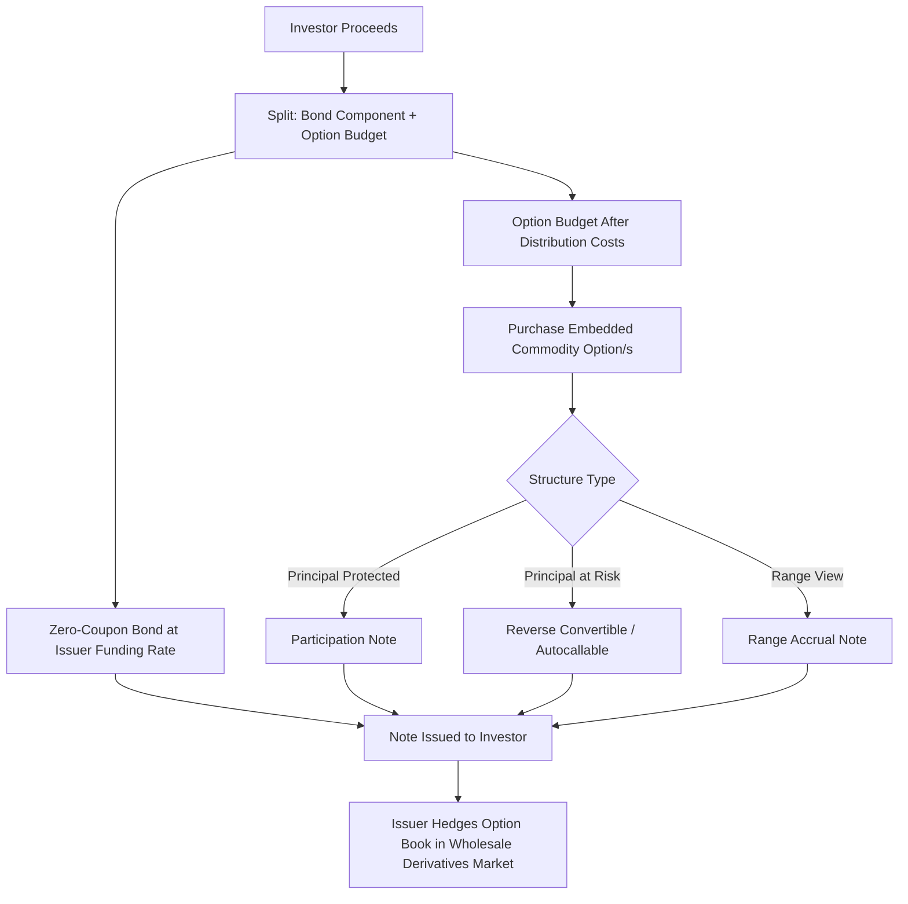

## Commodity Linked Notes

### Overview

Commodity linked notes are structured debt instruments whose coupon and/or principal repayment are contingent on the performance of one or more underlying commodity prices or indices. They combine a fixed-income wrapper (typically a note or certificate) with embedded commodity derivatives, allowing investors without direct commodity derivatives market access to gain commodity exposure through a standard security format, while issuers (typically banks) use them as a funding and distribution channel with an embedded hedging book.

**Key Points**

- Structurally, a commodity linked note decomposes into a bond component (providing principal protection, if any) plus one or more embedded commodity derivatives (typically options) determining the variable payoff
- Distribution channels differ from institutional OTC commodity derivatives — notes are typically sold to retail, private banking, and institutional investors seeking commodity exposure without direct futures/options market access
- Issuer credit risk is a distinct and often underappreciated risk dimension: the note is an unsecured obligation of the issuing bank, meaning investors bear issuer default risk in addition to commodity price risk
- Products range from simple principal-protected notes to highly leveraged, principal-at-risk structures

### Basic Structural Decomposition

A principal-protected commodity linked note can be decomposed as:

$$\text{Note Value} = \text{Zero-Coupon Bond (face value at maturity)} + \text{Embedded Option(s) on Commodity Performance}$$

The zero-coupon bond component is purchased at a discount to face value using the majority of investor proceeds, with the discount (the difference between face value and its discounted present value) used to purchase the embedded option(s) that provide the commodity-linked upside. This is structurally identical in concept to the classic "principal-protected note" construction used across many asset classes (equity-linked notes, FX-linked notes), simply substituting a commodity option for the variable-payoff component.

**Worked Illustration of the Decomposition**

For a 3-year, $1,000 face value note with principal protection:

- Domestic risk-free rate: 5% (continuously compounded)
- Present value of $1,000 in 3 years: $1000 \times e^{-0.05 \times 3} \approx \$860.71$
- Available budget for the embedded option: $1000 - 860.71 = \$139.29$

This $139.29 is used to purchase a commodity call option (or basket of options) structured to deliver the desired participation in commodity price appreciation, with the option's tenor, strike, and notional sized to fit within this budget — directly determining the note's participation rate (the percentage of commodity price appreciation the investor receives) given prevailing option premiums.

### Common Payoff Structures

**Principal-Protected Participation Note**

$$\text{Payoff at Maturity} = \max\left(\text{Face Value}, \text{Face Value} \times \left[1 + \text{Participation Rate} \times \frac{S_T - S_0}{S_0}\right]\right)$$

Guarantees return of principal (subject to issuer credit risk) while providing upside participation in commodity price appreciation, typically at a participation rate below 100% (since the embedded option budget is constrained by the discount bond structure), though participation can exceed 100% if the issuer subsidizes the structure economics via distribution margin or a shorter tenor/lower rate environment increases the available option budget.

**Principal-at-Risk Note (Reverse Convertible / Autocallable Structures)**

Offers an enhanced coupon in exchange for the investor bearing downside commodity price risk (typically via an implicitly sold put option), common where investors seek yield enhancement rather than pure upside participation:

$$\text{Payoff at Maturity} = \begin{cases} \text{Face Value} + \text{Enhanced Coupon} & \text{if } S_T \ge \text{Barrier} \\ \text{Face Value} \times \frac{S_T}{S_0} + \text{Coupon} & \text{if } S_T < \text{Barrier} \end{cases}$$

If the commodity price falls below a predetermined barrier by maturity, the investor's principal repayment is reduced proportionally to the commodity's decline, effectively bearing downside price risk in exchange for the enhanced coupon received regardless of outcome (or, in some variants, only if the barrier is not breached) — the investor is implicitly the seller of a put option to the issuer, financing the enhanced coupon.

**Autocallable Notes**

A widely used variant (across commodity, equity, and FX-linked notes alike) that includes periodic observation dates on which the note automatically redeems early (at a fixed redemption amount plus accrued coupon) if the underlying commodity price is at or above a specified level, providing early return of capital in favorable/stable scenarios while retaining a barrier-based downside risk if the note runs to maturity without triggering an autocall.

**Range Accrual Notes**

Pay a coupon that accrues based on the number of days the underlying commodity price remains within a specified range, common for investors with a view that prices will remain range-bound, and structurally embedding a strip of digital options (one per observation day) referencing whether the commodity price is within the range on that day.

### Illustration: Principal-Protected Note Payoff Profile

<svg xmlns="http://www.w3.org/2000/svg" viewBox="0 0 700 380" font-family="sans-serif">
<text x="350" y="25" text-anchor="middle" font-size="16" font-weight="bold">Principal-Protected Commodity Note Payoff (svg_diagram)</text>
<line x1="60" y1="330" x2="640" y2="330" stroke="black" stroke-width="1.5" />
<line x1="60" y1="330" x2="60" y2="60" stroke="black" stroke-width="1.5" />
<text x="650" y="335" font-size="12">Commodity Price at Maturity</text>
<text x="15" y="55" font-size="12">Note Redemption Value</text>

<line x1="60" y1="260" x2="640" y2="260" stroke="#999" stroke-width="1" stroke-dasharray="3,3" />
<text x="65" y="252" font-size="11">Face Value (100%)</text>

<polyline points="80,260 300,260 600,110" fill="none" stroke="#2980b9" stroke-width="3" />
<text x="400" y="150" font-size="12" fill="#2980b9">Upside participation (&lt; 100% rate)</text>
<text x="120" y="280" font-size="12" fill="#2980b9">Principal protected floor</text>

<polyline points="300,260 600,80" fill="none" stroke="#bdc3c7" stroke-width="1.5" stroke-dasharray="5,3" />
<text x="560" y="75" font-size="10" fill="#95a5a6">100% participation (reference)</text>
<line x1="300" y1="330" x2="300" y2="60" stroke="#999" stroke-width="1" stroke-dasharray="3,3" />
<text x="280" y="345" font-size="11">S₀ (initial level)</text>
</svg>

### Underlying Reference Types

**Key Points**

- **Single commodity**: referencing one specific commodity futures price or spot-equivalent index (e.g., gold, WTI crude)
- **Commodity index**: referencing a diversified basket (e.g., S&P GSCI, Bloomberg Commodity Index), providing broad commodity exposure in a single note rather than single-commodity concentration risk
- **Basket of commodities**: a custom-selected basket (e.g., energy + metals + agriculture weighted combination) tailored to a specific investment thesis, sometimes with worst-of or best-of payoff features (paying based on the worst- or best-performing basket member) that introduce significant correlation-dependent pricing complexity
- **Commodity-linked equity baskets**: notes linked to equities of commodity-producing companies (miners, energy companies) rather than the commodity itself, an indirect exposure route sometimes used where direct commodity derivatives access or investor mandate restrictions make direct commodity-linked notes impractical

### Pricing Considerations for Commodity Linked Notes

**Key Points**

- The embedded option(s) must be priced using an appropriate commodity option model (typically Black-76, given the futures-referenced nature of most commodity underlyings), incorporating the relevant commodity's implied volatility surface, which for commodities often exhibits pronounced skew and term structure effects tied to supply/demand fundamentals (e.g., crude oil skew often reflects a market-implied premium for downside/demand-shock protection or upside/supply-shock protection depending on prevailing conditions)
- Issuer funding cost is a critical, often underappreciated input: the zero-coupon bond component is discounted at the issuer's own funding rate (reflecting its credit spread), not the risk-free rate — a higher-funding-cost issuer has a smaller embedded option budget for the same note economics, all else equal, directly affecting achievable participation rates or coupon levels
- Distribution costs and issuer margin further reduce the embedded option budget relative to a theoretical "fair value" decomposition, meaning retail-distributed commodity linked notes typically embed a cost layer beyond the pure derivatives replication cost — a structural feature common across the broader structured products market, not unique to commodity-linked notes specifically
- **[Inference]** Because the embedded option, funding cost, and distribution margin components are not typically separately disclosed with full transparency to retail investors in many jurisdictions, assessing the "fair value" embedded cost of a specific commodity linked note generally requires either independent derivatives pricing expertise or reliance on regulatory-mandated cost disclosures (where applicable, such as the EU PRIIPs KID framework), and investors without such analysis have limited ability to verify whether the quoted terms are commercially competitive

### Issuer Perspective: Why Banks Issue Commodity Linked Notes

**Key Points**

- **Funding**: notes provide the issuing bank with funding at a rate potentially more favorable than conventional debt issuance, particularly when investor demand for commodity-linked yield enhancement is strong
- **Distribution and fee income**: notes are typically distributed through private banking, wealth management, or retail brokerage channels, generating distribution fee income for the issuer and/or distributing intermediary
- **Hedging and risk warehousing**: the issuer's derivatives desk hedges the embedded commodity option exposure in the wholesale/institutional derivatives and futures market, effectively using retail/private banking note issuance as one source of derivatives flow that the trading desk manages alongside its broader commodity derivatives book
- **[Inference]** The relative attractiveness of note issuance as a funding source versus conventional debt varies with market conditions (relative investor demand for structured yield-enhancement products versus plain vanilla debt, prevailing options market volatility levels affecting achievable structuring economics), making this an opportunistic rather than a constant funding channel for most issuing institutions

### Key Risks for Investors

**Key Points**

- **Issuer credit risk**: the note is an unsecured obligation of the issuer; if the issuer defaults, investors may lose some or all principal regardless of commodity price performance, a risk starkly illustrated by cases where structured note holders suffered losses following issuer distress, independent of the underlying commodity's performance
- **Liquidity risk**: commodity linked notes are typically far less liquid than the underlying exchange-traded commodity futures/options, often with limited or no active secondary market, and any secondary sale prior to maturity may occur at a significant discount to fair value
- **Complexity and cost transparency**: embedded structuring costs and distribution margins are often not fully transparent to the end investor, making true cost-adjusted expected return difficult to assess without independent analysis
- **Commodity price risk**: for principal-at-risk structures, investors bear direct commodity downside risk, which may be poorly understood by investors primarily attracted by the enhanced coupon rather than a genuine commodity market view
- **Basis and index tracking risk**: notes linked to a commodity index rather than a single spot/futures price may not track the "intuitive" commodity price movement an investor expects, particularly given the impact of roll yield on index-linked structures during periods of sustained contango or backwardation

### Regulatory Considerations

**Key Points**

- Structured commodity linked notes sold to retail investors are subject to jurisdiction-specific investor protection and disclosure regimes — for example, the EU's PRIIPs (Packaged Retail and Insurance-based Investment Products) Regulation mandates standardized Key Information Documents (KIDs) disclosing costs, risk indicators, and performance scenarios for such products sold to EU retail investors
- Suitability and appropriateness assessments (under frameworks such as MiFID II in the EU, or equivalent suitability rules in other jurisdictions) generally apply to the distribution of complex structured products, requiring distributors to assess whether a given product is suitable for a specific investor's risk profile and understanding
- **[Unverified]** Specific regulatory requirements vary significantly by jurisdiction and continue to evolve; any assessment of applicable regulatory obligations for a specific note issuance and distribution should be verified against current, jurisdiction-specific regulatory text rather than general market practice description

### Illustration: Commodity Linked Note Structuring Process

### Worked Example

A bank issues a 2-year gold-linked principal-protected note, $1,000 face value, with the following terms:

- Issuer funding rate: 5.5% (reflecting the bank's own credit spread over risk-free)
- Gold spot at issuance: $2,650/oz
- Distribution cost: 2% of proceeds (retained by distributing intermediary)

**Step 1 — Bond component:**

$$PV_{bond} = 1000 \times e^{-0.055 \times 2} \approx \$895.83$$

**Step 2 — Available budget for option and distribution cost:**

$$1000 - 895.83 = \$104.17$$

**Step 3 — Deduct distribution cost:**

$$104.17 - (0.02 \times 1000) = 104.17 - 20 = \$84.17 \text{ available for the embedded call option}$$

**Step 4 — Size the participation rate**: if a 2-year at-the-money gold call option (per $1,000 notional equivalent) costs, hypothetically, $120 for 100% participation, the achievable participation rate given the $84.17 budget is approximately:

$$\text{Participation Rate} \approx \frac{84.17}{120} \approx 70\%$$

The resulting note offers full principal protection at maturity (subject to issuer credit risk) plus 70% participation in any gold price appreciation over the 2-year term, with zero participation in any decline (principal returned at face value regardless of how far gold falls). An investor comparing this note to a hypothetical zero-distribution-cost equivalent would find the 70% participation rate reflects both the intrinsic option economics and the layered distribution cost — illustrating why direct comparison of note terms across issuers/distributors, and against a theoretical fair-value benchmark, is a relevant but often difficult exercise for a retail investor lacking derivatives pricing tools.

### Related Topics

**Related Topics**

- Commodity Swaps and Structured Hedges
- Black-76 Model for Commodity Options Pricing
- Principal-Protected Note Structuring Across Asset Classes
- Autocallable Note Mechanics and Barrier Risk
- PRIIPs KID Disclosure Framework for Retail Structured Products
- Issuer Credit Risk in Structured Note Investing
- Commodity Index Construction and Roll Yield Impact on Index-Linked Products