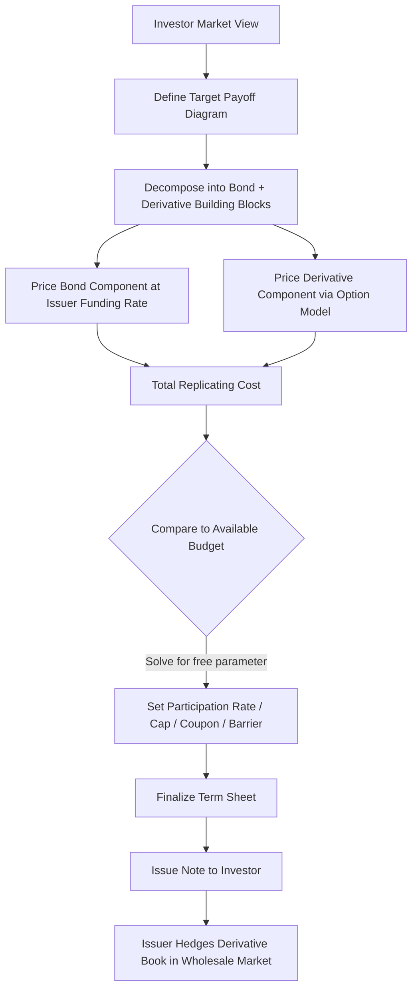

## What a Structured Product Is and How It Is Built

### Overview

A structured product is a pre-packaged investment combining a base instrument (typically a bond or deposit) with one or more embedded derivatives to create a customized risk-return profile that would be difficult or costly for an end investor to assemble independently. Structured products span the full spectrum from simple principal-protected notes to highly complex multi-asset, multi-barrier structures, and understanding their construction as a combination of simpler building blocks is the foundational skill for analyzing, pricing, and risk-managing them.

**Key Points**

- Every structured product can, in principle, be decomposed ("reverse-engineered") into a portfolio of simpler, more liquid instruments: a bond component plus one or more derivative components
- This decomposition approach — breaking a complex payoff into a replicating portfolio of vanilla building blocks — is the central analytical technique used throughout structured products work, for both pricing and risk understanding
- Structured products serve three main constituencies with different motivations: investors (customized risk-return exposure), issuers (funding and distribution economics), and intermediaries (fee income)
- The same payoff can often be achieved through multiple different derivative combinations, and the choice between them typically comes down to relative cost, liquidity, and hedging convenience for the structurer

### The Building-Block Philosophy

**Key Points**

- The foundational insight of structured products analysis is that virtually any payoff diagram, however complex, can be approximated or exactly replicated using combinations of: zero-coupon bonds, vanilla calls/puts (at various strikes), digital/binary options, and barrier features
- This is a direct application of the **static replication** principle: since a portfolio of options with a continuum of strikes can replicate any twice-differentiable payoff function (the Breeden-Litzenberger result, foundational to derivatives theory), practitioners use a finite, discrete version of this idea to construct and analyze real-world structures
- Understanding a structured product means being able to answer: "what portfolio of a bond and options would produce this identical payoff?" — this decomposition immediately clarifies both the product's true risk profile and a reasonable estimate of its fair value

### The Two Fundamental Components

**1. The Bond/Deposit Component**

Provides the baseline, non-contingent element of the structure — typically the source of principal protection (full, partial, or none) and/or a fixed coupon stream. Priced as a standard fixed-income instrument, discounted at the issuer's own funding rate (not the risk-free rate), since the note is an unsecured obligation of the issuer.

**2. The Derivative Component(s)**

One or more embedded derivatives — options (vanilla, digital, barrier, Asian, basket, worst-of/best-of), swaps, or combinations thereof — that determine the variable, market-contingent portion of the payoff. This is the element that gives the structured product its distinctive payoff shape and its name (e.g., "autocallable," "reverse convertible," "range accrual").

### The Core Construction Formula

$$\text{Structured Product Value} = \text{Bond Component (PV)} + \text{Derivative Component(s) (Premium)}$$

For a principal-protected structure, investor proceeds are split at inception:

$$\text{Proceeds} = \underbrace{PV(\text{Bond Component})}_{\text{discounted at issuer funding rate}} + \underbrace{\text{Option Budget}}_{\text{after distribution costs}}$$

The bond component's present value, discounted at the issuer's funding rate over the structure's tenor, determines how much of the initial proceeds remain available to purchase the derivative component — directly constraining the achievable participation rate, cap level, or coupon enhancement the structure can offer. This budget-constraint relationship is the single most important mechanical driver of structured product terms: a lower issuer funding rate, longer tenor, or higher prevailing interest rate environment increases the bond discount and thus the available option budget (generally making principal-protected structures more attractive to construct), while higher options market volatility increases option cost and reduces achievable participation for a given budget.

### Illustration: The Building-Block Decomposition

<svg xmlns="http://www.w3.org/2000/svg" viewBox="0 0 700 400" font-family="sans-serif">
<text x="350" y="25" text-anchor="middle" font-size="16" font-weight="bold">Structured Product Decomposition (svg_diagram)</text>

<rect x="240" y="50" width="220" height="60" rx="8" fill="#2c3e50" />
<text x="350" y="85" text-anchor="middle" font-size="14" fill="white" font-weight="bold">Structured Product</text>
<line x1="300" y1="110" x2="180" y2="160" stroke="black" stroke-width="1.5" />
<line x1="400" y1="110" x2="520" y2="160" stroke="black" stroke-width="1.5" />
<text x="350" y="130" text-anchor="middle" font-size="12">=</text>

<rect x="60" y="160" width="220" height="60" rx="6" fill="#eaf2f8" stroke="#2980b9" stroke-width="1.5" />
<text x="170" y="185" text-anchor="middle" font-size="13" font-weight="bold">Bond / Deposit</text>
<text x="170" y="203" text-anchor="middle" font-size="11">PV @ issuer funding rate</text>

<text x="290" y="195" text-anchor="middle" font-size="16">+</text>

<rect x="420" y="160" width="220" height="60" rx="6" fill="#fdedec" stroke="#c0392b" stroke-width="1.5" />
<text x="530" y="185" text-anchor="middle" font-size="13" font-weight="bold">Derivative(s)</text>
<text x="530" y="203" text-anchor="middle" font-size="11">Calls, puts, digitals, barriers</text>

<line x1="530" y1="220" x2="530" y2="250" stroke="black" stroke-width="1.5" />
<text x="530" y="265" text-anchor="middle" font-size="11" fill="#555">decomposes further into...</text>
<rect x="360" y="280" width="120" height="45" rx="5" fill="#fdf2e9" stroke="#e67e22" stroke-width="1" />
<text x="420" y="307" text-anchor="middle" font-size="11">Vanilla Options</text>
<rect x="500" y="280" width="120" height="45" rx="5" fill="#fdf2e9" stroke="#e67e22" stroke-width="1" />
<text x="560" y="307" text-anchor="middle" font-size="11">Barrier/Digital Features</text>
</svg>

### Common Decomposition Patterns

**Key Points**

- **Principal-protected participation note** = Zero-coupon bond + Long call option(s)
- **Reverse convertible / yield enhancement note** = Zero-coupon bond (or coupon bond) + Short put option (investor implicitly sells downside protection to the issuer, financing the enhanced coupon)
- **Zero-cost collar note** = Zero-coupon bond + Long call (or put) + Short put (or call), with the two option premiums structured to offset
- **Autocallable note** = Zero-coupon bond + Short put (downside risk below barrier) + Strip of digital options (one per observation date, paying the autocall redemption if triggered)
- **Range accrual note** = Zero-coupon bond + Strip of digital options (one per observation day, paying if the underlying is within the specified range)

Recognizing these standard patterns allows a practitioner to quickly identify the risk profile of a new structure by mapping it to a known decomposition template, then adjusting for the specific strikes, barriers, and observation schedule of the actual product.

### The Structuring Process: From Investor View to Priced Product

**Key Points**

- **Step 1 — Define the investor's market view and risk tolerance**: bullish, bearish, range-bound, or volatility view; principal protection requirement; desired tenor; income vs. growth objective
- **Step 2 — Translate the view into a target payoff diagram**: sketch the desired relationship between the underlying's terminal (or path-dependent) value and the note's redemption value
- **Step 3 — Decompose the target payoff into a replicating portfolio**: identify which combination of bond and derivative building blocks reproduces the target payoff shape
- **Step 4 — Price each component**: bond component via issuer funding curve; derivative component(s) via the appropriate option pricing model (Black-Scholes/Black-76 or more advanced models depending on features) referencing the underlying's implied volatility surface
- **Step 5 — Solve for the free structuring parameter**: given a fixed total budget (100% of investor proceeds, less distribution costs), solve for whichever term is left variable — participation rate, cap level, coupon, or barrier level — such that the structure's replicating cost equals the available budget
- **Step 6 — Issue and hedge**: the issuer sells the note and simultaneously (or shortly thereafter) executes offsetting derivative trades in the wholesale market to hedge the embedded derivative exposure, aiming to lock in the distribution/structuring margin

### Illustration: The Structuring Workflow

### Payoff Diagram Construction: A Practical Technique

A standard practitioner technique for building and reading structured product payoffs is to construct the diagram incrementally, adding one building block at a time and observing the cumulative effect:

1. Start with a flat line at the bond's guaranteed floor (e.g., 100% of face value for full principal protection, or 90% for 90%-protected)
2. Add a long call struck at the participation start level, with slope equal to the participation rate — this creates the "kink" where upside participation begins
3. If a cap exists, add a short call at the cap level, flattening the payoff above that point
4. If downside is not protected (principal-at-risk), replace the flat floor beyond a barrier with a declining line matching the underlying's decline (representing the effect of an implicitly sold put)

This incremental building process mirrors how the derivative component is actually assembled in practice and is the standard way practitioners read a term sheet's payoff diagram to infer the underlying option structure.

### Bond Component: Deeper Considerations

**Key Points**

- **Coupon-bearing vs. zero-coupon**: some structures pay a small fixed coupon in addition to the variable component, reducing the option budget accordingly (since bond proceeds must cover the coupon payments as well as final principal)
- **Callable/puttable features**: some structured notes include issuer call rights or investor put rights, adding further embedded optionality beyond the primary market-linked payoff, typically to allow the issuer to manage its funding book or the investor to obtain early liquidity under specified conditions
- **Currency of denomination**: the bond component's discounting must reflect the currency and credit curve of the actual note issuance, which may differ from the currency of the underlying reference asset, introducing an additional FX/quanto consideration into the structuring (addressed further under quanto and composite option techniques)

### Derivative Component: Choosing the Right Building Blocks

**Key Points**

- **Vanilla options** (calls/puts): the default building block for simple directional participation or protection views
- **Digital/binary options**: used when the payoff should be a fixed amount contingent on a condition being met, rather than proportional to the magnitude of the move (e.g., autocall triggers, range accrual coupons)
- **Barrier options**: used when a feature should activate or deactivate based on the underlying crossing a specific level during the life of the product (e.g., a "knock-in put" commonly embedded in reverse convertibles, where downside risk only activates if a barrier is breached, rather than existing from inception)
- **Asian/average-price options**: used when the payoff should reference an average price over a period rather than a single terminal value, reducing cost and/or better matching an investor's actual physical exposure pattern (particularly relevant for commodity-linked structures)
- **Basket/worst-of/best-of options**: used for multi-asset structures, where the payoff depends on the collective or extreme performance of several underlyings rather than a single one, introducing correlation as an additional critical pricing input

### Why the Same Payoff Can Have Multiple Constructions

**[Inference]** A given target payoff can frequently be replicated through more than one combination of building blocks — for example, a capped-upside, floored-downside payoff (a collar-like profile) can be constructed either as an explicit collar (long put + short call) or, in some cases, more efficiently as a single exotic structure (e.g., a corridor or range-based instrument) depending on which decomposition is cheaper to hedge given the issuer's existing derivatives book and the relative liquidity of the component options in the wholesale market. This means the "optimal" construction from an issuer's perspective is not purely a function of the target payoff itself, but also of the issuer's existing risk book, relative option liquidity across strikes/barriers, and hedging cost — a genuinely variable, desk-specific consideration rather than a single objectively correct construction.

### Key Terminology Summary

| Term | Definition |
| --- | --- |
| Participation rate | The percentage of underlying performance the investor receives on the upside (or downside, if applicable) |
| Barrier | A trigger level that activates or deactivates a feature (autocall, knock-in protection loss) if crossed |
| Cap | A maximum payoff level, beyond which the investor does not benefit from further underlying appreciation |
| Coupon | A fixed or contingent periodic payment, separate from principal repayment |
| Principal protection | The degree to which the investor's initial capital is guaranteed at maturity, subject to issuer credit risk |
| Underlying | The reference asset(s) (single security, index, basket, commodity) determining the variable payoff |
| Term sheet | The legal/commercial document specifying all structural parameters of a specific note issuance |

### Worked Example: Constructing a Simple Structure from Scratch

An issuer wants to design a 3-year, 100% principal-protected note on a single equity index, with the following inputs:

- Issuer funding rate: 4.8% (continuously compounded)
- 3-year at-the-money call option premium: 18% of notional (from the derivatives desk's pricing model)
- Distribution cost: 1.5% of proceeds

**Step 1 — Bond component present value:**

$$PV_{bond} = 100 \times e^{-0.048 \times 3} \approx 100 \times 0.8681 = 86.81$$

**Step 2 — Total budget for derivative + distribution:**

$$100 - 86.81 = 13.19$$

**Step 3 — Deduct distribution cost:**

$$13.19 - 1.5 = 11.69 \text{ available for the embedded call}$$

**Step 4 — Solve for participation rate:**

Since a 100%-notional call costs 18, and only 11.69 is available:

$$\text{Participation Rate} = \frac{11.69}{18} \approx 65\%$$

**Resulting term sheet**: 3-year, 100% principal-protected note, 65% participation in index appreciation, no participation in decline. This structure decomposes exactly as: Zero-coupon bond (86.81% of notional, growing to 100% at maturity) + 65% notional-weighted long call option (11.69% of notional cost) + 1.5% distribution margin retained by the distributor — the canonical building-block decomposition underlying every subsequent, more complex structure covered in this chapter.

### Related Topics

**Related Topics**

- Static Replication and the Breeden-Litzenberger Framework
- Principal-Protected Note Structuring Across Asset Classes
- Autocallable Note Mechanics and Barrier Risk
- Reverse Convertibles and Knock-In Put Structures
- Issuer Credit Risk and Funding Rate Impact on Structuring Economics
- Payoff Diagram Construction and Reading Term Sheets
- Multi-Asset Basket Structures: Worst-Of and Best-Of Payoffs