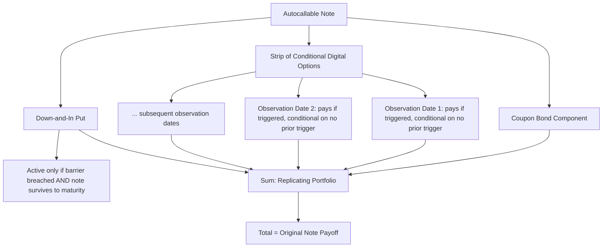

## Decomposing Notes Into Bond and Option Components

### Overview

Decomposing a structured note into its bond and option components is the core analytical technique for pricing, risk-managing, and evaluating structured products. Given any note payoff diagram, the practitioner's task is to identify the exact combination of zero-coupon bond exposure and vanilla/exotic option positions that exactly replicates it — turning an opaque term sheet into a transparent, independently verifiable portfolio of known, separately-priceable instruments.

**Key Points**

- Decomposition is a reverse-engineering exercise: starting from a known payoff diagram and working backward to the replicating portfolio, as opposed to structuring (forward construction from investor view to term sheet), which was covered in the prior topic
- The technique relies on reading the payoff diagram's kinks, slopes, and flat regions, each of which maps to a specific component of the replicating portfolio
- Correct decomposition is the prerequisite for independent fair-value assessment, since each component can then be priced separately using standard, verifiable models and market data
- This skill applies uniformly across asset classes (equity-linked, commodity-linked, FX-linked, rates-linked notes) since the underlying construction logic is identical regardless of what the derivative references

### The Systematic Decomposition Method

**Step 1 — Identify the Floor (Bond Component)**

Examine the payoff diagram's minimum guaranteed value across all outcomes. A flat horizontal segment at the far left (or right, for inverse structures) of the payoff diagram, independent of the underlying's level, indicates the bond component's contribution — this flat minimum is what a pure zero-coupon bond alone would deliver.

$$\text{Bond Notional (face value)} = \text{Minimum Guaranteed Redemption Value}$$

If the payoff has no floor at all (fully principal-at-risk from the first dollar of decline), there may be no explicit bond component beyond the very smallest residual value, and the structure is closer to a pure derivative-equivalent position.

**Step 2 — Identify Kinks and Slope Changes**

Every point on the payoff diagram where the slope changes corresponds to an option struck at that underlying level. The nature of the slope change determines the option type and position (long/short):

- **Slope increases from 0 to positive** at a point: long call struck at that point
- **Slope decreases from positive to 0** (payoff flattens/caps): short call struck at that point
- **Slope decreases from 0 to negative** as underlying falls: short put struck at that point (the investor's downside protection has been given up beyond this point)
- **Slope increases from negative to 0** as underlying rises through a point (from below): long put struck at that point

**Step 3 — Determine the Slope Magnitude (Participation Rate / Notional)**

The magnitude of each slope segment (relative to a 1:1 slope, which represents full/100% notional participation) indicates the notional size of the corresponding option position — a 65% slope indicates a 65%-notional option position, a slope of 2 (i.e., 200%) indicates a leveraged, double-notional option position.

**Step 4 — Identify Discontinuities (Digital Components)**

Any vertical jump in the payoff diagram — a discrete change in value at a specific underlying level, rather than a continuous kink — indicates an embedded digital/binary option, since only a digital payoff structure produces a true discontinuity rather than a change in slope.

**Step 5 — Sum the Components and Verify**

The decomposed portfolio (bond + sum of option positions) should be re-plotted and checked against the original payoff diagram at several representative underlying levels to confirm the decomposition is exact, not merely approximately similar.

### Illustration: Reading a Payoff Diagram for Decomposition

<svg xmlns="http://www.w3.org/2000/svg" viewBox="0 0 700 420" font-family="sans-serif">
<text x="350" y="25" text-anchor="middle" font-size="16" font-weight="bold">Decomposition by Reading Kinks and Slopes (svg_diagram)</text>
<line x1="60" y1="370" x2="640" y2="370" stroke="black" stroke-width="1.5" />
<line x1="60" y1="370" x2="60" y2="60" stroke="black" stroke-width="1.5" />
<text x="650" y="375" font-size="12">Underlying at Maturity</text>
<text x="15" y="55" font-size="12">Note Value</text>

<polyline points="80,280 250,280 450,140 600,140" fill="none" stroke="#2c3e50" stroke-width="3" />

<text x="130" y="265" font-size="12" fill="`#2980b9`" font-weight="bold">Segment A: flat</text>

<text x="130" y="300" font-size="11" fill="`#2980b9`">= Bond floor (face value)</text>

<circle cx="250" cy="280" r="5" fill="#c0392b" />
<text x="200" y="330" font-size="11" fill="#c0392b">Kink 1: slope 0 → positive</text>
<text x="200" y="345" font-size="11" fill="#c0392b">= Long call struck here (K₁)</text>

<text x="300" y="200" font-size="12" fill="`#27ae60`" font-weight="bold">Segment B: rising</text>

<text x="300" y="218" font-size="11" fill="`#27ae60`">= Participation slope</text>

<text x="300" y="233" font-size="11" fill="`#27ae60`">(long call notional)</text>

<circle cx="450" cy="140" r="5" fill="#c0392b" />
<text x="400" y="120" font-size="11" fill="#c0392b">Kink 2: slope positive → 0</text>
<text x="400" y="105" font-size="11" fill="#c0392b">= Short call struck here (K₂)</text>

<text x="530" y="125" font-size="12" fill="`#2980b9`" font-weight="bold">Segment C: flat (capped)</text>

<line x1="250" y1="370" x2="250" y2="60" stroke="#999" stroke-width="1" stroke-dasharray="3,3" />
<text x="235" y="390" font-size="11">K₁</text>
<line x1="450" y1="370" x2="450" y2="60" stroke="#999" stroke-width="1" stroke-dasharray="3,3" />
<text x="435" y="390" font-size="11">K₂</text>
</svg>

### Worked Decomposition 1: Zero-Cost Collar Note

**Given payoff**: A note that returns 100% at $K_1$, tracks the underlying 1:1 between $K_1$ and $K_2$, caps at the value corresponding to $K_2$, and — below $K_1$ — declines 1:1 with the underlying (no floor beyond $K_1$).

**Decomposition**:

1. Below $K_1$: payoff declines 1:1 with the underlying, matching what a **short put struck at $K_1$** would produce when combined with a bond floor at $K_1$'s corresponding value (the bond pays $K_1$-equivalent value, and the short put's negative payoff below $K_1$ exactly offsets the bond's flat floor, producing the observed 1:1 decline)
2. Between $K_1$ and $K_2$: flat slope of 1 (full participation) — consistent with the bond + short put (struck at $K_1$) + long call (struck at $K_1$) combination, since the long call struck at $K_1$ begins contributing exactly where the short put's influence ends
3. Above $K_2$: flattens (capped) — indicates a **short call struck at $K_2$**

**Resulting decomposition**: Zero-coupon bond (paying $K_1$ value) + Long call (struck at $K_1$) + Short put (struck at $K_1$) + Short call (struck at $K_2$)

This simplifies to the standard collar construction: the bond plus long-call-short-put combination at the same strike $K_1$ synthetically replicates a forward position starting at $K_1$ (this is put-call parity in action — a long call and short put at the same strike, combined with a bond paying that strike's value, replicate simply holding the underlying itself from that reference point), while the short call at $K_2$ caps the upside.

### Worked Decomposition 2: Reverse Convertible with Knock-In Put

**Given payoff**: A note pays an enhanced fixed coupon regardless of outcome. At maturity, if the underlying has never touched a barrier $B$ below the initial level, the investor receives 100% of face value. If the barrier was touched at any point during the note's life, principal repayment is reduced to track the underlying's actual decline (i.e., $\min(100\%, S_T/S_0 \times 100\%)$).

**Decomposition**:

1. **Coupon-bearing bond**: pays the enhanced fixed coupon periodically and 100% of face value at maturity as its own baseline
2. **Short down-and-in put struck at $S_0$, barrier at $B$**: this exotic option only activates (knocks in) if the barrier is breached; once active, it behaves as a standard put, whose negative payoff to the investor (since they are implicitly short) reduces the redemption value below par to match the underlying's decline

**Resulting decomposition**: Coupon bond + Short down-and-in put (struck at $S_0$, barrier $B$)

The enhanced coupon is precisely the premium the investor implicitly receives for selling this contingent (barrier-activated) put option to the issuer — a direct illustration of why reverse convertibles are frequently described as "selling insurance" against a large downside move, with the barrier feature meaning the "insurance" only pays out (against the investor) if the decline is severe enough to breach the barrier, not for any decline whatsoever.

### Worked Decomposition 3: Autocallable Note

**Given payoff**: On each of several quarterly observation dates, if the underlying is at or above its initial level, the note redeems early at 100% plus an accrued coupon. If never triggered, the note runs to maturity, where a knock-in put (as in the reverse convertible above) determines final redemption if a downside barrier was breached at any point.

**Decomposition**:

1. **Coupon bond** (with early redemption feature)
2. **Strip of digital "one-touch-upward" options**, one per observation date, each paying the accrued coupon plus early return of principal if the autocall condition is met on that specific date and was not previously triggered on an earlier date (making each digital's payoff conditional on all prior dates *not* having triggered — a sequential/conditional digital structure)
3. **Down-and-in put** (as in the reverse convertible decomposition), determining terminal payoff only in the scenario where the note survives to maturity without autocalling

**[Inference]** The precise, formal pricing decomposition of an autocallable's digital strip requires careful handling of the conditional/sequential nature of each autocall trigger (each date's digital payoff is contingent on non-triggering at all prior dates), which in practice is typically handled via Monte Carlo simulation or a recursive/backward-induction numerical approach rather than a simple sum of independent closed-form digital option prices, since the triggers are not independent events — this is a well-established point in the structured products quant literature regarding autocallable valuation methodology.

### Illustration: Autocallable Decomposition Structure

### Verification: The Payoff-Matching Check

After decomposing a note, the practitioner should verify the decomposition by evaluating both the original note payoff and the proposed replicating portfolio at several distinct underlying price scenarios, confirming exact agreement:

| Scenario | Original Note Payoff | Replicating Portfolio Payoff | Match? |
| --- | --- | --- | --- |
| Underlying well above cap | Capped value | Bond + long call (in-the-money, capped by short call) | Should match exactly |
| Underlying at initial level | Par (typically) | Bond + at-the-money option positions | Should match exactly |
| Underlying moderately below initial | Depends on barrier/floor | Bond + relevant put positions | Should match exactly |
| Underlying far below barrier | Tracks underlying decline | Bond + activated knock-in put | Should match exactly |

Any mismatch at any tested scenario indicates an error in the decomposition — either a missight kink, an incorrectly identified strike, or a missed component (such as an unaccounted-for digital feature).

### Why Decomposition Matters: Practical Applications

**Key Points**

- **Independent fair value assessment**: decomposing a note into standard components allows each piece to be priced using observable market data (bond yields, listed/OTC option implied volatilities), providing a check on whether a note's quoted terms are commercially reasonable relative to a theoretical replicating cost
- **Risk understanding**: the Greeks (delta, gamma, vega, theta) of the overall note are simply the sum of the Greeks of the decomposed components, making risk management tractable by analyzing each building block separately rather than the opaque note as a whole
- **Regulatory and disclosure compliance**: frameworks such as the EU's PRIIPs Regulation require standardized risk and cost disclosures that implicitly rely on this kind of decomposition methodology to model expected performance scenarios
- **Secondary market valuation**: since structured notes are often illiquid, mark-to-market valuation prior to maturity typically relies on repricing the decomposed components using current market data (updated bond yields, updated implied volatility) rather than observing an active secondary market price

### Common Pitfalls in Decomposition

**Key Points**

- **Missing the funding rate distinction**: using the risk-free rate rather than the issuer's actual funding rate to discount the bond component will produce an incorrect (typically overstated) fair value, since issuer credit spread is a real, priced component of the structure
- **Overlooking path-dependency**: a payoff diagram alone (which typically shows only the *terminal* payoff as a function of terminal underlying level) does not capture path-dependent features like knock-in/knock-out barriers or autocall triggers — these require examining the term sheet's observation schedule and barrier monitoring conventions, not just the terminal payoff shape
- **Ignoring correlation for multi-asset structures**: for basket, worst-of, or best-of notes, decomposition into single-asset option components is insufficient — the payoff genuinely depends on the joint (correlated) behavior of multiple underlyings, requiring multi-asset option pricing techniques rather than a simple sum of independent single-asset positions
- **Assuming a unique decomposition**: as previously noted, multiple valid replicating portfolios can sometimes produce an identical payoff (e.g., via put-call parity substitutions) — a valid decomposition need not be the unique one, only an accurate one

### Worked Numerical Example

A 2-year note has the following observed payoff pattern at maturity (percentage of face value returned, as a function of the underlying index's percentage change from initial level):

| Underlying Change | Note Redemption |
| --- | --- |
| -30% or worse | 70% |
| -10% | 90% |
| 0% (unchanged) | 100% |
| +15% | 100% |
| +15% to +40% | 100% to 125% (linear) |
| +40% or better | 125% (capped) |

**Reading the kinks**:

- From -30%+ to 0%: slope of 1 (1% redemption change per 1% underlying change) — consistent with full downside participation, i.e., **no protection at all in this range**, meaning effectively a short put (or equivalently, this entire segment could be seen as the bond floor being set very low, at 70% at the -30% extreme, with a short put or forward-like exposure explaining the linear decline down to that point)
- From 0% to +15%: flat at 100% — the note doesn't participate in the first 15% of gains, consistent with a **long call struck at +15%** not yet being in the money
- From +15% to +40%: slope of 1 (100% to 125% is a 25-point rise over a 25-point underlying rise) — consistent with the **long call struck at +15%** now being in the money, with full (100%) participation notional
- Above +40%: flat at 125% — consistent with a **short call struck at +40%**, capping the payoff

**Decomposition**: Coupon-free structure combining a bond-like floor around 70% (itself reflecting a partial, not full, protection level with linear downside exposure below that, best modeled as the bond paying 100% combined with a short put struck at-the-money with a particular notional producing the observed -30%-to-90%/100% slope) + Long call struck at +15% (100% notional) + Short call struck at +40% (100% notional) — a **capped participation note with partial (not full) principal protection**, structurally a bond plus a call spread (long +15% call, short +40% call) financed partly by an implicitly sold downside put reducing the effective principal protection level.

### Related Topics

**Related Topics**

- What a Structured Product Is and How It Is Built
- Put-Call Parity and Synthetic Forward Construction
- Reverse Convertibles and Knock-In Put Structures
- Autocallable Note Valuation via Monte Carlo Simulation
- Greeks Aggregation for Structured Note Risk Management
- PRIIPs KID Disclosure and Cost Transparency Requirements
- Multi-Asset Basket Structures: Worst-Of and Best-Of Payoffs