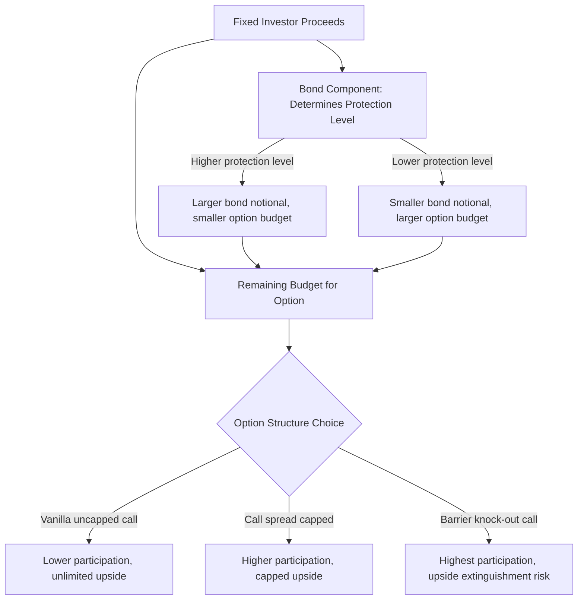

## Zero Coupon Bond Plus Option Structuring

### Overview

Zero coupon bond plus option structuring is the most fundamental and widely used construction template in the structured products universe: combining a discount bond (providing principal protection at maturity) with a long option position (providing market-contingent upside) to create a principal-protected participation note. This template underlies the majority of retail and private-banking structured products and serves as the canonical teaching example for the broader building-block methodology.

**Key Points**

- The zero coupon bond plus option (ZCB+Option) structure is the simplest possible principal-protected payoff: guaranteed return of principal at maturity, plus optional upside participation
- The structure's economics are driven by a direct tension between two variables: the bond's discount (a function of the issuer's funding rate and tenor) and the option's cost (a function of implied volatility, moneyness, and tenor) — this tension is what determines the achievable participation rate
- Despite its conceptual simplicity, the ZCB+Option template extends naturally to more complex variants (capped participation, basket-linked, leveraged participation, knock-out participation) by modifying only the option component while keeping the bond component logic unchanged
- Because the structure's payoff is bounded below at par (before fees) and unbounded (or capped) above, it has a payoff diagram identical in shape to a long call option itself, shifted upward by the bond floor

### The Fundamental Construction

**Payoff at Maturity**

$$\text{Redemption Value} = \max\left(\text{Face Value}, \, \text{Face Value} \times \left[1 + p \times \frac{S_T - S_0}{S_0}\right]\right)$$

where $p$ is the participation rate. This can be rewritten to make the decomposition explicit:

$$\text{Redemption Value} = \underbrace{\text{Face Value}}_{\text{ZCB}} + \underbrace{\frac{p \times \text{Face Value}}{S_0} \times \max(S_T - S_0, 0)}_{\text{Long call option position}}$$

The second term is exactly $p \times \text{Face Value}/S_0$ units of a standard European call option struck at-the-money ($K = S_0$), confirming the decomposition: the note is precisely a zero-coupon bond plus a scaled long call position.

### The Budget Equation

At inception, the total cost of constructing the note must equal the investor's proceeds (usually 100% of face value, less any distribution cost):

$$\text{Proceeds} = PV_{bond}(\text{Face Value}) + p \times \text{Face Value} \times \frac{C(S_0, K, T, \sigma, r_f, q)}{S_0}$$

where $C(\cdot)$ is the Black-Scholes (or dividend/yield-adjusted) call price per unit of underlying, and $r_f$ here denotes the issuer's own funding rate used for bond discounting (distinct from any risk-free rate used within the option pricing formula itself, which should use market rates appropriate to the option's replication/hedging cost — an important distinction addressed further below).

**Solving for the Participation Rate**

Given proceeds, bond terms, and option price, the achievable participation rate is:

$$p = \frac{\text{Proceeds} - PV_{bond}(\text{Face Value})}{\text{Face Value} \times C(S_0, K, T, \sigma, r_f, q)/S_0}$$

This single equation is the central driver of ZCB+Option structuring economics — every input on the right-hand side directly and predictably affects the achievable participation rate.

### Illustration: The ZCB+Option Payoff Build-Up

<svg xmlns="http://www.w3.org/2000/svg" viewBox="0 0 700 400" font-family="sans-serif">
<text x="350" y="25" text-anchor="middle" font-size="16" font-weight="bold">Building the Payoff: Bond + Call Option (svg_diagram)</text>
<line x1="60" y1="200" x2="640" y2="200" stroke="black" stroke-width="1" />
<text x="30" y="205" font-size="11">Bond alone</text>
<line x1="80" y1="180" x2="620" y2="180" stroke="#2980b9" stroke-width="2.5" />
<text x="500" y="170" font-size="11" fill="#2980b9">Flat at Face Value (100%)</text>

<text x="350" y="230" text-anchor="middle" font-size="16">+</text>

<line x1="60" y1="330" x2="640" y2="330" stroke="black" stroke-width="1" />
<text x="30" y="335" font-size="11">Call alone</text>
<polyline points="80,320 340,320 600,150" fill="none" stroke="#27ae60" stroke-width="2.5" />
<text x="450" y="180" font-size="11" fill="#27ae60">Zero below strike, rises above</text>

<text x="350" y="255" text-anchor="middle" font-size="14" font-weight="bold">=</text>

<line x1="60" y1="380" x2="640" y2="380" stroke="black" stroke-width="1.5" />
<text x="10" y="385" font-size="11">Combined</text>
<polyline points="80,365 340,365 600,240" fill="none" stroke="#c0392b" stroke-width="3" />
<text x="450" y="225" font-size="11" fill="#c0392b" font-weight="bold">Principal-Protected Participation Note</text>
</svg>

### Key Drivers of the Participation Rate

**Key Points**

- **Issuer funding rate**: higher funding rate → larger bond discount → more budget available for the option → higher achievable participation rate (all else equal). This is why structured note issuance economics are sensitive to the issuer's own credit spread, and why participation rates offered by different issuing banks on economically similar notes can differ meaningfully due to differing funding costs
- **Interest rate environment**: a higher general interest rate environment increases bond discounting (larger gap between face value and present value), directly increasing the option budget — this is a primary reason principal-protected structured notes became more prevalent/attractive to structure in higher-rate environments relative to near-zero-rate environments, where the bond discount is minimal and little budget remains for meaningful option participation
- **Tenor**: longer tenor increases the bond discount (more compounding periods) but also increases option cost (longer-dated options are generally more expensive in absolute premium terms, though not necessarily proportionally) — the net effect on participation rate is ambiguous and depends on the specific relationship between the term structure of interest rates and the term structure of implied volatility for the given underlying
- **Implied volatility**: higher implied volatility increases option cost, directly reducing the achievable participation rate for a fixed budget — this creates the counterintuitive-to-some-investors dynamic where a higher-volatility, seemingly more "exciting" underlying often results in a *less* generous participation rate, since the note issuer must pay more for the same optionality
- **Dividend yield / foreign rate (for equity/FX underlyings)**: a higher dividend yield (equities) or foreign interest rate (FX) reduces the forward price of the underlying, which reduces call option value (since $C = S_0 e^{-qT} N(d_1) - Ke^{-rT}N(d_2)$, and higher $q$ directly reduces the first term) — all else equal, this reduces the option budget's purchasing power and thus the achievable participation rate

### Variants of the Basic Structure

**Capped Participation Note (Call Spread Structure)**

Adds a short call at a higher strike to finance a higher participation rate on the uncapped segment, at the cost of foregoing upside beyond the cap:

$$\text{Redemption Value} = \text{Face Value} + p \times \text{Face Value} \times \frac{\min(\max(S_T - K_1, 0), K_2 - K_1)}{S_0}$$

Decomposes as: Zero-coupon bond + Long call at $K_1$ + Short call at $K_2$ (a call spread), where the premium received from selling the $K_2$ call increases the available budget, typically allowing either a higher participation rate on the uncapped portion or a lower $K_1$ (participation starting sooner) than the uncapped version could achieve with the same budget.

**Leveraged (Geared) Participation Note**

Uses a participation rate above 100%, financed either by a smaller bond discount tolerance (e.g., accepting less than full principal protection) or by combining with a cap (as above) to fund the leverage on the uncapped segment.

**Knock-Out Participation Note**

Replaces the vanilla call with an up-and-out call (or similar barrier variant), reducing the option's cost (since a barrier option is generally cheaper than the equivalent vanilla, as covered in the barrier options topic) in exchange for the risk that the upside participation is extinguished entirely if the underlying rises too far, too fast — an unusual but real risk that investors in such structures must understand: reaching a very favorable price level can, counterintuitively, eliminate the note's benefit if it triggers the knock-out.

**Partial Principal Protection Note**

Reduces the guaranteed floor below 100% (e.g., 90% protected), freeing up additional budget (since a lower guaranteed floor requires a smaller bond notional/PV) to fund a higher participation rate or lower entry barrier for participation — a direct trade-off between protection level and upside potential that investors explicitly choose based on risk tolerance.

### Illustration: Structuring Trade-Off Space

### Comparing Structuring Levers: A Sensitivity Table

| Lever | Increases Participation Rate? | Mechanism |
| --- | --- | --- |
| Higher issuer funding rate | Yes | Larger bond discount, more option budget |
| Higher general interest rates | Yes (typically) | Larger bond discount effect dominates |
| Lower implied volatility | Yes | Cheaper option for same budget |
| Adding a cap (call spread) | Yes (on uncapped portion) | Premium received from short call funds higher participation |
| Reducing principal protection | Yes | Smaller required bond notional frees budget |
| Longer tenor | Ambiguous | Larger bond discount but also larger option cost |
| Higher dividend yield/foreign rate | No | Reduces call option value for same strike |

### Pricing Nuance: Which Rate Discounts the Bond?

**Key Points**

- The bond component must be discounted at the **issuer's own funding rate**, reflecting that the note is an unsecured liability of the issuing entity, not a risk-free instrument — using the risk-free rate would overstate the bond's true present value and thus overstate the note's fair value relative to what it actually costs the issuer to construct
- The option component, by contrast, is priced using standard risk-neutral valuation with the risk-free rate (or the appropriate discount rate for the option's replication/hedging framework), since the option's value derives from a no-arbitrage replication argument in the wholesale derivatives market, distinct from the issuer's own credit standing
- This means a ZCB+Option note effectively contains an implicit "funding value adjustment" relative to a hypothetical risk-free-issuer equivalent — a concept closely related to Funding Valuation Adjustment (FVA) concepts used more broadly in derivatives valuation post-2008, where an institution's own funding cost is explicitly incorporated into derivative and structured product economics rather than assuming risk-free funding throughout

### Worked Example: Full Structuring Walkthrough

An issuer structures a 4-year, USD 10,000,000 notional, 100% principal-protected note linked to a broad equity index, with the following inputs:

- Issuer funding rate: 5.2% (continuously compounded, 4-year tenor)
- Index spot level: $S_0 = 5{,}000$
- 4-year at-the-money implied volatility: 16%
- Dividend yield on index: 1.8%
- Risk-free rate (for option pricing): 4.5%
- Distribution cost: 1.25% of notional

**Step 1 — Bond component present value:**

$$PV_{bond} = 10{,}000{,}000 \times e^{-0.052 \times 4} = 10{,}000{,}000 \times e^{-0.208} \approx 10{,}000{,}000 \times 0.8122 = \$8{,}122{,}000$$

**Step 2 — Budget for option + distribution:**

$$10{,}000{,}000 - 8{,}122{,}000 = \$1{,}878{,}000$$

**Step 3 — Deduct distribution cost:**

$$1{,}878{,}000 - (0.0125 \times 10{,}000{,}000) = 1{,}878{,}000 - 125{,}000 = \$1{,}753{,}000 \text{ available for the call}$$

**Step 4 — Price the 4-year at-the-money call (per unit notional)** using Black-Scholes with $S_0 = 5000$, $K = 5000$, $T = 4$, $\sigma = 16\%$, $r = 4.5\%$, $q = 1.8\%$:

$$d_1 = \frac{\ln(S_0/K) + (r - q + \sigma^2/2)T}{\sigma\sqrt{T}} = \frac{0 + (0.045 - 0.018 + 0.0128)(4)}{0.16 \times 2} = \frac{0.1592}{0.32} \approx 0.4975$$

$$d_2 = d_1 - \sigma\sqrt{T} = 0.4975 - 0.32 \approx 0.1775$$

Using standard normal CDF approximations, $N(d_1) \approx 0.6905$, $N(d_2) \approx 0.5705$:

$$C = S_0 e^{-qT} N(d_1) - Ke^{-rT}N(d_2) = 5000 \times e^{-0.072} \times 0.6905 - 5000 \times e^{-0.18} \times 0.5705$$

$$= 5000 \times 0.9305 \times 0.6905 - 5000 \times 0.8353 \times 0.5705 \approx 3212.5 - 2382.5 \approx 830.0$$

So the call costs approximately 830.0 index points, or as a percentage of the 5,000 spot level: $830.0 / 5000 \approx 16.6\%$ of notional.

**Step 5 — Solve for participation rate:**

$$p = \frac{1{,}753{,}000}{0.166 \times 10{,}000{,}000} = \frac{1{,}753{,}000}{1{,}660{,}000} \approx 105.6\%$$

**Resulting term sheet**: 4-year, 100% principal-protected note on the equity index, approximately 105.6% participation in index appreciation (a mild leverage effect achievable here because the bond discount plus favorable rate/volatility combination provided slightly more budget than needed for 100% participation), no participation in any decline, subject to issuer credit risk.

**[Inference]** This worked example uses simplified, illustrative Black-Scholes assumptions (constant volatility, continuous dividend yield, no skew adjustment) for pedagogical clarity; a live trading desk would price the embedded option against the actual implied volatility surface (which typically exhibits skew and term structure effects for equity indices) rather than a single flat volatility input, which would produce a somewhat different, generally more precise, participation rate outcome.

### Related Topics

**Related Topics**

- What a Structured Product Is and How It Is Built
- Decomposing Notes Into Bond and Option Components
- Black-Scholes Option Pricing and the Greeks
- Call Spreads and Capped Participation Structures
- Funding Valuation Adjustment (FVA) in Derivatives Pricing
- Issuer Credit Risk and Its Impact on Structured Note Economics
- Barrier Options and Knock-Out Participation Structures