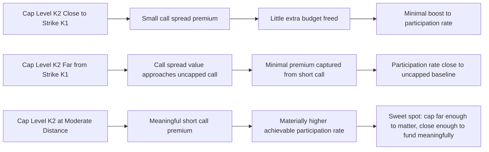

## Participation Rates and Payoff Design

### Overview

Participation rates and payoff design encompass the systematic techniques for engineering a structured note's exposure profile to match a targeted investor view, balancing the interlocking variables — participation rate, strike/barrier placement, cap levels, and protection level — that together determine a note's economics within a fixed budget constraint. This topic builds directly on the zero-coupon-bond-plus-option template by generalizing the single-lever participation rate concept into a full payoff design toolkit.

**Key Points**

- The participation rate is the single most prominent term-sheet parameter for investors, but it is only one of several interdependent design variables that collectively determine a structure's risk-return profile
- Payoff design is fundamentally a constrained optimization exercise: given a fixed budget (investor proceeds less bond cost and distribution fees), the structurer chooses among competing uses of that budget — higher participation, lower entry point, higher cap, or better protection — since not all can be simultaneously maximized
- Different payoff shapes suit different market views, and matching the payoff design to the investor's actual view (rather than defaulting to a generic template) is central to appropriate structuring
- Participation rates above 100% ("leverage" or "gearing") and below 100% represent fundamentally different budget-allocation choices, not simply different risk appetites

### The Participation Rate as a Budget Allocation Decision

Revisiting the core budget equation from the zero-coupon-bond-plus-option structure, the participation rate is the output of dividing available option budget by the cost of one unit of the relevant option exposure:

$$p = \frac{\text{Available Option Budget}}{\text{Cost of 100\% Notional Option Exposure}}$$

**Key Points**

- When available budget exceeds the cost of 100% notional exposure (e.g., due to a favorable interest rate environment, low implied volatility, or a capped/spread structure freeing additional budget), $p > 100\%$ is achievable — a "leveraged" or "geared" participation
- When available budget is less than the cost of 100% notional exposure (common in low-rate environments, high-volatility underlyings, or with strict full principal protection requirements), $p < 100\%$ results, and the structurer/investor must accept either reduced participation or seek offsetting structural changes (a cap, reduced protection, later strike) to improve it
- The participation rate is not an independently chosen "risk dial" set by investor preference alone — it is the mechanical output of the budget equation once all other structural parameters (protection level, cap, strike, tenor) are fixed; changing the participation rate to a specific desired level requires adjusting one of the other parameters instead

### The Interlocking Design Variables

A structured note's payoff design involves several parameters that trade off against one another within the fixed budget constraint:

**1. Protection Level**

The percentage of face value guaranteed regardless of underlying performance (e.g., 100%, 95%, 90%, or 0% for principal-at-risk structures). Lowering the protection level reduces the required bond component, freeing budget for other features.

**2. Participation Rate**

As defined above — the percentage of underlying performance the investor receives, on whichever segment of the payoff diagram participation applies.

**3. Strike / Start Level for Participation**

The underlying level at which participation begins (not always at-the-money; can be set above spot for a smaller premium, delaying when participation kicks in, or below spot, requiring a more expensive in-the-money option).

**4. Cap Level**

The underlying level beyond which no further participation applies (relevant only for capped/call-spread structures); a lower cap generates more premium from the short call leg, which can fund a higher participation rate on the uncapped segment or an earlier strike.

**5. Barrier Levels** (for barrier-embedding structures)

Knock-in/knock-out triggers that activate or deactivate features; barrier placement trades off premium/budget against the probability and severity of the barrier event affecting the investor.

### Illustration: The Design Variable Trade-Off Space

<svg xmlns="http://www.w3.org/2000/svg" viewBox="0 0 700 420" font-family="sans-serif">
<text x="350" y="25" text-anchor="middle" font-size="16" font-weight="bold">Fixed Budget, Competing Uses (svg_diagram)</text>

<circle cx="350" cy="210" r="70" fill="#2c3e50" />
<text x="350" y="205" text-anchor="middle" font-size="13" fill="white" font-weight="bold">Fixed Option</text>
<text x="350" y="222" text-anchor="middle" font-size="13" fill="white" font-weight="bold">Budget</text>

<circle cx="150" cy="100" r="60" fill="#eaf2f8" stroke="#2980b9" stroke-width="1.5" />
<text x="150" y="95" text-anchor="middle" font-size="11">Higher</text>
<text x="150" y="110" text-anchor="middle" font-size="11">Participation</text>
<line x1="220" y1="130" x2="290" y2="175" stroke="#2980b9" stroke-width="1.5" />
<circle cx="550" cy="100" r="60" fill="#fdedec" stroke="#c0392b" stroke-width="1.5" />
<text x="550" y="95" text-anchor="middle" font-size="11">Higher</text>
<text x="550" y="110" text-anchor="middle" font-size="11">Protection</text>
<line x1="480" y1="130" x2="410" y2="175" stroke="#c0392b" stroke-width="1.5" />
<circle cx="150" cy="330" r="60" fill="#fdf2e9" stroke="#e67e22" stroke-width="1.5" />
<text x="150" y="325" text-anchor="middle" font-size="11">Earlier</text>
<text x="150" y="340" text-anchor="middle" font-size="11">Strike</text>
<line x1="220" y1="300" x2="290" y2="250" stroke="#e67e22" stroke-width="1.5" />
<circle cx="550" cy="330" r="60" fill="#eafaf1" stroke="#27ae60" stroke-width="1.5" />
<text x="550" y="325" text-anchor="middle" font-size="11">Higher</text>
<text x="550" y="340" text-anchor="middle" font-size="11">Cap Level</text>
<line x1="480" y1="300" x2="410" y2="250" stroke="#27ae60" stroke-width="1.5" />

<text x="350" y="400" text-anchor="middle" font-size="12" fill="#555">Improving one variable requires reducing another, holding proceeds fixed</text>

</svg>

### Payoff Design Archetypes by Investor View

**Key Points**

- **Bullish, uncapped view**: standard ZCB+Call structure, uncapped participation, suitable for investors expecting significant appreciation and wanting to preserve full upside potential; typically yields a lower participation rate due to the higher cost of an uncapped option
- **Bullish, range-bound view**: capped participation (call spread) structure, suitable when the investor expects moderate appreciation but believes very large moves are unlikely; the cap sacrifices unlikely extreme upside to fund a higher rate on the more probable moderate-move range
- **Moderately bullish, income-focused view**: autocallable or reverse-convertible-style structure, suitable when the investor prioritizes an enhanced coupon over unlimited upside participation, accepting downside risk (often barrier-conditional) in exchange
- **Range-bound/neutral view**: range accrual structure, suitable when the investor expects the underlying to trade within a defined band, with coupon accrual tied to time spent within that range
- **Bearish view**: inverse participation structures (paying based on underlying decline rather than appreciation) or put-based reverse structures, less common in retail distribution but used in private banking/institutional contexts
- **Volatility view (view on volatility itself, not direction)**: structures with straddle-like or strangle-like embedded option combinations, paying based on the magnitude of movement in either direction rather than a specific directional view

### Sensitivity of Participation Rate to Strike Placement

Moving the strike (participation start level) away from at-the-money materially affects both the option cost and, consequently, the achievable participation rate:

- **Strike above spot (out-of-the-money call)**: cheaper option, larger achievable participation rate, but participation only begins after the underlying has already risen to the strike level — the investor forgoes participation in the initial portion of any move
- **Strike at spot (at-the-money)**: the standard baseline case
- **Strike below spot (in-the-money call)**: more expensive option (since it already has intrinsic value), smaller achievable participation rate for the same budget, but participation begins immediately from a lower starting point — effectively providing participation even if the underlying only partially recovers or rises modestly from a starting point below current spot

**[Inference]** The choice of strike placement relative to spot is a genuine structuring trade-off without a universally "better" answer — it depends on the specific balance an investor wants between a higher headline participation rate (favoring an out-of-the-money strike) versus earlier/broader participation onset (favoring an at-the-money or in-the-money strike), and different investors with the same directional view may reasonably prefer different points on this trade-off depending on their conviction about the magnitude versus likelihood of the anticipated move.

### Cap Level Design: Balancing Premium Capture Against Upside Forgone

Setting the cap level involves a specific trade-off worth quantifying: the closer the cap is to the participation strike, the more premium is captured from the short call (increasing available budget for a higher participation rate or better protection), but the more upside is forgone if the underlying rallies strongly.

$$\text{Call Spread Value} = C(K_1) - C(K_2), \quad K_2 > K_1$$

As $K_2 \to K_1$, the call spread value approaches zero (the structure captures almost no net premium, since the long and short call values converge), meaning almost no budget remains for the derivative component of the note (this extreme would collapse toward a near-pure-bond structure with almost no equity participation at all). As $K_2 \to \infty$, the structure approaches the uncapped case, with the short call contributing negligible premium. The optimal cap placement for a given target participation rate is found by solving the budget equation for $K_2$ given a target $p$ and fixed $K_1$, rather than picking $K_2$ arbitrarily.

### Illustration: Effect of Cap Placement on Participation Rate

### Multi-Tenor and Step-Up Participation Structures

**Key Points**

- **Step-up notes**: vary the participation rate or protection level across different segments of the underlying's performance range (e.g., 100% participation from 0% to +20% appreciation, then 150% participation from +20% to +40%), constructed via a combination of call spreads at different strikes with different notional weightings, allowing a more customized payoff shape than a single uniform participation rate
- **Digital-plus-participation hybrids**: combine a fixed digital payout (triggered at a specific underlying level) with continued proportional participation beyond that level, creating a payoff with both a discrete "step" and a continuous slope — decomposed as a digital option plus a call struck at the same level
- **Twin-win structures**: pay a positive return regardless of whether the underlying rises or falls (up to a barrier on the downside), by combining a long call above the initial level with a long put below it (converted to a positive payoff via appropriate scaling), suitable for investors with a volatility view but genuine uncertainty about direction, subject to a barrier beyond which the downside protection/twin-win feature is lost

### Illustration: Twin-Win Payoff Structure

<svg xmlns="http://www.w3.org/2000/svg" viewBox="0 0 700 380" font-family="sans-serif">
<text x="350" y="25" text-anchor="middle" font-size="16" font-weight="bold">Twin-Win Payoff: Positive Return Either Direction (svg_diagram)</text>
<line x1="60" y1="200" x2="640" y2="200" stroke="black" stroke-width="1" />
<line x1="350" y1="340" x2="350" y2="60" stroke="black" stroke-width="1.5" />
<text x="650" y="205" font-size="12">Underlying at Maturity</text>
<text x="15" y="55" font-size="12">Note Value</text>

<polyline points="150,320 350,120 550,320" fill="none" stroke="#8e44ad" stroke-width="3" />
<text x="150" y="340" font-size="11" fill="#8e44ad">Barrier: twin-win lost below here</text>

<polyline points="90,320 150,320" fill="none" stroke="#c0392b" stroke-width="3" stroke-dasharray="4,2" />
<text x="70" y="335" font-size="10" fill="#c0392b">1:1 decline if barrier breached</text>
<line x1="350" y1="340" x2="350" y2="60" stroke="#999" stroke-width="1" stroke-dasharray="3,3" />
<text x="335" y="360" font-size="11">S₀ (initial)</text>
</svg>

### Practical Constraints on Payoff Design

**Key Points**

- **Minimum viable participation rate**: below some threshold, a structure's participation rate may be so low as to make the product commercially unattractive relative to simpler alternatives (e.g., direct exchange-traded fund exposure or exchange-listed options), a practical constraint that limits how much a structurer can favor protection or cap tightness before the offered participation becomes unappealing to distribute
- **Round-number and liquidity constraints**: strikes and barriers are typically set at liquid, standard levels (round percentage moves, standard listed strikes where relevant) both for ease of communication to investors and because the issuer's hedging desk can execute more efficiently at liquid strikes
- **Regulatory/suitability constraints**: certain jurisdictions restrict the complexity or leverage of structures distributable to retail investors, constraining the feasible design space for a given target investor base
- **Issuer risk appetite and existing book**: as previously noted, the issuer's derivatives desk may favor certain strikes, barriers, or structures that offset its existing risk book, subtly influencing which payoff designs are offered at more attractive terms at any given time

### Worked Example: Comparing Three Payoff Designs on the Same Budget

Given a fixed available option budget of 12% of notional (after bond discount and distribution costs, per a 3-year tenor), a structurer compares three designs for an equity-index-linked note:

**Design A — Uncapped, at-the-money participation:**

3-year ATM call costs approximately 15% of notional (illustrative). Achievable participation: $12\% / 15\% \approx 80\%$.

**Design B — Capped at +35%, at-the-money strike:**

The call spread (long ATM call, short call at +35%) costs approximately 9.5% of notional (illustrative, since the short call at +35% returns meaningful premium given typical volatility levels). Achievable participation: $12\% / 9.5\% \approx 126\%$, capped at +35% underlying appreciation.

**Design C — Uncapped, but strike set at +5% out-of-the-money:**

The slightly out-of-the-money call costs approximately 12.8% of notional (illustrative, cheaper than ATM but not dramatically so for a modest 5% out-of-the-moneyness). Achievable participation: $12\% / 12.8\% \approx 94\%$, but participation only begins once the underlying has risen 5% from its initial level.

**Comparison and investor trade-off**:

| Design | Participation Rate | Upside Cap | Participation Start |
| --- | --- | --- | --- |
| A: Uncapped ATM | ~80% | None | Immediate (from S₀) |
| B: Capped +35% | ~126% | +35% appreciation | Immediate (from S₀) |
| C: Uncapped, OTM strike | ~94% | None | After +5% appreciation |

An investor confident in strong appreciation (well above +35%) would prefer Design A despite its lower headline participation rate, since it alone preserves unlimited upside. An investor expecting moderate, range-bound appreciation would prefer Design B's higher rate, accepting the cap as a low-probability-cost trade-off. An investor wanting a straightforward, simple structure with a decent headline rate and no cap, tolerant of missing the first small tranche of gains, might prefer Design C. This comparison illustrates that "best" participation rate is meaningless without reference to the accompanying structural trade-offs (cap, strike placement, protection level) that were adjusted to produce it.

### Related Topics

**Related Topics**

- What a Structured Product Is and How It Is Built
- Zero Coupon Bond Plus Option Structuring
- Autocallable Note Mechanics and Barrier Risk
- Twin-Win and Volatility-View Structured Payoffs
- Step-Up and Multi-Tranche Participation Structures
- Call Spread Economics and Cap Level Optimization
- Suitability and Regulatory Constraints on Retail Structured Product Complexity