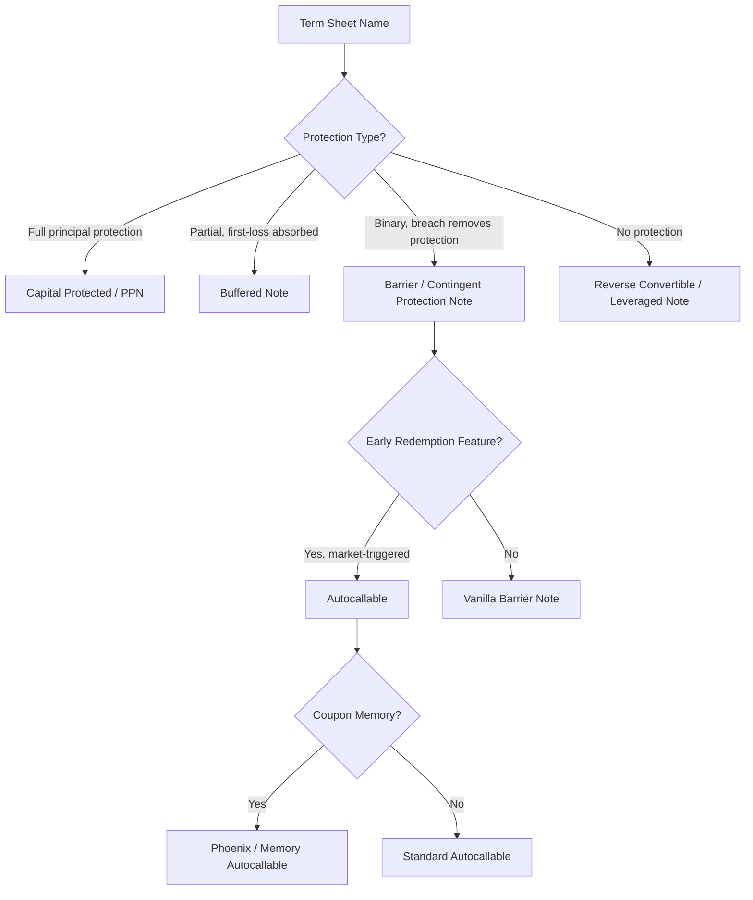

## Structured Product Naming Conventions

### Overview

Structured product naming conventions provide a compressed, semi-standardized shorthand for encoding a note's underlying, payoff mechanics, protection level, and term. There is no single global naming authority — conventions vary by desk, issuer, jurisdiction, and product taxonomy body — but recurring patterns exist across sell-side documentation, ISDA-linked term sheets, and industry classifications (e.g., EUSIPA/SVSP maps used in Europe).

### Why Naming Conventions Exist

- Term sheets and marketing materials need a fast way to signal payoff type before an investor reads the full mechanics
- Regulatory/industry bodies (EUSIPA in Europe, SVSP in Switzerland, structured products associations elsewhere) publish standardized product maps to improve comparability across issuers
- Internal trading desks use naming shorthand in risk systems and booking models to tag payoff families for aggregation and Greeks reporting

### Core Naming Components

Most structured product names are built from a combination of:

1. **Protection level** — Capital Protected, Buffered, Contingent Protection, Barrier, Unprotected/Leveraged
2. **Participation mechanic** — Participation, Leveraged, Digital, Autocall, Reverse Convertible
3. **Payoff shape modifier** — Cap, Floor, Knock-in/Knock-out, Worst-of/Best-of
4. **Underlying reference** — Single stock, Index, Basket, Rates, FX, Commodity
5. **Coupon style** — Fixed Coupon, Contingent Coupon, Memory Coupon, Snowball

**Example:**

"Autocallable Contingent Coupon Barrier Note, Worst-of, 3Y" decodes as:

- Autocallable → early redemption feature tied to observation dates
- Contingent Coupon → coupon paid only if a condition is met (barrier)
- Barrier → downside protection type (as opposed to buffer)
- Worst-of → payoff references the worst-performing of a basket
- 3Y → tenor

### Common Product Families and Their Names

| Family | Typical Name Variants | Core Mechanic |
| --- | --- | --- |
| Capital Protected | Principal Protected Note (PPN), Capital Guaranteed Note | Bond floor + upside participation, principal returned at maturity subject to issuer credit |
| Buffered | Buffered Note, Buffer PLUS Note | Absorbs first X% of loss (buffer), then 1:1 loss beyond |
| Barrier / Contingent Protection | Contingent Protection Note, Barrier Note | Protection removed entirely if barrier is breached (binary, not partial) |
| Reverse Convertible | Reverse Convertible Note (RCN), Yield Enhancement Note | High coupon, principal at risk based on underlying's decline; economically short a put |
| Autocallable | Autocallable, Phoenix Autocallable, Snowball | Early redemption if underlying is above a trigger on observation dates |
| Digital/Binary | Digital Note, Range Accrual Note | Fixed payout if condition met, zero (or reduced) otherwise |
| Leveraged/Participation | Leveraged Note, Booster, Turbo | Amplified (>100%) participation in underlying performance, often capped |

### EUSIPA/SVSP-Style Classification Codes

European and Swiss markets use standardized numeric/alpha codes for product categorization, improving cross-issuer comparability:

- **Capital Protection**: 1100 series (e.g., Capital Protection with Participation)
- **Yield Enhancement**: 1200 series (e.g., Discount Certificates, Reverse Convertibles)
- **Participation**: 1300 series (e.g., Tracker Certificates, Outperformance Certificates)
- **Leverage**: 2100/2200 series (e.g., Warrants, Knock-out Products)

[Unverified] Exact code numbers and category boundaries are periodically revised by EUSIPA; practitioners should confirm current mappings against the live EUSIPA/SVSP derivative map rather than relying on a fixed historical numbering, since taxonomy versions have changed over time.

### Decoding a Real-World-Style Name

**Example:** "5Y USD Phoenix Autocallable Worst-of Contingent Coupon Note linked to a Basket of 3 Indices, 30% Barrier, 70% Coupon Trigger"

Breakdown:

- **5Y USD**: Tenor and settlement currency
- **Phoenix**: Sub-type of autocallable where missed coupons can be "remembered" and paid later if conditions are subsequently met (memory coupon feature)
- **Autocallable**: Early redemption mechanic
- **Worst-of**: Payoff driven by the worst-performing underlying in the basket
- **Contingent Coupon**: Coupon paid only if coupon barrier condition holds
- **Basket of 3 Indices**: Underlying reference assets
- **30% Barrier**: Capital-at-risk threshold (principal protection lost if worst-of underlying closes below 70% of initial, i.e., down more than 30%)
- **70% Coupon Trigger**: Level underlying must stay above to trigger coupon payment

### Naming Ambiguities and Pitfalls

**Key Points**

- "Buffer" and "Barrier" are frequently confused but are mechanically distinct: buffer absorbs a fixed percentage of loss and then transfers 1:1 loss beyond that; barrier is often a binary breach event that removes protection entirely
- "Protected" in a name does not always mean 100% principal protection — always verify protection percentage and whether protection is contingent on issuer credit survival, not sovereign or deposit-insurance backed
- "Autocallable" and "Callable" are different: autocall is automatically triggered by market observation, while callable/issuer call is at issuer's discretion
- Marketing names (e.g., "Booster," "Turbo," "Phoenix," "Snowball") are not standardized across issuers — the same marketing term can describe different mechanics at different banks, so the term sheet's payoff formula is authoritative, not the product name

### Naming Convention Decision Flow

### Jurisdictional Variation

- **US**: Names often driven by issuer marketing (e.g., "Accelerated Return Notes," "Trigger PLUS," "Absolute Return Barrier Notes") with less standardized taxonomy; SEC/FINRA disclosure focuses on plain-English payoff description rather than mandated naming
- **Europe**: EUSIPA classification map widely used; issuer marketing name typically paired with EUSIPA code for regulatory comparability
- **Switzerland**: SVSP map (predecessor/parallel to EUSIPA) historically dominant, largely harmonized with EUSIPA categories
- **Asia (notably structured deposits/notes in HK, SG)**: Often named descriptively per local regulator disclosure templates (e.g., MAS, SFC), with less reliance on pan-regional standardized codes

### Practical Implications for Analysis

- Never infer payoff mechanics from the marketing name alone — always cross-reference the term sheet's payoff formula and defined terms section
- When comparing products across issuers, map each to its EUSIPA/SVSP category (where applicable) to normalize for naming inconsistency
- Distinguish "protection," "buffer," and "barrier" precisely, as they carry materially different loss profiles at the same headline coupon
- Treat proprietary marketing names (Booster, Phoenix, Snowball, etc.) as issuer-specific branding, not a mechanical specification

### Related Topics

- EUSIPA/SVSP derivative map and classification codes
- Barrier vs. buffer payoff mechanics
- Autocallable and Phoenix structure design
- Term sheet defined terms and payoff formula conventions
- Reverse convertible note structuring
- Regulatory disclosure standards (FINRA 12-03, PRIIPs KID, MAS/SFC templates)