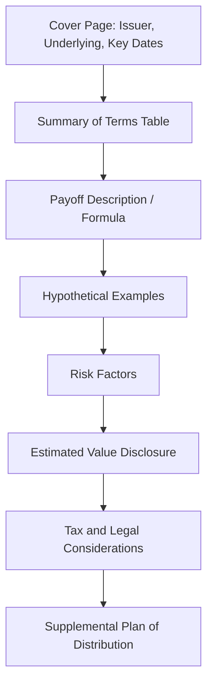

## Term Sheet Anatomy and Key Terms

### Overview

A structured product term sheet is the primary legal and commercial document defining a note's payoff mechanics, dates, parties, and risk disclosures prior to (and as part of) the final pricing supplement/prospectus. It functions as the authoritative reference for how the payoff formula operates, superseding any marketing name or summary description. Understanding term sheet anatomy is foundational to accurately pricing, hedging, or evaluating any structured note.

### Document Hierarchy

Structured note documentation typically layers as follows:

1. **Base Prospectus** — Issuer's shelf registration, covers general terms for all notes issued under the program
2. **Prospectus Supplement / Product Supplement** — Standardized terms for a note family/type (e.g., all autocallable notes)
3. **Pricing Supplement / Final Term Sheet** — Deal-specific terms fixed at trade date (strike, barrier levels, coupon rate, dates)
4. **Preliminary Term Sheet (Pre-Pricing)** — Indicative terms circulated before final pricing, often with ranges instead of fixed values

[Inference] The exact naming and number of layers varies by jurisdiction and issuer; US SEC-registered programs commonly use the base/product/pricing supplement structure described above, while other markets may consolidate these into fewer documents.

### Core Sections of a Term Sheet

**Key Points**

- **Issuer and Guarantor**: Legal entity issuing the note and any parent guarantee — determines credit risk exposure
- **Underlying(s)**: Reference asset(s) — single stock, index, basket, rate, FX pair, commodity — with exact identifiers (ticker, exchange, index sponsor)
- **Trade Date / Pricing Date**: Date on which final terms (strike, barrier, coupon) are fixed
- **Settlement Date / Issue Date**: Date proceeds are exchanged and the note is issued
- **Maturity Date**: Final scheduled redemption date, subject to early redemption features
- **Denomination**: Minimum investment unit (e.g., $1,000 per note)
- **Initial Level / Strike**: Reference price of the underlying(s) as of trade date, against which performance is measured

### Payoff-Defining Terms

- **Participation Rate**: Multiplier applied to underlying performance for upside calculation (e.g., 150% participation means 1.5x the index return, subject to cap)
- **Cap Level / Maximum Return**: Ceiling on investor upside, expressed as a percentage or fixed maximum payment
- **Barrier Level**: Threshold (often expressed as % of initial level) that triggers a change in payoff outcome — critically, must specify **American** (continuously monitored) vs. **European** (observed only at maturity) barrier style
- **Buffer Level**: Percentage of downside absorbed by the issuer before investor losses begin
- **Coupon Barrier / Trigger**: Level the underlying must maintain (often on observation dates) for a contingent coupon to be paid
- **Autocall Trigger / Call Level**: Level at or above which the note redeems early on an observation date, typically paying par plus accrued coupon
- **Observation Dates**: Specific dates on which barrier, coupon, or autocall conditions are tested
- **Memory Feature**: Whether missed coupons accrue and can be paid later if a subsequent observation date satisfies the trigger

### Worst-of / Best-of and Basket Mechanics

For multi-asset underlyings, the term sheet must specify:

- **Basket Composition**: Named constituents and their weights (if weighted) or worst-of/best-of selection rule
- **Correlation Sensitivity Disclosure**: Often a qualitative risk factor statement rather than a quantified figure, since worst-of payoffs are highly sensitive to underlying correlation
- **Rebalancing (if any)**: Whether basket weights are fixed at trade date or dynamically rebalanced

### Example Term Sheet Excerpt (Illustrative, Not a Real Issuance)

| Term | Value |
| --- | --- |
| Issuer | [Hypothetical Bank] |
| Underlying | Worst-of: Index A, Index B, Index C |
| Trade Date | Month/Year |
| Maturity | 3 Years from Trade Date |
| Autocall Observation | Quarterly, starting Month 12 |
| Autocall Trigger | 100% of Initial Level |
| Coupon (per period, if triggered) | 2.00% |
| Coupon Barrier | 70% of Initial Level |
| Downside Barrier (at maturity) | 60% of Initial Level, European (observed only at maturity) |
| Principal at Risk | Yes, 1:1 below 60% barrier if not autocalled |

### Risk Factors and Disclosure Sections

- **Credit Risk of Issuer**: Explicit statement that payments depend on issuer's ability to pay — the note is unsecured debt, not deposit-insured
- **Liquidity Risk**: Disclosure that secondary market, if any, is generally made by the issuer/affiliate at their discretion and bid price may be below fair value
- **Estimated Value vs. Offer Price**: Disclosed gap representing embedded fees, structuring margin, and funding spread (see related coverage on issuer economics)
- **Tax Treatment**: Often a summary reference to prevailing tax opinion (e.g., open transaction, contingent payment debt instrument treatment in the US), with a caveat that tax treatment is uncertain and subject to change
- **Hypothetical Payoff Examples**: Required in most jurisdictions — worked numerical scenarios showing best/base/worst case outcomes

### Anatomy Flow of a Term Sheet Read-Through

### Common Pitfalls When Reading Term Sheets

**Key Points**

- Confusing barrier observation style (American vs. European) materially changes risk — a continuously monitored barrier is far more likely to be breached than one observed only at maturity, all else equal
- Overlooking whether the coupon barrier and the principal-protection barrier are set at different levels (common in Phoenix-style notes) — a missed coupon does not necessarily mean principal is at risk
- Assuming "Participation Rate" applies unconditionally — many notes cap upside regardless of stated participation rate
- Treating the preliminary term sheet's indicative ranges as final — always confirm against the final pricing supplement dated on/after trade date
- Ignoring the definition of "Initial Level" methodology (e.g., closing price vs. VWAP vs. average over a strike-setting period), which affects strike-setting risk

### Practical Implications for Analysis

- Always locate and read the payoff formula section verbatim rather than relying on the summary table, since summary tables can omit conditional nuances (e.g., memory features, worst-of selection)
- Cross-check barrier/coupon/autocall levels against their respective observation date schedules — mismatched date assumptions are a common source of mispricing in independent valuation
- For basket/worst-of products, confirm whether correlation assumptions are disclosed or must be sourced independently for valuation purposes
- Distinguish between issuer credit risk disclosure and market/underlying risk disclosure — both are typically present but govern different loss scenarios

### Related Topics

- Barrier style (American vs. European) and its pricing impact
- Autocallable and Phoenix payoff mechanics
- Estimated value disclosure and issuer economics
- Worst-of basket correlation risk
- Tax treatment of structured notes (contingent payment debt instruments)
- Secondary market liquidity and issuer bid-back practices