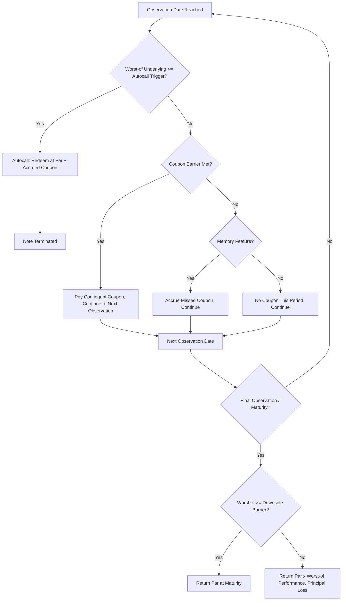

## Autocallable Notes and Trigger Mechanics

### Overview

Autocallable notes are structured products that redeem early — automatically — if the underlying asset (or the worst-performing asset in a basket) meets or exceeds a predefined trigger level on a scheduled observation date. The "auto" in autocallable refers to the mechanical, non-discretionary nature of the redemption: unlike issuer-callable bonds, there is no issuer decision involved; the trigger event alone forces redemption per the term sheet formula.

### Core Mechanics

An autocallable note combines:

1. A series of **observation dates** (monthly, quarterly, semi-annual)
2. An **autocall trigger level**, typically set at or near 100% of the initial level (though step-down structures reduce this over time)
3. A **coupon** (fixed or contingent) paid if the note autocalls or if a separate coupon barrier condition is met
4. A **downside barrier**, active if the note survives to maturity without autocalling

$$\text{Payoff at Observation } t = \begin{cases} \text{Par} + \text{Accrued Coupon} & \text{if } S_t \geq K_{\text{autocall}} \\ \text{Continue to next observation} & \text{if } S_t < K_{\text{autocall}} \end{cases}$$

If the note survives to maturity without autocalling, a separate terminal payoff formula applies, typically referencing the downside barrier.

### Trigger Level Structures

- **Flat Trigger**: Autocall level fixed at 100% of initial level for all observation dates
- **Step-Down Trigger**: Autocall level declines over time (e.g., 100% → 95% → 90% → 85%), increasing the probability of early redemption as the note ages — common in "Snowball" style structures
- **Step-Up Trigger**: Less common; autocall level increases over time

**Example:**

A 3-year quarterly-observed autocallable with a step-down trigger might have:

| Observation | Autocall Level (% of Initial) |
| --- | --- |
| Month 3 | 100% |
| Month 6 | 97.5% |
| Month 9 | 95% |
| Month 12 | 92.5% |
| ... | ... continuing down |
| Month 36 (Maturity) | 80% |

### Coupon Mechanics

Coupons in autocallable structures are typically one of:

- **Fixed Coupon on Autocall**: Coupon paid only upon early redemption or maturity, accrued from issue date
- **Contingent Coupon (Phoenix-style)**: Coupon paid on each observation date independently of autocall, conditional on underlying being above a (often lower) coupon barrier — decoupled from the autocall trigger
- **Memory Coupon**: Missed coupon payments accrue and are paid retroactively if a later observation date satisfies the coupon condition

**Key Points**

- Coupon barrier and autocall barrier are frequently set at different levels — a common structure has autocall at 100% and coupon barrier at 60–70%, meaning coupons can be earned even when the note does not autocall
- Memory features materially increase the expected coupon stream and are priced into the embedded option cost — they are not "free" optionality for the investor

### Terminal (Maturity) Payoff if Not Autocalled

If the note survives all observation dates without triggering autocall, the maturity payoff typically depends on a downside barrier:

$$\text{Maturity Payoff} = \begin{cases} \text{Par} & \text{if } S_T \geq B \\ \text{Par} \times \frac{S_T}{S_0} & \text{if } S_T < B \text{ (barrier breached)} \end{cases}$$

Where $B$ is the downside barrier level and the breach determination depends on barrier style (American — continuously monitored — vs. European — observed only at maturity).

### Worst-of Basket Autocallables

Most retail-distributed autocallables reference a basket of 2–5 underlyings with a **worst-of** selection rule:

- Autocall triggers only if **all** underlyings are at or above the trigger level (equivalently, the worst performer must clear the bar)
- Coupon barrier similarly requires the worst performer to clear the coupon threshold
- Terminal payoff at maturity, if barrier breached, is based on the **worst-performing** underlying's return, not a basket average

[Inference] Because worst-of payoffs are highly sensitive to the correlation between underlyings, lower correlation (more diversified basket) generally increases the embedded option value the issuer can extract, which is why worst-of baskets often carry meaningfully higher headline coupons than single-stock equivalents — but this correlation sensitivity is a structural property of the option pricing model, not a universal rule for every basket composition.

### Autocall Probability and Pricing Intuition

- Autocall probability is driven by the underlying's volatility, the trigger level relative to spot, the observation frequency, and (for baskets) the correlation structure
- Higher volatility increases both the probability of early autocall (if trending flat/up) and the probability of breaching the downside barrier (if trending down) — autocallables are a bet on realized volatility staying within a "sweet spot" range relative to trigger and barrier levels
- Step-down triggers increase the probability of earlier redemption, which reduces the note's average duration and total potential coupon accrual, and correspondingly affects the coupon rate the issuer can offer at a given target economics

### Trigger Mechanics Flow

### Risk Considerations

- **Reinvestment Risk**: Early autocall returns capital sooner than expected, forcing reinvestment at potentially lower prevailing rates — a key risk for investors targeting a specific yield/duration
- **Path Dependency**: Terminal payoff (if not autocalled) can depend on whether the barrier style is American, making interim price action relevant even if the underlying recovers by maturity
- **Correlation Risk in Baskets**: A single weak performer in a worst-of basket can trigger principal loss even if other underlyings perform well
- **Volatility Regime Sensitivity**: Autocallables sold in low-volatility environments may carry embedded option costs that reprice unfavorably if volatility spikes before the first observation date, affecting secondary market value (not the contractual payoff itself)

### Practical Implications for Analysis

- When comparing autocallable notes, normalize for observation frequency, trigger structure (flat vs. step-down), and barrier style before comparing headline coupon rates
- For worst-of baskets, evaluate historical and implied correlation among constituents, since lower correlation baskets can justify higher coupons independent of individual underlying quality
- Distinguish coupon barrier from principal barrier explicitly — a "high coupon" headline can mask a low coupon barrier that is easily breached, or a wide gap between coupon and principal barriers
- Model expected note duration (accounting for autocall probability at each observation) rather than assuming full-term duration, since actual realized yield depends heavily on when (if) autocall occurs

### Related Topics

- Barrier style (American vs. European) and path-dependency in payoff valuation
- Worst-of basket correlation risk and pricing sensitivity
- Phoenix / memory coupon structuring
- Volatility surface construction for autocallable pricing (local vol, stochastic vol considerations)
- Term sheet anatomy and key terms
- Reverse convertible notes as a single-observation-date special case