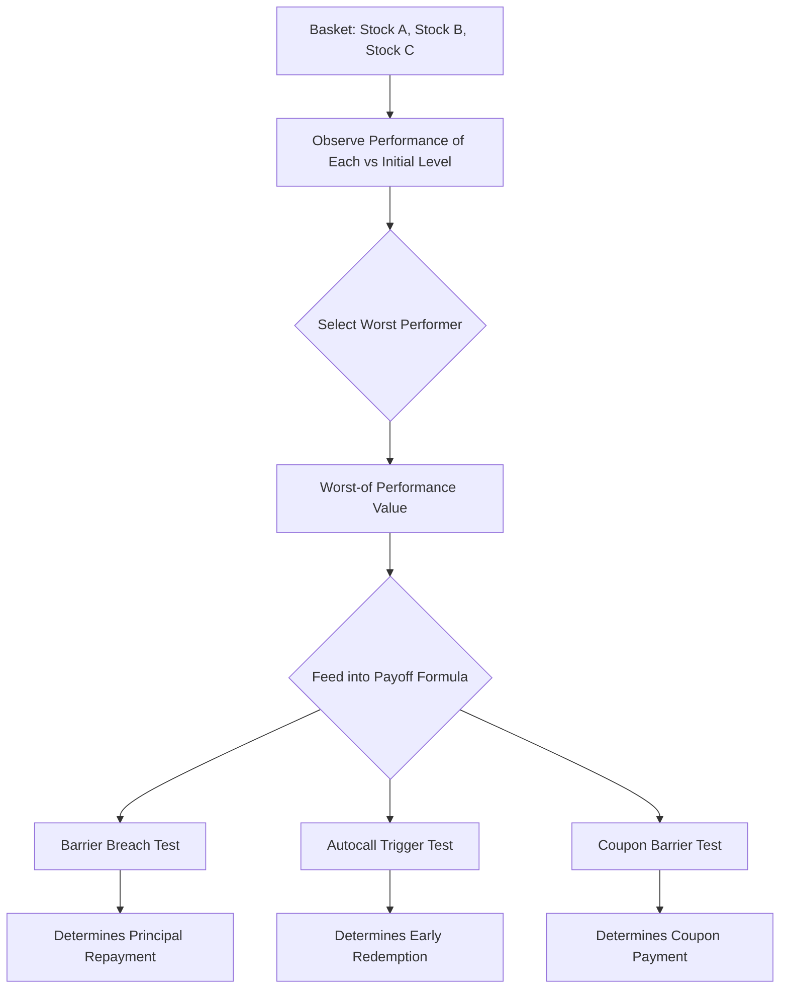

## Worst Of and Best Of Basket Notes

### Overview

Worst-of and best-of basket notes are structured products referencing multiple underlyings where the payoff is determined not by an average or weighted blend, but by the single **worst-performing** or **best-performing** constituent in the basket. This selection mechanic is a defining structural feature that materially changes both the risk profile and the option-pricing economics relative to single-underlying or basket-average products, primarily through sensitivity to **correlation** among the constituents.

### Core Mechanics

**Worst-of structure**: The payoff-determining performance is:

$$\text{Perf}_{\text{worst-of}} = \min\left(\frac{S_1(T)}{S_1(0)}, \frac{S_2(T)}{S_2(0)}, \ldots, \frac{S_n(T)}{S_n(0)}\right)$$

**Best-of structure**: The payoff-determining performance is:

$$\text{Perf}_{\text{best-of}} = \max\left(\frac{S_1(T)}{S_1(0)}, \frac{S_2(T)}{S_2(0)}, \ldots, \frac{S_n(T)}{S_n(0)}\right)$$

Where each $\frac{S_i(T)}{S_i(0)}$ represents the normalized performance of constituent $i$ from initial level to the relevant observation date. This selected performance figure then feeds into whatever payoff formula the note employs (barrier breach test, autocall trigger test, participation calculation, etc.).

**Key Points**

- Worst-of structures are overwhelmingly more common in retail/institutional distribution than best-of, because the worst-of selection allows issuers to offer materially higher headline coupons or lower barriers for a given target cost — the worst-of condition is harder to satisfy for the investor, so the issuer can compensate with richer headline terms
- Best-of structures are typically used for upside participation notes (investor benefits from the best performer), and are structurally more expensive for the issuer to hedge, generally resulting in lower headline participation or caps than a comparable single-stock note

### Why Worst-of Baskets Offer Higher Coupons

The core driver is correlation. A worst-of basket is economically equivalent to the issuer being long a basket of individual put options and short the minimum-of-basket option to the investor — more precisely, the note embeds a short position (from the investor's perspective) in a **rainbow option** on the minimum of the basket.

$$\text{Rainbow Put Value} > \max(\text{Individual Put Values})$$

Because the probability that *at least one* constituent breaches a barrier is always greater than or equal to the probability that *a single* constituent breaches it, a worst-of basket carries a structurally higher probability of adverse outcomes than any single underlying alone. This elevated risk is compensated with a higher coupon.

**Correlation relationship:**

- **Lower correlation** between constituents → **higher** probability that at least one underlying is weak → **higher** rainbow option value → **higher** achievable coupon for the same barrier level (or lower barrier for the same coupon)
- **Higher correlation** between constituents → constituents tend to move together → worst-of behaves more like a single-asset note → **lower** rainbow option value → **lower** achievable coupon

[Inference] This inverse relationship between correlation and worst-of option value is a standard result in multi-asset option pricing theory; the precise magnitude of the effect for any specific basket depends on the volatility of each constituent and the correlation matrix used, which is why desks rely on model-implied or historical correlation estimates that can vary meaningfully by data source and estimation window.

### Worked Example — Worst-of Barrier Impact

Consider a 1-year note where each individual underlying, priced standalone, would support an 80% barrier for a given coupon target. Adding correlation-dependent worst-of selection across 3 underlyings might require:

| Basket Correlation (avg pairwise) | Approximate Equivalent Worst-of Barrier for Same Coupon |
| --- | --- |
| 0.90 (highly correlated, e.g., sector peers) | ~75-78% |
| 0.60 (moderate correlation, e.g., cross-sector large caps) | ~68-72% |
| 0.30 (low correlation, e.g., cross-asset-class) | ~60-65% |

[Speculation] The specific barrier percentages above are illustrative approximations to demonstrate directional sensitivity, not derived from a specific priced model run — actual barrier/coupon trade-offs depend on the volatility surface, dividend assumptions, rates, and correlation inputs used by the pricing desk for the specific underlyings involved.

### Sector and Asset-Class Selection Effects

Issuers and structuring desks often select basket constituents specifically to manage correlation:

- **Same-sector baskets** (e.g., three technology stocks): High correlation, worst-of penalty is smaller, but basket offers less true diversification benefit to the issuer's hedge
- **Cross-sector baskets** (e.g., tech + healthcare + financials): Lower correlation, worst-of penalty is larger, enabling higher headline coupons — commonly used specifically to maximize marketed coupon rates
- **Cross-asset baskets** (e.g., equity index + commodity + FX): Typically the lowest correlation, used in more sophisticated or institutional structures

### Diagram: Worst-of Selection Mechanic

### Correlation Risk from the Investor's Perspective

**Key Points**

- A worst-of note can suffer principal loss even when the **majority** of the basket performs well — a single weak constituent drives the outcome
- Investors sometimes misjudge worst-of risk by focusing on the average or "typical" expected performance of the basket rather than the minimum, which is the actual payoff driver
- Diversification, which normally reduces risk in a portfolio context, has the **opposite effect** on a worst-of note's embedded option cost — more diversified (lower correlated) baskets increase, not decrease, the probability of a barrier breach
- Correlation is not static — historical correlation can diverge from realized correlation during the note's life, particularly during market stress when correlations across risk assets tend to rise (a phenomenon sometimes referred to as "correlation breakdown" or "correlation convergence in crises"), which can work either for or against the investor depending on structure

### Best-of Structures — Typical Use Cases

- **Best-of participation notes**: Investor receives upside participation based on the best-performing constituent, useful for expressing a view that at least one of several assets/sectors/regions will outperform without needing to pick which one in advance
- **Best-of principal-protected notes**: Capital protection combined with upside tied to the best performer, appealing to investors seeking diversified upside optionality with downside protection

Best-of structures are priced as the mirror image of worst-of: higher correlation between constituents reduces the value of the best-of option (since a high-correlation basket makes any one constituent being the standout performer less differentiated from the others), while lower correlation increases the best-of option's value — but because the issuer is *selling* this valuable optionality to the investor (rather than the investor selling a put to the issuer, as in worst-of), lower correlation makes best-of structures **more expensive to the issuer to hedge**, which is passed through as lower participation/cap for the investor.

### Comparative Summary

| Aspect | Worst-of | Best-of |
| --- | --- | --- |
| Typical use | Coupon/barrier notes (yield enhancement) | Participation notes (upside capture) |
| Investor position (embedded option) | Effectively short a rainbow put (min) | Long a rainbow call (max) — but capped/participation-limited by issuer pricing |
| Effect of lower correlation | Increases issuer's option value → higher coupon offered | Increases cost of note → lower participation/cap offered |
| Effect of higher correlation | Decreases issuer's option value → lower coupon offered | Decreases cost of note → higher participation/cap offered |
| Common basket composition | Cross-sector, deliberately lower-correlated | Varies; sometimes higher-correlated to keep cost down |

### Practical Implications for Analysis

- Before comparing worst-of note coupons across issuers, evaluate the basket's constituent correlation — a high coupon on a low-correlation cross-sector basket may reflect appropriately higher embedded risk, not superior structuring
- Use historical and implied correlation data (where available) as a sanity check against the term sheet's stated barrier/coupon combination
- For worst-of notes, focus risk analysis on the weakest plausible constituent scenario, not basket-average scenarios
- Recognize that correlation assumptions used in issuer pricing models are rarely disclosed precisely in term sheets — treat published barrier/coupon combinations as reflecting the issuer's correlation view, which may differ from independent estimates

### Related Topics

- Autocallable notes and trigger mechanics (frequently worst-of structured)
- Barrier reverse convertibles on baskets
- Correlation risk and rainbow option pricing
- Volatility surface and skew effects on multi-asset payoffs
- Basket composition and sector/asset-class selection in structuring
- Correlation breakdown during market stress and its impact on structured note risk