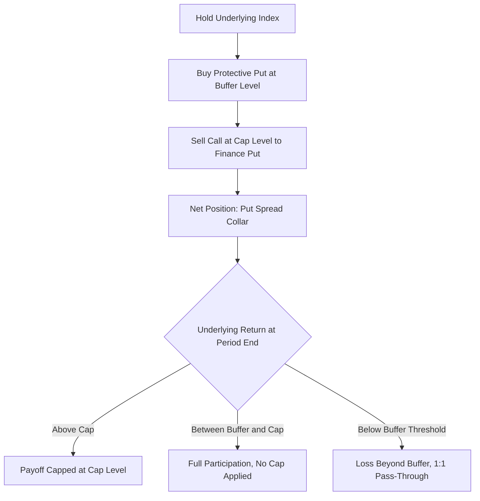

## Buffer and Defined Outcome Notes

### Overview

Buffer notes and defined outcome notes (also marketed as "Defined Outcome ETFs" in the US listed-fund context, or "Buffer Notes"/"Structured Outcome Notes" in bank-issued form) are structured products that pre-define a range of outcomes at issuance: a known buffer against losses, a capped upside, and a fixed tenor. Unlike barrier products, where protection is binary (all-or-nothing based on a breach event), buffer notes absorb a **specified percentage of loss** before investor losses begin, after which losses accrue 1:1 (or at a defined multiple) beyond the buffer. This section covers both bank-issued buffer notes and the closely related defined outcome fund structure.

### Core Mechanics — Buffer Note

$$\text{Maturity Payoff} = \begin{cases} \text{Par} \times \min\left(1 + \text{Participation} \times \frac{S_T - S_0}{S_0}, \, 1 + \text{Cap}\right) & \text{if } S_T \geq S_0 \\ \text{Par} & \text{if } S_0 \times (1 - \text{Buffer}) \leq S_T < S_0 \\ \text{Par} \times \left(1 - \left(\text{Buffer} - \frac{S_0 - S_T}{S_0}\right)\right) & \text{if } S_T < S_0 \times (1 - \text{Buffer}) \end{cases}$$

In plain terms:

- If the underlying is flat or up, investor participates in gains up to a cap
- If the underlying is down but the decline is **within** the buffer percentage, investor receives full par (no loss)
- If the underlying decline **exceeds** the buffer, investor bears losses 1:1 beyond the buffer threshold — the buffer is subtracted from the loss, not applied as a floor

**Key distinguishing feature vs. barrier notes**: A buffer **always** absorbs the stated percentage of loss regardless of how far the underlying falls — there is no "breach" event that removes protection entirely. This is fundamentally different from a barrier note, where breaching the barrier eliminates protection for the *entire* decline, not just the portion beyond the barrier.

### Worked Example — Buffer Mechanics

A 1-year note with a 10% buffer, 100% upside participation, and an 8% cap:

| Underlying Return | Buffer Note Payoff | Explanation |
| --- | --- | --- |
| +15% | +8% (capped) | Upside capped at 8% |
| +5% | +5% | Full participation up to cap |
| 0% | 0% (par) | Flat |
| -8% | 0% (par) | Loss fully absorbed by 10% buffer |
| -10% | 0% (par) | Loss exactly equals buffer, fully absorbed |
| -25% | -15% | 25% decline minus 10% buffer = 15% loss passed through |
| -50% | -40% | 50% decline minus 10% buffer = 40% loss passed through |

**Key Points**

- Buffer notes provide **partial** protection across the entire loss spectrum beyond the buffer, unlike barriers which are binary
- The buffer percentage, participation rate, and cap are interdependent — increasing the buffer (more protection) generally requires reducing the cap or participation rate to keep the note's cost neutral for the issuer at par issuance
- Some variants use a **geared buffer** or "buffer with leverage," where losses beyond the buffer are multiplied (e.g., 1.5x) rather than 1:1, which is a materially different and riskier structure that must be checked explicitly in the term sheet

### Buffer vs. Floor — A Critical Distinction

- **Buffer**: Absorbs the *first* X% of loss; losses beyond X% pass through to the investor (uncapped downside beyond the buffer, subject to zero floor at total loss)
- **Floor**: Caps the *maximum* loss at X%, regardless of how far the underlying declines (the investor's downside is limited to the floor percentage, no matter how severe the underlying's decline)

These are frequently confused in casual usage but represent opposite risk profiles at the extremes:

\text{Buffer (10%) at -50% underlying decline} \Rightarrow \text{-40% investor loss (uncapped downside beyond buffer)}
\text{Floor (10%) at -50% underlying decline} \Rightarrow \text{-10% investor loss (capped, floor holds)}

[Inference] Floor structures are generally more expensive to manufacture than buffer structures at the same headline percentage, because a floor requires the issuer to hedge against unlimited downside beyond the floor level (effectively buying a deep out-of-the-money put spread that caps issuer exposure), whereas a buffer only requires absorbing a fixed-width loss layer — this cost difference is why buffer structures are more commonly used in the defined outcome fund space than true floors.

### Defined Outcome Funds (Listed ETF Wrapper)

Since approximately 2018, US-listed "Defined Outcome" or "Buffer ETFs" have packaged similar buffer mechanics into an exchange-traded fund wrapper, typically constructed using a laddered options overlay (FLEX options on an index) rather than issuer credit-linked note economics:

- **Underlying replication**: Fund holds the reference index (or index-tracking instrument) plus/minus an options collar
- **Options overlay construction**: Typically built from a combination of a long call (financing upside up to cap), a long put (providing the buffer), and a short call (funding the long put via cap sacrifice) — collectively a "put spread collar"
- **Outcome period**: Usually 1 year, reset annually; buffer and cap levels reset at the start of each new outcome period based on prevailing options pricing
- **No issuer credit risk**: Unlike bank-issued buffer notes, defined outcome ETFs do not carry issuer default risk in the same way, since the fund holds actual option contracts (subject to counterparty/clearing risk on those FLEX options) rather than being an unsecured note obligation of a single issuer

**Key Points**

- Cap levels on defined outcome ETFs fluctuate with each new outcome period based on prevailing implied volatility — higher volatility generally compresses the cap (since options become more expensive, funding a smaller cap for the same buffer)
- Investors who buy mid-outcome-period (not at the start) do not receive the originally stated buffer/cap relative to their purchase price — the fund's actual buffer/cap only applies precisely to an investor who buys at the start of the outcome period and holds to its end
- These products are functionally similar in payoff shape to bank-issued buffer notes but differ meaningfully in wrapper (fund vs. note), credit risk profile, and pricing reset mechanics

### Options Collar Construction Diagram

### Buffer Payoff Diagram (svg_diagram)

<svg xmlns="http://www.w3.org/2000/svg" viewBox="0 0 700 400">
\<style\>
.axis { stroke: #333; stroke-width: 1.5; }
.line1 { stroke: #8e44ad; stroke-width: 2.5; fill: none; }
.line2 { stroke: #999; stroke-width: 1.5; stroke-dasharray: 4,4; fill: none; }
.lbl { font-family: sans-serif; font-size: 12px; fill: #333; }
.title { font-family: sans-serif; font-size: 14px; font-weight: bold; fill: #111; }
\</style\>
<text x="20" y="20" class="title">Buffer Note Payoff at Maturity (svg_diagram)</text>
<line x1="60" y1="340" x2="640" y2="340" class="axis" />
<line x1="350" y1="340" x2="350" y2="40" class="axis" />
<text x="280" y="375" class="lbl">Underlying Return</text>
<line x1="350" y1="60" x2="440" y2="60" class="line1" />
<text x="450" y="65" class="lbl" fill="#8e44ad">Capped upside</text>
<line x1="440" y1="60" x2="520" y2="60" class="line1" />
<line x1="260" y1="180" x2="440" y2="180" class="line1" />
<text x="130" y="200" class="lbl" fill="#8e44ad">Buffer zone: par preserved</text>
<line x1="60" y1="300" x2="260" y2="180" class="line1" />
<text x="65" y="290" class="lbl" fill="#8e44ad">1:1 loss beyond buffer</text>
<line x1="260" y1="40" x2="260" y2="360" class="line2" />
<text x="200" y="378" class="lbl">Buffer threshold</text>
<text x="330" y="378" class="lbl">Initial</text>
</svg>

### Comparative Summary: Buffer vs. Barrier vs. Floor

| Structure | Protection Mechanic | Downside Beyond Threshold | Typical Wrapper |
| --- | --- | --- | --- |
| Buffer Note | Absorbs first X% of loss | 1:1 pass-through beyond buffer | Bank-issued note |
| Barrier Note | Binary — protection removed entirely if breached | Full decline exposure once breached | Bank-issued note |
| Floor Note | Caps maximum loss at X% | No further loss regardless of decline | Bank-issued note (less common) |
| Defined Outcome ETF | Options collar replicates buffer mechanic | 1:1 pass-through beyond buffer | Listed fund (FLEX options) |

### Risk Considerations

**Key Points**

- Buffer notes still carry uncapped downside beyond the buffer in a severe decline scenario — the buffer is a partial cushion, not a hard floor, and this is a common point of investor misunderstanding
- Upside is always capped in buffer structures — investors sacrifice tail upside in exchange for the buffer and, where applicable, enhanced participation within the capped range
- For bank-issued buffer notes, issuer credit risk applies to both the buffer benefit and any positive return — a note is only as good as the issuer's ability to pay
- For defined outcome ETFs, investors must track the specific outcome period's buffer/cap and their own entry price relative to the period start, since stated terms apply only to period-start purchasers held to period-end

### Practical Implications for Analysis

- Explicitly distinguish "buffer" from "floor" language in any term sheet — the payoff shapes are meaningfully different, especially in tail scenarios
- For defined outcome ETFs, always check the specific outcome period's cap (resets periodically) rather than relying on a fund's historical or marketed cap from a prior period
- Compare cap and participation rate trade-offs against the buffer level to assess whether the risk/reward is appropriately priced relative to current implied volatility
- For geared/leveraged buffer variants, confirm the exact multiple applied beyond the buffer threshold, as this materially changes the tail-risk profile versus a standard 1:1 buffer

### Related Topics

- Floor notes and capped-loss structuring
- Barrier reverse convertibles (binary protection contrast)
- Options collar and put spread construction
- Volatility surface and cap-level sensitivity to implied volatility
- Term sheet anatomy and key terms
- Autocallable notes and trigger mechanics