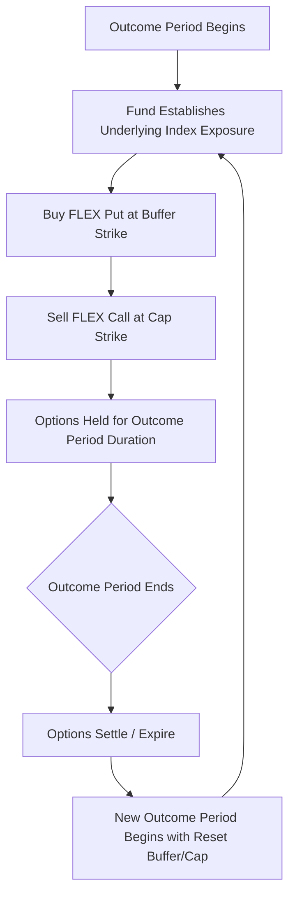

## Structured Payoffs Wrapped as Exchange Traded Funds

### Overview

Structured payoffs traditionally delivered via bank-issued notes have increasingly been packaged into exchange-traded fund (ETF) wrappers, replicating buffer, floor, capped, and even leveraged/inverse structured payoff shapes without the credit-linked note format. This category spans defined outcome (buffer) ETFs, options-based income ETFs, and leveraged/inverse ETFs — each replicating a distinct structured payoff family using exchange-listed derivatives (primarily FLEX and standard listed options) rather than issuer-specific derivative bookings.

### Why Wrap Structured Payoffs in an ETF?

- **No issuer credit risk in the traditional sense**: The fund holds actual securities and options positions rather than being an unsecured obligation of a single bank; risk shifts to fund structure, options counterparty/clearing risk, and market risk rather than issuer default risk
- **Daily liquidity and exchange listing**: Investors can buy/sell throughout the trading day at exchange-quoted prices, versus bank notes which are typically illiquid, single-issuer OTC instruments with issuer-discretionary secondary bids
- **Lower minimum investment and fractional access**: ETF shares trade at market price (often tens to low hundreds of dollars) versus note denominations often starting at $1,000+
- **Transparency**: Daily holdings disclosure (for most ETFs) versus opaque note-level derivative bookings

**Key Points**

- The trade-off for liquidity and credit-risk mitigation is that ETF-wrapped structured payoffs are typically **less customizable** — investors select from a menu of pre-set outcome periods, buffer levels, and caps rather than negotiating bespoke terms as with an OTC note
- ETF structures also introduce **path-of-entry risk** not present in single-issuance notes: an investor buying mid-outcome-period receives a different effective buffer/cap than the fund's stated terms, which apply precisely only to period-start purchasers held to period-end

### Defined Outcome (Buffer) ETFs

The most direct structured-payoff replication in ETF form. Mechanics (detailed further under the Buffer/Defined Outcome Notes topic) center on a **put spread collar** built from FLEX (Flexible Exchange) options on a reference index:

1. Fund holds the underlying index exposure (directly or via a proxy)
2. **Buys a protective put** at the buffer threshold to establish downside protection
3. **Sells a call** at the cap level to finance the protective put purchase
4. Outcome period (commonly 1, 2, 3, 6, or 12 months) resets with new options positions at each period's start, re-striking the buffer and cap based on then-prevailing implied volatility

**Key Points**

- Cap levels are **not fixed across time** — each new outcome period's cap depends on the cost of the protective put at that period's start, which fluctuates with prevailing implied volatility; higher volatility generally compresses the achievable cap for a given buffer
- Fund families in this space (well-established players include Innovator, First Trust, Allianz, and others) typically offer **laddered outcome periods** (e.g., 12 separate funds each starting a new monthly outcome period) allowing investors to select an entry point with a known buffer/cap combination going forward
- [Unverified] Specific fund providers, product line-ups, and exact fee structures change over time and vary by issuer; current fund-specific terms should be verified against the fund's own prospectus and fact sheet rather than assumed from general category knowledge, as this space has seen continued product launches and structural refinements since initial 2018-era offerings.

### Options-Income (Covered Call / Put-Write) ETFs

A related but distinct structured-payoff family replicates yield-enhancement note economics (similar to reverse convertibles) using a systematic options overlay:

- **Covered call ETFs**: Hold the underlying and systematically sell (write) call options against the position, generating premium income in exchange for capped upside — economically similar to a capped participation note
- **Put-write ETFs**: Sell cash-secured puts on an index systematically, generating premium income while bearing downside risk similar in spirit to a reverse convertible's short-put economics
- **Buffer + income combination funds**: Some newer product lines combine a partial buffer with call-writing income generation, blending defined-outcome and options-income mechanics

$$\text{Covered Call ETF Return} \approx \text{Underlying Return (capped at strike)} + \text{Option Premium Income} - \text{Fund Fees}$$

[Inference] Systematic (rules-based, non-discretionary) options overlay strategies in ETF form generally underperform the reference underlying in strong bull markets (due to capped upside from written calls) and can outperform in flat or modestly declining markets (due to premium income), consistent with the general risk/return trade-off of covered call strategies — actual realized performance depends on the specific strike selection methodology, roll frequency, and volatility regime experienced, which vary by fund and time period.

### Leveraged and Inverse ETFs (Related Structured Payoff Family)

While not "buffer" or "defined outcome" in nature, leveraged and inverse ETFs represent another category of structured payoff delivered via the ETF wrapper, using daily-reset swap and futures exposure to deliver a multiple (e.g., 2x, 3x, -1x, -2x) of an underlying index's **daily** return:

- **Daily reset mechanic**: Leverage/inverse multiples apply to daily returns, not cumulative period returns — compounding over multi-day holding periods causes returns to diverge from the simple multiple of the underlying's cumulative return, particularly in volatile or choppy markets (a phenomenon sometimes called "volatility drag" or "beta slippage")

$$\text{2-Day Return of 2x Fund} \neq 2 \times \text{2-Day Return of Underlying (in general)}$$

**Key Points**

- This compounding divergence is a structural, mathematically inherent property of daily-reset leveraged products, not a fund-specific defect — it is most pronounced in high-volatility, range-bound (non-trending) markets and least pronounced in strongly trending markets
- Leveraged/inverse ETFs are generally marketed and regulator-flagged as suitable primarily for short-term tactical use rather than long-term buy-and-hold, precisely because of this compounding effect

### Comparative Summary: ETF-Wrapped Structured Payoff Types

| ETF Category | Payoff Replicated | Primary Mechanism | Key Risk Consideration |
| --- | --- | --- | --- |
| Defined Outcome (Buffer) | Buffer note | FLEX options put spread collar | Entry timing relative to outcome period start |
| Covered Call / Options-Income | Reverse convertible-like yield enhancement | Systematic call writing | Capped upside in strong rallies |
| Put-Write | Reverse convertible-like short put economics | Systematic cash-secured put selling | Downside exposure similar to short put |
| Leveraged/Inverse | Amplified directional exposure | Daily-reset swaps/futures | Compounding/volatility drag over multi-day holds |

### Construction Flow: Defined Outcome ETF

### Risk and Structural Considerations Specific to ETF Wrappers

**Key Points**

- **FLEX options liquidity and counterparty risk**: FLEX options are exchange-listed and centrally cleared (reducing bilateral counterparty risk relative to OTC derivatives), but liquidity can be thinner than standardized listed options, potentially affecting the fund's ability to execute efficiently at scale
- **Tracking and pricing precision**: The fund's net asset value (NAV) reflects the options collar's mark-to-market value throughout the period, meaning the fund's market price during the outcome period will **not** move linearly with the underlying in the way the final buffer/cap outcome suggests — interim price behavior reflects options Greeks (delta, gamma, vega) rather than a simple point-to-point payoff
- **Expense ratios**: These funds typically carry higher expense ratios than plain-vanilla index ETFs, reflecting the cost of managing the rolling options overlay — this fee drag should be factored into any comparison against a bank-issued note's embedded issuer economics
- **Tax treatment differences**: ETF-wrapped structured payoffs may have different tax characterization (e.g., options gains/losses, potential for 1256 contract treatment on certain index options in the US) compared to a note's debt-instrument tax treatment — [Unverified] specific tax treatment depends on the exact options instruments used and prevailing tax rules, and should be confirmed against current guidance and fund-specific disclosures rather than assumed uniformly across all ETF structured-payoff products.

### Practical Implications for Analysis

- When comparing a bank-issued buffer note to a defined outcome ETF with similar headline buffer/cap terms, explicitly account for credit risk difference (issuer default risk vs. fund/options structure risk), fee drag, and entry-timing sensitivity
- For laddered defined outcome fund families, select the specific fund/outcome-period-start date matching the desired buffer/cap combination — do not assume all funds in a family share the same current terms
- For leveraged/inverse ETFs, evaluate intended holding period explicitly — these are structurally distinct from single-settlement structured notes and carry path-dependent compounding effects even absent any change in the underlying's starting-to-ending price
- Recognize that ETF NAV during an active outcome period reflects options valuation dynamics, not a linear interpolation toward the stated buffer/cap outcome — this matters for investors considering an early exit before period-end

### Related Topics

- Buffer and defined outcome notes (bank-issued note comparison)
- Options collar and put spread construction
- Covered call and put-write strategy mechanics
- Leveraged and inverse ETF compounding/volatility drag
- Volatility surface and cap-level sensitivity to implied volatility
- Issuer credit risk vs. fund/counterparty structural risk