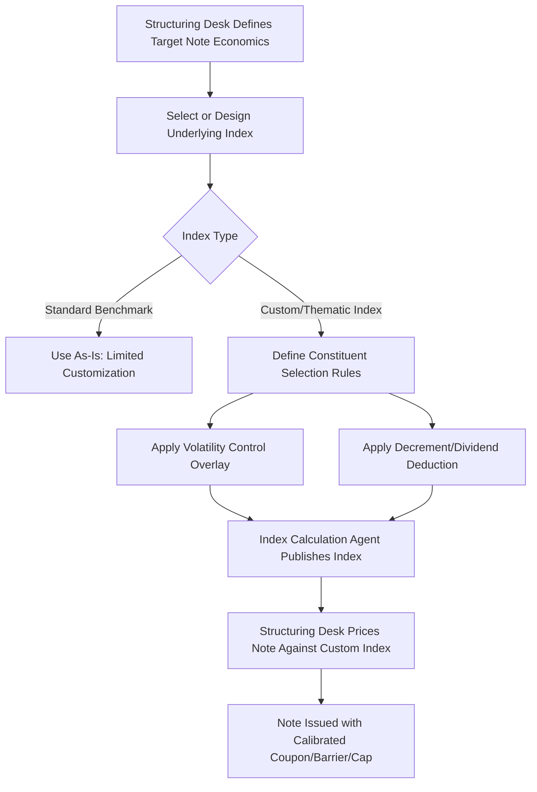

## Thematic and Custom Index Underlyings

### Overview

Thematic and custom index underlyings refer to bespoke or narrowly-focused index constructions created specifically to serve as the reference asset for a structured product, rather than using an established, widely-quoted benchmark (e.g., S&P 500, EURO STOXX 50). These indices are typically designed jointly by the issuing bank's structuring desk and an index calculation agent, often with input from the distributing party, to achieve specific volatility, correlation, or thematic exposure characteristics that improve the structured note's headline economics or marketing appeal.

### Why Issuers Use Custom Indices

- **Volatility control**: Structuring desks can calibrate a custom index's realized/implied volatility profile to hit a target coupon or barrier level that a standard benchmark index would not naturally support at the desired terms
- **Reduced hedging cost via internal mechanics**: Many custom indices embed a **volatility control (vol target) overlay** or **volatility cap mechanism**, which dynamically adjusts exposure to keep realized volatility near a target level — this can materially reduce the cost of options used to structure the note, allowing higher headline coupons or lower barriers
- **Thematic marketing appeal**: Indices branded around themes (e.g., "AI Innovation," "Clean Energy Transition," "Global Healthcare Leaders") are more marketable to retail distribution channels than a generic benchmark reference, even when the underlying constituent selection is loosely defined
- **Avoiding benchmark index licensing costs/constraints**: Custom indices avoid licensing fees and usage restrictions associated with major third-party benchmark providers

### Volatility Control (Vol Target) Mechanics

A common feature of custom indices used in structured products is a volatility control overlay:

$$\text{Index Exposure}_t = \min\left(\frac{\text{Target Volatility}}{\text{Realized Volatility}_{t-1}}, \text{Max Leverage}\right)$$

The index dynamically rebalances between the underlying risky asset(s) and a cash/deposit component to maintain realized volatility near the target level (commonly 5-15% depending on the index design).

**Key Points**

- Vol control indices tend to reduce exposure during periods of rising volatility (often coinciding with market stress/declines) and increase exposure during calm periods — this is a **backward-looking, rules-based** mechanism, not a forecast, so it can lag rapid volatility spikes
- Lower and more stable realized volatility directly reduces the cost of the options embedded in a structured note (since option premiums scale with volatility), which is precisely why vol-controlled indices enable more attractive headline note terms
- [Inference] The rebalancing mechanic means a vol-controlled index's total return can diverge meaningfully from a simple buy-and-hold exposure to the underlying risky asset, particularly over periods with significant volatility regime shifts — the exact divergence magnitude depends on the specific vol target level, lookback window used for realized volatility calculation, and rebalancing frequency, which are index-specific design parameters.

### Common Custom Index Structural Features

- **Decrement / Dividend Deduction Indices**: Deduct a fixed or variable "decrement" (synthetic dividend-like deduction) from the index level daily/periodically, which lowers the index's starting reference level and reduces the cost of embedded call options, again enabling richer headline terms
- **Excess Return vs. Total Return construction**: Custom indices frequently use excess return methodology (return net of a financing rate, typically overnight rate) rather than total return, which affects the index's baseline trajectory independent of the underlying constituents' price performance
- **Rules-based constituent selection**: Thematic indices often use algorithmic screening (e.g., revenue exposure to a theme, sector classification, market cap thresholds) rather than discretionary selection, though thresholds and methodology can vary significantly between index providers

### Decrement Index Mechanics

$$\text{Index Level}_t = \text{Index Level}_{t-1} \times \left(1 + \text{Constituent Return}_t\right) - \text{Decrement}_t$$

Where the decrement can be a fixed point deduction (e.g., 5 index points per year) or a percentage deduction (e.g., 5% per annum), applied continuously or periodically.

**Example:**

A custom index with a 5% annual decrement, tracking a basket with 8% expected annual price return, effectively presents to the option-pricing model as a much lower forward-starting trajectory — mechanically similar to a stock with an artificially elevated dividend yield. This lowers the cost of call options struck on the index, which the structuring desk passes through as a higher participation rate or lower barrier on the associated note.

**Key Points**

- A decrement index's headline "high coupon" or "attractive barrier" partly reflects this structural drag, not purely superior underlying performance expectations — investors comparing a decrement-index note against a standard-index note must account for this built-in headwind
- Decrement indices are particularly common in worst-of basket autocallables, where the decrement mechanic on each basket constituent (or the basket as a whole) is a key lever issuers use to achieve target coupon levels

### Custom Index Construction Flow

### Thematic Index Risk Considerations

**Key Points**

- **Concentration risk**: Thematic indices are often narrower than diversified benchmarks, with fewer constituents and higher concentration in specific sectors or sub-themes, increasing idiosyncratic risk relative to broad-market exposure
- **Limited track record**: Many custom/thematic indices are created specifically for a note issuance and have short or entirely backtested (simulated) historical data prior to live publication — backtested performance is not a reliable indicator of live future performance and is subject to hindsight/selection bias in constituent methodology design
- **Illiquidity of the index itself**: Unlike major benchmarks, custom indices are not independently tradeable or widely quoted outside the context of the structured products referencing them, limiting independent verification of pricing and reducing transparency for investors attempting to assess fair value
- **Rebalancing and methodology changes**: Custom index providers (often index calculation agents affiliated with or contracted by the issuing bank) retain discretion to modify methodology, which can affect the index's behavior over the note's life in ways not fully transparent to investors

[Unverified] The degree of independence between the index calculation agent and the issuing bank varies by structure — some jurisdictions and regulatory frameworks (e.g., EU Benchmarks Regulation) impose governance requirements on index administrators to address conflicts of interest, but the specific governance arrangements for any given custom index should be verified against that index's own methodology documentation and the issuer's disclosures rather than assumed to follow a single universal standard.

### Comparative Summary: Standard Benchmark vs. Custom/Thematic Index Underlyings

| Feature | Standard Benchmark (e.g., S&P 500) | Custom/Thematic Index |
| --- | --- | --- |
| Track record | Long, independently verifiable | Often short or backtested |
| Liquidity/tradability | Highly liquid, widely quoted | Typically not independently tradeable |
| Volatility control | Not applicable (raw benchmark) | Frequently embedded |
| Decrement mechanic | Not applicable | Common, especially in autocallables |
| Headline note terms achievable | Constrained by real market volatility | Often enhanced via structural features |
| Transparency of methodology | High, publicly governed | Varies, often issuer/agent-controlled |

### Practical Implications for Analysis

- Always identify whether a note's underlying is a standard, independently-quoted benchmark or a custom/proprietary index — this single distinction materially changes both risk assessment and valuation transparency
- For custom indices, obtain and review the index methodology document specifically for volatility control parameters, decrement rate, and total/excess return construction, since these structural features directly explain headline coupon/barrier attractiveness independent of genuine thematic outperformance expectations
- Treat backtested index performance with substantial skepticism, particularly for indices created concurrently with or shortly before the note's issuance
- When comparing coupon/barrier terms across notes referencing different index types, normalize for decrement rate and volatility control presence before concluding one note offers genuinely superior economics

### Related Topics

- Decrement index mechanics and dividend-deduction structuring
- Volatility control (vol target) overlay design
- Worst-of basket notes and correlation risk
- Funding levels and issuer economics
- Term sheet anatomy and key terms
- EU Benchmarks Regulation and index administrator governance