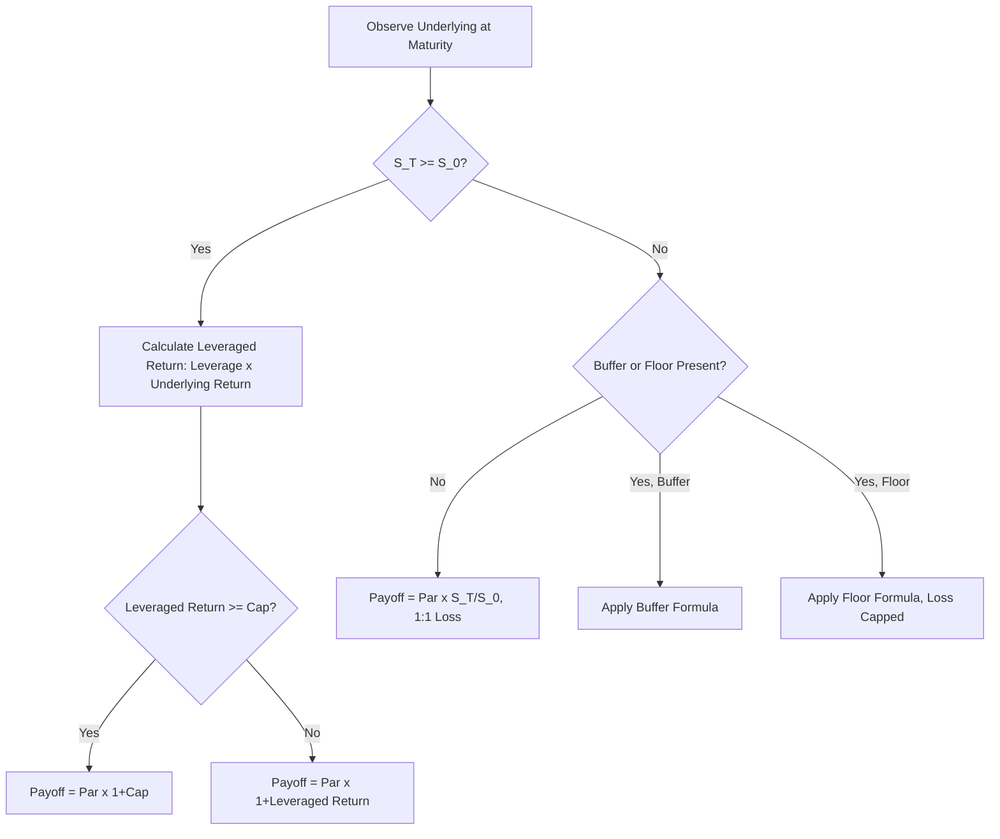

## Accelerated Return and Leveraged Notes

### Overview

Accelerated return notes (ARNs) and leveraged notes provide amplified (greater than 1:1) participation in an underlying's positive performance, typically over a short-to-medium tenor (often 1-2 years), in exchange for a capped maximum return and, in most variants, no downside protection (or only limited buffer/floor protection). The "acceleration" refers specifically to the leveraged upside multiplier applied to gains up to the cap — this is the defining mechanical feature distinguishing ARNs from simple 1:1 tracker notes.

### Core Mechanics

$$\text{Maturity Payoff} = \begin{cases} \text{Par} \times \min\left(1 + \text{Leverage} \times \frac{S_T - S_0}{S_0}, \, 1 + \text{Cap}\right) & \text{if } S_T \geq S_0 \\ \text{Par} \times \frac{S_T}{S_0} & \text{if } S_T < S_0 \text{ (typical uncapped/unbuffered variant)} \end{cases}$$

Where the **Leverage** (or "Gearing" / "Participation Rate") multiplier is typically 2x or 3x, and the **Cap** limits the maximum payout regardless of how far the underlying rallies.

**Key Points**

- The leverage multiplier applies **only** to the upside scenario in most ARN structures — downside participation, if the underlying declines, is typically 1:1 with no leverage applied (i.e., leverage is asymmetric, upside-only)
- The presence of a cap is what allows issuers to offer >100% leveraged upside participation — the leveraged call spread (long leveraged call, short call at cap to finance it) determines the achievable leverage/cap combination for a given target cost
- ARNs are named variously by issuer: "Accelerated Return Notes" (a common US retail-market term, associated with certain issuer marketing programs), "Leveraged Notes," "Booster Certificates" (European convention), "Turbo Certificates," or "Bonus Certificates" — mechanics can differ meaningfully despite similar branding, so the payoff formula must be verified per term sheet

### Worked Example

A 15-month ARN with 3x leveraged upside participation, capped at 24% maximum return, no downside protection:

| Underlying Return | ARN Payoff | Explanation |
| --- | --- | --- |
| +30% | +24% (capped) | 3x leverage would suggest +90%, but capped at 24% |
| +8% | +24% (capped) | 3x leverage = 24%, exactly at cap |
| +5% | +15% | 3x leverage applied: 5% × 3 = 15% |
| 0% | 0% | Flat, par returned |
| -10% | -10% | 1:1 downside, no leverage or protection |
| -40% | -40% | 1:1 downside, uncapped loss |

[Inference] The specific "breakeven cap point" (underlying return at which leveraged participation first hits the cap) is determined by dividing the cap by the leverage multiplier — in this example, 24% ÷ 3 = 8%, meaning any underlying return at or above 8% delivers the same capped 24% payoff.

### Leverage/Cap Trade-off Relationship

For a given target cost (typically priced at or near par issuance), leverage and cap are inversely related through the underlying call spread economics:

$$\text{Cost of Leveraged Call Spread} \propto \text{Leverage} \times (\text{Call Value at Strike} - \text{Call Value at Cap})$$

- **Higher leverage** at a **fixed cap** increases cost (requires financing via a lower breakeven, steeper spread, or reduced protection elsewhere)
- **Higher cap** at a **fixed leverage** increases cost (wider spread between the two call strikes)
- Issuers calibrate the leverage/cap combination against prevailing implied volatility and skew to hit a target price (often par) at issuance — higher implied volatility generally compresses the achievable leverage/cap combination for a given cost target, since options become more expensive

### Leveraged Notes with Partial Protection

Some variants combine leveraged upside with a buffer or floor on the downside, effectively merging ARN mechanics with buffer note mechanics:

$$\text{Maturity Payoff (Buffered Leveraged Note)} = \begin{cases} \text{Par} \times \min\left(1 + \text{Leverage} \times \frac{S_T - S_0}{S_0}, \, 1 + \text{Cap}\right) & \text{if } S_T \geq S_0 \\ \text{Par} & \text{if } S_0(1-\text{Buffer}) \leq S_T < S_0 \\ \text{Par} \times \left(1 - \left(\text{Buffer} - \frac{S_0 - S_T}{S_0}\right)\right) & \text{if } S_T < S_0(1-\text{Buffer}) \end{cases}$$

**Key Points**

- Adding downside protection (buffer or floor) to a leveraged note necessarily reduces the achievable leverage multiplier or cap for the same cost target, since the issuer must now also purchase a protective put to fund the buffer
- These hybrid structures are sometimes marketed as "Leveraged Buffered Notes" or "Enhanced Growth Notes" — again, naming is not standardized, and exact protection/leverage/cap combinations must be read from the term sheet

### Payoff Diagram: Leveraged Note vs. Simple Tracker (svg_diagram)

<svg xmlns="http://www.w3.org/2000/svg" viewBox="0 0 700 400">
\<style\>
.axis { stroke: #333; stroke-width: 1.5; }
.line1 { stroke: #2980b9; stroke-width: 2.5; fill: none; }
.line2 { stroke: #7f8c8d; stroke-width: 2; fill: none; stroke-dasharray: 5,4; }
.lbl { font-family: sans-serif; font-size: 12px; fill: #333; }
.title { font-family: sans-serif; font-size: 14px; font-weight: bold; fill: #111; }
\</style\>
<text x="20" y="20" class="title">Accelerated Return Note Payoff (svg_diagram)</text>
<line x1="60" y1="360" x2="640" y2="360" class="axis" />
<line x1="280" y1="360" x2="280" y2="40" class="axis" />
<text x="300" y="395" class="lbl">Underlying Return</text>
<line x1="60" y1="330" x2="280" y2="180" class="line1" />
<line x1="280" y1="180" x2="360" y2="60" class="line1" />
<line x1="360" y1="60" x2="640" y2="60" class="line1" />
<text x="440" y="50" class="lbl" fill="#2980b9">3x leveraged, capped at 24%</text>
<text x="150" y="250" class="lbl" fill="#2980b9">1:1 uncapped downside</text>
<line x1="60" y1="330" x2="280" y2="180" class="line2" />
<line x1="280" y1="180" x2="640" y2="30" class="line2" />
<text x="440" y="90" class="lbl" fill="#7f8c8d">1x simple tracker (reference)</text>
<line x1="360" y1="40" x2="360" y2="360" stroke="#ccc" stroke-dasharray="2,3" />
<text x="365" y="378" class="lbl">Cap breakeven (~8%)</text>
</svg>

### Payoff Determination Flow

### Risk Considerations

**Key Points**

- The most common ARN structure (no downside protection) offers **no advantage over holding the underlying directly** in a decline scenario — the investor bears full 1:1 loss, identical to unhedged direct ownership, while sacrificing all upside beyond the cap
- The cap can meaningfully limit returns in strong bull markets — investors expecting significant appreciation should explicitly model the breakeven cap point (cap ÷ leverage) to understand at what underlying return the note's advantage over direct ownership disappears
- Short tenor (often 12-18 months) means these notes are exposed to whatever market conditions prevail during that specific window — there is no opportunity to "wait out" a decline as a long-term direct equity holder might
- Issuer credit risk applies throughout, as with all unsecured structured notes

### ARN vs. Buffer Note vs. Simple Tracker Comparison

| Feature | ARN (unprotected) | Buffered Leveraged Note | Simple 1x Tracker Note |
| --- | --- | --- | --- |
| Upside leverage | Yes (2x-3x typical) | Yes, reduced vs. unprotected ARN | No (1:1) |
| Upside cap | Yes | Yes, typically lower | Sometimes, often higher/uncapped |
| Downside protection | None | Buffer or floor | Varies |
| Downside participation | 1:1, uncapped | Buffer-adjusted | 1:1 typically |
| Best-suited market view | Moderate, capped bullish view | Moderate bullish view with some protection desired | Simple directional exposure |

### Practical Implications for Analysis

- Always calculate the breakeven cap point (cap ÷ leverage multiplier) to identify at what underlying return the leveraged structure's advantage over direct 1:1 exposure is fully captured — returns beyond this point provide no additional benefit versus the cap
- Explicitly confirm whether any downside protection (buffer/floor) is present, since many ARN variants offer none — this is a critical suitability consideration distinct from the upside leverage feature
- Compare the leverage/cap combination against prevailing implied volatility expectations for the underlying and tenor — richer leverage/cap combinations generally correspond to lower implied volatility environments at issuance
- Recognize that "Accelerated," "Leveraged," "Booster," and "Turbo" are largely marketing labels for the same underlying leveraged call spread mechanic — evaluate the payoff formula directly rather than inferring risk/return from the name

### Related Topics

- Buffer and defined outcome notes (protection mechanic comparison)
- Call spread option construction and leverage/cap trade-offs
- Structured product naming conventions
- Volatility surface and its effect on achievable leverage/cap combinations
- Term sheet anatomy and key terms
- Twin Win structures (comparison of asymmetric vs. one-directional leveraged payoffs)