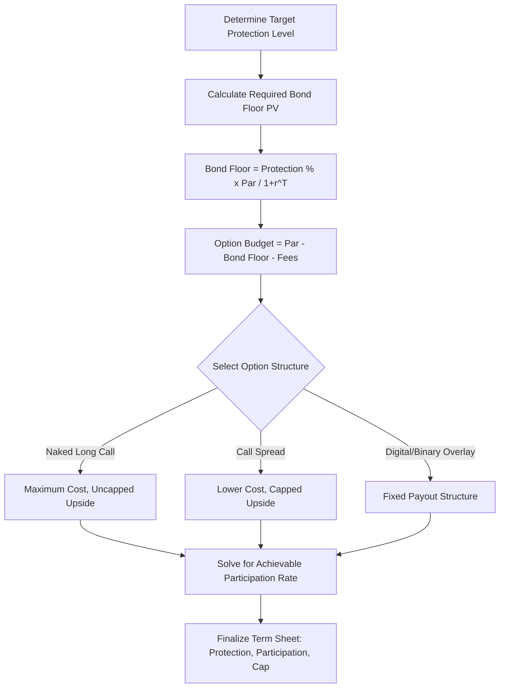

## Principal Protected Note Construction

### Overview

Principal protected note (PPN) construction refers to the engineering methodology by which a structured note delivers a guarantee (subject to issuer credit) of full or partial principal return at maturity while still offering exposure to an underlying's upside performance. The canonical construction combines a **zero-coupon bond component** — which alone grows to par by maturity — with a **long option component** funded by the discount between the note's issue price and the bond's face value. This is the most fundamental building block in structured products engineering and underlies the majority of "capital protected," "capital guaranteed," and related product families.

### Core Construction: Zero-Coupon Bond Plus Call Option

$$\text{Note Proceeds (Par)} = \text{PV of Zero-Coupon Bond} + \text{Option Premium Budget}$$

$$\text{PV of Zero-Coupon Bond} = \frac{\text{Par}}{(1+r)^T}$$

Where $r$ is the issuer's relevant discount rate (see funding levels discussion) and $T$ is the note's tenor. The **residual** — the difference between par and the bond's discounted value — is the budget available to purchase the option component that delivers the upside payoff.

**Worked Example:**

For a 5-year note with par = $1,000 and an issuer discount rate of 5.5%:

$$\text{PV of Bond} = \frac{1000}{(1.055)^5} = \$766.62$$

$$\text{Option Budget} = 1000 - 766.62 = \$233.38$$

This $233.38 is the maximum premium available to purchase a call option (or call spread, or other upside structure) on the underlying, before any distribution fees or structuring margin are deducted.

**Key Points**

- The bond floor value is the **single largest determinant** of how much option premium budget is available — higher interest rates (steeper discount) directly increase the option budget, all else equal, which is why PPN participation rates tend to be more attractive in higher-rate environments and less attractive in low/zero-rate environments
- This relationship explains why PPN issuance historically contracted during prolonged low-rate periods (e.g., post-2008 through much of the 2010s in USD/EUR) — the option budget compressed as bond floors required nearly the entire note proceeds, leaving little room for meaningful upside optionality
- Issuer credit spread (funding level) also affects the bond floor calculation — a wider issuer credit spread increases the discount rate used, paradoxically increasing the option budget available (weaker-credit issuers can sometimes offer richer headline participation, reflecting compensation for higher issuer risk, not superior structuring)

### From Option Budget to Participation Rate

Given the option budget, the achievable participation rate depends on the cost of the specific option structure chosen:

$$\text{Participation Rate} = \frac{\text{Option Budget}}{\text{Call Option Premium (per unit of notional)}}$$

**Example continued:** If a 5-year at-the-money call option on the reference index costs $280 per $1,000 notional (28% of notional) given prevailing implied volatility, dividend assumptions, and rates:

$$\text{Participation Rate} = \frac{233.38}{280} \approx 83.3\%$$

The issuer would offer approximately 83% participation in the underlying's upside performance, with full principal protection (subject to issuer credit) at maturity.

### Levers to Increase Participation Rate

Structuring desks commonly adjust several variables to improve the headline participation rate for a target protection level:

- **Cap the upside**: Selling a call at a higher strike (creating a call spread instead of a naked long call) reduces the net option cost, freeing budget for higher participation within the capped range
- **Use a basket/worst-of reference**: As discussed in worst-of basket notes, correlation-dependent structures can alter option cost, though for pure upside participation (not worst-of downside), this effect is less directly applicable than for coupon/barrier notes
- **Extend tenor**: Longer tenors increase the bond floor discount (larger option budget) but also generally increase option cost — the net effect on participation rate depends on the shape of the discount curve versus the volatility term structure
- **Reduce protection level**: Moving from 100% principal protection to 90% or 95% protection frees additional budget from the bond component (a smaller bond floor is needed), increasing available option premium
- **Use a decrement or dividend-deducted index underlying**: As discussed in thematic/custom index underlyings, embedding a decrement mechanic lowers the effective cost of the call option, increasing achievable participation

### Partial Protection Variants

Not all "principal protected" notes offer 100% protection. Common partial protection levels include:

$$\text{Bond Component (Partial Protection)} = \text{Protection}\% \times \frac{\text{Par}}{(1+r)^T}$$

| Protection Level | Bond Floor Requirement | Relative Option Budget |
| --- | --- | --- |
| 100% | Full par discounted | Lowest (baseline) |
| 95% | 95% of par discounted | Moderately higher |
| 90% | 90% of par discounted | Higher still |
| 80% | 80% of par discounted | Highest among these examples |

**Key Points**

- Partial protection notes trade a known, capped downside (e.g., maximum 10% loss at 90% protection) for improved upside participation or cap versus a 100%-protected equivalent
- This differs mechanically from a buffer note: partial protection PPNs typically guarantee a **fixed minimum floor value** (e.g., 90% of par) regardless of how far the underlying falls, whereas a buffer note absorbs a percentage of loss and then passes through further losses 1:1 beyond that — these are related but distinct downside profiles and should not be conflated

### Construction Flow Diagram

### Structural Diagram: PPN Component Breakdown (svg_diagram)

<svg xmlns="http://www.w3.org/2000/svg" viewBox="0 0 700 380">
\<style\>
.lbl { font-family: sans-serif; font-size: 13px; fill: #1a1a1a; }
.val { font-family: sans-serif; font-size: 12px; fill: #fff; }
.title { font-family: sans-serif; font-size: 14px; font-weight: bold; fill: #111; }
\</style\>
<text x="20" y="20" class="title">Principal Protected Note Construction (svg_diagram)</text>
<rect x="60" y="60" width="180" height="260" fill="#34495e" />
<text x="70" y="180" class="val">Zero-Coupon</text>
<text x="70" y="198" class="val">Bond Component</text>
<text x="70" y="220" class="val">PV = $766.62</text>
<text x="70" y="238" class="val">(grows to $1,000</text>
<text x="70" y="254" class="val">at maturity)</text>
<rect x="280" y="220" width="180" height="100" fill="#27ae60" />
<text x="290" y="260" class="val">Call Option</text>
<text x="290" y="278" class="val">Premium = $233.38</text>
<text x="290" y="296" class="val">(delivers upside)</text>
<line x1="240" y1="320" x2="280" y2="320" stroke="#333" stroke-width="1.5" />
<text x="330" y="200" class="lbl">+</text>
<rect x="500" y="60" width="150" height="260" fill="#2980b9" />
<text x="510" y="180" class="val">Issue Price</text>
<text x="510" y="198" class="val">(Par)</text>
<text x="510" y="216" class="val">$1,000</text>
<line x1="460" y1="270" x2="500" y2="190" stroke="#333" stroke-width="1.5" />
<text x="60" y="350" class="lbl">Sum of components = par proceeds at issuance</text>
</svg>

### Beyond Vanilla Calls: Alternative Upside Structures

The option budget can be deployed into structures other than a simple long call:

- **Call spread**: Long call at strike, short call at higher strike — reduces net premium, enabling a cap-for-higher-participation trade-off (as in leveraged/ARN notes)
- **Digital/binary overlay**: Fixed payout if a condition is met, rather than proportional participation — can be cheaper or more expensive than vanilla participation depending on the specific strike/probability profile
- **Basket or worst-of/best-of overlay**: As discussed separately, correlation-sensitive multi-asset structures change the achievable option budget deployment

### Risk and Disclosure Considerations

**Key Points**

- "Principal protected" always refers to protection against **market risk**, not **issuer credit risk** — if the issuer defaults, the bond floor guarantee is worthless regardless of the underlying's performance; this is among the most consistently emphasized risk disclosures across regulatory regimes
- Investors holding a PPN to maturity in a rising-rate environment forgo the opportunity to reinvest at prevailing higher rates, since the bond floor was locked in at issuance-date rates — an opportunity cost distinct from market performance risk on the option component
- Secondary market value of a PPN prior to maturity reflects both the bond component's rate-sensitive mark-to-market and the option component's Greeks (delta, vega, theta) — early exit value can be meaningfully below par even with a fully intact 100% protection feature, since protection applies only at the stated maturity date

### Practical Implications for Analysis

- Always decompose a PPN's headline participation rate into its bond-floor-driven option budget and the specific option structure's cost, rather than treating participation rate as an isolated marketing figure
- Compare achievable participation rates across issuers with similar credit ratings and similar rate environments to isolate genuine structuring competitiveness from credit-spread-driven funding differences (see funding levels and issuer economics)
- For partial protection variants, explicitly distinguish the fixed-floor mechanic from a percentage buffer mechanic, since the downside risk profiles differ meaningfully in tail scenarios
- Recognize that PPN attractiveness is structurally rate-dependent — evaluate the current rate environment's effect on achievable option budgets before assessing whether observed participation rates represent good or poor relative value

### Related Topics

- Funding levels and issuer economics
- Buffer and defined outcome notes (partial protection comparison)
- Call spread option construction and leverage/cap trade-offs
- Thematic and custom index underlyings (decrement mechanics)
- Term sheet anatomy and key terms
- Volatility surface and its effect on option premium costs