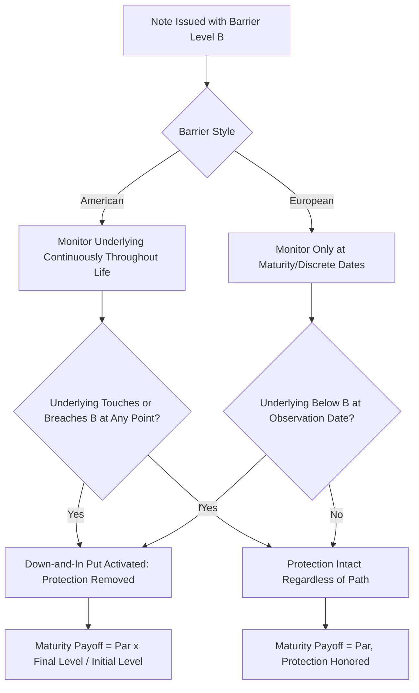

## Capital at Risk Notes and Barrier Levels

### Overview

Capital at risk (CAR) notes are structured products where principal repayment is explicitly conditional on the underlying's performance relative to a barrier level, in contrast to principal protected notes where the bond floor guarantees par regardless of underlying performance (subject only to issuer credit). Barrier levels are the mechanical threshold that determines whether and how much of the investor's capital is exposed to loss. This category spans barrier reverse convertibles, capital-at-risk autocallables, and any structure where the term sheet explicitly states principal is not guaranteed and depends on a barrier condition.

### The Fundamental Trade-Off: Protection vs. Yield

Capital at risk notes exist because removing the bond-floor-driven principal guarantee frees substantially more premium budget for richer coupons, participation, or lower barriers than a principal protected structure could offer at the same tenor and underlying. This is the direct mechanical counterpart to principal protected note construction:

$$\text{PPN: Budget} = \text{Par} - \text{Bond Floor PV}$$

$$\text{CAR Note: Budget} = \text{Par} - \text{Reduced or No Bond Floor} + \text{Premium from Sold Downside Option}$$

In a CAR note, the investor is not merely forgoing a large bond floor — they are typically **selling** downside protection (a put or down-and-in put) back to the issuer, and the premium from that sale directly funds the enhanced coupon or terms. This is why CAR notes, particularly reverse convertibles and barrier notes, can offer coupons that a PPN of similar tenor and underlying could never support.

### Barrier Level Definitions and Types

**Key Points**

- **Barrier level**: A threshold, typically expressed as a percentage of the initial reference level (e.g., 60%, 70%), that determines whether the downside protection mechanism activates or deactivates
- **Downside barrier (protection-removing)**: Common in reverse convertibles and autocallables — protection exists as long as the barrier is not breached; breach converts the note to (or reveals) full/partial downside participation
- **Coupon barrier**: A separate threshold (often set higher than the principal barrier) determining whether a contingent coupon is paid, independent of principal risk
- **Autocall barrier**: The threshold triggering early redemption, typically set at or near 100% of initial level, distinct from both coupon and principal barriers

A single note can have up to three distinct barrier levels simultaneously (autocall trigger, coupon barrier, principal barrier), each potentially set at different percentages and observed on different schedules.

### American vs. European Barrier Observation

This is the single most consequential structural variable affecting barrier breach probability:

- **American (continuous) barrier**: Monitored on every trading day (or continuously) throughout the note's life; breach at *any* point during the observation period activates the barrier condition, regardless of subsequent recovery
- **European (terminal) barrier**: Observed *only* at maturity (or only at specific discrete observation dates); the underlying's path between observations is irrelevant — only the level at the observation date(s) determines breach status

$$P(\text{American Barrier Breach}) \geq P(\text{European Barrier Breach}) \text{ for the same barrier level and underlying}$$

This inequality holds because the American barrier's breach condition is satisfied by the running minimum of the underlying's path, which is always less than or equal to the terminal value alone.

**Key Points**

- For the same headline barrier percentage, an American-barrier note carries materially higher risk of principal impairment than a European-barrier note, because a temporary dip below the barrier — even one that fully recovers by maturity — locks in the barrier breach under American observation
- Issuers price this difference explicitly: American-barrier notes typically require a **lower** barrier level (more room before breach) or a **lower** coupon to achieve the same target cost as a European-barrier note at a higher barrier
- Some structures use a **discrete/window barrier**: observed only at specific dates (e.g., daily closes over the note's life, or only on quarterly observation dates) — this sits between pure American and pure European in terms of breach probability, depending on observation frequency

### Worked Comparison

Consider two otherwise identical 1-year notes on the same underlying, both targeting the same issuer economics:

| Barrier Style | Barrier Level | Coupon |
| --- | --- | --- |
| European (maturity only) | 70% | 8.5% |
| American (continuous) | 70% | 11.0% (compensating for higher breach risk) |
| American (continuous) | 60% (lowered to reduce breach risk) | 8.5% (comparable to European example) |

[Speculation] The specific coupon differentials shown are illustrative to demonstrate directional sensitivity to barrier style and level, not derived from a specific priced model run — actual differentials depend on the underlying's volatility, skew, and the specific pricing model and inputs used by the issuing desk.

### Barrier Breach Mechanics Flow

### Barrier Breach Probability Diagram (svg_diagram)

<svg xmlns="http://www.w3.org/2000/svg" viewBox="0 0 700 380">
\<style\>
.axis { stroke: #333; stroke-width: 1.5; }
.pathline { stroke: #2980b9; stroke-width: 2; fill: none; }
.barrier { stroke: #c0392b; stroke-width: 1.5; stroke-dasharray: 5,4; }
.lbl { font-family: sans-serif; font-size: 12px; fill: #333; }
.title { font-family: sans-serif; font-size: 14px; font-weight: bold; fill: #111; }
\</style\>
<text x="20" y="20" class="title">American vs European Barrier Observation (svg_diagram)</text>
<line x1="60" y1="340" x2="640" y2="340" class="axis" />
<line x1="60" y1="340" x2="60" y2="40" class="axis" />
<text x="300" y="365" class="lbl">Time to Maturity</text>
<polyline class="pathline" points="60,120 150,140 220,260 280,180 350,90 420,130 500,100 580,110 640,120" />
<text x="440" y="70" class="lbl" fill="#2980b9">Underlying Path (dips then recovers)</text>
<line x1="60" y1="250" x2="640" y2="250" class="barrier" />
<text x="565" y="245" class="lbl" fill="#c0392b">Barrier Level</text>
<circle cx="220" cy="260" r="5" fill="#c0392b" />
<text x="180" y="290" class="lbl" fill="#c0392b">American: breach here triggers</text>
<text x="180" y="304" class="lbl" fill="#c0392b">loss of protection permanently</text>

<text x="590" y="140" class="lbl" fill="`#2980b9`">European: only this</text>

<text x="590" y="154" class="lbl" fill="`#2980b9`">point matters — recovered,</text>

<text x="590" y="168" class="lbl" fill="`#2980b9`">so protection intact</text>

</svg>

### Barrier Level Selection and Issuer Calibration

Structuring desks select barrier levels by solving for the level that achieves a target coupon/cost given:

- **Implied volatility** of the underlying at the relevant tenor — higher volatility increases the value of the down-and-in put the investor is implicitly selling, allowing either a lower barrier or higher coupon
- **Volatility skew** — since barrier options are sensitive to the volatility smile/skew at the barrier strike specifically, not just at-the-money volatility, skew shape materially affects barrier pricing independent of ATM volatility level
- **Correlation** (for worst-of baskets) — as detailed in worst-of basket coverage, lower correlation increases barrier breach probability across the basket, again allowing richer headline terms
- **Observation frequency and style** (American vs. European vs. discrete) — as detailed above

### Comparative Summary: Barrier Style Impact

| Factor | American Barrier | European Barrier |
| --- | --- | --- |
| Breach probability at same level | Higher | Lower |
| Typical barrier level for same coupon | Lower (more room) | Higher |
| Sensitivity to interim volatility spikes | High — even temporary dips matter | Low — only terminal level matters |
| Pricing model complexity | Higher (path-dependent, requires barrier-specific adjustments) | Lower (closer to standard European option pricing) |
| Investor risk from short-term market stress | Elevated | Minimal (if recovery occurs by observation) |

### Risk Considerations

**Key Points**

- Investors frequently underestimate American barrier risk because they anchor on the barrier's distance from current levels without accounting for the *path* — a note can appear "safe" based on spot-to-barrier distance while carrying substantial breach probability due to volatility over the holding period
- Barrier breach does not necessarily mean total capital loss — post-breach payoff is typically proportional to final underlying performance (e.g., $\text{Par} \times S_T/S_0$), so partial recovery by maturity still partially mitigates the loss, though protection itself is gone
- For worst-of baskets with barriers, breach probability compounds across constituents (see worst-of basket coverage) — barrier risk analysis must account for the full basket, not a single reference asset
- Barrier levels set near round numbers or psychologically significant technical levels can interact with broader market positioning (e.g., other market participants' hedging flows around similar levels), though this is a market microstructure consideration distinct from the note's own contractual mechanics

### Practical Implications for Analysis

- Always identify barrier style (American vs. European vs. discrete) as the first step in any capital-at-risk note analysis — this single variable changes breach probability more than most other individual factors
- Model breach probability using the underlying's historical and implied volatility over the specific tenor, accounting for barrier style, rather than relying solely on the static percentage distance from spot to barrier
- For notes with multiple barrier types (autocall, coupon, principal), map out each barrier's level, style, and observation schedule separately — conflating them leads to mischaracterizing the note's actual risk profile
- Compare barrier level and coupon combinations across issuers only after normalizing for barrier style, tenor, and underlying volatility, since apparently attractive headline terms may simply reflect a riskier barrier configuration

### Related Topics

- Barrier reverse convertibles (mechanics detail)
- Autocallable notes and trigger mechanics
- Volatility skew and its effect on barrier option pricing
- Worst-of basket correlation risk and compounding barrier probability
- Principal protected note construction (contrast structure)
- Term sheet anatomy and key terms