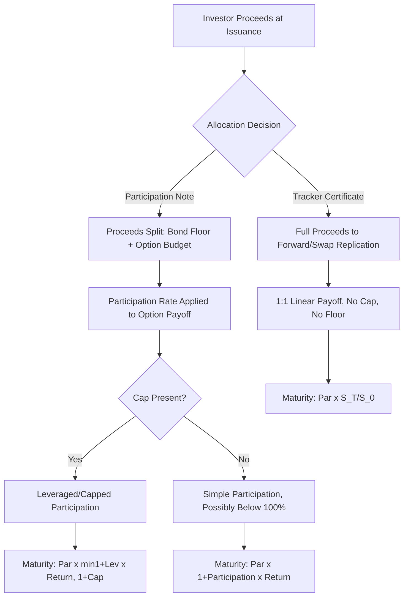

## Participation Notes and Tracker Certificates

### Overview

Participation notes and tracker certificates are the simplest structural family in the capital-at-risk/participation spectrum: they deliver exposure to an underlying's performance without an embedded principal guarantee, and typically without a cap, in exchange for eliminating the bond floor entirely. Where a principal protected note dedicates most of its proceeds to a zero-coupon bond and uses the residual for optionality, a tracker certificate dedicates essentially all proceeds directly to underlying exposure (often via a forward or swap replication) — making it economically closer to synthetic direct ownership than to an option-based payoff.

### Core Mechanics — Tracker Certificate

$$\text{Maturity Payoff} = \text{Par} \times \frac{S_T}{S_0}$$

This is the simplest possible structured payoff: 1:1 linear participation in the underlying's performance, with no cap and no floor. Economically, this is equivalent to the investor holding a forward contract or synthetic long position on the underlying, wrapped in note form.

**Key Points**

- Because there is no option optionality embedded (no cap, no floor, no barrier), a tracker certificate's economics are driven almost entirely by the cost of replication (financing/repo cost, dividend treatment, and issuer margin) rather than options pricing
- Tracker certificates are commonly used to provide access to underlyings that are otherwise difficult or costly for retail/institutional investors to access directly — foreign markets with capital controls, illiquid commodities, custom indices, or baskets that would be impractical to replicate via direct purchase
- Unlike an ETF, a tracker certificate is an unsecured debt obligation of the issuer — it carries issuer credit risk, which a fund-wrapped ETF replicating the same exposure generally does not carry in the same form

### Participation Notes: Adding Leverage or a Cap

A participation note generalizes the tracker certificate by introducing a participation rate other than 100%, and optionally a cap:

$$\text{Maturity Payoff} = \text{Par} \times \left(1 + \text{Participation Rate} \times \frac{S_T - S_0}{S_0}\right)$$

- **Participation rate < 100%**: Reduces cost, sometimes paired with partial downside protection (a hybrid with PPN-style construction)
- **Participation rate = 100%**: Equivalent to the tracker certificate
- **Participation rate > 100%**: Leveraged upside participation, typically requiring a cap to remain cost-neutral (as covered under accelerated return/leveraged notes)

**Key Points**

- Participation notes sit on a continuum between pure tracker certificates (100% linear, no protection) and principal protected notes (protected floor, capped/participation upside funded by option budget) — where a specific note sits on this continuum depends on how much of the proceeds are allocated to a bond floor versus direct/forward exposure versus option optionality
- Downside participation in most tracker/participation notes (absent an explicit buffer or floor) is 1:1 uncapped, identical to direct ownership — the structure does not inherently provide downside mitigation unless explicitly engineered in

### Replication Methodology: Forward/Swap-Based Construction

Unlike option-based structures (PPNs, barriers, autocallables), tracker certificates are typically constructed via:

1. **Forward replication**: Issuer enters a forward contract on the underlying to deliver the 1:1 performance at maturity, financed through the note's proceeds
2. **Total return swap (TRS) replication**: Issuer swaps a fixed/floating financing leg for the underlying's total return, passing the net economics through to the note
3. **Direct physical/synthetic replication**: For index-tracking certificates, the issuer may directly hold (or synthetically replicate via swaps) the underlying index constituents

$$\text{Forward Price} = S_0 \times e^{(r - q)T}$$

Where $r$ is the financing rate and $q$ is the dividend yield of the underlying. The certificate's implied cost of carry (financing rate minus dividend yield) is a key determinant of the certificate's economics relative to direct ownership.

**Key Points**

- If a tracker certificate does **not** pass through dividends to the investor (common — many certificates are priced on a price-return, not total-return basis), the investor forgoes dividend income that a direct shareholder would receive, and this dividend "leakage" becomes part of the issuer's economics
- This dividend treatment is one of the most consequential and sometimes under-scrutinized aspects of tracker certificate structuring — a certificate's underperformance relative to a benchmark's total return index over time is frequently attributable to this dividend pass-through gap rather than tracking error in the traditional sense

### Tracker Certificate vs. Direct Ownership vs. ETF Comparison

| Feature | Tracker Certificate | Direct Underlying Ownership | ETF (physical/synthetic replication) |
| --- | --- | --- | --- |
| Issuer/counterparty credit risk | Yes (unsecured note) | No (direct ownership) | Limited (fund structure, though synthetic ETFs carry swap counterparty risk) |
| Dividend treatment | Often price-return only (no pass-through) | Full dividend receipt | Typically total-return (dividends reinvested or distributed) |
| Access to restricted/illiquid markets | Yes, a primary use case | Limited by market access | Varies by fund structure |
| Minimum investment | Often lower, note-denomination based | Market price of underlying | Market price of ETF share |
| Liquidity | Issuer-dependent secondary market | Underlying's own liquidity | Generally good, exchange-listed |

### Construction and Payoff Flow

### Payoff Comparison Diagram (svg_diagram)

<svg xmlns="http://www.w3.org/2000/svg" viewBox="0 0 700 380">
\<style\>
.axis { stroke: #333; stroke-width: 1.5; }
.line1 { stroke: #16a085; stroke-width: 2.5; fill: none; }
.line2 { stroke: #e67e22; stroke-width: 2; fill: none; stroke-dasharray: 5,4; }
.lbl { font-family: sans-serif; font-size: 12px; fill: #333; }
.title { font-family: sans-serif; font-size: 14px; font-weight: bold; fill: #111; }
\</style\>
<text x="20" y="20" class="title">Tracker Certificate vs Participation Note (svg_diagram)</text>
<line x1="60" y1="340" x2="640" y2="340" class="axis" />
<line x1="350" y1="340" x2="350" y2="40" class="axis" />
<text x="290" y="365" class="lbl">Underlying Return</text>
<line x1="60" y1="320" x2="640" y2="60" class="line1" />
<text x="440" y="90" class="lbl" fill="#16a085">Tracker: 1:1 linear, no cap</text>
<line x1="60" y1="320" x2="640" y2="140" class="line2" />
<text x="440" y="160" class="lbl" fill="#e67e22">Participation Note: 70% rate</text>
</svg>

### Use Cases and Market Positioning

**Key Points**

- **Market access**: Tracker certificates are frequently used to provide exposure to underlyings with restricted direct access — foreign equity markets with capital controls, commodities requiring physical delivery infrastructure, or custom/thematic indices with no direct investable vehicle
- **Tax and regulatory wrapper considerations**: In certain jurisdictions, note-wrapped exposure may carry different tax treatment than direct ownership or fund ownership, which can be a structuring rationale independent of payoff mechanics
- **Cost efficiency for issuers**: Because no option optionality is embedded, tracker certificates are typically cheaper and faster for issuers to structure and hedge than barrier or autocallable notes, though this does not necessarily translate to lower cost for the investor once financing spread and dividend treatment are accounted for

### Risk Considerations

- **No downside protection**: A pure tracker certificate offers zero cushion — losses track the underlying 1:1, identical to direct ownership risk, while adding issuer credit risk on top
- **Dividend leakage**: Price-return-only certificates systematically underperform total-return benchmarks over time purely due to foregone dividends, independent of any tracking error
- **Financing spread embedded in forward pricing**: The implied financing rate used in forward replication may embed issuer margin beyond the true market financing cost, similar in spirit to funding level economics discussed elsewhere
- **Issuer credit risk without commensurate yield compensation**: Unlike reverse convertibles or barrier notes, where enhanced coupon compensates for risk taken, a plain tracker certificate offers no such compensation for the issuer credit risk assumed — the investor takes on credit risk purely for market access convenience

### Practical Implications for Analysis

- Before evaluating a tracker certificate, confirm whether it is priced on a price-return or total-return basis, since this materially affects long-term performance versus benchmark expectations
- Compare implied financing cost embedded in the certificate's forward pricing against prevailing market repo/financing rates to assess whether issuer margin is reasonable
- For participation notes with a cap, apply the same breakeven analysis used for leveraged notes (cap ÷ participation rate) to identify where capped performance ceases to track the underlying
- Weigh the market-access rationale (for otherwise hard-to-reach underlyings) against the added issuer credit risk when a more direct, uncapped exposure vehicle (e.g., a total-return ETF) is available for the same underlying

### Related Topics

- Principal protected note construction (contrast in bond floor allocation)
- Accelerated return and leveraged notes (participation rate above 100%)
- Funding levels and issuer economics (forward pricing and financing spread)
- Structured payoffs wrapped as exchange traded funds (ETF alternative)
- Thematic and custom index underlyings (common tracker certificate reference assets)
- Term sheet anatomy and key terms