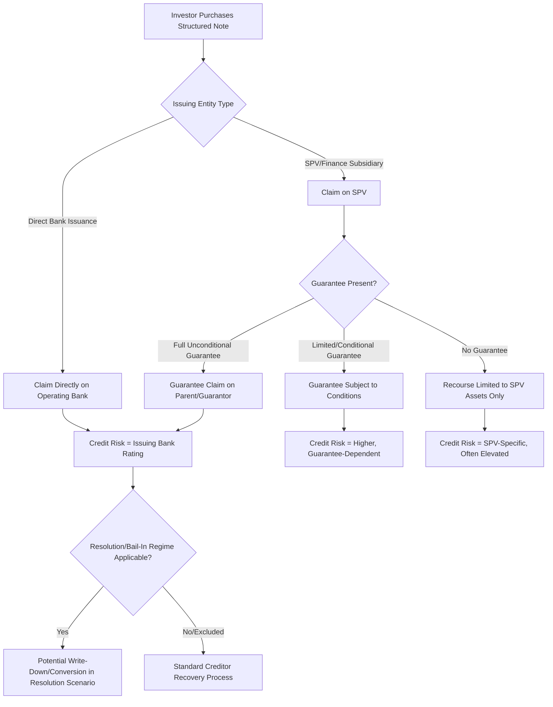

## Issuer Guarantee Structures

### Overview

Issuer guarantee structures describe the legal and credit architecture by which a structured note's payment obligations are backed — specifically, which entity within a banking group is legally obligated to pay, and what recourse an investor has if that entity fails. This is distinct from the payoff mechanics covered elsewhere (barriers, participation, coupons); it concerns the **credit risk layer** underlying every structured note, since even a note with 100% principal protection against market risk offers no protection against issuer or guarantor default.

### The Core Legal Structure

Structured notes are typically issued through one of several legal arrangements within a banking group:

1. **Direct issuance by the operating bank entity**: The note is a direct unsecured obligation of the bank itself (e.g., the bank's own balance sheet, subject to the bank's senior unsecured creditor ranking)
2. **Issuance via a special purpose vehicle (SPV) or finance subsidiary, with a parent guarantee**: A separate legal entity issues the note, but a parent or affiliate entity (often the main operating bank or holding company) guarantees the payment obligations
3. **Issuance via a finance subsidiary with no guarantee, or a limited guarantee**: Rare and generally viewed as higher risk, since investors would have recourse only to the (often thinly capitalized) issuing subsidiary

**Key Points**

- The presence and scope of a guarantee is a **material** credit consideration distinct from the issuer's own standalone credit rating — an SPV issuer with a strong parent guarantee is generally viewed as carrying credit risk equivalent to the guarantor, not the SPV itself
- Guarantee terms must be read carefully: guarantees can be full and unconditional, or subject to specific conditions, subordination, or carve-outs that limit their practical value in a stress scenario
- [Unverified] The specific legal and regulatory requirements governing guarantee structures (disclosure standards, guarantee enforceability, subordination rules) vary meaningfully by jurisdiction and should be verified against the specific offering documents and applicable securities law for the relevant market, since these frameworks are subject to ongoing regulatory evolution.

### Seniority and Ranking

Within an issuer's capital structure, structured notes are typically issued as:

- **Senior unsecured debt**: Ranks pari passu (equally) with the issuer's other senior unsecured creditors — this is the most common ranking for retail-distributed structured notes
- **Subordinated debt**: Ranks below senior unsecured creditors in a liquidation/resolution scenario — rare for retail structured notes but occasionally used, and requires clear and prominent disclosure given the materially elevated risk

$$\text{Recovery Priority: Secured Creditors} > \text{Senior Unsecured (incl. most structured notes)} > \text{Subordinated Debt} > \text{Equity}$$

**Key Points**

- Senior unsecured ranking means structured note holders rank alongside the issuer's depositors and other senior creditors in many jurisdictions — however, this does **not** mean structured notes carry deposit-insurance-equivalent protection, since deposit insurance schemes are a separate regulatory mechanism that generally does not extend to structured notes
- Post-2008 regulatory reforms in several jurisdictions (bail-in regimes, Total Loss-Absorbing Capacity/TLAC requirements) have introduced scenarios where senior unsecured creditors, including structured note holders, can be subject to write-down or conversion to equity in a resolution scenario — this is a material, jurisdiction-specific consideration that materially changes the traditional "senior unsecured is nearly as safe as deposits" framing

### Bail-In Risk and Resolution Regimes

Following the 2008 financial crisis, many jurisdictions implemented bank resolution frameworks designed to avoid taxpayer-funded bailouts by imposing losses on creditors, including senior unsecured bondholders, in a failing bank scenario:

- **EU Bank Recovery and Resolution Directive (BRRD)**: Establishes a bail-in mechanism where eligible liabilities, potentially including senior unsecured structured notes, can be written down or converted to equity as part of a resolution
- **US Orderly Liquidation Authority / TLAC requirements**: Establishes similar loss-absorption mechanisms for systemically important US financial institutions
- **UK, Switzerland, and other major jurisdictions**: Have implemented broadly analogous resolution regimes with jurisdiction-specific mechanics

[Unverified] The precise scope of which structured note liabilities are "bail-inable" under any given resolution regime, and the order of loss absorption relative to other creditor classes, is technical and evolves with regulatory guidance — investors and analysts should consult current regulatory disclosures and legal opinions specific to the issuer and jurisdiction rather than relying on a generalized description, since these frameworks have been refined since their initial implementation and can differ meaningfully between jurisdictions.

### Guarantee Structure Comparison

| Structure | Investor Recourse | Typical Credit Risk Profile |
| --- | --- | --- |
| Direct bank issuance | Direct claim on issuing bank | Reflects issuing bank's own credit rating |
| SPV with full parent guarantee | Claim on SPV, backed by guarantee claim on parent | Generally viewed as equivalent to guarantor's credit rating |
| SPV with limited/conditional guarantee | Claim on SPV, guarantee subject to conditions | Higher risk, requires careful review of guarantee scope |
| SPV with no guarantee | Claim on SPV only | Highest risk among these variants, dependent on SPV's own (often minimal) capitalization |

### Diagram: Issuer/Guarantor Legal Structure

### Disclosure Requirements

**Key Points**

- Regulatory frameworks (e.g., SEC disclosure requirements in the US, PRIIPs KID in the EU) generally mandate clear disclosure of the issuing entity, any guarantor, and the credit risk implications, typically prominently on the term sheet cover page and in dedicated risk factor sections
- Credit ratings, where available, are typically disclosed for both the issuer and guarantor (if applicable) — however, credit ratings reflect rating agency opinions at a point in time and are not a guarantee of future creditworthiness
- Structured note prospectuses typically include explicit risk factor language stating that the note is **not** insured by any government deposit insurance scheme and that repayment depends entirely on the issuer's (and guarantor's, if applicable) ability to pay

### Cross-Border and Multi-Entity Considerations

- **Home vs. host jurisdiction resolution**: For internationally distributed notes, the applicable resolution regime is typically that of the issuing (or guaranteeing) entity's home jurisdiction, which may differ from the jurisdiction where the note is distributed or where the investor resides
- **Currency and jurisdiction of governing law**: Term sheets specify governing law and jurisdiction for dispute resolution, which affects investor recourse mechanics in a default or resolution scenario, independent of the guarantee structure itself
- [Inference] Cross-border investors should generally expect that the credit and resolution risk they are exposed to is governed by the issuing/guaranteeing entity's home regulatory framework, not their own jurisdiction's framework, though the specific interaction between multiple jurisdictions' rules in a resolution scenario can be legally complex and is best assessed with reference to the specific offering documents and, where warranted, professional legal advice rather than general principles alone.

### Risk Considerations

**Key Points**

- Principal protection features (100% capital protected notes) provide **zero** protection against issuer or guarantor credit risk — this is among the most important and most commonly misunderstood aspects of structured note risk, since "principal protected" language can create a false impression of a risk-free instrument
- A strong parent guarantee substantially mitigates SPV-specific structural risk, but the underlying credit risk of the guarantor itself remains the ultimate determinant of note safety
- Bail-in and resolution regime exposure means that even senior unsecured structured notes from systemically important institutions are not immune to loss in a severe stress scenario, a meaningful shift from pre-2008 assumptions about senior bank debt safety
- Diversification across issuers is a standard risk mitigation practice for investors holding multiple structured notes, analogous to avoiding concentration risk in any single-issuer credit exposure

### Practical Implications for Analysis

- Always identify the specific issuing entity and, where applicable, the guarantor, and assess credit risk based on the guarantor's rating and standing when a full unconditional guarantee is present
- Review guarantee documentation for conditions, subordination, or carve-outs rather than assuming "guaranteed" implies unconditional parent-level backing
- Factor in applicable bail-in/resolution regime exposure for the specific issuer's home jurisdiction, recognizing that senior unsecured status does not eliminate loss risk in a resolution scenario under modern frameworks
- Treat "principal protected" and "capital guaranteed" marketing language as referring exclusively to market-risk protection, never as a statement about issuer credit safety

### Related Topics

- Funding levels and issuer economics
- Principal protected note construction
- Term sheet anatomy and key terms (credit risk disclosure sections)
- Capital at risk notes and barrier levels
- Secondary market liquidity and issuer bid-back practices
- Regulatory disclosure standards (FINRA 12-03, PRIIPs KID)