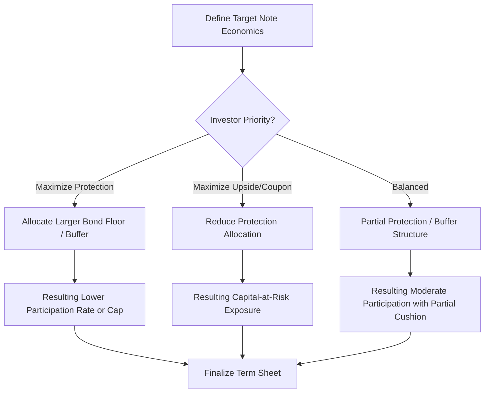

## The Trade Off Between Protection and Upside

### Overview

The trade-off between protection and upside is the unifying economic principle underlying nearly every structured note design choice covered across principal protected and capital-at-risk structures: at a fixed cost/proceeds level, more downside protection mechanically requires less upside potential (lower participation, lower cap, or lower coupon), and vice versa. This is not a stylistic preference of structuring desks — it is a direct consequence of option pricing arithmetic, where the total premium budget available at issuance is finite and must be allocated between protective features and performance-enhancing features.

### The Fixed-Budget Principle

At issuance, a note's total proceeds (typically at or near par) must fund three components simultaneously:

$$\text{Par} = \text{Bond/Protection Component} + \text{Payoff-Generating Option Component} + \text{Fees and Issuer Margin}$$

Since fees and issuer margin are relatively fixed (see funding levels and issuer economics), **the bond/protection component and the option component are in direct competition for the remaining budget**. Any increase in protection allocation necessarily reduces what remains for the payoff-generating optionality, and vice versa.

$$\frac{\partial(\text{Option Budget})}{\partial(\text{Protection Level})} < 0$$

**Key Points**

- This inverse relationship holds across virtually every structured note family: principal protected notes (bond floor vs. participation rate), buffer notes (buffer size vs. cap/participation), barrier notes (barrier level vs. coupon), and leveraged notes (protection presence vs. leverage/cap)
- The relationship is not always perfectly linear or symmetric — the specific trade-off curve depends on the shape of the relevant option's sensitivity to strike (related to volatility skew) and the discount curve's shape, but the directional relationship (more protection costs upside, always) is structurally invariant

### Illustrating the Trade-Off Across Product Families

| Product Family | Protection Lever | Upside Lever | Trade-Off Direction |
| --- | --- | --- | --- |
| Principal Protected Note | Bond floor % (protection level) | Participation rate | Higher protection → lower participation |
| Buffer Note | Buffer % (loss absorbed) | Cap / participation rate | Larger buffer → lower cap |
| Barrier Reverse Convertible | Barrier level (lower = more protection) | Coupon rate | Lower barrier → lower coupon (less protection needed to sell) |
| Autocallable | Barrier level, autocall trigger | Coupon rate | Wider protection cushion → lower coupon |
| Leveraged/ARN Note | Presence/size of buffer or floor | Leverage multiplier, cap | Added protection → reduced leverage or lower cap |

### Worked Numerical Illustration

Using the principal protected note construction framework, consider a 5-year note with par = $1,000, issuer discount rate 5.5%, and a call option costing $280 per $1,000 notional at prevailing volatility:

| Protection Level | Bond Floor PV | Option Budget | Approx. Participation Rate |
| --- | --- | --- | --- |
| 100% | $766.62 | $233.38 | ~83% |
| 90% | $689.96 | $310.04 | ~111% |
| 80% | $613.30 | $386.70 | ~138% |
| 0% (no protection) | $0 | $1,000.00 | ~357% (before cap) |

[Speculation] These participation figures are illustrative extrapolations from the single worked example used in principal protected note construction coverage, intended to demonstrate the directional trade-off mechanically — actual achievable participation rates at each protection level depend on the specific option structure, cap decisions, and prevailing market pricing, and would not scale perfectly linearly in a real issuance due to the effects of caps, skew, and the fact that at very low/zero protection levels issuers typically impose a cap rather than offering uncapped high participation.

### Trade-Off Curve Diagram (svg_diagram)

<svg xmlns="http://www.w3.org/2000/svg" viewBox="0 0 700 400">
\<style\>
.axis { stroke: #333; stroke-width: 1.5; }
.curve { stroke: #8e44ad; stroke-width: 2.5; fill: none; }
.lbl { font-family: sans-serif; font-size: 12px; fill: #333; }
.title { font-family: sans-serif; font-size: 14px; font-weight: bold; fill: #111; }
\</style\>
<text x="20" y="20" class="title">Protection Level vs Achievable Upside (svg_diagram)</text>
<line x1="70" y1="350" x2="640" y2="350" class="axis" />
<line x1="70" y1="350" x2="70" y2="40" class="axis" />
<text x="280" y="380" class="lbl">Protection Level (0% to 100%)</text>
<text x="20" y="200" class="lbl" transform="rotate(-90 20,200)">Achievable Upside / Coupon</text>
<path class="curve" d="M 70 60 Q 300 80 450 200 Q 550 280 620 340" />

<text x="90" y="55" class="lbl">High upside,</text>

<text x="90" y="70" class="lbl">no protection</text>

<text x="500" y="360" class="lbl">100% protected,</text>

<text x="500" y="375" class="lbl">low upside</text>

</svg>

### Volatility's Role in Shaping the Trade-Off

The steepness of the protection-vs-upside trade-off curve is itself a function of the underlying's implied volatility:

- **Higher implied volatility**: Both protection and upside optionality become more expensive in absolute terms, but the *relative* trade-off can shift — higher volatility increases the value of downside puts (making protection relatively more "expensive" to remove) while simultaneously increasing the value of upside calls (making participation relatively more expensive to acquire)
- **Volatility skew**: Since downside options (puts, used for protection) and upside options (calls, used for participation) often trade at different implied volatilities due to skew, the trade-off is rarely symmetric — in equity markets, downside skew (higher implied volatility for puts than calls) generally means protection is disproportionately expensive relative to equivalent-distance upside participation, reinforcing the incentive for issuers and investors to consider partial protection or capital-at-risk structures for better headline economics

[Inference] The specific magnitude of skew's effect on the protection/upside trade-off varies by underlying asset class and market regime — equity index skew tends to be persistently negative (downside protection relatively expensive) based on typical observed market structure, but this is a general historical pattern rather than a fixed constant, and skew shape can vary meaningfully across different underlyings and time periods.

### Trade-Off Decision Flow for Structuring

### Investor Decision Framework

**Key Points**

- The trade-off means there is no structurally "free" way to obtain both maximum protection and maximum upside simultaneously — any note advertising unusually attractive terms on both dimensions relative to peers warrants scrutiny of underlying assumptions (custom index decrement, unusual correlation assumptions, wider issuer credit spread, or reduced barrier style protection)
- Investor risk tolerance and market view should drive where along the trade-off spectrum a chosen note sits — a strongly protection-oriented investor accepts lower upside potential deliberately, while a yield/growth-oriented investor accepts capital-at-risk deliberately, and structured products exist precisely to let investors select a point along this continuum rather than being limited to the binary choice of full direct ownership or a plain bond
- The trade-off is asset-class and volatility-regime dependent: in low implied volatility environments, the achievable trade-off curve overall shifts to offer less generous terms at every protection level (smaller option budgets and cheaper optionality both compress available combinations), while high volatility environments can support richer terms at a given protection level (though also reflecting genuinely higher underlying risk)

### Practical Implications for Analysis

- When evaluating any structured note, explicitly locate it along the protection-vs-upside spectrum rather than assessing protection level and upside potential as independent, unrelated features
- Use the fixed-budget framework to sanity-check headline terms: if a note offers both unusually high protection and unusually high upside relative to comparable market offerings, investigate the specific structural levers used (custom index, wider issuer credit spread, extended tenor, correlation assumptions) that may explain the apparent anomaly
- Recognize that the "right" point on the trade-off curve is investor-specific and market-view-specific, not a universal optimum — comparing two notes at different points on the curve (e.g., a PPN vs. a reverse convertible) is a suitability question, not a simple "which is better structured" question
- Factor in prevailing volatility and skew conditions when assessing whether a given note's specific trade-off point represents fair value relative to the broader options market at time of issuance

### Related Topics

- Principal protected note construction
- Buffer and defined outcome notes
- Capital at risk notes and barrier levels
- Funding levels and issuer economics
- Volatility skew and its effect on protection cost
- Accelerated return and leveraged notes