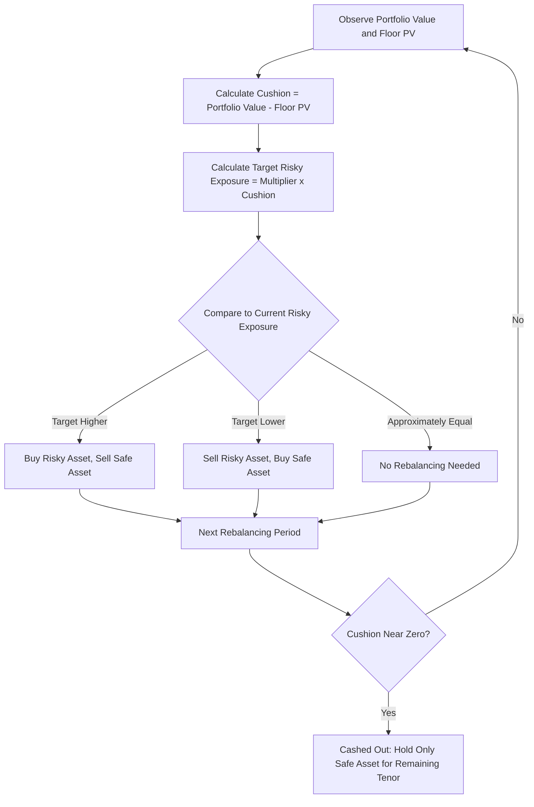

## Dynamic and CPPI Based Protection Strategies

### Overview

Dynamic and CPPI (Constant Proportion Portfolio Insurance) based protection strategies deliver principal protection through **active, rules-based rebalancing** between a risky asset and a safe/reserve asset over the note's life, rather than through the static "buy a zero-coupon bond plus a fixed option" construction used in traditional principal protected notes. This approach shifts the protection mechanism from a one-time, option-market-priced allocation at issuance to an ongoing, algorithmic exposure management process that responds to market movements throughout the note's tenor.

### Core CPPI Mechanics

CPPI dynamically allocates between a risky asset (the underlying being tracked) and a safe asset (typically cash, a bond floor instrument, or a money market position), using a formula that scales risky exposure based on the "cushion" — the amount by which the portfolio's current value exceeds the present value of the guaranteed floor:

$$\text{Exposure to Risky Asset} = \text{Multiplier} \times \text{Cushion}$$

$$\text{Cushion} = \text{Portfolio Value}_t - \text{PV(Floor)}_t$$

$$\text{PV(Floor)}_t = \frac{\text{Guaranteed Floor}}{(1+r)^{(T-t)}}$$

Where the **Multiplier** (commonly 3-6x, though can vary) determines how aggressively the strategy leverages the cushion into risky-asset exposure.

**Worked Example:**

A CPPI note with $1,000 par, 100% guaranteed floor, multiplier of 5, at a point where the discounted floor value is $950:

$$\text{Cushion} = 1000 - 950 = \$50$$

\text{Risky Asset Exposure} = 5 \times 50 = \$250 \text{ (25% of portfolio)}
\text{Safe Asset Allocation} = 1000 - 250 = \$750 \text{ (75% of portfolio)}

### Rebalancing Mechanics

**Key Points**

- As the risky asset **rises**, portfolio value increases, the cushion widens, and the formula mechanically **increases** risky asset exposure — CPPI is inherently a trend-following, momentum-buying strategy on the way up
- As the risky asset **falls**, portfolio value decreases, the cushion narrows, and the formula mechanically **decreases** risky asset exposure — selling into weakness to protect the floor
- Rebalancing frequency (daily, weekly, or continuous in theory) directly affects how responsively the strategy can de-risk in a fast-moving decline — less frequent rebalancing increases **gap risk**, discussed below
- At the extreme, if the cushion approaches zero (portfolio value approaches the discounted floor), risky exposure is mechanically reduced toward zero — this state is often called being "cashed out" or "the floor is locked," after which the strategy holds only the safe asset for the remainder of the tenor, foregoing any further participation in a subsequent risky-asset recovery

### CPPI vs. Static Option-Based Protection

| Feature | Static (Zero-Coupon Bond + Option) | Dynamic (CPPI) |
| --- | --- | --- |
| Protection mechanism | Fixed at issuance, bond floor + option purchased once | Ongoing rebalancing throughout tenor |
| Upside participation | Fixed participation rate, known at issuance | Variable, path-dependent — depends on how the cushion evolves |
| Cashed-out / floor-lock risk | Not applicable (option payoff is fixed) | Yes — early de-risking can permanently forfeit upside participation |
| Sensitivity to volatility | Priced once via option premium at issuance | Ongoing — ongoing volatility affects rebalancing frequency/cost and cushion evolution |
| Gap risk (overnight/discontinuous moves) | Not applicable (protection is contractually fixed via option payoff) | Present — a large overnight decline can breach the floor before rebalancing occurs |
| Typical structuring approach | Options desk, volatility-based pricing | Algorithmic/quantitative desk, rules-based |

### Gap Risk — The Central CPPI Vulnerability

CPPI's core structural weakness is **gap risk**: the possibility that the risky asset declines so sharply and suddenly (a "gap" move, such as an overnight crash) that the rebalancing mechanism cannot de-risk fast enough to preserve the floor.

$$\text{Gap Risk Scenario: Portfolio Value}_{t+1} < \text{PV(Floor)}_{t+1}$$

If this occurs, the CPPI strategy's guarantee is technically "broken" from a pure algorithmic standpoint — the issuer, having guaranteed the floor contractually to the investor, absorbs this shortfall as an issuer liability (a form of embedded short gap-risk option that the issuer bears, not the investor, assuming the guarantee is genuine and not merely "best-efforts" tracking).

**Key Points**

- The probability of a gap-risk breach increases with the multiplier: a higher multiplier (more aggressive risky exposure per unit of cushion) increases upside participation potential in normal conditions but also increases the sensitivity to sudden adverse moves, raising the issuer's gap-risk liability
- Issuers manage this residual gap risk through their own hedging (e.g., purchasing deep out-of-the-money puts, or reserving capital against the tail risk), which is itself a component of the note's embedded cost — effectively, part of what the investor pays for indirectly funds the issuer's own gap-risk hedge
- [Inference] Multiplier selection in practice reflects a calibrated trade-off between offering attractive upside participation potential and keeping the issuer's gap-risk exposure within acceptable limits, informed by the specific underlying's historical volatility and jump-risk characteristics — exact multiplier calibration methodologies are proprietary to individual issuers/strategy providers and are not uniformly standardized.

### CPPI Rebalancing Flow

### CPPI Path Diagram (svg_diagram)

<svg xmlns="http://www.w3.org/2000/svg" viewBox="0 0 700 400">
\<style\>
.axis { stroke: #333; stroke-width: 1.5; }
.portfolio { stroke: #2980b9; stroke-width: 2.5; fill: none; }
.floor { stroke: #c0392b; stroke-width: 2; fill: none; stroke-dasharray: 6,4; }
.lbl { font-family: sans-serif; font-size: 12px; fill: #333; }
.title { font-family: sans-serif; font-size: 14px; font-weight: bold; fill: #111; }
\</style\>
<text x="20" y="20" class="title">CPPI Portfolio Path vs Floor (svg_diagram)</text>
<line x1="60" y1="350" x2="640" y2="350" class="axis" />
<line x1="60" y1="350" x2="60" y2="40" class="axis" />
<text x="300" y="380" class="lbl">Time to Maturity</text>
<polyline class="portfolio" points="60,250 150,220 220,180 300,240 380,300 440,320 520,315 600,310 640,308" />
<text x="440" y="250" class="lbl" fill="#2980b9">Portfolio Value (cushion narrowing)</text>
<line x1="60" y1="330" x2="640" y2="310" class="floor" />
<text x="450" y="335" class="lbl" fill="#c0392b">PV(Floor), rising toward par as maturity approaches</text>

<text x="80" y="290" class="lbl">Wide cushion:</text>

<text x="80" y="304" class="lbl">high risky exposure</text>

<text x="420" y="290" class="lbl">Cushion narrows:</text>

<text x="420" y="304" class="lbl">exposure reduced</text>

</svg>

### Comparison: CPPI vs. Option-Based (OBPI) Portfolio Insurance

The academic and practitioner literature commonly contrasts CPPI with **Option-Based Portfolio Insurance (OBPI)** — the static approach covered under principal protected note construction:

- **OBPI (static option-based)**: Protection is purchased once via an option premium at issuance; payoff at maturity is contractually fixed by the option's payoff function; no path-dependent forfeiture of upside beyond the option's own terms
- **CPPI (dynamic rules-based)**: Protection emerges from ongoing rebalancing; final payoff is path-dependent — two notes with identical starting parameters can have very different outcomes depending on the specific price path taken (e.g., early volatility causing a cash-out versus a smooth uptrend allowing sustained participation)

[Inference] Academic finance literature has generally found that CPPI and OBPI produce similar expected payoff distributions under certain theoretical market assumptions (continuous trading, no transaction costs, no jumps), but their actual behavior diverges meaningfully in realistic markets with discrete rebalancing, transaction costs, and jump risk — CPPI's path dependency and cash-out risk versus OBPI's fixed, path-independent (at least with respect to protection, though not necessarily payoff shape) terminal payoff are the most commonly cited practical distinctions.

### Risk Considerations

**Key Points**

- **Cash-out/floor-lock risk**: An early sharp decline can permanently reduce risky exposure to near zero, foreclosing participation in any subsequent recovery for the remainder of the note's tenor — this is arguably the most significant investor-facing risk distinct from static structures
- **Path dependency**: Unlike a static option payoff that depends only on the underlying's level at specific observation dates, CPPI outcomes depend on the entire price path, making outcomes harder to predict or model with simple scenario analysis
- **Transaction/rebalancing costs**: Frequent rebalancing in volatile, choppy (non-trending) markets can erode returns through repeated buying-high/selling-low behavior inherent to the mechanical rule, a cost not present in static structures
- **Gap risk borne by issuer (or investor, depending on structure)**: Whether the issuer contractually guarantees the floor despite gap risk (absorbing the tail risk itself) or whether the strategy is offered on a "best efforts, no guarantee" basis is a critical structural distinction that must be confirmed from documentation
- **Multiplier sensitivity**: Higher multipliers increase both potential upside participation and cash-out/gap-risk probability — investors should understand the specific multiplier used and its implications for their risk profile

### Practical Implications for Analysis

- Confirm whether a CPPI-based note carries a genuine issuer guarantee on the floor (with issuer credit risk applying, as in any guaranteed structure) or is offered as a "best-efforts" dynamic strategy without a hard guarantee — this distinction fundamentally changes the risk profile
- Evaluate the multiplier used, since it directly drives the trade-off between upside participation potential and cash-out/gap-risk probability
- Recognize that CPPI performance cannot be fully characterized by terminal underlying level alone (unlike most static structures covered elsewhere) — path and volatility regime during the note's life materially affect outcomes
- For any CPPI or dynamic protection strategy, review rebalancing frequency and any stated gap-risk mitigation approach (e.g., issuer-side hedging, maximum multiplier caps, volatility-based multiplier adjustment) as key risk-differentiating features between providers

### Related Topics

- Principal protected note construction (static/OBPI contrast)
- Funding levels and issuer economics
- Volatility control (vol target) index mechanics
- Issuer guarantee structures
- Capital at risk notes and barrier levels
- The trade-off between protection and upside