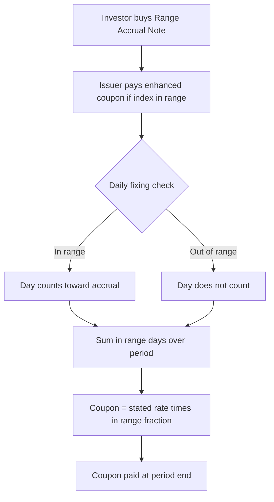

## Range Accrual Notes

### Overview

A Range Accrual Note (RAN) is a structured note that pays a coupon proportional to the number of days (or fixing dates) during an accrual period on which a reference index — typically a interest rate, credit spread, FX rate, or equity level — fixes within a predefined range. The instrument allows investors to express a view that a reference rate will remain range-bound, in exchange for enhanced coupon relative to a plain fixed or floating note, while bearing the risk of coupon reduction (or zero coupon) if the reference trades outside the range for an extended portion of the period.

---

### Basic Payoff Mechanics

**Key Points**

- The note pays a coupon at the end of each accrual period equal to:

$$C = N \times c \times \frac{n_{\text{in}}}{n_{\text{total}}}$$

where $N$ is notional, $c$ is the stated coupon rate for the period, $n_{\text{in}}$ is the number of observation days (or dates) the reference index fixed within the range $[L, U]$, and $n_{\text{total}}$ is the total number of observation days in the period.

- Observations are typically **daily** for interest-rate range accruals (e.g., referencing daily SOFR or EURIBOR fixings) but can be less frequent for other underlyings.
- The **range** $[L, U]$ may be:
  - **Fixed** for the life of the note.
  - **Stepped up/down** across successive periods (common in callable structures to maintain attractiveness as rates evolve).
  - **One-sided** (e.g., accrual condition is simply "index stays below $U$" or "index stays above $L$").

**Example**

A 5-year USD range accrual note referencing daily SOFR, with range $[3.00\%, 4.50\%]$ and stated coupon $c = 6.00\%$ per annum, paid quarterly. If SOFR fixes within the range on 55 of 63 business days in a quarter, the coupon paid for that quarter is:

$$6.00\% \times \frac{55}{63} \times \frac{1}{4} \approx 1.31\%$$

---

### Decomposition into a Strip of Digital Options

**Key Points**

- The core valuation insight is that a range accrual coupon can be decomposed into a **strip of digital (binary) options**, one per observation date, each paying $1/n_{\text{total}}$ of the coupon if the index fixes within the range on that date.
- Each daily "in-range" indicator can itself be decomposed as the difference of two digital options:

  $$\mathbb{1}_{\{L \leq X_t \leq U\}} = \mathbb{1}_{\{X_t \geq L\}} - \mathbb{1}_{\{X_t \geq U\}}$$

  i.e., a **digital call spread** struck at $L$ and $U$.
- This means the fair value of the coupon leg is:

  $$V_{\text{coupon}} = \sum_{i=1}^{n} P(0, T_{\text{pay}}) \times \frac{c}{n} \times \left[\text{DigitalCall}(L, T_i) - \text{DigitalCall}(U, T_i)\right]$$

  where each digital is valued under the appropriate forward measure for the fixing date $T_i$, discounted to the payment date $T_{\text{pay}}$.
- Digital options are commonly priced via a **tight call spread replication** (approximating the discontinuous digital payoff with a steep but continuous payoff using two vanilla options struck close together) to avoid the numerical instability of pricing a true discontinuous payoff directly, and to obtain a well-defined vega/gamma profile for risk management.

$$\text{DigitalCall}(K) \approx \frac{\text{Call}(K - \epsilon) - \text{Call}(K + \epsilon)}{2\epsilon}$$

---

### Range Accrual Note Structure Diagram

---

### Valuation Approach

**Key Points**

- **Interest-rate range accruals** referencing a short-term rate (e.g., SOFR, EURIBOR, term rates) are typically valued using a term structure model consistent with the swaption/cap volatility surface, since the embedded digitals require an accurate volatility smile at each strike ($L$ and $U$) and each fixing date.
- Common modeling choices:
  - **Market Model (LMM)** or **Hull-White/Gaussian short-rate models** extended with a local or stochastic volatility overlay to fit the smile at the relevant strikes.
  - **SABR-style smile interpolation** at each fixing date to obtain consistent digital option prices across the strike range $[L, U]$.
- **Convexity/timing adjustments** are required because daily fixings of a rate index observed and paid with lag introduce a **timing mismatch** between the natural payment date of the underlying rate and the coupon payment date of the note — analogous to the convexity adjustment required for LIBOR-in-arrears products.
- For **long-dated notes with many observation dates**, computing the full strip of digitals analytically (rather than via full Monte Carlo simulation of the path) is significantly more efficient, since each day's in/out-of-range probability can often be computed via the model's marginal distribution at that fixing date without needing the joint path (the payoff is **additively separable** across days, not path-dependent in a way that requires joint distribution — correlation across days does not affect the *expected* number of in-range days, only the payoff's variance).
- **Callable range accrual notes** (very common — most range accruals are also issuer-callable) require significantly more computation, since the issuer's call decision (typically executed to call away the note before increased benefit accrues to the investor) is intertwined with the range-accrual coupon path, generally requiring a **Longstaff-Schwartz least-squares Monte Carlo** or a **PDE/lattice** approach for the callable feature layered on top of the digital-strip coupon valuation.

---

### Risk Profile

**Key Points**

- **Vega profile**: range accrual notes are short volatility exposure — the note becomes more expensive to the issuer (favorable coupon for the investor) when realized rate volatility is lower and the reference stays within the range; the investor is effectively **short volatility, long carry**.
- **Skew/smile sensitivity**: because the payoff depends on digital options at two distinct strikes ($L$ and $U$), the note's value is sensitive to the **relative skew** between those strikes, not just the at-the-money volatility level — a steep skew makes one side of the range structurally cheaper/more expensive to replicate than a symmetric-smile assumption would suggest.
- **Correlation risk (multi-underlying range accruals)**: "dual range accruals" that require *both* an interest rate index *and* an FX rate (or a second rate index) to be within their respective ranges simultaneously introduce correlation risk between the two underlyings, since the joint in-range probability depends on their co-movement, not just their marginal distributions.
- **Path dependency from daily observation**: while the expected coupon does not require joint-day correlation (as noted above), risk management (Greeks over time, P&L attribution) does depend on realized day-to-day rate behavior, and hedging with the replicating digital-spread positions requires periodic rebalancing as time passes and fixings are realized.

---

### Common Variants

**Key Points**

- **Single-range accrual**: as described above, standard interest-rate range accrual.
- **Dual-range / dual-index accrual**: accrual condition requires two reference indices to simultaneously satisfy their respective ranges (e.g., short rate in range AND long rate in range — a "steepener range accrual").
- **CMS spread range accrual**: range condition based on the spread between two constant maturity swap rates (e.g., 10Y CMS − 2Y CMS), used to express a view on curve steepness remaining within a band.
- **FX range accrual**: reference index is an FX rate; used to express a view that an exchange rate will remain within a trading band, common in emerging-market or carry-trade-linked structured notes.
- **Range accrual with knockout/knock-in**: an additional barrier feature that terminates or activates the range-accrual feature entirely if the index breaches a separate, wider barrier level, layering barrier-option risk on top of the digital-strip coupon.
- **Snowball / accreting range accruals**: coupon in one period depends on accrual performance in prior periods, adding genuine path dependency across periods (not just within a period) and requiring full path simulation.

---

### Practical Pitfalls

- **Underestimating skew impact**: pricing the range boundaries using a single flat implied volatility (rather than the correct smile-consistent volatility at each strike) can materially misprice the note, especially when $L$ and $U$ sit in different regions of the smile.
- **Treating daily fixings as fully path-independent for risk purposes**: while the *expected* coupon doesn't need joint-date correlation, Greeks (especially vega and correlation Greeks for dual-range products) do depend on the joint dynamics and must be computed with a model that captures the correct dependency structure.
- **Ignoring the embedded call feature's economic value**: since most range accruals are callable, quoting or reserving against the coupon leg alone (ignoring the issuer's call optionality) significantly overstates the note's value to the investor.
- **Convexity/timing adjustment omission**: neglecting the adjustment for the lag between rate fixing and coupon payment can introduce a small but systematic pricing bias, particularly for longer-dated notes with in-arrears-style fixing conventions.

---

**Next Steps**

- Digital Option Replication and Call Spread Approximation Techniques
- CMS Spread Options and Convexity Adjustments
- Callable Structured Notes and Longstaff-Schwartz Monte Carlo
- SABR Model and Smile-Consistent Digital Pricing
- Dual-Range and Multi-Asset Range Accrual Structures
- Structured Note Risk Management: Vega, Skew, and Correlation Greeks