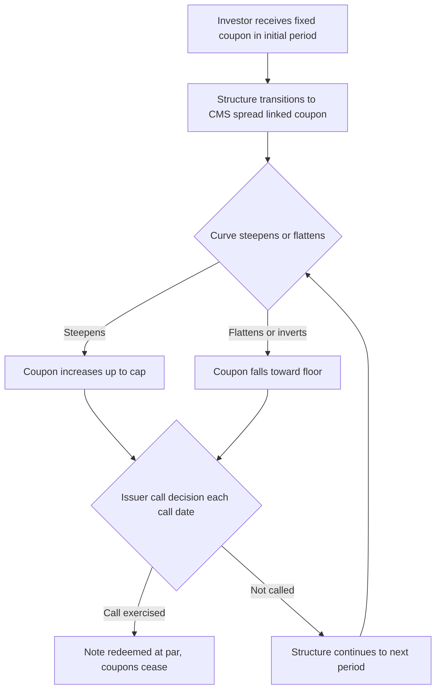

## Callable and Steepener Notes

### Overview

Callable and steepener notes are structured notes whose coupons are linked to interest rate curve shape and whose economics are dominated by an embedded issuer call option. A **steepener note** pays a coupon linked to the slope of the yield curve (typically a CMS spread such as 10Y CMS − 2Y CMS), allowing investors to express a view on curve steepening. Because such notes are almost always issued with an embedded **Bermudan call option** in the issuer's favor, valuing and risk-managing them requires combining CMS spread option pricing with callable-note optimal-exercise valuation.

---

### Steepener Coupon Mechanics

**Key Points**

- A standard **CMS steepener** coupon formula for period $i$ is:

$$c_i = \max\left(\alpha \times \left(\text{CMS}_{10Y}(T_i) - \text{CMS}_{2Y}(T_i)\right) + \beta,\ 0\right)$$

or, in a leveraged form:

$$c_i = \max\left(L \times \left(\text{CMS}_{10Y}(T_i) - \text{CMS}_{2Y}(T_i)\right),\ f_{\min}\right)$$

where $L$ is a leverage factor (commonly 2x–10x to make a modest curve-slope move economically meaningful), and $f_{\min}$ is a coupon floor (often zero).

- Common structural features layered on top:
  - **Fixed-to-floating (or fixed-to-steepener) structure**: note pays a high fixed coupon for an initial "teaser" period (e.g., years 1–2), then switches to the CMS-spread-linked steepener coupon for the remaining life.
  - **Coupon cap**: the steepener coupon is often capped as well as floored, turning the payoff into a **collared** CMS spread position (long a spread floor, short a spread cap from the investor's perspective).
  - **Leverage**: the multiplier $L$ on the CMS spread is central to the note's risk profile — higher leverage increases both the upside from steepening and the downside/duration risk if the curve flattens or inverts.

**Example**

A 10-year note pays 6.00% fixed in years 1–2, then pays $\max(4 \times (\text{CMS}_{10Y} - \text{CMS}_{2Y}), 0\%)$, capped at 8.00%, for years 3–10, callable annually by the issuer from year 3 onward.

---

### Why These Notes Are (Almost Always) Callable

**Key Points**

- Steepener notes are structured to be attractive when issued (offering an above-market fixed coupon or an attractive leverage on the spread), which means the issuer is economically short an expensive optionality package to the investor.
- The issuer typically **retains a Bermudan call option** to offset/monetize this cost — the issuer can call the note away once market conditions make the embedded coupon structure unfavorable to the issuer (e.g., if the curve steepens persistently, raising the cost of future coupons, the issuer calls the note to cap its liability).
- From the investor's perspective, the **net position** is: long the CMS spread coupon structure (with floor/cap), **short a Bermudan call option** to the issuer. The premium from selling this call option is what subsidizes the enhanced initial coupon or higher leverage than would otherwise be sustainable.
- This means **the note's yield enhancement is compensation for two distinct risks**: (1) the curve-shape/CMS-spread risk, and (2) the reinvestment/optionality risk from the issuer's call right, which tends to be exercised precisely when reinvestment conditions are least favorable to the investor (negative convexity, similar in spirit to a callable bond).

---

### Structure Diagram

---

### Valuation Framework

**Key Points**

- **Step 1 — Price the CMS spread option coupon leg** (ignoring callability): this requires a model of the joint distribution of two CMS rates, since the payoff is a spread option, not a simple digital or vanilla option on a single rate.
  - **CMS convexity adjustment**: each CMS rate itself requires a convexity adjustment (a CMS rate is not a traded asset and its expectation under the relevant forward measure differs from the raw swap rate due to the annuity/timing mismatch between the swap's payment schedule and the coupon payment date).
  - **Spread option pricing**: after adjusting each leg for convexity, the spread option requires a joint model — common approaches include a **two-factor Gaussian/lognormal model** for the two CMS rates with a specified correlation, or **copula-based approaches** combining each leg's own smile-consistent marginal distribution (from the swaption smile) with an assumed correlation structure.
- **Step 2 — Layer in the Bermudan call decision**: the issuer's optimal call decision depends on the value of continuing to hold the (now short) coupon structure versus calling at par. This is a genuine **optimal stopping problem** requiring either:
  - **Longstaff-Schwartz Least-Squares Monte Carlo (LSM)**: simulate the joint term structure (typically via a multi-factor short-rate or market model), simulate the CMS spread coupon path, and use regression-based backward induction to estimate the continuation value at each call date.
  - **PDE/lattice methods**: feasible for one- or two-factor short-rate models but become impractical as the number of state variables needed to capture the CMS spread dynamics grows.
- **Step 3 — Combine**: the note's fair value to the investor equals the value of the (long) coupon leg minus the value of the (issuer's) Bermudan call option, both computed under a model calibrated to the swaption volatility cube (including the correlation/spread-option-relevant smile dynamics) and the discount curve.

---

### Model Requirements

**Key Points**

- **Multi-factor term structure model**: because the payoff depends on two points on the curve (e.g., 10Y and 2Y swap rates) and their *joint* evolution, a one-factor short-rate model (which forces near-perfect correlation across the curve) is structurally inadequate — a minimum of a two-factor model (e.g., two-factor Hull-White, or an LMM with a rich correlation structure) is required to produce realistic curve-steepening/flattening dynamics.
- **Correlation calibration**: the correlation between the two CMS rates is a critical, often illiquid parameter; it is typically inferred from historical curve-shape data or extracted implicitly from the prices of exchange-traded CMS spread options where available, and stress-tested since it materially affects the spread option's value (higher correlation reduces spread volatility, cheapening the coupon leg).
- **Volatility smile per CMS tenor**: each CMS rate's own volatility smile (from the swaption cube at the relevant tenor and maturity) must be respected in the marginal distribution used within the joint model, since the spread option's value is sensitive to each leg's smile, not just its at-the-money volatility.

---

### Risk Profile

**Key Points**

- **Curve risk (CMS spread delta)**: the note's primary directional risk is exposure to the steepness/flatness of the yield curve segment referenced (e.g., 2s10s), which behaves differently from outright duration/level risk — a parallel shift in rates with no change in curve shape leaves the coupon largely unaffected, whereas curve flattening or inversion reduces or eliminates the coupon.
- **Negative convexity from the call feature**: like a callable bond, the note's price appreciation is capped as market conditions become favorable to the investor (steepening curve, e.g.) because the issuer is more likely to call the note away, converting potential upside into an early return of principal at par.
- **Correlation risk**: value is sensitive to the assumed/implied correlation between the two CMS rates, an illiquid and model-dependent input, making the note's mark-to-market sensitive to correlation assumption changes even absent any change in the two rates themselves.
- **Vega and cross-vega**: exposure to the implied volatility of both the 2Y and 10Y swaption points, and to the "spread vega" or correlation sensitivity that is distinct from either leg's individual vega.
- **Extension/reinvestment risk**: if the curve flattens and stays flat, the issuer has no incentive to call, and the investor may be left holding a long-dated note paying at or near the floor coupon — the mirror image of prepayment risk in callable/mortgage-related products, sometimes called "extension risk."

---

### Common Variants

**Key Points**

- **Range accrual steepener**: combines a CMS spread condition with a range-accrual-style day-count feature (coupon accrues only on days the spread is within/above a threshold), stacking two path-dependent features.
- **Digital steepener**: pays a fixed enhanced coupon if the spread is above a threshold on the observation date, zero (or a low floor) otherwise — a digital rather than linear payoff on the spread.

  – **Inverse floater / flattener notes**: the mirror-image structure, paying more when the curve flattens or inverts, used to express the opposite market view.
- **Cross-currency steepeners**: reference the curve slope in one currency while the note itself is denominated in another, adding an FX/quanto adjustment to the CMS spread option pricing.

---

### Practical Pitfalls

- **Modeling the two CMS legs independently**: pricing each CMS coupon convexity adjustment and volatility smile in isolation without a properly specified joint/correlation model materially misprices the spread option — spread options are fundamentally about the *joint* distribution, not just the two marginals.
- **Underestimating negative convexity from the call**: valuing the coupon leg alone without the issuer's Bermudan call option overstates the note's fair value to the investor, sometimes substantially, especially for long-dated, deeply in-the-money-to-call structures.
- **Static correlation assumption**: treating the CMS-CMS correlation as a fixed, unchanging parameter ignores that curve correlation itself can shift materially in stressed environments (e.g., curve dynamics changing character across hiking versus cutting cycles), which is a material model risk for long-dated steepener books.
- **Ignoring extension risk in liquidity/duration management**: assuming the issuer will call at the "obviously optimal" date based on a simple rule of thumb, rather than the model-implied optimal stopping boundary, can misstate the note's expected life and duration for hedging purposes.

---

**Next Steps**

- CMS Convexity Adjustments and Rate Payment Timing
- CMS Spread Option Pricing and Correlation Modeling
- Longstaff-Schwartz Least-Squares Monte Carlo for Callable Structures
- Two-Factor Short-Rate Models for Curve Shape Dynamics
- Bermudan Swaption Valuation and Exercise Boundaries
- Negative Convexity and Extension Risk in Callable Structured Products