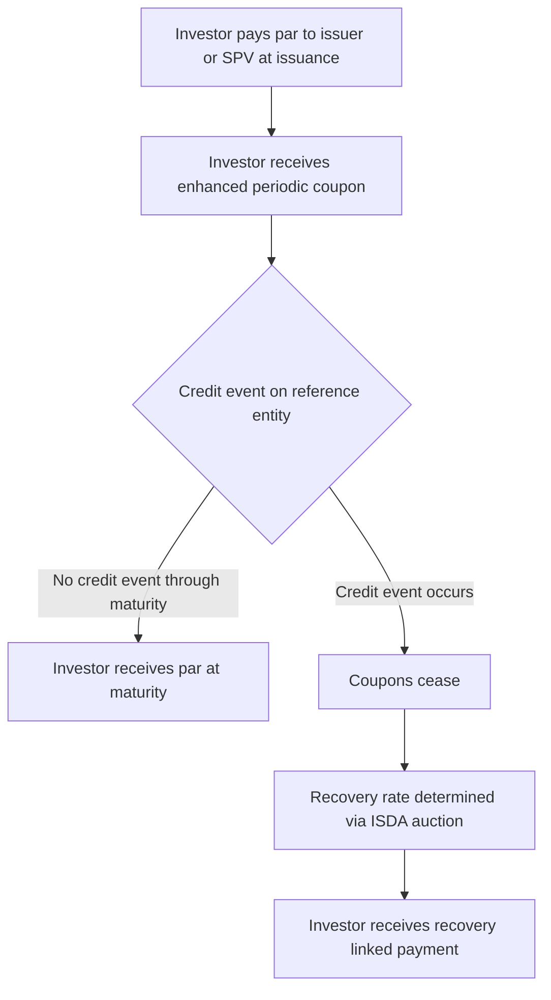

## Credit Linked Notes and Default Linked Payoffs

### Overview

A Credit Linked Note (CLN) is a structured note whose principal and/or coupon payments are contingent on the credit performance of one or more reference entities. Economically, a CLN combines a funded note (the investor pays par upfront) with an embedded **credit default swap (CDS)** sold by the investor to the note issuer (or to a special purpose vehicle, SPV). The investor is compensated with an enhanced coupon for bearing the credit risk of the reference entity/entities, and receives reduced (or zero) principal back if a credit event occurs.

---

### Basic Structure and Cash Flows

**Key Points**

- **At issuance**: investor pays par (or issue price) to the issuer/SPV in exchange for the note.
- **During the life of the note** (absent a credit event): investor receives periodic coupons, typically structured as:

  $$c = r_{\text{funding}} + s_{\text{CDS}}$$

  where $r_{\text{funding}}$ is the issuer's funding cost (or a reference rate plus spread) and $s_{\text{CDS}}$ is the CDS premium (spread) on the reference entity — the enhanced yield reflects the credit risk premium being sold by the investor.
- **If a credit event occurs** on the reference entity before maturity:
  - The note is terminated early.
  - The investor receives a **recovery-linked payment**, typically:

    $$\text{Payment} = N \times R$$

    where $R$ is the recovery rate (determined via a **CDS auction/ISDA credit event auction** process, or via a pre-agreed fixed recovery assumption for some structures).
  - Remaining coupons cease.
- **At maturity** (absent a credit event): investor receives par (or the structured redemption amount) in full.

**Example**

A 5-year USD 10 million CLN referencing a single corporate reference entity, paying SOFR + 250bp quarterly. If the reference entity defaults in year 3 and the ISDA auction determines a recovery rate of 40%, the investor receives a final payment of $4 million (40% of notional) in lieu of the remaining coupons and par redemption, and the note terminates.

---

### CLN as a Funded Synthetic Position

**Key Points**

- The CLN can be decomposed conceptually as:

  $$\text{CLN} = \text{Funded Note (e.g., FRN)} + \text{Short CDS Protection (investor sells protection)}$$
- This is the "funded" counterpart to an **unfunded CDS**: in an unfunded CDS, the protection seller receives the CDS premium but posts no upfront cash and faces counterparty risk to the protection buyer over the life of the trade; in a CLN, the investor pays cash upfront (removing the protection buyer's counterparty risk to the investor, since the investor's maximum loss is prefunded) and the enhanced coupon embeds the CDS premium on top of the funding-cost component.
- This structural difference — **prefunded vs. unfunded protection** — is the primary reason CLNs exist: they allow investors who cannot (or do not wish to) transact derivatives directly (due to regulatory, documentation, or mandate restrictions) to gain synthetic credit exposure via a cash bond-like instrument, and they eliminate the issuer's counterparty credit risk to the investor as protection seller.

---

### Structure Diagram

---

### Credit Event Definitions

**Key Points**

- CLN documentation typically references standard **ISDA Credit Derivatives Definitions** to define what constitutes a "credit event," commonly including:
  - **Bankruptcy**
  - **Failure to pay** (missed principal or interest payment beyond a grace period, above a materiality threshold)
  - **Restructuring** (in some jurisdictions/documentation types — often excluded or modified in North American CDS conventions ["No-R," "Mod-R," "Mod-Mod-R"] versus more commonly included in European conventions)
  - **Repudiation/moratorium** and **obligation acceleration** (used in sovereign or emerging-market reference entities more than corporates)
- The **determinations committee (DC)** process under ISDA governs whether a credit event has formally occurred for standardized reference entities, and the **auction mechanism** determines the final settlement/recovery price used for cash-settled contracts, which most modern CLNs reference directly to align payouts with the broader CDS market.

---

### Structural Variants

**Key Points**

- **Single-name CLN**: references one corporate or sovereign entity, as described above.
- **Basket CLN / First-to-Default (FtD) Note**: references a basket of several reference entities; the note terminates (with the recovery-linked payment) upon the **first** credit event among any entity in the basket. Because the investor is exposed to the highest-risk single name effectively (whichever defaults first), FtD notes pay a spread close to the **sum** of the basket's individual CDS spreads for low correlation, converging toward the spread of the single riskiest name as correlation approaches 1 (since a highly correlated basket behaves more like a single credit).
- **Nth-to-Default Note**: pays out only after the $N$-th credit event in the basket (e.g., second-to-default) — a less risky (higher subordination) structure than FtD, priced with **correlation-sensitive** basket credit models.
- **Tranche-linked CLN (Synthetic CDO note)**: references a specific loss tranche (e.g., 3%–7% of losses) of a large diversified reference portfolio (often via an index such as CDX or iTraxx), functionally a funded note version of a synthetic CDO tranche; highly sensitive to **default correlation** across the underlying portfolio.
- **Zero-recovery / fixed-recovery CLN**: some notes specify a fixed recovery assumption (e.g., 0% or 50%) at issuance rather than referencing the auction-determined recovery, simplifying the payoff but introducing basis risk relative to the actual CDS market outcome.
- **Principal-protected CLN**: structured so that only the *coupon* is at risk from a credit event, with principal returned in full at maturity regardless of credit events — economically closer to a coupon-linked digital credit option than a full CDS-equivalent exposure.

---

### Valuation Approach

**Key Points**

- **Single-name CLN valuation** follows standard CDS-implied hazard rate / survival probability methodology:
  - Bootstrap a **survival curve** (hazard rates $\lambda(t)$) from the reference entity's CDS spread curve (or bond-implied spreads if CDS is illiquid).
  - Value the coupon leg as the expected present value of coupons paid contingent on survival:

    $$V_{\text{coupon}} = \sum_i c \cdot \Delta t_i \cdot P(0,T_i) \cdot Q(T_i)$$

    where $Q(T_i)$ is the risk-neutral survival probability to time $T_i$.
  - Value the recovery/protection leg as the expected present value of the recovery payment, contingent on default occurring within each period:

    $$V_{\text{protection}} = \int_0^T P(0,t) \cdot R \cdot \left(-\frac{dQ(t)}{dt}\right) dt$$
  - The note's fair coupon/spread is set such that the funded note's value equals par at issuance, analogous to CDS par-spread bootstrapping.
- **Basket/tranche CLN valuation** requires a **default correlation model**, most commonly:
  - **Gaussian copula** (the long-standing market-standard approach for synthetic CDO/basket pricing, despite well-documented limitations around tail dependence).
  - **Factor copula models** (one-factor Gaussian, Student-t, or double-t copulas) to generate joint default times from individual survival curves plus a correlation/factor loading parameter.
  - **Base correlation** framework for tranche pricing, which maps tranche prices to an implied correlation skew analogous to an implied volatility smile in options markets.

---

### Risk Profile

**Key Points**

- **Credit spread risk (CS01)**: sensitivity to changes in the reference entity's CDS spread curve — the note's value declines as the market-implied default risk of the reference entity rises (spread widening).
- **Jump-to-default risk**: unlike spread-based products, a CLN carries genuine discontinuous ("jump") risk — the note's value can drop suddenly and substantially upon an actual credit event, not just gradually as spreads widen, since spread-implied probability and an actual default event are distinct risk dimensions.
- **Recovery rate risk**: for structures referencing the ISDA auction-determined recovery, the actual realized recovery rate is uncertain until the credit event auction occurs, and can differ materially from market assumptions embedded in CDS pricing (which often uses a standardized 40% recovery assumption for pricing convenience, distinct from the realized outcome).
- **Correlation risk (basket/tranche structures)**: for FtD, Nth-to-default, and tranche CLNs, value is highly sensitive to the assumed default correlation across the basket/portfolio — a parameter that is illiquid, regime-dependent, and subject to significant model risk, particularly for equity tranches (highly negatively correlation-sensitive) versus senior tranches (positively correlation-sensitive).
- **Issuer/SPV counterparty risk**: even though the CLN structure removes the *investor's* counterparty risk exposure as protection seller (since cash is prefunded), the investor still bears **issuer credit risk** — if the CLN is issued directly by a bank rather than via a bankruptcy-remote SPV, the investor is exposed to the issuer's own default risk in addition to the reference entity's, a historically important distinction (highlighted during the 2008 financial crisis when several CLN issuers themselves became distressed).

---

### Practical Pitfalls

- **Conflating issuer risk and reference entity risk**: failing to distinguish between the credit risk of the note's issuer (repayment risk) and the credit risk of the referenced entity (the risk being synthetically transferred) can lead to significant underestimation of the note's total risk, especially for non-SPV-issued notes.
- **Using outdated or mismatched recovery assumptions**: applying a generic 40% recovery assumption in valuation models when the actual reference entity's seniority, jurisdiction, or sector suggests a materially different expected recovery.
- **Underestimating correlation model risk in baskets/tranches**: treating a single correlation parameter (or a static base-correlation skew) as a stable, reliable input rather than a model convention subject to significant recalibration risk, especially in stressed credit markets where realized correlation can spike suddenly.
- **Ignoring documentation basis risk**: differences between the CLN's specific credit event definitions/settlement mechanics and the standard ISDA definitions used in the broader CDS market can create basis risk between the note's payout and what a "vanilla" CDS-implied hedge would deliver.

---

**Next Steps**

- CDS Pricing and Survival Curve Bootstrapping
- ISDA Credit Event Determinations and Auction Mechanics
- Gaussian Copula and Base Correlation for Synthetic CDO Tranches
- First-to-Default and Nth-to-Default Basket Modeling
- Counterparty Risk in Funded vs. Unfunded Credit Derivatives
- CVA/DVA Considerations for Credit-Linked Structured Products