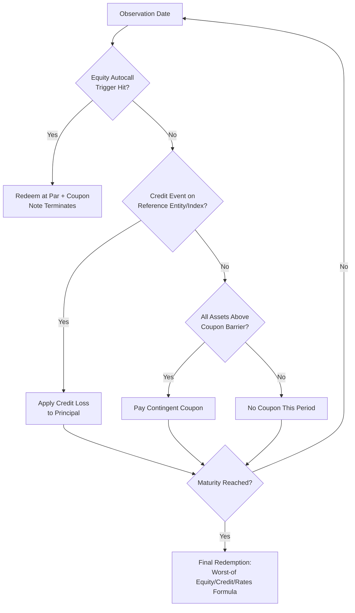

## Hybrid Multi Asset Structured Notes

### Definition and Conceptual Overview

A Hybrid Multi Asset Structured Note is a structured product whose payoff (coupon and/or redemption amount) is contingent on the joint or conditional performance of two or more underlying assets drawn from **different asset classes** — typically some combination of equities (single stocks, baskets, indices), interest rates (swap rates, CMS rates), credit (single-name or index CDS reference entities), FX rates, commodities, and inflation indices.

The defining feature is **cross-asset-class linkage**, which distinguishes these notes from single-asset-class multi-underlying notes (e.g., a worst-of note on three equity indices). Hybrid notes are engineered to:

- Harvest risk premia from multiple, ideally weakly-correlated, sources
- Express a macro or relative-value thesis spanning asset classes (e.g., "rates stay low AND credit stays tight AND equities don't crash")
- Enhance coupon by selling multi-factor optionality (correlation risk premium) to the note issuer/dealer
- Provide issuers with diversified, cost-efficient hedging relative to hedging each risk in isolation

**Key Points**

- Hybrid notes are fundamentally a **correlation trade**: the investor is implicitly short cross-asset correlation risk in most common structures (e.g., worst-of, everything-must-work payoffs).
- Pricing requires a **joint dependence model** across asset classes, not just marginal volatility surfaces per asset.
- Legally and operationally, these are typically issued as senior unsecured medium-term notes (MTNs) off an issuer's EMTN/GMTN program, embedding a derivative (swap or option) between the issuer and a hedging dealer (often an affiliate).

---

### Structural Anatomy

A hybrid multi-asset note decomposes into:

1. **Funding/bond component** — the zero-coupon or fixed-coupon bond floor, reflecting the issuer's credit and the discount curve.
2. **Derivative overlay** — one or more options/swaps referencing the multi-asset basket or conditional structure.
3. **Trigger/barrier logic** — autocall, knock-in, knock-out, or range-accrual conditions tied to one, several, or all underlyings.
4. **Coupon mechanism** — fixed, contingent, digital, or accrual-based, often "worst-of" across asset classes.

$$V_{\text{note}} = B(0,T) \cdot N + \text{PV}[\text{Derivative Overlay}] - \text{Structuring/Distribution Margin}$$

where $B(0,T)$ is the issuer's discount factor to maturity $T$ and $N$ is notional.

---

### Common Hybrid Multi-Asset Structures

#### 1. Rates-Equity Hybrid Notes

- **Range accrual on a CMS spread, with equity-linked redemption**: coupon accrues based on days an interest rate condition (e.g., CMS10Y − CMS2Y $>$ 0) is satisfied; principal redemption is linked to an equity index knock-in put.
- **Callable Reverse Convertible with Rate-Linked Call**: issuer's call decision proxy embedded via a rate trigger (e.g., callable if 3M LIBOR/SOFR resets above a level), combined with equity worst-of downside.

#### 2. Credit-Equity Hybrid Notes (Equity-Linked CLNs)

- Coupon paid contingent on **no credit event** on a reference entity/basket (CDS-linked), **and** redemption linked to equity performance of the same or related issuer(s).
- Common in single-name corporate exposure: e.g., a note referencing Company X's credit (via CDS) and Company X's stock (via equity option), allowing investors to express a combined capital-structure view.

#### 3. Rates-Credit Hybrid Notes

- **CMS-linked Credit-Linked Notes (CLNs)**: coupon is the greater of a CMS-based floating rate or a fixed rate, contingent on no credit event on an index (e.g., CDX.NA.IG) or single name; principal is credit-contingent (par minus recovery-linked loss if default occurs).

#### 4. FX-Equity-Rates Triple Hybrids

- Emerging-market linked notes: coupon linked to an EM equity index, subject to an FX knock-out barrier (protecting/exposing to currency depreciation), and discounted/funded off a local-currency or hard-currency rate curve.

#### 5. Commodity-Equity-Rates Notes

- Inflation-hedging structures: coupon linked to a commodity basket (e.g., energy/metals), with a floor tied to an inflation index (CPI) and a cap based on a rates trigger.

**Example**

*3-Year Autocallable Hybrid Note (Equity + Credit)*

- Underlyings: S&P 500 Index (equity) and CDX.NA.IG index (credit)
- Autocall: If S&P 500 closes at or above 100% of initial level on any annual observation date, note redeems at par plus accrued coupon.
- Coupon: 7.00% p.a., paid quarterly, **contingent** on (a) S&P 500 $\geq$ 70% barrier on observation date AND (b) no credit event affecting $\geq$ 5% of CDX.NA.IG constituents by notional weight.
- Maturity redemption (if not autocalled): worst-of (i) par reduced by equity downside beyond 70% barrier (European put), (ii) par reduced by cumulative credit losses on CDX.NA.IG.

---

### Payoff Mechanics and Mathematical Formulation

#### Generic Multi-Asset Worst-Of Contingent Coupon

$$C_t = \begin{cases} c \cdot N & \text{if } \min_i \left( \dfrac{S_i(t)}{S_i(0)} \right) \geq K_{\text{barrier}} \text{ for all asset classes } i \\ 0 & \text{otherwise} \end{cases}$$

where $S_i(t)$ is the level of asset class $i$'s reference (normalized index level, CDS survival probability proxy, or rate level transformed to a comparable metric).

#### Credit Component — Survival-Contingent Cash Flow

For the credit leg, the coupon/notional survives only absent a credit event:

$$\text{PV}_{\text{credit leg}} = \sum_{t=1}^{T} c \cdot N \cdot Q(0,t) \cdot D(0,t)$$

where $Q(0,t)$ is the risk-neutral survival probability to time $t$ (derived from the CDS curve) and $D(0,t)$ is the discount factor.

#### Redemption with Cross-Asset Worst-Of Barrier

$$\text{Redemption} = N \cdot \min\left(1,\ 1 - \max(0, K - \min(R_{\text{eq}}, R_{\text{credit}}, R_{\text{rate}}))\right)$$

where $R_{\text{eq}}, R_{\text{credit}}, R_{\text{rate}}$ are normalized performance ratios per asset class and $K$ is the strike/barrier level.

---

### Pricing Framework

#### Component-Based Valuation

1. **Bond floor**: discount redemption/coupon streams at the issuer's own funding curve (issuer credit spread + risk-free curve).
2. **Derivative overlay**: priced as a basket/rainbow option under a **joint stochastic model**.

#### Modeling Cross-Asset Dependence

Because equities, rates, credit, and FX have fundamentally different stochastic dynamics, hybrid pricing typically uses:

- **Equity**: local volatility or stochastic volatility (Heston, SABR) models
- **Rates**: short-rate models (Hull-White) or LIBOR Market Model (LMM) for CMS-linked payoffs
- **Credit**: reduced-form intensity models (Cox process / hazard rate models) calibrated to CDS curves
- **Correlation coupling**: a Gaussian or t-copula links the driving Brownian motions/jump processes across asset classes, or a **hybrid Monte Carlo** simulates all factors jointly under a common pricing measure with cross-asset correlation matrix $\rho_{ij}$

$$dS_i = \mu_i S_i \, dt + \sigma_i S_i \, dW_i, \quad d\langle W_i, W_j \rangle = \rho_{ij}\, dt$$

For credit-equity coupling specifically, **jump-to-default equity models** (e.g., Merton-style or JDCEV) are common, where equity price dynamics include a jump-to-zero component at the default intensity $\lambda_t$, naturally linking equity vol skew to credit spread level.

**Key Points**

- Cross-asset correlation is the single largest driver of pricing uncertainty in hybrids; unlike single-asset-class correlation (which has liquid dispersion/correlation swap markets for equities), cross-asset correlation (e.g., equity-credit, rates-FX) is largely **[Inference]** estimated from historical regression or stress scenarios rather than observed from a liquid market, since no standard exchange-traded cross-asset correlation product exists.
- Model risk is elevated: small changes in copula choice or correlation assumption can materially shift the fair value of worst-of and everything-must-work structures.

---

### Greeks and Risk Sensitivities

| Greek | Equity Leg | Rates Leg | Credit Leg |
| --- | --- | --- | --- |
| Delta | $\partial V/\partial S$ | DV01 ($\partial V/\partial r$) | CS01 ($\partial V/\partial \text{spread}$) |
| Vega | Equity implied vol sensitivity | Swaption vol sensitivity | Credit spread vol (jump-to-default sensitivity) |
| Cross-gamma | $\partial^2 V/\partial S \partial r$ | Rate-credit cross terms | Equity-credit cross terms |
| Correlation risk | $\partial V/\partial \rho_{\text{eq,cr}}$, $\partial V/\partial \rho_{\text{eq,rates}}$ |  |  |

Hybrid notes carry **cross-gamma** exposures that single-asset-class books do not: a move in rates can change the effective moneyness of the equity barrier (via discounting) while simultaneously widening credit spreads (flight-to-quality), compounding losses to the note issuer's hedge book in stressed regimes. Dealers typically manage this via a centralized **hybrid/XVA desk** rather than siloed asset-class desks.

---

### Diagram: Hybrid Note Cash Flow and Risk Structure (svg_diagram)

<svg xmlns="http://www.w3.org/2000/svg" viewBox="0 0 900 480">
<text x="450" y="25" font-size="16" font-weight="bold" text-anchor="middle">Hybrid Multi Asset Structured Note — Structure (svg_diagram)</text>

<rect x="20" y="60" width="140" height="60" fill="#dbeafe" stroke="#1e3a8a" stroke-width="1.5" />
<text x="90" y="85" font-size="12" text-anchor="middle" font-weight="bold">Investor</text>
<text x="90" y="102" font-size="10" text-anchor="middle">Pays Purchase Price</text>

<rect x="220" y="60" width="160" height="60" fill="#fef3c7" stroke="#92400e" stroke-width="1.5" />
<text x="300" y="85" font-size="12" text-anchor="middle" font-weight="bold">Issuer (MTN)</text>
<text x="300" y="102" font-size="10" text-anchor="middle">Note Principal Amount</text>

<rect x="440" y="60" width="180" height="60" fill="#fee2e2" stroke="#991b1b" stroke-width="1.5" />
<text x="530" y="85" font-size="12" text-anchor="middle" font-weight="bold">Hedging Dealer</text>
<text x="530" y="102" font-size="10" text-anchor="middle">(Hybrid Derivatives Desk)</text>

<line x1="160" y1="90" x2="220" y2="90" stroke="black" stroke-width="1.5" marker-end="url(#arrow)" />
<text x="190" y="82" font-size="9" text-anchor="middle">Cash</text>
<line x1="380" y1="90" x2="440" y2="90" stroke="black" stroke-width="1.5" marker-end="url(#arrow)" />
<text x="410" y="82" font-size="9" text-anchor="middle">Swap</text>
<line x1="220" y1="105" x2="160" y2="105" stroke="black" stroke-width="1.5" marker-end="url(#arrow)" />
<text x="190" y="118" font-size="9" text-anchor="middle">Coupons/Redemption</text>
<text x="530" y="160" font-size="12" font-weight="bold" text-anchor="middle">Multi-Asset Reference Basket</text>

<rect x="330" y="180" width="120" height="50" fill="#dcfce7" stroke="#166534" stroke-width="1.5" />
<text x="390" y="200" font-size="10" text-anchor="middle" font-weight="bold">Equity</text>
<text x="390" y="215" font-size="9" text-anchor="middle">Index/Basket</text>
<rect x="465" y="180" width="120" height="50" fill="#ede9fe" stroke="#5b21b6" stroke-width="1.5" />
<text x="525" y="200" font-size="10" text-anchor="middle" font-weight="bold">Rates</text>
<text x="525" y="215" font-size="9" text-anchor="middle">CMS / Swap Rate</text>
<rect x="600" y="180" width="120" height="50" fill="#fce7f3" stroke="#9d174d" stroke-width="1.5" />
<text x="660" y="200" font-size="10" text-anchor="middle" font-weight="bold">Credit</text>
<text x="660" y="215" font-size="9" text-anchor="middle">CDS/CDX Index</text>
<line x1="530" y1="120" x2="390" y2="180" stroke="#555" stroke-width="1" stroke-dasharray="4,2" />
<line x1="530" y1="120" x2="525" y2="180" stroke="#555" stroke-width="1" stroke-dasharray="4,2" />
<line x1="530" y1="120" x2="660" y2="180" stroke="#555" stroke-width="1" stroke-dasharray="4,2" />

<rect x="330" y="260" width="390" height="70" fill="#f1f5f9" stroke="#334155" stroke-width="1.5" stroke-dasharray="3,3" />
<text x="525" y="282" font-size="11" text-anchor="middle" font-weight="bold">Joint Dependence Model</text>
<text x="525" y="298" font-size="9" text-anchor="middle">Copula / Correlation Matrix ρij linking</text>
<text x="525" y="312" font-size="9" text-anchor="middle">Equity SV, Rate (Hull-White/LMM), Credit (Intensity) processes</text>
<line x1="390" y1="230" x2="450" y2="260" stroke="#555" stroke-width="1" stroke-dasharray="4,2" />
<line x1="525" y1="230" x2="525" y2="260" stroke="#555" stroke-width="1" stroke-dasharray="4,2" />
<line x1="660" y1="230" x2="600" y2="260" stroke="#555" stroke-width="1" stroke-dasharray="4,2" />

<rect x="330" y="370" width="390" height="80" fill="#fff7ed" stroke="#c2410c" stroke-width="1.5" />
<text x="525" y="392" font-size="11" text-anchor="middle" font-weight="bold">Payoff Logic</text>
<text x="525" y="410" font-size="9" text-anchor="middle">Autocall trigger • Worst-of barrier • Contingent coupon</text>
<text x="525" y="425" font-size="9" text-anchor="middle">Credit event loss adjustment • Principal protection level</text>
<text x="525" y="440" font-size="9" text-anchor="middle">→ Determines cash flows to Issuer / Investor</text>
<line x1="525" y1="330" x2="525" y2="370" stroke="black" stroke-width="1.5" marker-end="url(#arrow)" />
</svg>

---

### Diagram: Payoff Decision Flow (Mermaid)

---

### Issuer and Dealer Perspective

- **Balance sheet funding**: Issuers (typically banks or their funding vehicles) use hybrid notes as a source of below-LIBOR/SOFR funding, since investors accept a lower yield in exchange for the embedded optionality premium.
- **Hedging complexity**: the hedging desk must dynamically hedge delta/gamma/vega across three or more asset classes simultaneously, often requiring a **hybrid derivatives book** distinct from flow trading desks (equity derivatives, rates derivatives, credit trading) with centralized cross-asset risk aggregation.
- **XVA considerations**: Counterparty credit risk (CVA), funding valuation adjustment (FVA), and capital valuation adjustment (KVA) on the internal hedge swap between issuer and dealer become more complex due to wrong-way risk (e.g., if the hedging counterparty's own credit deteriorates alongside adverse market moves in the underlying basket).

---

### Investor Perspective — Risk/Return Profile

**Key Points**

- **Enhanced yield**: hybrid notes typically offer higher headline coupons than single-asset-class notes of comparable tenor, compensating for multi-factor tail risk and lower liquidity.
- **Diversification illusion risk**: investors may believe cross-asset exposure reduces risk, but worst-of/everything-must-work structures mean the investor is short the **minimum** performance across assets, so diversification benefit accrues to the note issuer (via lower cost of optionality), not necessarily to the investor's payoff distribution.
- **Correlation breakdown risk**: in systemic stress events (e.g., 2008, March 2020), correlations across equity, credit, and rates tend to move toward 1 (converge), which is typically the **worst-case scenario** for worst-of note holders, since all barriers are more likely to be breached simultaneously.
- **Illiquidity and mark-to-market volatility**: secondary market pricing for hybrid notes is dealer-quoted (often only by the issuing dealer), and mid-life valuations can be volatile due to changes in cross-asset correlation assumptions, not just underlying levels.
- **Credit risk layering**: investors bear both (a) the issuer's own credit/default risk (as the note is unsecured issuer debt) and (b) the reference credit risk embedded in the payoff — a **double credit exposure** that is often underappreciated.

---

### Regulatory and Documentation Considerations

- **MiFID II / PRIIPs (EU)**: hybrid notes are classified as PRIIPs, requiring a Key Information Document (KID) with standardized risk indicators (SRI 1–7) and performance scenarios; multi-asset-class dependency complicates scenario modeling under PRIIPs Regulatory Technical Standards.
- **Suitability**: given multi-factor complexity, these are generally distributed to sophisticated/professional investors or private banking clients with appropriate risk disclosures, and increasingly restricted in some jurisdictions from mass retail distribution due to product complexity concerns.
- **ISDA documentation**: the internal hedge between issuer and dealer typically references ISDA Master Agreement definitions spanning multiple product definitions booklets — 2006 ISDA Definitions (rates), 2014 ISDA Credit Derivatives Definitions (credit), and Equity Derivatives Definitions — requiring careful cross-definitional consistency (e.g., business day conventions, disruption events across asset classes).
- **Credit event determination**: for the credit leg, ISDA Credit Derivatives Determinations Committees (DC) rulings govern whether a credit event has occurred, which the note's payoff mechanically references — introducing a **third-party determination dependency** distinct from market-observable equity/rate levels.

---

### Comparison: Hybrid vs. Single-Asset-Class Structured Notes

| Dimension | Single-Asset-Class Note | Hybrid Multi-Asset Note |
| --- | --- | --- |
| Dependence modeling | Single vol surface/curve | Joint/copula model across asset classes |
| Correlation market | Often liquid (e.g., equity dispersion) | Largely OTC-estimated, illiquid |
| Hedging desk | Siloed (equity, rates, or credit desk) | Centralized hybrid/cross-asset desk |
| Tail risk driver | Single-factor shock | Correlation convergence in stress |
| Documentation | Single definitions booklet | Multiple ISDA definitions booklets |
| Typical investor base | Broader retail/private bank | Sophisticated/professional investors |

---

### Practical Structuring Example — Term Sheet Skeleton

**Example**

- **Issuer**: [Bank XYZ Funding Entity]
- **Notional**: USD 10,000,000
- **Tenor**: 5 years, autocallable annually from Year 1
- **Underlyings**:
  - Equity: Euro Stoxx 50 Index
  - Rates: EUR CMS10Y
  - Credit: iTraxx Europe Main Index (5Y)
- **Autocall Trigger**: Euro Stoxx 50 $\geq$ 100% initial AND CMS10Y $\geq$ 1.50%
- **Contingent Coupon**: 8.25% p.a. if Euro Stoxx 50 $\geq$ 65% barrier AND no iTraxx credit event affecting reference constituents $\geq$ 3% weighted
- **Principal at Risk**: If not autocalled and at maturity Euro Stoxx 50 $<$ 65% initial, redemption = par $\times$ (Euro Stoxx 50 final/initial), further reduced by any cumulative credit losses on iTraxx
- **Governing Law**: English law (or New York law, depending on program)

---

### Common Pitfalls and Misconceptions

- **Mistaking correlation benefit for the investor**: lower asset correlation reduces the *cost* of the option to the issuer (cheaper to hedge a worst-of with less correlated assets), which typically translates into a **higher coupon offered to investors** — not a risk-free diversification benefit to the investor's payoff.
- **Ignoring credit event mechanics**: unlike equity/rate triggers which are continuously observable, credit events are discrete, binary, and determined by ISDA DCs with potential lag — investors sometimes underestimate this operational/legal risk.
- **Underestimating cross-gamma in stress**: a note that appears "safe" under independent-factor stress testing can show materially worse loss profiles once cross-asset correlation shocks are applied.

---

### Related Topics

- Autocallable Notes and Barrier Reverse Convertibles
- CMS-Linked and Range Accrual Notes
- Credit-Linked Notes (CLNs) and Reference Entity Mechanics
- ISDA Credit Derivatives Determinations Committees
- Copula Models in Multi-Asset Derivatives Pricing
- Cross-Gamma and XVA in Hybrid Derivatives Books
- PRIIPs KID Requirements for Structured Products
- Dispersion and Correlation Trading in Equity Derivatives
- Jump-to-Default Models Linking Equity and Credit
- Structured Note Secondary Market Liquidity and Fair Valuation