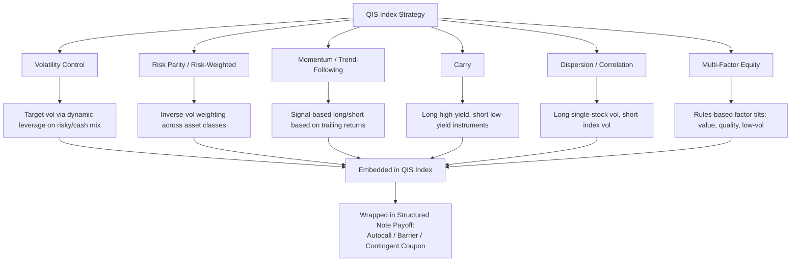

## Quantitative Investment Strategy Linked Notes

### Definition and Conceptual Overview

A Quantitative Investment Strategy (QIS) Linked Note is a structured note whose coupon and/or redemption value is linked to the performance of a **rules-based, systematic index** — commonly referred to as a QIS index, custom index, or proprietary strategy index — rather than a traditional market benchmark (e.g., S&P 500) or a single stock/rate/credit reference. The underlying QIS index is typically sponsored and calculated by the issuing dealer (or an affiliated index sponsor) and implements a **pre-defined, algorithmic trading strategy** such as volatility targeting, risk parity, momentum/trend-following, carry, or factor rotation across one or more asset classes.

QIS-linked notes sit structurally between traditional index-linked notes and actively managed certificates (AMCs): the strategy is systematic and rules-based (not discretionary), but it is dynamic (rebalancing, re-weighting) rather than static (buy-and-hold basket).

**Key Points**

- The "underlying" is not a raw asset price but an **index level derived from a dynamic algorithm** — this introduces methodology risk, index sponsor risk, and calculation agent discretion as distinct risk factors beyond simple market risk.
- QIS indices are frequently **proprietary and single-dealer**, meaning the same bank that structures and sells the note also designs, calculates, and can amend the index methodology — a structural conflict of interest requiring specific disclosure and governance scrutiny.
- These notes are a primary vehicle through which banks distribute "risk premia" or "systematic strategy" exposure to institutional and private banking clients without requiring the investor to directly implement the strategy via futures/swaps.

---

### Taxonomy of QIS Index Strategies

#### 1. Volatility Control / Vol-Target Indices

- Dynamically allocate between a risky asset (equity index, basket) and a cash/risk-free component to target a constant realized volatility level (e.g., 10% annualized).
- Mechanism: leverage $L_t = \sigma_{\text{target}} / \sigma_{\text{realized},t}$, applied to the risky asset weight, subject to a leverage cap.

$$w_{\text{risky},t} = \min\left(L_{\max}, \frac{\sigma_{\text{target}}}{\hat{\sigma}_{t}}\right)$$

- Effect: de-risks in high-volatility regimes, re-risks in calm regimes — commonly used as the underlying for autocallable notes because it **suppresses realized volatility**, reducing option premium cost and enabling higher headline coupons.

#### 2. Risk Parity / Risk-Weighted Multi-Asset Indices

- Allocate across asset classes (equities, bonds, commodities) inversely proportional to each asset's volatility contribution, so each contributes roughly equal risk to the portfolio.

$$w_i \propto \frac{1}{\sigma_i}, \quad \text{subject to} \sum_i w_i = 1$$

#### 3. Momentum / Trend-Following Indices

- Long/short or long-only exposure adjusted based on trailing price momentum signals (e.g., 12-month return, moving average crossovers).
- Rebalanced periodically (daily/weekly/monthly) based on signal thresholds.

#### 4. Carry Strategies

- Common in FX and rates QIS indices: systematically long high-yielding currencies/instruments funded by short low-yielding ones, harvesting the carry risk premium.

#### 5. Dispersion / Correlation Strategies

- Long single-stock volatility vs. short index volatility (or vice versa) to harvest the correlation risk premium; packaged as an index for note issuance.

#### 6. Multi-Factor Equity Indices

- Systematic exposure to value, quality, low-volatility, or quality factors via rules-based stock selection and weighting.

**Example**

*"Vol-Target 10% Equity Index" underlying an Autocallable Note*

- Base assets: Euro Stoxx 50 Futures + EUR cash deposit rate
- Daily rebalancing to target 10% annualized realized volatility (20-day lookback)
- Maximum leverage: 150%
- Deducted index fee: 0.50% p.a. (embedded in index calculation, reducing index level daily)
- Note: 5-year autocallable paying 6.5% p.a. contingent coupon if index $\geq$ 60% of initial level

---

### Payoff Mechanics

QIS-linked notes typically wrap the QIS index in a familiar structured payoff shell:

$$\text{Coupon}_t = \begin{cases} c \cdot N & \text{if } \dfrac{I_{\text{QIS}}(t)}{I_{\text{QIS}}(0)} \geq K_{\text{barrier}} \\ 0 & \text{otherwise} \end{cases}$$

$$\text{Redemption} = N \cdot \left[1 - \max\left(0,\ K - \frac{I_{\text{QIS}}(T)}{I_{\text{QIS}}(0)}\right)\right]$$

where $I_{\text{QIS}}(t)$ is the QIS index level at time $t$, net of embedded fees. The **index itself already contains an embedded fee deduction** (a synthetic "total expense ratio" of typically 0.30%–1.50% p.a.), which mechanically drags index performance and must be distinguished from the note's own distribution/structuring margin.

---

### Index Construction Mechanics and Fee Layering

A defining technical feature of QIS indices is their **excess return (ER) vs. total return (TR)** construction and layered fee structure:

1. **Gross strategy return** — raw signal-driven return before costs
2. **Less: transaction costs / rebalancing costs** — modeled or actual bid-offer costs from rebalancing
3. **Less: financing/funding cost** — for leveraged or long/short strategies, a funding rate (e.g., overnight rate + spread) is charged on notional exposure
4. **Less: index calculation/licensing fee** — the embedded "TER-equivalent" fee (e.g., 50–150 bps p.a.), deducted daily via a fee-adjustment factor

$$I_{\text{QIS}}(t) = I_{\text{QIS}}(t-1) \times \left(1 + r_{\text{gross},t} - r_{\text{cost},t} - \frac{\text{fee}_{\text{ann}}}{252}\right)$$

**Key Points**

- Because fees compound daily against the index level, QIS indices exhibit **structural negative drag** — an index can underperform its stated strategy's theoretical gross return meaningfully over multi-year note tenors purely from fee compounding.
- Investors comparing headline coupons across QIS-linked notes must examine the **embedded index fee** disclosed in the index methodology document/index rulebook, not just the note's stated distribution fee, since embedded fees are economically equivalent but often less visible.

---

### Diagram: QIS Note Fee and Cash Flow Layering (svg_diagram)

<svg xmlns="http://www.w3.org/2000/svg" viewBox="0 0 900 420">
<text x="450" y="25" font-size="16" font-weight="bold" text-anchor="middle">QIS Linked Note — Fee Layering Structure (svg_diagram)</text>
<rect x="60" y="60" width="200" height="55" fill="#e0f2fe" stroke="#075985" stroke-width="1.5" />
<text x="160" y="82" font-size="11" text-anchor="middle" font-weight="bold">Gross Strategy Signal</text>
<text x="160" y="98" font-size="9" text-anchor="middle">(Vol-target / Momentum / Carry)</text>
<line x1="160" y1="115" x2="160" y2="150" stroke="black" stroke-width="1.5" marker-end="url(#arr2)" />
<rect x="30" y="150" width="260" height="50" fill="#fef9c3" stroke="#854d0e" stroke-width="1.5" />
<text x="160" y="170" font-size="10" text-anchor="middle" font-weight="bold">Less: Transaction/Rebalancing Costs</text>
<text x="160" y="185" font-size="9" text-anchor="middle">Modeled bid-offer, slippage</text>
<line x1="160" y1="200" x2="160" y2="230" stroke="black" stroke-width="1.5" marker-end="url(#arr2)" />
<rect x="30" y="230" width="260" height="50" fill="#fde68a" stroke="#854d0e" stroke-width="1.5" />
<text x="160" y="250" font-size="10" text-anchor="middle" font-weight="bold">Less: Financing/Funding Cost</text>
<text x="160" y="265" font-size="9" text-anchor="middle">O/N rate + spread on notional exposure</text>
<line x1="160" y1="280" x2="160" y2="310" stroke="black" stroke-width="1.5" marker-end="url(#arr2)" />
<rect x="30" y="310" width="260" height="50" fill="#fca5a5" stroke="#7f1d1d" stroke-width="1.5" />
<text x="160" y="330" font-size="10" text-anchor="middle" font-weight="bold">Less: Index Calc/Licensing Fee</text>
<text x="160" y="345" font-size="9" text-anchor="middle">~0.30%–1.50% p.a., deducted daily</text>
<line x1="290" y1="335" x2="380" y2="335" stroke="black" stroke-width="1.5" marker-end="url(#arr2)" />
<rect x="390" y="300" width="200" height="70" fill="#dcfce7" stroke="#166534" stroke-width="1.5" />
<text x="490" y="325" font-size="11" text-anchor="middle" font-weight="bold">Published QIS Index Level</text>
<text x="490" y="342" font-size="9" text-anchor="middle">I_QIS(t)</text>
<text x="490" y="357" font-size="9" text-anchor="middle">This is the note's underlying</text>
<line x1="590" y1="335" x2="680" y2="335" stroke="black" stroke-width="1.5" marker-end="url(#arr2)" />
<rect x="690" y="290" width="180" height="90" fill="#e9d5ff" stroke="#6b21a8" stroke-width="1.5" />
<text x="780" y="315" font-size="10" text-anchor="middle" font-weight="bold">Note Wrapper Payoff</text>
<text x="780" y="332" font-size="9" text-anchor="middle">Autocall / Barrier / Coupon</text>
<text x="780" y="347" font-size="9" text-anchor="middle">Plus: Note distribution</text>
<text x="780" y="362" font-size="9" text-anchor="middle">margin (separate layer)</text>
</svg>

---

### Diagram: QIS Strategy Classification (Mermaid)

---

### Why Vol-Control Overlays Are Common in QIS-Linked Autocallables

Volatility-controlled QIS indices are disproportionately used as underlyings for autocallable notes because of a specific derivatives-pricing mechanic:

- Autocallable note pricing embeds a **short volatility position** (issuer sells downside puts/digital options to fund coupons).
- A vol-target overlay mechanically **caps realized volatility** by de-leveraging in stressed markets, which reduces the tail risk and implied volatility priced into the barrier options.
- This lowers the **cost of hedging** the embedded optionality for the issuer, which — combined with the embedded index fee revenue — allows the issuer to offer a **higher headline coupon** than a note linked directly to the uncontrolled equity index, even though the vol-target index itself, net of fees, may have lower expected long-run total return than the raw index.

**Key Points**

- The higher coupon on a vol-target-linked autocallable is **not a "free lunch"**; it reflects lower embedded option cost to the issuer (partly passed to the investor as coupon) combined with the fee drag transferred to the investor via the index construction — [Inference] the net economic benefit to the investor relative to a plain-vanilla note depends heavily on realized volatility regimes and fee levels over the note's life, and is not guaranteed to be favorable.

---

### Pricing Framework

#### Two-Layer Pricing Approach

1. **Index-level simulation**: Monte Carlo simulation of the QIS strategy's own rules (e.g., simulating the vol-target rebalancing algorithm, momentum signal evaluation) under a chosen stochastic model for the underlying constituent assets (local vol, stochastic vol, or historical bootstrap).
2. **Note-level payoff valuation**: pricing the autocall/barrier/coupon structure as a derivative on the *simulated index paths*, using standard risk-neutral valuation once the index-level dynamics are established.

$$V_{\text{note}} = \mathbb{E}^{\mathbb{Q}}\left[\sum_t D(0,t) \cdot \text{CF}(I_{\text{QIS}}(t))\right]$$

where the expectation is taken over paths of $I_{\text{QIS}}$ generated by simulating the underlying strategy rules jointly with the constituent asset dynamics.

#### Backward-Looking Index History Limitation

- Since QIS indices are often newly launched or have short live histories, pricing and risk models rely heavily on **backtested/simulated history**, which carries [Inference] potential backtest overfitting risk and may not represent how the strategy will behave under future, unseen market regimes — a standard caveat, though not one specific to any single issuer's methodology.
- Regulatory guidance (e.g., ESMA, IOSCO benchmark principles) increasingly requires clear disclosure distinguishing **live/calculated index history** from **backtested/simulated history** in marketing materials.

---

### Governance, Benchmark Regulation, and Conflicts of Interest

- **EU Benchmarks Regulation (BMR)**: QIS indices used as "benchmarks" for financial instruments (including structured notes) issued or sold in the EU generally must be administered by an authorized/registered benchmark administrator, with methodology transparency, oversight committee governance, and periodic review requirements.
- **Single-dealer index conflicts**: because the issuing bank often acts simultaneously as index sponsor, calculation agent, hedging counterparty, and distributor, governance frameworks (e.g., an internal index oversight committee, methodology change protocols requiring investor notice) are critical risk mitigants, and their presence/absence is a material due-diligence item for investors and their advisors.
- **Methodology amendment risk**: most QIS index rulebooks reserve the sponsor's right to amend methodology (e.g., for market disruption, corporate actions, or "manifest error" corrections), introducing a **discretionary risk layer** distinct from the mechanical, transparent nature the "rules-based" label implies.

---

### Comparison: QIS-Linked Notes vs. Traditional Index-Linked Notes vs. Actively Managed Certificates

| Dimension | Traditional Index-Linked Note | QIS-Linked Note | Actively Managed Certificate (AMC) |
| --- | --- | --- | --- |
| Underlying nature | Static/passive benchmark | Systematic, rules-based, dynamic | Discretionary manager decisions |
| Rebalancing | None/minimal (index provider-defined) | Frequent (daily/weekly, algorithmic) | Manager-driven, ad hoc |
| Fee transparency | High (well-known index) | Moderate (embedded, less visible) | Explicit management fee |
| Index sponsor conflicts | Low (third-party index) | Often high (single-dealer index) | N/A (manager discloses mandate) |
| Backtested history reliance | Low | High for newer strategies | N/A |
| Regulatory oversight | Established benchmark rules | Evolving (BMR, IOSCO principles) | Fund/AMC-specific regulation |

---

### Investor Due Diligence Checklist

**Next Steps**

- Review the **index methodology document/rulebook** in full, not just the marketing termsheet — identify all embedded fee layers (transaction cost, funding cost, licensing fee).
- Confirm whether index performance shown is **live calculated** or **backtested/simulated**, and over what period each applies.
- Identify the **index administrator/calculation agent** and assess independence from the note issuer/distributor.
- Understand the **methodology amendment clause** — what triggers a change, and what notice period is provided to noteholders.
- Compare the note's headline coupon against a **plain-vanilla equivalent** (same barrier, same tenor, raw index underlying) to isolate how much of the coupon enhancement derives from vol-target/strategy mechanics versus fee/structuring differences.
- Assess **secondary market liquidity** — QIS-linked notes on proprietary single-dealer indices are typically only quotable by the issuing dealer, concentrating both market-making and valuation discretion.

---

### Common Pitfalls and Misconceptions

- **Conflating "systematic/rules-based" with "risk-free" or "transparent"**: rules-based does not mean the methodology is simple, static, or free of sponsor discretion.
- **Overlooking compounding fee drag**: a strategy with a strong theoretical gross Sharpe ratio can still underperform materially net of layered daily-compounding fees over a multi-year note tenor.
- **Assuming higher historical vol-target index Sharpe implies higher note coupon safety**: the coupon barrier's proximity to current index level, not the strategy's historical risk-adjusted return, is what principally determines coupon payment probability.
- **Ignoring index discontinuation risk**: some QIS indices are discontinued or methodology-substituted by the sponsor if strategy capacity, liquidity, or business reasons change, which can trigger note-level fallback provisions (e.g., successor index selection by calculation agent) with valuation impact.

---

### Related Topics

- Volatility Control / Vol-Target Index Mechanics
- Risk Parity and Multi-Asset Systematic Strategies
- EU Benchmarks Regulation (BMR) and Index Governance
- Autocallable Notes and Barrier Reverse Convertibles
- Dispersion and Correlation Risk Premia Strategies
- Backtesting Methodology and Overfitting Risk in Systematic Indices
- Single-Dealer vs. Third-Party Index Sponsorship
- Actively Managed Certificates (AMCs) vs. Rules-Based Note Structures
- Fee Layering and Total Cost of Ownership in Structured Products
- Momentum and Carry Risk Premia Across Asset Classes