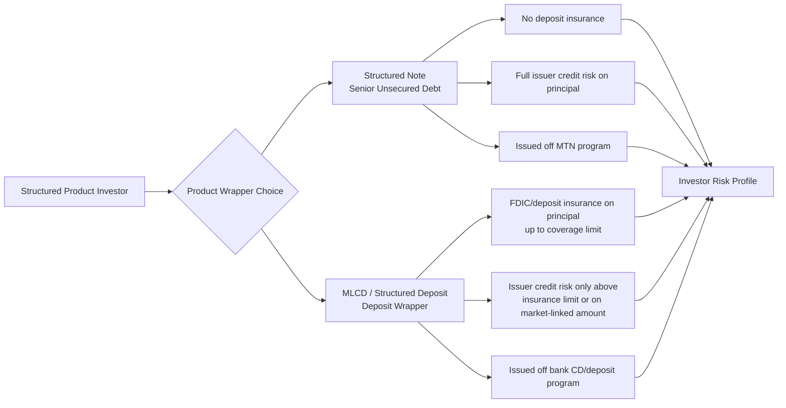

## Structured Deposits and Market Linked Certificates of Deposit

### Definition and Conceptual Overview

Structured Deposits and Market-Linked Certificates of Deposit (MLCDs) are hybrid savings/investment products issued by a bank or depository institution that combine a **deposit or CD wrapper** with **derivative-linked payoff features** tied to an underlying market reference (equity index, basket, rate, commodity, or FX). Unlike structured notes issued as senior unsecured debt off an MTN program, these products are structured as **deposits** — meaning they are typically issued directly by a bank's deposit-taking entity and, in many jurisdictions, benefit from **deposit insurance** (e.g., FDIC in the US, up to applicable coverage limits) on the principal amount, subject to specific conditions.

**Key Points**

- The deposit/CD wrapper is the critical distinguishing legal feature: it changes the investor's creditor status, insurance eligibility, and regulatory treatment relative to an equivalent structured note.
- Structured deposits are common in retail and private banking distribution in Europe and Asia; MLCDs are the equivalent, FDIC-eligible product common in the US market.
- The embedded derivative determines the **upside participation formula**; the deposit/CD wrapper determines the **principal protection and insurance characteristics**.

---

### Structural Anatomy

#### Structured Deposit (Non-US, e.g., UK/EU/Asia)

- Legal form: a time deposit with the issuing bank, where the **interest/return** payable at maturity (not principal, in most principal-protected variants) is linked to the performance of an underlying reference.
- Principal is generally returned in full at maturity if held to term (subject to the bank's own solvency, since deposit protection schemes have coverage caps).
- Early withdrawal typically forfeits some or all of the market-linked return and may incur penalties.

#### Market-Linked Certificate of Deposit (US)

- Legal form: a CD issued under the bank's CD program, registered (if publicly offered) or exempt, paying an FDIC-insurable principal amount at maturity (subject to the FDIC per-depositor, per-bank coverage limit, currently $250,000 including all other deposits at that institution) plus a market-linked "additional amount" determined by the payoff formula.
- Structured as **zero-coupon during the term** with a single payment at maturity combining principal and market-linked return, or with periodic contingent coupons depending on structure.

$$V_{\text{deposit/CD}} = \text{Principal (FDIC-insured, subject to limits)} + \text{PV}[\text{Embedded Derivative}]$$

**Key Points**

- FDIC/deposit insurance coverage applies to principal (and often accrued/declared interest) but does **not** typically extend to the market-linked additional amount before it is credited/declared, and coverage is always subject to the applicable per-depositor, per-institution limit — amounts above that limit carry issuer credit risk exactly like an unsecured note. [Unverified: exact treatment of accrued-but-undeclared market-linked amounts under FDIC rules can vary by product structure and should be confirmed against the specific offering document.]

---

### Common Payoff Structures

#### 1. Principal-Protected Participation MLCD

- Investor receives 100% of principal at maturity plus a percentage (participation rate) of the positive performance of the underlying index, with no downside participation.

$$\text{Maturity Value} = \text{Principal} \times \left[1 + \text{Participation Rate} \times \max\left(0, \frac{I_T - I_0}{I_0}\right)\right]$$

#### 2. Capped Participation MLCD

- Same as above but with a maximum return cap.

$$\text{Maturity Value} = \text{Principal} \times \left[1 + \min\left(\text{Cap},\ \text{Participation Rate} \times \frac{I_T - I_0}{I_0}\right)\right]$$

#### 3. Digital/Contingent Coupon Structured Deposit

- Pays a fixed enhanced rate if the underlying closes above a specified level on observation date(s); otherwise pays a minimal or zero rate (principal still protected at maturity in most retail-protected variants).

#### 4. Range Accrual Structured Deposit

- Interest accrues daily based on the proportion of days a reference rate or index remains within a defined range.

$$\text{Interest} = \text{Principal} \times \text{Rate} \times \frac{n_{\text{in-range}}}{n_{\text{total}}}$$

#### 5. Callable Structured Deposit

- Issuer retains the right to call (redeem) the deposit early at specified dates, typically paying an enhanced fixed rate up to the call date — economically similar to a callable note but wrapped as a deposit.

**Example**

*5-Year Principal-Protected MLCD Linked to S&P 500*

- Denomination: $1,000 minimum, FDIC-insured up to applicable limits
- Participation Rate: 85% of the average of the index's monthly closing level performance (Asian/averaging feature to reduce volatility and cost)
- Cap: None
- Floor: 0% (principal returned in full regardless of index performance)
- Averaging observation: monthly closes over final 12 months, averaged, compared to initial level

$$\text{Return} = 0.85 \times \max\left(0, \frac{\bar{I}_{\text{final 12mo avg}} - I_0}{I_0}\right)$$

---

### Pricing and Structuring Mechanics

#### Component Decomposition

1. **Zero-coupon deposit/CD component**: funds the guaranteed principal return, discounted at the bank's internal funding/deposit cost curve to maturity.
2. **Embedded option**: typically a call option (for upside participation) or digital option (for contingent coupon), purchased using the "excess" yield the bank would otherwise pay as a market-rate deposit rate.

$$\text{Option Budget} = \text{Principal} \times \left[1 - \frac{1}{(1 + r_{\text{deposit}})^T}\right]$$

where $r_{\text{deposit}}$ is the bank's comparable market deposit/funding rate for the tenor $T$. This budget is then used to purchase the call/digital option, and the **participation rate or cap is solved so the option premium matches the available budget**.

$$\text{Participation Rate} = \frac{\text{Option Budget}}{\text{Cost of ATM Call Option (per unit participation)}}$$

**Key Points**

- The participation rate is a direct function of prevailing interest rates and implied volatility: higher rates increase the option budget (more foregone deposit interest to spend on optionality), while higher implied volatility increases option cost, reducing the achievable participation rate for a given budget — so participation rates are **not arbitrarily set by marketing** but are a mechanical output of the funding-rate-versus-option-cost relationship at issuance.
- In low-rate environments, the "option budget" shrinks, structurally compressing achievable participation rates or requiring caps/lower principal protection to maintain attractive terms — a standard, well-documented mechanic of principal-protected note/deposit structuring economics.

---

### Diagram: Structured Deposit Cash Flow Architecture (svg_diagram)

<svg xmlns="http://www.w3.org/2000/svg" viewBox="0 0 900 400">
<text x="450" y="25" font-size="16" font-weight="bold" text-anchor="middle">Structured Deposit / MLCD — Budget Decomposition (svg_diagram)</text>
<rect x="60" y="60" width="220" height="60" fill="#dbeafe" stroke="#1e3a8a" stroke-width="1.5" />
<text x="170" y="85" font-size="11" text-anchor="middle" font-weight="bold">Deposit Principal</text>
<text x="170" y="102" font-size="9" text-anchor="middle">(e.g., $1,000, FDIC-eligible)</text>
<line x1="170" y1="120" x2="170" y2="160" stroke="black" stroke-width="1.5" marker-end="url(#a3)" />
<text x="230" y="145" font-size="9" text-anchor="middle">Discounted at bank funding rate</text>
<rect x="60" y="160" width="220" height="60" fill="#bfdbfe" stroke="#1e3a8a" stroke-width="1.5" />
<text x="170" y="185" font-size="11" text-anchor="middle" font-weight="bold">PV of Zero-Coupon Deposit</text>
<text x="170" y="200" font-size="9" text-anchor="middle">Funds guaranteed principal at T</text>
<rect x="60" y="240" width="220" height="60" fill="#fef3c7" stroke="#92400e" stroke-width="1.5" />
<text x="170" y="262" font-size="11" text-anchor="middle" font-weight="bold">"Option Budget"</text>
<text x="170" y="278" font-size="9" text-anchor="middle">Principal − PV(deposit) =</text>
<text x="170" y="292" font-size="9" text-anchor="middle">Foregone deposit interest</text>
<line x1="170" y1="220" x2="170" y2="240" stroke="black" stroke-width="1.5" marker-end="url(#a3)" />
<text x="60" y="235" font-size="9">Remainder</text>
<line x1="280" y1="270" x2="380" y2="270" stroke="black" stroke-width="1.5" marker-end="url(#a3)" />
<rect x="390" y="240" width="220" height="60" fill="#fee2e2" stroke="#991b1b" stroke-width="1.5" />
<text x="500" y="262" font-size="11" text-anchor="middle" font-weight="bold">Purchase Call/Digital Option</text>
<text x="500" y="278" font-size="9" text-anchor="middle">On index/basket underlying</text>
<text x="500" y="292" font-size="9" text-anchor="middle">Premium = Option Budget</text>
<line x1="500" y1="240" x2="500" y2="200" stroke="black" stroke-width="1.5" marker-end="url(#a3)" />
<rect x="390" y="130" width="220" height="60" fill="#dcfce7" stroke="#166534" stroke-width="1.5" />
<text x="500" y="152" font-size="11" text-anchor="middle" font-weight="bold">Solve for Participation Rate</text>
<text x="500" y="168" font-size="9" text-anchor="middle">Given Budget ÷ ATM Call Cost</text>
<text x="500" y="182" font-size="9" text-anchor="middle">= achievable participation %</text>
<line x1="280" y1="190" x2="60" y2="60" stroke="#888" stroke-width="0" />
<rect x="660" y="150" width="200" height="150" fill="#ede9fe" stroke="#5b21b6" stroke-width="1.5" />
<text x="760" y="175" font-size="11" text-anchor="middle" font-weight="bold">Combined at Maturity</text>
<text x="760" y="195" font-size="9" text-anchor="middle">100% Principal</text>
<text x="760" y="210" font-size="9" text-anchor="middle">+</text>
<text x="760" y="225" font-size="9" text-anchor="middle">Participation Rate ×</text>
<text x="760" y="240" font-size="9" text-anchor="middle">Index Upside (if any)</text>
<text x="760" y="260" font-size="9" text-anchor="middle">= Total Maturity Payout</text>
<line x1="610" y1="270" x2="660" y2="230" stroke="black" stroke-width="1.5" marker-end="url(#a3)" />
<line x1="500" y1="190" x2="620" y2="220" stroke="black" stroke-width="1.5" marker-end="url(#a3)" stroke-dasharray="4,2" />
</svg>

---

### Diagram: MLCD vs. Structured Note Legal/Insurance Comparison (Mermaid)

---

### Regulatory and Insurance Framework

#### United States (MLCDs)

- Issued under the bank's CD program; subject to FDIC insurance rules under 12 CFR Part 330, covering principal (and often declared/accrued interest) up to the standard maximum deposit insurance amount **per depositor, per insured bank, per ownership category**.
- Investors holding MLCDs across multiple accounts/ownership categories at the same institution must aggregate for FDIC coverage purposes — a common point of investor confusion when purchasing large positions.
- SEC/FINRA oversight applies to the **offering and sales practice** (suitability, disclosure) even though the FDIC (not SEC) governs the insurance aspect; broker-dealers distributing MLCDs must comply with FINRA rules on structured product complexity disclosure (e.g., FINRA Regulatory Notices on structured products and complex products).
- Early withdrawal: MLCDs are generally **not redeemable at the investor's option** before maturity; liquidity is provided only via a secondary market bid from the issuing dealer, at a price reflecting current market value (which can be below par), distinguishing MLCDs from traditional CDs that permit early withdrawal with a penalty.

#### Europe / UK (Structured Deposits)

- Under UK regulation, structured deposits are explicitly brought within the scope of the UK's implementation of MiFID II-equivalent conduct-of-business rules (structured deposits were added to MiFID II's scope specifically due to consumer protection concerns), requiring KID-equivalent disclosure and suitability assessments similar to PRIIPs-scope products.
- Deposit protection: covered by the relevant national/EU Deposit Guarantee Scheme (DGS) up to the harmonized EU coverage limit (EUR 100,000 equivalent) or the UK's Financial Services Compensation Scheme (FSCS) limit, again applying to principal within scheme limits — investors should verify current limits as these are periodically reviewed.

**Key Points**

- The insurance/protection benefit is **capped and per-institution** — investors placing large sums are exposed to full issuer credit risk on any amount above the coverage limit, meaning structured deposits are not a blanket substitute for credit risk management on large tickets.
- Insurance coverage applies to the **deposit-taking entity**, so investors must confirm which specific legal entity within a banking group is the deposit-taker (this can differ from the group's flagship brand name, particularly for products distributed by intermediaries/brokers on behalf of multiple partner banks).

---

### Comparison: Structured Deposit/MLCD vs. Structured Note vs. Traditional CD

| Dimension | Traditional CD | Structured Deposit / MLCD | Structured Note |
| --- | --- | --- | --- |
| Return type | Fixed rate | Market-linked, often with protected/floor principal | Market-linked, principal may be at risk |
| Deposit insurance | Yes (up to limit) | Yes, on principal (up to limit) | No |
| Issuer credit risk on principal | Only above insurance limit | Only above insurance limit (on protected principal) | Full, from dollar one |
| Early liquidity | Penalty-based withdrawal | Secondary market only, at issuer's bid (no put right) | Secondary market only, at issuer's bid |
| Typical issuer | Bank/thrift | Bank/thrift deposit-taking entity | Bank or funding subsidiary (MTN program) |
| Regulatory framework | Banking/deposit regulation | Banking regulation + securities conduct rules (suitability) | Securities regulation (prospectus/offering rules) |

---

### Risk Considerations for Investors

**Key Points**

- **Opportunity cost risk**: because principal-protected structures allocate a portion of yield to the option premium, the "floor" of zero or low market-linked return (if the underlying does not perform) means the investor may earn materially less than a comparable fixed-rate deposit/CD over the same period — the protection has an embedded cost.
- **Liquidity risk**: absence of a put right means investors needing funds before maturity depend entirely on the issuing dealer's secondary market bid, which reflects current rates and volatility and can be significantly below par, especially early in the note's life or during rising-rate environments.
- **Complexity and disclosure risk**: participation rates, caps, averaging features, and call provisions materially affect realized return and require careful reading of the disclosure statement/offering circular, not just the marketing summary.
- **Tax treatment**: in the US, many MLCDs are treated as **contingent payment debt instruments (CPDI)** for tax purposes, which can require investors to accrue and pay tax annually on imputed "comparable yield" interest even though no cash is received until maturity — a materially different (and often less favorable from a cash-flow-timing perspective) tax treatment than investors may expect from a "CD." [Inference: exact tax treatment depends on specific instrument structure and jurisdiction; investors should consult the product's tax disclosure and a qualified tax advisor.]
- **Issuer concentration**: because coverage limits apply per institution, investors building meaningful structured deposit/MLCD allocations often need to **ladder across multiple issuing banks** to stay within insurance limits per issuer.

---

### Distribution and Structuring Considerations for Issuers

- Structured deposits/MLCDs allow banks to raise **retail deposit funding** (attractive from a liquidity coverage ratio/net stable funding ratio regulatory perspective under Basel III) while offering enhanced-return optionality, as opposed to raising funding via wholesale MTN note issuance.
- The embedded option is typically hedged by the bank's derivatives desk using standard vanilla or exotic option hedging (delta-hedging a call or digital option), similar to hedging a principal-protected note, but booked against the deposit-taking entity's balance sheet rather than a note issuance vehicle.
- Distribution via retail branch networks and private banking channels is common, given the "CD/deposit" framing's psychological association with safety — a factor regulators (FINRA, FCA) have specifically flagged as requiring enhanced point-of-sale disclosure to prevent investors from underestimating the product's complexity relative to a plain CD.

---

### Common Pitfalls and Misconceptions

- **Assuming full FDIC/DGS protection on total maturity value**: protection typically applies to principal (and sometimes declared interest) within coverage limits — not necessarily to unrealized/undeclared market-linked upside, and never above the per-institution coverage cap.
- **Treating MLCDs as liquid like traditional CDs**: the absence of an early-withdrawal-with-penalty feature (common in vanilla CDs) is a frequently overlooked structural difference.
- **Underestimating tax complexity**: assuming CD-like cash-basis taxation when the instrument may actually require CPDI-style annual accrual taxation.
- **Overlooking issuer/brand entity distinctions**: assuming a recognizable bank brand automatically means full principal insurance, without confirming the specific deposit-taking legal entity and current coverage limits.

---

### Related Topics

- FDIC Deposit Insurance Rules and Ownership Category Aggregation
- Contingent Payment Debt Instrument (CPDI) Tax Treatment
- Principal-Protected Notes vs. Structured Deposits
- FINRA Complex Products Disclosure Requirements
- UK FCA Structured Deposit Conduct Rules and FSCS Coverage
- Basel III Liquidity Coverage Ratio and Deposit Funding Strategy
- Participation Rate and Option Budget Mechanics
- Averaging (Asian) Features in Principal-Protected Structures
- Secondary Market Liquidity for Bank-Issued Structured Products
- Callable Structured Deposits and Reinvestment Risk