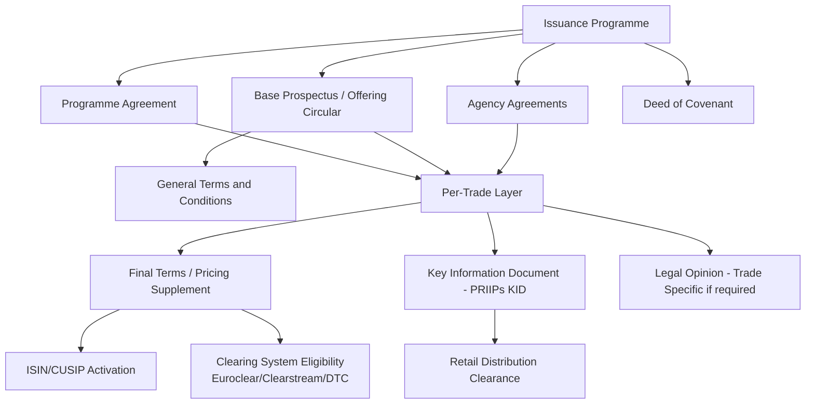

## Primary Issuance Process and Documentation

### Definition and Conceptual Overview

The primary issuance process is the end-to-end workflow through which a structured note or structured product moves from initial concept/investor demand through pricing, legal documentation, regulatory clearance, and settlement, resulting in a live, tradeable instrument delivered to the initial investor(s). It encompasses the interaction between the **issuer** (bank or funding vehicle), **arranger/structurer**, **distributor(s)**, **legal counsel**, **calculation agent**, and **paying/settlement agents**, all operating within a pre-established **issuance programme** (e.g., EMTN, GMTN, or a US shelf registration).

**Key Points**

- Nearly all structured notes are issued off a **standing issuance programme** rather than through bespoke standalone documentation for each trade — this is what allows banks to issue thousands of small-denomination structured notes efficiently.
- The primary issuance process differs materially between **programme-based drawdowns** (fast, templated) and **standalone/reg-S or 144A offerings** (slower, bespoke, typically for larger or more customized institutional trades).
- Documentation exists in **layers**: a static base programme layer (rarely changes) and a dynamic per-issuance layer (final terms/pricing supplement, specific to each note).

---

### The Issuance Programme Framework

#### EMTN (Euro Medium Term Note) Programme

- A base shelf facility established by an issuer (often with a programme size cap, e.g., USD 50 billion) enabling repeated note issuances (**drawdowns**) under standardized documentation, without re-negotiating full legal terms each time.
- Governed typically by English law or the law of the relevant jurisdiction, with a **Base Prospectus** approved by a competent authority (e.g., under the EU Prospectus Regulation) and passportable across EU/EEA member states.
- Updated **annually** (programme update) and supplemented as needed for material developments (supplement prospectus).

#### GMTN (Global Medium Term Note) Programme

- Similar structure but designed to enable issuance across multiple markets/currencies globally, often combining EMTN-style and US-eligible documentation within a single umbrella.

#### US Shelf Registration (Form S-3) / 144A Programmes

- SEC-registered issuers use a **shelf registration statement** (Form S-3) allowing repeated public offerings without a new registration statement each time, supplemented by a **prospectus supplement** or **pricing supplement** per issuance.
- For offerings to Qualified Institutional Buyers (QIBs) only, **Rule 144A** private placement documentation (offering memorandum) is used instead, avoiding full SEC registration but restricting the investor base.

**Example**

*Programme Documentation Stack (EMTN)*

1. **Programme Agreement** — governs the relationship between issuer, arranger, and dealers
2. **Base Prospectus** — describes the issuer, general terms and conditions applicable to all notes, risk factors
3. **Agency Agreement** — appoints and governs the fiscal agent/paying agent/calculation agent
4. **Deed of Covenant** — issuer's covenant to noteholders (particularly relevant for notes held in global form via clearing systems)
5. **Final Terms / Pricing Supplement** — the trade-specific document completed for each individual note issuance, incorporating the Base Prospectus by reference

---

### The Structuring-to-Issuance Workflow

#### Phase 1: Origination and Structuring

- Distributor (private bank, broker-dealer, or platform) identifies investor demand or the structuring desk proposes an idea based on market views/client requests.
- Structurer designs the payoff, selects underlying(s), and works with the trading desk to obtain an **indicative pricing** (participation rate, coupon level, barrier) based on current market data (vol surfaces, rates, credit spreads).
- Legal and compliance perform an initial **product approval process** review (suitability target market assessment, complexity classification under MiFID II/PRIIPs product governance rules).

#### Phase 2: Term Sheet and Marketing

- A **preliminary/indicative term sheet** is produced, summarizing key economic terms (underlying, tenor, barrier, coupon, participation rate) — marked "indicative" and "subject to change" since final terms are only fixed at pricing.
- Distribution begins (subscription period), during which the offering is marketed to target investors, subject to regulatory marketing restrictions (e.g., PRIIPs KID must be provided before a retail sale is concluded in the EU).

#### Phase 3: Trade Date / Strike Date Pricing

- On the **trade date** (also called **strike date** or **pricing date**), the final economic terms are fixed based on the closing (or intraday reference) levels of the underlying(s), final funding rate, and final implied volatility levels.
- The **calculation agent** (often the issuer's derivatives desk or an affiliate) determines and publishes the official initial reference level(s), which anchor all future barrier/strike calculations for the note's life.

#### Phase 4: Documentation Finalization

- **Final Terms** (EMTN) or **Pricing Supplement** (US) are drafted, finalizing all economic terms, incorporating the Base Prospectus by reference, and specifying ISIN/CUSIP, settlement details, and any product-specific risk factors not already covered in the base documentation.
- Legal review/sign-off, compliance clearance, and (where applicable) competent authority notification/filing occur before settlement.

#### Phase 5: Issue Date / Settlement

- The **issue date** (settlement date) is typically T+2 to T+5 business days after trade date, during which:
  - The note is created in the relevant clearing system (Euroclear, Clearstream, DTC) as a **global note** (or global certificate)
  - ISIN/CUSIP is activated
  - Cash settlement occurs: investors' cash moves to the issuer, notes are credited to investors' custody accounts via their distributor/broker

#### Phase 6: Post-Issuance Lifecycle Initiation

- Ongoing calculation agent functions begin: barrier monitoring, coupon determination, corporate action adjustments (for equity-linked notes), and periodic valuation/reporting to investors.

**Key Points**

- The gap between **term sheet publication** and **trade date pricing** exposes investors to **market risk on final terms**: a coupon or barrier indicated on a preliminary term sheet can shift (usually worsen slightly, embedding distribution costs, or improve if rates/vol move favorably) before final pricing — this is standard practice, disclosed via "indicative, subject to change" language, but a frequent source of investor confusion.

---

### Diagram: Primary Issuance Timeline (svg_diagram)

<svg xmlns="http://www.w3.org/2000/svg" viewBox="0 0 950 300">
<text x="475" y="25" font-size="16" font-weight="bold" text-anchor="middle">Primary Issuance Timeline (svg_diagram)</text>
<line x1="60" y1="150" x2="890" y2="150" stroke="#333" stroke-width="2" />
<circle cx="100" cy="150" r="6" fill="#1e3a8a" />
<text x="100" y="135" font-size="10" text-anchor="middle" font-weight="bold">Origination</text>
<text x="100" y="180" font-size="9" text-anchor="middle">Structuring &amp;</text>
<text x="100" y="192" font-size="9" text-anchor="middle">indicative pricing</text>
<circle cx="260" cy="150" r="6" fill="#166534" />
<text x="260" y="135" font-size="10" text-anchor="middle" font-weight="bold">Marketing Period</text>
<text x="260" y="180" font-size="9" text-anchor="middle">Term sheet distributed</text>
<text x="260" y="192" font-size="9" text-anchor="middle">KID/disclosure provided</text>
<circle cx="450" cy="150" r="7" fill="#991b1b" />
<text x="450" y="130" font-size="11" text-anchor="middle" font-weight="bold">TRADE DATE</text>
<text x="450" y="180" font-size="9" text-anchor="middle">Final terms fixed</text>
<text x="450" y="192" font-size="9" text-anchor="middle">Initial reference level set</text>
<circle cx="620" cy="150" r="6" fill="#854d0e" />
<text x="620" y="135" font-size="10" text-anchor="middle" font-weight="bold">Documentation</text>
<text x="620" y="180" font-size="9" text-anchor="middle">Final Terms / Pricing</text>
<text x="620" y="192" font-size="9" text-anchor="middle">Supplement finalized</text>
<circle cx="780" cy="150" r="7" fill="#5b21b6" />
<text x="780" y="130" font-size="11" text-anchor="middle" font-weight="bold">ISSUE / SETTLEMENT DATE</text>
<text x="780" y="180" font-size="9" text-anchor="middle">T+2 to T+5</text>
<text x="780" y="192" font-size="9" text-anchor="middle">ISIN activated, notes credited</text>
<circle cx="850" cy="230" r="5" fill="#0f766e" />
<text x="850" y="250" font-size="9" text-anchor="middle" font-weight="bold">Lifecycle</text>
<text x="850" y="262" font-size="9" text-anchor="middle">Ongoing calc agent</text>
<line x1="780" y1="157" x2="850" y2="225" stroke="#555" stroke-width="1" stroke-dasharray="4,2" />
<line x1="100" y1="155" x2="260" y2="155" stroke="#333" stroke-width="0" />
</svg>

---

### Documentation Hierarchy in Detail

#### 1. Base Prospectus / Offering Circular

- Describes the issuer (or guarantor), general terms and conditions applying to all notes under the programme, standard risk factors, and the programme's overall legal and regulatory framework.
- Must be kept current: updated at least annually, and supplemented promptly upon **significant new factors, material mistakes, or inaccuracies** (a specific legal obligation under prospectus regulation regimes) that could affect investor assessment.

#### 2. General Terms and Conditions ("Conditions")

- The master set of legal terms and conditions (interest/coupon mechanics templates, redemption mechanics templates, events of default, governing law, agent provisions) that apply to all notes issued under the programme, with the **Final Terms** selecting/completing the applicable variables for each specific note.

#### 3. Final Terms / Pricing Supplement

- The critical trade-specific document. Contains:
  - ISIN/CUSIP, issue size, issue price
  - Specific underlying(s), initial reference level(s), strike/barrier levels
  - Coupon formula, redemption formula (with worked numerical examples typically required by regulation)
  - Trade date, issue date, maturity date, observation dates
  - Listing status (if listed on an exchange, e.g., Luxembourg Stock Exchange, SIX)
  - Selling restrictions by jurisdiction

#### 4. Key Information Document (KID) — EU PRIIPs

- A standardized, short-form (typically 3-page) disclosure document required before any sale to a retail investor in the EU/UK (UK retains similar requirements post-Brexit under its own regime), covering:
  - Risk indicator (Summary Risk Indicator, 1–7 scale)
  - Performance scenarios (favorable, moderate, unfavorable, stress)
  - Cost disclosure (entry costs, ongoing costs, exit costs, reduction in yield)
  - Must be produced and kept up to date by the **PRIIP manufacturer** (typically the issuer or structurer) before the product is made available to retail investors.

#### 5. Legal Opinions

- Issued by external counsel confirming, among other things, that the notes constitute valid, binding obligations of the issuer, that documentation complies with applicable securities laws, and (for tax-sensitive structures) addressing specific tax characterization issues.

#### 6. Agency Agreements

- **Fiscal/Paying Agency Agreement**: appoints the agent responsible for making payments to noteholders via the clearing systems.
- **Calculation Agency Agreement/Provisions**: appoints and defines the calculation agent's role — typically the issuer or an affiliate — responsible for determining barrier breaches, coupon amounts, corporate action adjustments, and disruption event determinations throughout the note's life.

**Key Points**

- The calculation agent's determinations are typically stated in the Conditions to be **"binding on the issuer and noteholders absent manifest error"** — a critical clause that concentrates significant discretion (disruption event determination, successor index selection, adjustment methodology) with a party (often issuer-affiliated) that is not independent from the issuer, a standard but frequently scrutinized feature of structured note documentation.

---

### Diagram: Documentation Hierarchy (Mermaid)

---

### Regulatory Product Governance and Target Market Assessment

- Under **MiFID II product governance rules**, manufacturers (issuers/structurers) must define a **target market** for each product (client type, knowledge/experience, risk tolerance, ability to bear losses, client objectives) before distribution, and distributors must ensure sales fall within this target market or provide additional justification/documentation for "negative target market" sales.
- This target market assessment is typically documented internally and referenced within (or alongside) the Final Terms/marketing materials, and is subject to periodic review, particularly after material product performance events or complaints.
- **Complexity classification** (e.g., under MiFID II's assessment of "complex" vs. "non-complex" instruments for appropriateness testing purposes) determines the level of investor suitability/appropriateness testing required before sale.

---

### Settlement Mechanics and Clearing System Integration

- Structured notes are typically issued in **global note/global certificate form**, held by a common depositary or custodian on behalf of the relevant clearing system (Euroclear, Clearstream for European issuance; DTC for US issuance), with individual investor holdings recorded as **book-entry interests** rather than physical certificates.
- **Settlement cycle**: standard is T+2 in most developed markets (aligned with broader securities settlement conventions), though structured products can have T+3 to T+5 given the additional documentation/booking complexity, particularly for cross-border or complex multi-underlying structures.
- **ISIN (International Securities Identification Number)** or **CUSIP** (US) is assigned and activated at or shortly before issue date, enabling the note to be held, transferred, and (if listed) traded through standard securities infrastructure.

---

### Listing Considerations

- Many EMTN-issued structured notes are **listed** on a stock exchange (commonly Luxembourg Stock Exchange's Euro MTF market, SIX Swiss Exchange, or Irish Stock Exchange) even though **actual secondary trading volume on-exchange is typically minimal to nonexistent** — listing is primarily pursued to satisfy:
  - Certain institutional investors' mandates requiring "listed" securities
  - Regulatory/tax eligibility requirements in specific jurisdictions
  - UCITS eligibility rules (for funds that can only hold listed transferable securities)
- Actual liquidity for investors wishing to exit before maturity is provided almost exclusively via the **issuing dealer's OTC secondary market bid**, not the nominal exchange listing.

---

### Common Pitfalls and Misconceptions

- **Assuming the indicative term sheet terms are final**: economic terms are only locked at trade date pricing; earlier marketing materials are explicitly indicative and subject to change based on market movements during the subscription period.
- **Confusing exchange listing with tradeable liquidity**: a "listed" note is not the same as a liquid, exchange-traded note; investors should look to the issuing dealer's secondary market-making commitment (if any) for realistic liquidity expectations.
- **Overlooking calculation agent discretion**: investors and even some distributors underweight how much post-issuance economic outcome (disruption events, successor index selection, adjustment calculations) depends on calculation agent determinations that are contractually binding absent manifest error.
- **Treating Base Prospectus risk factors as boilerplate**: while extensive and templated, these documents contain issuer- and programme-specific risk disclosures that are legally material and should inform investor due diligence, not merely be treated as standard legal filler.

---

### Related Topics

- EMTN and GMTN Programme Structuring
- PRIIPs KID Production and Cost Disclosure Methodology
- MiFID II Product Governance and Target Market Assessment
- Calculation Agent Discretion and Disruption Event Provisions
- Clearing System Mechanics: Euroclear, Clearstream, DTC
- Secondary Market Making and Exit Liquidity for Structured Notes
- Rule 144A vs. SEC-Registered US Structured Note Offerings
- Legal Opinions and Issuer Credit Documentation
- Structured Note Listing Practices and UCITS Eligibility
- Post-Issuance Lifecycle Management and Corporate Action Adjustments