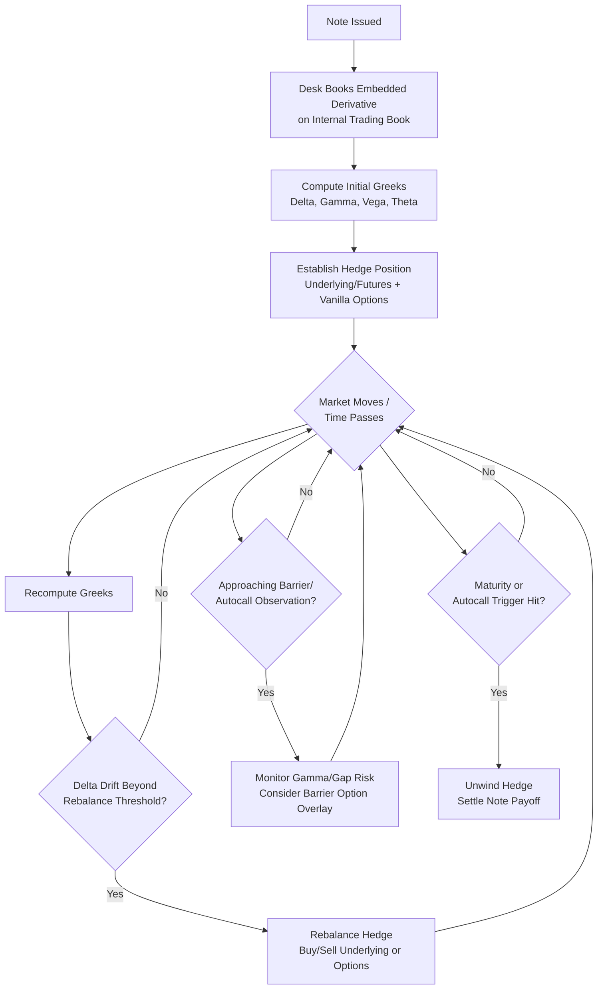

## Pricing and Hedging a New Structured Product

### Definition and Conceptual Overview

Pricing and hedging a new structured product is the process by which an issuer's derivatives/structuring desk determines the fair value of a proposed payoff, converts that value into investor-facing economic terms (coupon, participation rate, barrier level), and establishes the trading strategy required to manage the resulting market risk over the product's life. This process sits at the intersection of **derivatives valuation** (deriving a theoretical price from market inputs), **structuring economics** (allocating available margin between investor terms and issuer profit), and **risk management** (constructing and maintaining a hedge portfolio).

**Key Points**

- Pricing a structured note is fundamentally **pricing a bond plus one or more embedded derivatives**, decomposed and valued separately, then reassembled.
- The "price" the issuer solves for is typically not a dollar value but a **structuring variable** (coupon rate, participation rate, barrier level, cap) that makes the total package cost exactly 100% (par) to manufacture, inclusive of the desk's target margin.
- Hedging is not a one-time event at issuance but a **continuous, dynamic process** spanning the note's entire life, requiring rebalancing as market conditions, time-to-maturity, and underlying levels evolve.

---

### The Pricing Workflow

#### Step 1: Decompose the Payoff into Component Derivatives

Any structured note payoff can be decomposed into a linear combination of a zero-coupon bond and standard (or exotic) options. For example, a capped participation note:

$$\text{Payoff} = N \times \left[1 + \min\left(\text{Cap}, \text{Participation} \times \max\left(0, \frac{S_T - K}{K}\right)\right)\right]$$

decomposes into:

- A zero-coupon bond paying $N$ at maturity
- A long position in $\text{Participation} \times N/K$ units of an **at-the-money call option**
- A short position in the same notional of an **out-of-the-money call option** struck at the cap level (creating a call spread)

#### Step 2: Price Each Component

- **Bond component**: discounted at the issuer's own funding curve (own-credit-adjusted discount curve), reflecting the issuer's cost of unsecured borrowing at the relevant tenor.

$$PV_{\text{bond}} = N \times e^{-(r_f + s_{\text{issuer}}) \times T}$$

where $r_f$ is the risk-free rate and $s_{\text{issuer}}$ is the issuer's credit spread.

- **Option component(s)**: priced using an appropriate model given the underlying's dynamics — Black-Scholes/Black-76 for simple vanilla payoffs, local volatility or stochastic volatility models (Heston, SABR) for barrier/path-dependent features, and Monte Carlo simulation for basket/worst-of/multi-asset payoffs.

$$PV_{\text{option}} = e^{-r_f T} \, \mathbb{E}^{\mathbb{Q}}[\text{Option Payoff}]$$

Note the option is discounted at the **risk-free/OIS-based discount curve** (consistent with standard derivatives collateralized-discounting practice), while the bond leg uses the **issuer's own credit-adjusted curve** — a critical and sometimes overlooked distinction in decomposed pricing.

#### Step 3: Assemble Total Cost and Solve for Structuring Variable

$$100\% = PV_{\text{bond}} + PV_{\text{option net}} + \text{Distribution Fee} + \text{Desk Margin}$$

The structuring variable (e.g., participation rate, coupon) is solved such that this equation balances to exactly par (100% of issue price), given all other terms fixed.

**Example**

*Solving for Participation Rate on a 5-Year Capped Note*

- Notional: $1,000,000
- Issuer 5Y funding rate: 5.20% (own credit-adjusted)
- Risk-free discount rate: 4.00%
- $PV_{\text{bond}} = 1{,}000{,}000 \times e^{-0.052 \times 5} = 771{,}630$
- Available budget for options + fees: $1{,}000{,}000 - 771{,}630 = 228{,}370$
- Distribution fee (3.0% upfront): $30{,}000$
- Desk margin (target 1.0%): $10{,}000$
- Net option budget: $228{,}370 - 30{,}000 - 10{,}000 = 188{,}370$
- Given the priced cost of a 5Y ATM call spread (0%–50% cap) per unit participation is $1,850 per 1% participation, solve: Participation Rate $= 188{,}370 / 1{,}850 \approx 101.8\%$, rounded down to a marketable **100% participation, 50% cap**

---

### Diagram: Pricing Waterfall (svg_diagram)

<svg xmlns="http://www.w3.org/2000/svg" viewBox="0 0 900 380">
<text x="450" y="25" font-size="16" font-weight="bold" text-anchor="middle">Structured Note Pricing Waterfall (svg_diagram)</text>
<rect x="50" y="60" width="800" height="45" fill="#dbeafe" stroke="#1e3a8a" stroke-width="1.5" />
<text x="450" y="87" font-size="12" text-anchor="middle" font-weight="bold">Issue Price = 100% of Notional</text>
<line x1="450" y1="105" x2="450" y2="135" stroke="black" stroke-width="1.5" marker-end="url(#a4)" />
<rect x="50" y="140" width="240" height="55" fill="#fef3c7" stroke="#92400e" stroke-width="1.5" />
<text x="170" y="162" font-size="11" text-anchor="middle" font-weight="bold">PV of Zero-Coupon Bond</text>
<text x="170" y="178" font-size="9" text-anchor="middle">Discounted at issuer's own</text>
<text x="170" y="190" font-size="9" text-anchor="middle">credit-adjusted funding curve</text>
<rect x="330" y="140" width="240" height="55" fill="#dcfce7" stroke="#166534" stroke-width="1.5" />
<text x="450" y="162" font-size="11" text-anchor="middle" font-weight="bold">Option Budget</text>
<text x="450" y="178" font-size="9" text-anchor="middle">100% − PV(Bond) =</text>
<text x="450" y="190" font-size="9" text-anchor="middle">funds embedded derivative</text>
<rect x="610" y="140" width="240" height="55" fill="#fee2e2" stroke="#991b1b" stroke-width="1.5" />
<text x="730" y="162" font-size="11" text-anchor="middle" font-weight="bold">Fees &amp; Margin</text>
<text x="730" y="178" font-size="9" text-anchor="middle">Distribution fee +</text>
<text x="730" y="190" font-size="9" text-anchor="middle">Desk target margin</text>
<line x1="450" y1="195" x2="450" y2="225" stroke="black" stroke-width="1.5" marker-end="url(#a4)" />
<rect x="280" y="230" width="340" height="55" fill="#ede9fe" stroke="#5b21b6" stroke-width="1.5" />
<text x="450" y="252" font-size="11" text-anchor="middle" font-weight="bold">Net Option Budget</text>
<text x="450" y="268" font-size="9" text-anchor="middle">Option Budget − Fees − Margin</text>
<text x="450" y="280" font-size="9" text-anchor="middle">= funds available for actual option purchase</text>
<line x1="450" y1="285" x2="450" y2="310" stroke="black" stroke-width="1.5" marker-end="url(#a4)" />
<rect x="230" y="315" width="440" height="55" fill="#fde68a" stroke="#854d0e" stroke-width="1.5" />
<text x="450" y="337" font-size="11" text-anchor="middle" font-weight="bold">Solve for Structuring Variable</text>
<text x="450" y="353" font-size="9" text-anchor="middle">Net Budget ÷ Cost per Unit Participation</text>
<text x="450" y="365" font-size="9" text-anchor="middle">= Participation Rate / Coupon / Barrier Level offered to investor</text>
</svg>

---

### Hedging Framework

#### Static vs. Dynamic Hedging

- **Static hedge**: for simple vanilla-option-based payoffs (e.g., plain capped participation notes), the desk can often purchase/sell the exact offsetting options from the listed or OTC market at inception and hold them largely unchanged to maturity, since the payoff replicates a static option combination.
- **Dynamic hedge**: for path-dependent, barrier, or exotic features (autocall triggers, knock-in puts, digital coupons), no static replicating portfolio exists; the desk must **delta-hedge** continuously, rebalancing the hedge position as the underlying moves, time passes, and volatility changes.

#### Greeks-Based Dynamic Hedging

The desk manages a **Greeks book** aggregating the risk of all structured products referencing a given underlying (or correlated underlyings), hedging at the portfolio level rather than trade-by-trade:

$$\Delta = \frac{\partial V}{\partial S}, \quad \Gamma = \frac{\partial^2 V}{\partial S^2}, \quad \mathcal{V} = \frac{\partial V}{\partial \sigma}, \quad \Theta = \frac{\partial V}{\partial t}, \quad \rho = \frac{\partial V}{\partial r}$$

- **Delta hedging**: buying/selling the underlying (or futures/forwards) to neutralize first-order price sensitivity; rebalanced as delta changes with spot moves (gamma) and time (theta-driven delta decay near barriers).
- **Vega hedging**: buying/selling other options (typically vanilla options in the listed or OTC market) to offset the note's sensitivity to implied volatility changes, since a bank cannot easily "delta hedge away" vega risk using the underlying alone.
- **Barrier/gap risk hedging**: near knock-in/knock-out barriers, delta can change discontinuously (particularly for digital or American-style barriers), creating **gamma/gap risk** that is difficult to hedge perfectly with discrete rebalancing — banks often purchase actual barrier options or use static replication techniques (e.g., replicating a barrier with a portfolio of vanilla options, per Carr-Chou/Derman-Ergener-Kani static replication methods) to reduce this residual risk.

**Key Points**

- **Autocallable notes** are a canonical example of complex dynamic hedging: near an autocall observation date with spot close to the trigger, the note's delta can swing sharply (the note behaves very differently depending on whether it autocalls or not), generating large gamma exposure that requires active, sometimes costly, rebalancing.
- Dynamic hedging is never perfect: **residual P&L (hedging slippage)** arises from discrete rebalancing (vs. continuous theoretical hedging), transaction costs, and model risk (the model used to compute the hedge ratios may not match true market dynamics) — this is a standard, well-documented feature of dynamic hedging, not specific to any one desk's competence.

---

### Diagram: Delta-Hedging Lifecycle (Mermaid)

---

### Model Selection by Payoff Type

| Payoff Feature | Typical Pricing Model | Key Model Risk |
| --- | --- | --- |
| Vanilla call/put participation | Black-Scholes / Black-76 | Implied vol surface interpolation |
| Barrier (knock-in/knock-out) | Local volatility model | Barrier sensitivity to vol skew assumptions |
| Autocallable (path-dependent, multiple triggers) | Monte Carlo under local/stochastic vol | Path simulation granularity, correlation assumptions |
| Worst-of / basket (multi-asset) | Monte Carlo with copula/correlation matrix | Correlation risk premium mis-estimation |
| American/Bermudan-style features (callable) | Finite difference / tree methods (PDE) or Longstaff-Schwartz Monte Carlo | Early-exercise boundary approximation |
| Rate-linked (CMS, range accrual) | LIBOR Market Model (LMM) / Hull-White | Convexity adjustment accuracy |
| Digital/binary coupon | Black-Scholes digital formula or vertical call spread approximation | Discontinuity near barrier (gap risk) |

---

### Volatility Surface and Skew Considerations

- Structured products with **out-of-the-money puts** (e.g., autocallable downside barriers) are particularly sensitive to the **volatility skew** (the tendency for OTM put implied volatility to exceed ATM implied volatility in equity markets) — pricing these features using a flat/ATM volatility assumption would materially misprice the embedded put, typically understating its cost.
- The desk calibrates its pricing model (local vol surface, SABR parameters, or stochastic vol model parameters) to the **observed listed options market** (where liquid) and extrapolates/interpolates for strikes, tenors, or underlyings without direct listed market coverage — introducing model/extrapolation risk for bespoke baskets or long-dated tenors beyond listed option liquidity.

---

### Funding Rate and Issuer Credit Spread Impact

**Key Points**

- The issuer's own credit spread is a **first-order driver** of achievable structuring terms: a wider issuer credit spread increases $PV_{\text{bond}}$'s discount (lowers its present value), freeing up more budget for the option component, thereby **enabling more attractive investor-facing terms** (higher participation, higher coupon) — somewhat counterintuitively, a riskier issuer can sometimes offer better headline terms, all else equal, because more of the par proceeds are freed for optionality rather than funding the bond floor.
- This dynamic is a well-documented structural feature of structured note economics and is a reason sophisticated investors evaluate structured note terms **relative to the specific issuer's credit spread**, not in isolation — comparing headline coupons across issuers without adjusting for credit spread differences can be misleading.
- Changes in the issuer's own funding level between term sheet publication and trade date pricing can shift final achievable terms, another source of the "indicative vs. final" terms gap discussed in issuance documentation.

---

### Desk Organization and Risk Aggregation

- Structuring/pricing typically involves coordination between:
  - **Structuring desk**: designs payoffs, communicates with distributors/sales, solves structuring variables
  - **Trading/hedging desk**: owns the resulting derivative risk on its book, manages Greeks across the aggregated portfolio of all similar structured products referencing that underlying
  - **Quant/model validation team**: builds, validates, and maintains the pricing models used, ensuring consistency and appropriate model risk controls
  - **Risk management**: monitors aggregate exposure limits (VaR, stress scenarios, concentration limits) across the structured product book
- Because many retail-distributed structured notes are **small-denomination but high-volume**, desks typically **aggregate risk across many similar notes** referencing the same or correlated underlyings into a single Greeks book, hedging the net exposure rather than hedging each note individually — this is materially more capital and operationally efficient.

---

### Post-Issuance Hedge Maintenance and Lifecycle Risk

- **Corporate actions** (equity underlyings): stock splits, spin-offs, mergers, and special dividends require **hedge and strike adjustment**, governed by the note's Conditions (often referencing standard equity derivatives definitions adjustment methodologies) and executed jointly by the calculation agent and hedging desk.
- **Rate resets/fixings**: for CMS or rate-linked notes, hedge rebalancing occurs around each fixing/reset date as forward-starting exposure crystallizes into realized cash flows.
- **Credit events** (credit-linked notes): trigger an immediate, discontinuous hedge unwind and settlement process (physical or cash settlement per ISDA credit derivatives auction mechanics), fundamentally different from the continuous rebalancing used for market risk hedging.
- **Autocall/knock-out events**: trigger early termination of both the note and its corresponding hedge, requiring the desk to unwind the hedge position at that point, with any residual hedging P&L (positive or negative) accruing to the issuer's trading book rather than affecting the investor's fixed payoff.

---

### Common Pitfalls and Misconceptions

- **Assuming the headline coupon/participation rate reflects "generosity"**: terms are a mechanical output of funding rate, volatility levels, and issuer credit spread — comparing terms across issuers or time periods without adjusting for these inputs conflates market conditions with issuer competitiveness.
- **Underestimating gap/gamma risk near barriers**: assuming continuous, costless rebalancing is achievable in practice; real-world discrete hedging near sharp payoff discontinuities (digitals, barriers) generates real, sometimes material, hedging slippage that the desk's margin must absorb or that influences the desk's willingness to price certain features aggressively.
- **Ignoring the discounting curve mismatch**: applying the issuer's own credit spread to discount the option leg (rather than only the bond leg) would misprice the derivative component — the bond and option legs are priced on **different discount curves** by design.
- **Treating pricing models as objectively "correct"**: all option pricing for exotic/path-dependent features relies on model assumptions (volatility dynamics, correlation) that are calibrated to available market data but extrapolated where data is sparse — model risk is inherent and managed, not eliminated.

---

### Related Topics

- Volatility Surface Construction and Skew/Smile Modeling
- Static Replication of Barrier Options
- Monte Carlo Methods for Path-Dependent and Multi-Asset Payoffs
- Issuer Own-Credit Risk and Funding Valuation Adjustment (FVA)
- Autocallable Note Gamma and Gap Risk Management
- Corporate Action Adjustment Methodology in Equity Derivatives
- LIBOR Market Model and CMS Convexity Adjustments
- Greeks Aggregation and Portfolio-Level Risk Management
- Model Validation and Model Risk Governance in Derivatives Pricing
- Structuring Desk Margin and Distribution Fee Economics