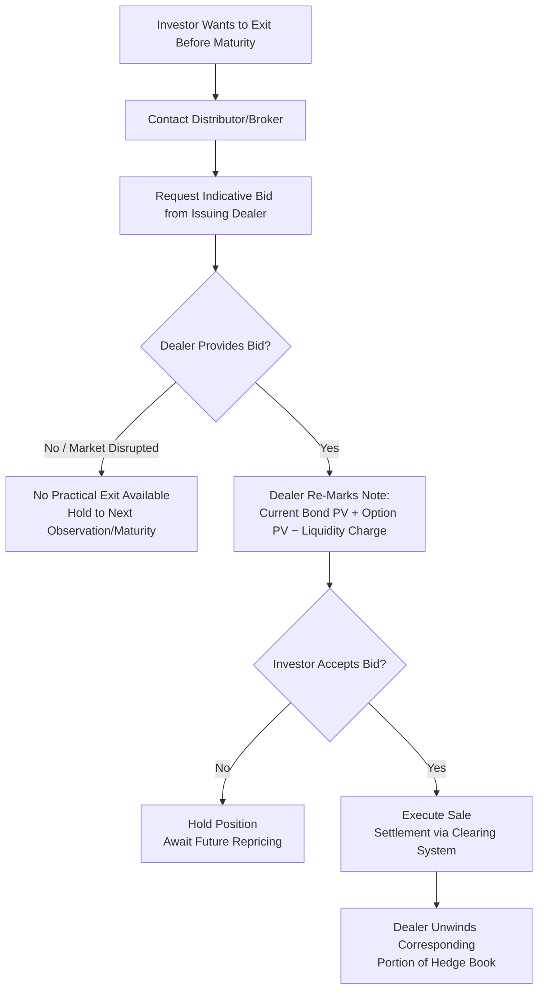

## Secondary Market Making and Liquidity Provision

### Definition and Conceptual Overview

Secondary market making and liquidity provision refers to the ongoing process by which an issuer or issuing dealer provides **bid prices** (and sometimes offer prices) at which investors can sell (or occasionally buy) structured notes before maturity. Because structured notes are generally not exchange-traded in any liquid sense — even when nominally "listed" — the issuing dealer's willingness and ability to make a market is typically the **sole practical liquidity channel** available to investors seeking to exit a position early.

**Key Points**

- Secondary liquidity for structured notes is fundamentally **dealer-provided, not market-provided**: there is no independent order book, exchange matching engine, or competing market-maker ecosystem comparable to listed equities or liquid bonds.
- The issuing dealer is typically under **no contractual obligation** to make a market (absent specific commitments disclosed in offering documents), though many maintain informal or policy-level commitments to provide indicative and executable bids as a matter of franchise/reputational practice.
- Secondary market prices are **model-derived, not observed** — the bid reflects the dealer's re-marked theoretical value of the note (bond floor + current option value) using updated market inputs, not a price discovered through competitive trading.

---

### How Secondary Bids Are Constructed

The dealer's secondary market bid mirrors the original pricing decomposition, but marked to **current** market conditions rather than conditions at issuance:

$$\text{Bid Price} = PV_{\text{bond, current}}(t) + PV_{\text{option, current}}(t) - \text{Bid-Offer Spread/Liquidity Charge}$$

where:

- $PV_{\text{bond, current}}(t)$ reflects the issuer's **current** credit spread and discount curve at the remaining tenor (not the spread at issuance)
- $PV_{\text{option, current}}(t)$ reflects the **current** underlying level, implied volatility, rates, and time decay
- The **liquidity charge** compensates the dealer for hedge unwind costs, operational effort, and the fact that the dealer is providing a bid without a corresponding natural offsetting buyer

**Example**

*Repricing a 3-Year Autocallable Mid-Life*

- Original issuance: Euro Stoxx 50-linked autocallable, 8% p.a. contingent coupon, 60% barrier, issued 18 months ago at par (100%)
- Current market conditions: Euro Stoxx 50 down 15% since issuance, implied volatility up 4 vol points, issuer credit spread widened by 25bp
- Repricing impact:
  - Lower underlying level increases probability of barrier breach → embedded short put is more in-the-money → **reduces** note value
  - Higher implied volatility increases the value of the embedded optionality the issuer is short → **reduces** note value further
  - Wider issuer credit spread **increases** the discount applied to the bond floor → **reduces** note value (paradoxically, worse issuer credit typically lowers, not raises, secondary bid value, since the bond floor is discounted more heavily)
  - Net effect: secondary bid likely well below par (e.g., 78%–85%), reflecting the combined negative moves, even though no credit event or default has occurred

---

### Diagram: Secondary Bid Construction (svg_diagram)

<svg xmlns="http://www.w3.org/2000/svg" viewBox="0 0 900 380">
<text x="450" y="25" font-size="16" font-weight="bold" text-anchor="middle">Secondary Market Bid Construction (svg_diagram)</text>
<rect x="40" y="60" width="230" height="70" fill="#dbeafe" stroke="#1e3a8a" stroke-width="1.5" />
<text x="155" y="82" font-size="11" text-anchor="middle" font-weight="bold">Current Bond Floor PV</text>
<text x="155" y="98" font-size="9" text-anchor="middle">Remaining tenor discounted at</text>
<text x="155" y="112" font-size="9" text-anchor="middle">CURRENT issuer credit spread</text>
<rect x="330" y="60" width="230" height="70" fill="#dcfce7" stroke="#166534" stroke-width="1.5" />
<text x="445" y="82" font-size="11" text-anchor="middle" font-weight="bold">Current Option Value</text>
<text x="445" y="98" font-size="9" text-anchor="middle">Re-marked to current spot,</text>
<text x="445" y="112" font-size="9" text-anchor="middle">vol, rates, time-to-maturity</text>
<rect x="620" y="60" width="230" height="70" fill="#fee2e2" stroke="#991b1b" stroke-width="1.5" />
<text x="735" y="82" font-size="11" text-anchor="middle" font-weight="bold">Liquidity/Bid-Offer Charge</text>
<text x="735" y="98" font-size="9" text-anchor="middle">Hedge unwind cost +</text>
<text x="735" y="112" font-size="9" text-anchor="middle">dealer compensation</text>
<line x1="155" y1="130" x2="450" y2="180" stroke="black" stroke-width="1.5" marker-end="url(#a5)" />
<line x1="445" y1="130" x2="450" y2="180" stroke="black" stroke-width="1.5" marker-end="url(#a5)" />
<line x1="735" y1="130" x2="450" y2="180" stroke="black" stroke-width="1.5" marker-end="url(#a5)" />
<rect x="280" y="190" width="340" height="60" fill="#ede9fe" stroke="#5b21b6" stroke-width="1.5" />
<text x="450" y="213" font-size="11" text-anchor="middle" font-weight="bold">Dealer Secondary Bid</text>
<text x="450" y="230" font-size="9" text-anchor="middle">Bond PV + Option PV − Liquidity Charge</text>
<line x1="450" y1="250" x2="450" y2="280" stroke="black" stroke-width="1.5" marker-end="url(#a5)" />
<rect x="250" y="285" width="400" height="70" fill="#fef3c7" stroke="#92400e" stroke-width="1.5" />
<text x="450" y="308" font-size="11" text-anchor="middle" font-weight="bold">Investor Exit Price</text>
<text x="450" y="325" font-size="9" text-anchor="middle">Can be significantly above or below par</text>
<text x="450" y="340" font-size="9" text-anchor="middle">depending on market moves since issuance</text>
</svg>

---

### Drivers of Secondary Price Movement

| Factor | Effect on Secondary Bid | Mechanism |
| --- | --- | --- |
| Underlying spot decline (below barrier proximity) | Decreases | Embedded short put more in-the-money |
| Underlying spot rally | Increases (up to cap, if any) | Embedded option gains value |
| Implied volatility increase | Decreases (for short-vol structures like autocallables) | Issuer's short option position more costly to unwind |
| Implied volatility decrease | Increases (for short-vol structures) | Cheaper to unwind short option position |
| Issuer credit spread widening | Decreases | Bond floor discounted more heavily |
| Issuer credit spread tightening | Increases | Bond floor discounted less heavily |
| Time decay (theta), all else equal | Varies by structure | Barrier notes often gain value approaching autocall dates if spot is favorable; erodes optionality value otherwise |
| Interest rate changes | Varies | Affects both discounting and forward pricing of underlying |
| Passage through autocall observation dates without trigger | Can increase or decrease | Removes near-term autocall optionality, shifts risk profile toward final maturity payoff |

**Key Points**

- Secondary prices for structured notes, especially autocallables and other short-volatility structures, can be **highly non-linear and counterintuitive** relative to simple underlying price moves — a note can lose significant secondary value even when the underlying has only modestly declined, if implied volatility has risen sharply, since the issuer's embedded short-option position becomes materially more expensive to hedge/unwind.
- The **issuer credit spread effect** is frequently misunderstood by investors: a *widening* of the issuer's own credit spread (implying higher perceived default risk) typically **reduces** the note's secondary mark-to-market value (because the bond floor is discounted more), even though intuitively investors might expect "more risk priced in" to mean something different — this is a standard, mechanical discounting effect, not a market anomaly.

---

### Bid-Offer Spreads and Cost of Early Exit

- Bid-offer spreads on structured note secondary markets are typically **wider** than for the underlying reference assets themselves, reflecting:
  - The bespoke, non-fungible nature of each note (unique ISIN, unique terms) — no netting or pooling of liquidity across similar notes
  - The cost and operational complexity of unwinding the dealer's specific hedge for that note
  - The absence of competing market-makers to discipline pricing
- For complex or illiquid underlyings (bespoke baskets, single-dealer QIS indices, less liquid emerging market equities), bid-offer spreads can be **substantially wider**, and in stressed market conditions the dealer may **widen spreads further or temporarily suspend secondary bidding** ("market disruption" or "no bid" conditions), leaving investors with no practical exit until conditions normalize.

**Key Points**

- Early exit before maturity should generally be viewed by investors as **potentially costly and uncertain in timing/price**, not as a reliable liquidity option comparable to selling a listed security — this is a standard structural characteristic of the asset class rather than a defect specific to any issuer.

---

### Diagram: Secondary Liquidity Decision Flow (Mermaid)

---

### Regulatory and Best Execution Considerations

- Under **MiFID II best execution** requirements, when a distributor executes a client's sell order for a structured note, it must take sufficient steps to obtain the best possible result for the client — though in practice, for single-dealer bespoke notes, the **issuing dealer is frequently the only available liquidity source**, limiting the practical scope for best-execution price comparison across multiple counterparties.
- Some distributors and platforms have developed **multi-dealer secondary trading facilities** or request-for-quote (RFQ) platforms for certain standardized note types, allowing competing bids from multiple dealers — though this remains far less developed than for other fixed income or equity markets, and coverage varies significantly by product type, issuer, and jurisdiction. [Unverified: the extent of multi-dealer secondary liquidity platform coverage varies and should be confirmed against current market infrastructure for the specific product type in question.]
- **Fair valuation obligations**: many jurisdictions require regular, independent-as-possible valuation reporting to investors (e.g., periodic statements showing estimated secondary market value), even absent an actual trade, requiring dealers/administrators to maintain valuation models and processes distinct from (but consistent with) their live bid-making process.

---

### Market-Making Desk Operations

- The market-making function is typically housed within the same **hybrid/structuring derivatives desk** that originally priced and hedges the note, since re-marking and unwinding requires the same pricing models and hedge infrastructure used at issuance.
- Desks maintain **inventory and hedge books** aggregated across many similar notes; a secondary buyback from one investor typically results in the dealer **holding the note on its own book** (as inventory) rather than immediately re-selling it to another investor, since structured notes lack a natural matching counterparty pool.
- Repurchased notes may be:
  - Held to maturity by the dealer, continuing to manage the associated hedge
  - Cancelled/extinguished (reducing the outstanding notional under the programme), if permitted by the note's terms
  - Occasionally re-offered to other investors, though this is less common given the bespoke, aged nature of the position (barriers/strikes fixed at original issuance levels may no longer be attractive to new investors)

**Key Points**

- Because the dealer absorbs repurchased notes onto its own inventory rather than passing risk to another investor, the dealer's **willingness to bid competitively** in stressed conditions is constrained by its own risk appetite and balance sheet capacity — a factor that can cause bid-offer spreads to widen precisely when investors most want to exit (procyclical liquidity risk), a well-documented characteristic of dealer-provided liquidity in stressed markets generally, not unique to structured notes.

---

### Investor Considerations for Secondary Market Interaction

**Next Steps**

- Request **indicative secondary pricing periodically** (not only when planning to sell) to understand the current mark-to-market value and how it has evolved relative to the underlying's performance and volatility environment.
- Understand that secondary bid levels reflect a **full repricing exercise**, not merely tracking the underlying's percentage move — request an explanation of the key drivers (spot, vol, credit spread, time decay) behind any given quote.
- For notes with **autocall features**, recognize that value can shift materially around each observation date, even without a trigger event, as the probability-weighted payoff distribution changes.
- Confirm whether any **secondary market-making commitment** is documented in the offering materials, and understand this is typically a policy/franchise practice rather than a binding contractual obligation, absent specific language to the contrary.
- For larger positions or less liquid/bespoke structures, consider requesting **staged/partial exit** discussions with the dealer, since large block sales may face wider effective spreads than smaller odd-lot sales.

---

### Common Pitfalls and Misconceptions

- **Assuming a "listed" note has exchange-level liquidity**: as noted in issuance documentation, exchange listing is frequently for regulatory/eligibility purposes only, not a source of tradeable on-exchange liquidity.
- **Expecting secondary value to track the underlying linearly**: non-linear payoff features (barriers, autocalls, digitals) combined with volatility and credit spread effects mean secondary value changes are rarely a simple percentage translation of underlying performance.
- **Assuming the issuer is contractually obligated to provide a bid**: absent specific documented commitments, market-making is typically discretionary, and can be curtailed in stressed conditions or for specific product types.
- **Overlooking the interaction between own-credit spread and secondary value**: investors sometimes mistakenly interpret a lower secondary bid as solely reflecting negative underlying performance, without recognizing the compounding (or offsetting) effect of the issuer's own credit spread movement.
- **Treating periodic account statement valuations as guaranteed executable prices**: statement-based fair value estimates may differ from the actual executable bid obtained at the time of a real sale request, given bid-offer spread and market movement between valuation date and execution.

---

### Related Topics

- Bond Floor and Embedded Option Decomposition in Secondary Repricing
- Issuer Own-Credit Spread Impact on Structured Note Valuation
- Autocallable Note Gamma Risk Near Observation Dates
- MiFID II Best Execution Obligations for Structured Products
- Multi-Dealer RFQ Platforms for Structured Note Secondary Trading
- Dealer Inventory Management and Hedge Book Aggregation
- Fair Valuation and Periodic Statement Reporting Requirements
- Market Disruption Events and Suspension of Secondary Bidding
- Bid-Offer Spread Determinants in OTC Structured Products
- Procyclical Liquidity Risk in Dealer-Provided Markets