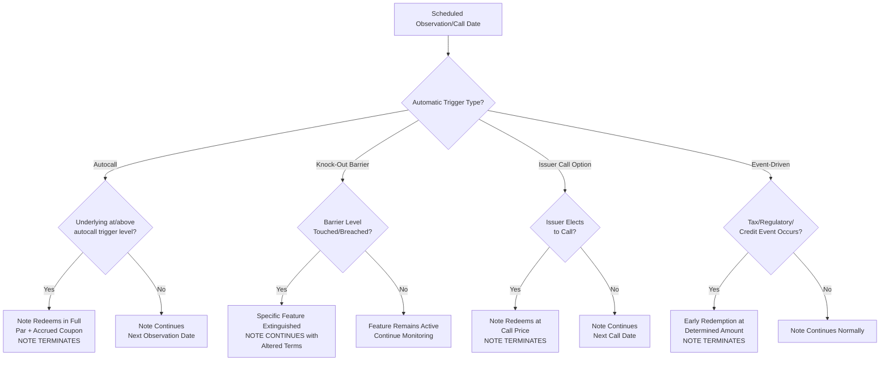

## Early Redemption and Knock Out Events

### Definition and Conceptual Overview

Early redemption and knock-out events refer to the contractual mechanisms by which a structured note terminates **before its scheduled final maturity date**, triggering an early payment to the investor (or, in some cases, an early loss crystallization) based on either the underlying's performance reaching a specified level, the passage of a predetermined callable date, or the occurrence of a specified event (such as a credit event or regulatory/tax event). These mechanisms fundamentally alter the note's expected life, cash flow timing, and reinvestment risk profile.

**Key Points**

- Early redemption can be **automatic** (triggered mechanically by market conditions, e.g., autocall/knock-out) or **discretionary** (triggered by a party's election, e.g., issuer call option or investor put, where available).
- A "knock-out" event typically **terminates the embedded option/barrier feature** (extinguishing further downside or upside optionality from that point), while an "autocall" typically **terminates the entire note**, paying out principal plus accrued coupon.
- These features are central to the economics of most modern structured notes — a large proportion of the current market issuance volume across autocallable-style products (equity, rate, credit, and hybrid-linked) includes some form of automatic early redemption feature, since it is a primary lever for enhancing achievable coupons within a fixed pricing budget.

---

### Taxonomy of Early Termination Mechanisms

#### 1. Autocall (Automatic Early Redemption)

- The note automatically redeems at par (or a specified early redemption amount, sometimes above par with an early redemption premium) if the underlying's level is at or above (or below, for some structures) a specified **autocall trigger level** on a scheduled **observation date**.
- Typically observed periodically (quarterly, semi-annually, annually) starting from an initial call-protection period (e.g., no autocall possible before Year 1).
- Once triggered, the note **terminates entirely** — no further coupons, no further exposure to the underlying.

$$\text{Autocall Condition (observation date } t_i\text{)}: \quad \frac{S(t_i)}{S(0)} \geq K_{\text{autocall}}$$

Often the autocall trigger **steps down** over time (a "step-down autocall"), making early redemption progressively easier to trigger as the note ages:

$$K_{\text{autocall}}(t_i) = K_0 - i \times \Delta K$$

#### 2. Knock-Out (Barrier Extinguishment)

- Distinguished from autocall in that a knock-out typically **extinguishes a specific optionality feature** (e.g., a knock-out put, removing downside protection or removing an upside participation cap feature) rather than terminating the entire note — the note continues to maturity, but with altered payoff characteristics from that point forward.
- Common in **knock-out barrier options** embedded within a note: e.g., a note with a knock-out call where, if the underlying touches a specified upper barrier at any point (American-style, continuous monitoring), the upside participation feature is extinguished and the investor reverts to a lower fixed floor/coupon for the remainder of the term.

#### 3. Issuer Call (Discretionary Early Redemption by Issuer)

- The issuer retains the contractual right (not obligation) to redeem the note early on specified call dates, typically at par plus accrued interest/coupon, or at a specified early redemption amount.
- Economically similar to a callable bond: the investor has effectively **sold a call option to the issuer**, compensated via an enhanced coupon relative to a non-callable equivalent.
- Issuer call decisions are typically driven by **funding economics** (if the issuer's funding cost falls, refinancing via a new, cheaper issuance becomes attractive) rather than by the underlying's performance.

#### 4. Event-Driven Early Redemption

- Triggered by specified events unrelated to the underlying's market performance:
  - **Tax event**: change in tax law imposing withholding or other adverse tax consequences on the issuer
  - **Regulatory event**: change in regulatory capital treatment making the note economically unattractive for the issuer to maintain
  - **Illegality/force majeure**: a change in law making performance of the note illegal or impossible
  - **Credit event** (for credit-linked notes): occurrence of a determined credit event on the reference entity, triggering credit-contingent early redemption/settlement per ISDA credit derivatives mechanics
  - **Market disruption persisting beyond a maximum deferral period**: extended market disruption events (e.g., trading suspension in the underlying) that cannot be resolved through the standard disruption/postponement provisions

**Example**

*Step-Down Autocallable Note — Full Trigger Schedule*

- Underlying: FTSE 100 Index
- Initial level: 7,500
- Tenor: 5 years, quarterly observations from Year 1
- Coupon: 7.20% p.a. (1.80% per quarter), contingent on 60% coupon barrier
- Autocall schedule (step-down):
  - Year 1 observations: autocall trigger = 100% (7,500)
  - Year 2 observations: autocall trigger = 97.5% (7,312.50)
  - Year 3 observations: autocall trigger = 95% (7,125)
  - Year 4 observations: autocall trigger = 92.5% (6,937.50)
  - Year 5 (final): autocall trigger = 90% (6,750); if not triggered, final redemption per worst-of/barrier formula applies

---

### Diagram: Autocall vs. Knock-Out Mechanics Comparison (svg_diagram)

<svg xmlns="http://www.w3.org/2000/svg" viewBox="0 0 900 420">
<text x="450" y="25" font-size="16" font-weight="bold" text-anchor="middle">Autocall vs. Knock-Out — Structural Comparison (svg_diagram)</text>

<text x="230" y="55" font-size="12" font-weight="bold" text-anchor="middle">AUTOCALL</text>

<line x1="60" y1="200" x2="400" y2="200" stroke="#333" stroke-width="2" />

<text x="60" y="215" font-size="9">Issue</text>

<circle cx="150" cy="200" r="5" fill="`#166534`" />

<text x="150" y="215" font-size="9" text-anchor="middle">Obs 1</text>

<text x="150" y="185" font-size="8" text-anchor="middle">Not triggered</text>

<circle cx="250" cy="200" r="5" fill="`#166534`" />

<text x="250" y="215" font-size="9" text-anchor="middle">Obs 2</text>

<text x="250" y="185" font-size="8" text-anchor="middle">Not triggered</text>

<circle cx="350" cy="200" r="7" fill="`#991b1b`" />

<text x="350" y="215" font-size="9" text-anchor="middle" font-weight="bold">Obs 3</text>

<text x="350" y="185" font-size="8" text-anchor="middle" font-weight="bold">TRIGGERED</text>

<line x1="350" y1="200" x2="400" y2="200" stroke="`#991b1b`" stroke-width="3" stroke-dasharray="5,3" />

<text x="400" y="240" font-size="9" text-anchor="middle">Note terminates entirely.</text>

<text x="400" y="253" font-size="9" text-anchor="middle">Par + accrued coupon paid.</text>

<text x="400" y="266" font-size="9" text-anchor="middle">No further underlying exposure.</text>

<text x="700" y="55" font-size="12" font-weight="bold" text-anchor="middle">KNOCK-OUT (Barrier)</text>

<line x1="530" y1="200" x2="870" y2="200" stroke="#333" stroke-width="2" />

<text x="530" y="215" font-size="9">Issue</text>

<circle cx="620" cy="200" r="5" fill="`#166534`" />

<text x="620" y="215" font-size="9" text-anchor="middle">Monitor</text>

<circle cx="700" cy="200" r="7" fill="`#854d0e`" />

<text x="700" y="215" font-size="9" text-anchor="middle" font-weight="bold">Barrier Touched</text>

<text x="700" y="185" font-size="8" text-anchor="middle" font-weight="bold">Feature extinguished</text>

<circle cx="800" cy="200" r="5" fill="`#5b21b6`" />

<text x="800" y="215" font-size="9" text-anchor="middle">Continues</text>

<circle cx="870" cy="200" r="7" fill="`#1e3a8a`" />

<text x="870" y="215" font-size="9" text-anchor="middle" font-weight="bold">Maturity</text>

<text x="700" y="250" font-size="9" text-anchor="middle">Note CONTINUES to maturity.</text>

<text x="700" y="263" font-size="9" text-anchor="middle">Specific feature (e.g., cap/floor)</text>

<text x="700" y="276" font-size="9" text-anchor="middle">altered for remaining life.</text>

</svg>

---

### Diagram: Early Redemption Decision Tree (Mermaid)

---

### Determination of Early Redemption Amount

The amount paid upon early redemption varies significantly by trigger type:

| Trigger Type | Typical Redemption Amount |
| --- | --- |
| Autocall (performance-based) | Par (100%) plus accrued/current period coupon; occasionally a premium above par for early years |
| Issuer call (discretionary) | Par plus accrued coupon, or a specified make-whole/call price per the Conditions |
| Tax/regulatory event | "Fair market value" as determined by the calculation agent, which may be above, at, or below par |
| Illegality/force majeure | Fair market value, often with limited ability for investors to contest the calculation agent's determination |
| Credit event (credit-linked notes) | Recovery-value-based settlement per ISDA auction/cash settlement mechanics — often well below par |

**Key Points**

- Event-driven early redemptions (tax, regulatory, illegality) are a source of material investor uncertainty because the redemption amount is **calculation-agent-determined "fair value"** rather than a pre-specified formula — this can result in redemption significantly below the investor's expectation, particularly if triggered during adverse market conditions, and this discretion is a standard, disclosed feature of most note Conditions rather than an unusual or aggressive term.

---

### Reinvestment Risk from Early Redemption

- Autocall features are structurally more likely to trigger in **favorable market conditions** (underlying at or above initial/step-down levels) — precisely the environment in which **reinvestment options may also be less attractive** (e.g., if rates have fallen or volatility has compressed, reducing achievable coupons on a replacement note).
- This creates a structural **reinvestment risk asymmetry**: investors receive their capital back early exactly when redeploying it into a similarly attractive new structure may be harder, a standard and well-recognized feature of autocallable products (directly analogous to prepayment risk in callable bonds/mortgages).
- Conversely, if the note is **not** autocalled (underlying underperforming), the investor's capital remains locked in a potentially underperforming position for longer, with principal increasingly at risk as the note approaches final maturity without triggering.

**Key Points**

- The **expected life** of an autocallable note is therefore a probability-weighted, path-dependent quantity — pricing and risk models typically compute an **expected time to autocall** and a **probability distribution across observation dates** (including the "never autocalls, goes to maturity" scenario) rather than treating maturity as a fixed, certain date.

---

### Calculation Agent Role in Trigger Determination

- The **calculation agent** (typically the issuer or an issuer affiliate) is contractually responsible for:
  - Observing and confirming whether autocall/knock-out trigger conditions are met on each observation date, using the officially defined closing/reference level methodology
  - Applying any **market disruption event** provisions if the underlying cannot be properly observed on a scheduled date (postponing observation per specified fallback provisions)
  - Determining "fair market value" redemption amounts for event-driven early terminations
- As with other calculation agent functions, these determinations are typically **binding on the issuer and noteholders absent manifest error**, concentrating discretion in a party that is generally not independent from the issuer — a standard structural feature of note documentation requiring investor awareness rather than an unusual or exceptional risk.

---

### Impact on Hedging (Cross-Reference to Pricing/Hedging Desk)

- Approaching an autocall observation date with the underlying near the trigger level generates significant **gamma risk** for the issuer's hedging desk, since the note's expected future cash flows (and therefore its delta) can change sharply depending on whether the trigger is hit.
- Upon an actual autocall/early redemption event, the desk must **immediately unwind the corresponding hedge position**, crystallizing any residual hedging P&L (which accrues to the issuer, not the investor, since the investor's payoff is fixed once the trigger event determination is made).
- Knock-out barrier events (which extinguish a feature but do not terminate the note) require the desk to **restructure its ongoing hedge** to reflect the altered payoff profile for the note's remaining life, rather than a full unwind.

---

### Investor Considerations

**Next Steps**

- Review the **full autocall/step-down schedule** (not just the headline coupon) to understand how trigger levels evolve over the note's life and how this affects the probability-weighted expected holding period.
- Model or request scenario analysis showing **expected redemption timing** under different market path assumptions (e.g., flat, rising, declining, high-volatility scenarios).
- Understand the distinction between an **autocall** (full termination) and a **knock-out** (feature extinguishment, note continues) as applied to the specific note's Conditions, since terminology can vary by issuer and product.
- For notes with **issuer call rights**, recognize the asymmetry: the issuer will generally only call when advantageous to the issuer (e.g., falling funding costs), meaning the investor's "option" (enhanced coupon for accepting call risk) is systematically exercised against the investor's own reinvestment interests.
- For **event-driven early redemption** provisions, review the specific "fair market value" determination methodology described in the Conditions to understand the calculation agent's discretion and any dispute/challenge mechanisms (typically limited).

---

### Common Pitfalls and Misconceptions

- **Assuming autocall is purely a positive feature**: while autocall enables enhanced coupons and returns capital early in favorable scenarios, it caps upside (the investor does not participate in further underlying appreciation beyond the trigger level) and introduces reinvestment risk precisely when conditions are favorable.
- **Confusing knock-out with autocall terminology**: using these terms interchangeably can lead to incorrect assumptions about whether a triggered event ends the note entirely or merely alters a specific feature — always confirm against the specific note's Conditions.
- **Underestimating issuer call risk asymmetry**: treating an issuer call feature as symmetric optionality, when in practice the issuer's exercise decision is economically one-sided (funding-cost-driven) against the investor.
- **Overlooking "fair market value" redemption uncertainty**: assuming event-driven early redemptions will return par, when the actual determination can differ materially, particularly during adverse market conditions coinciding with the triggering event.
- **Ignoring path dependency in expected maturity**: treating the stated final maturity date as the expected holding period, rather than recognizing that autocallable notes have a probability-weighted expected life that is typically shorter than the stated final maturity.

---

### Related Topics

- Step-Down Autocall Structuring and Coupon Enhancement Mechanics
- Gamma Risk Management Near Autocall Observation Dates
- Callable Note Economics and Issuer Refinancing Incentives
- Calculation Agent Discretion in Fair Market Value Determinations
- Market Disruption Events and Observation Date Postponement
- ISDA Credit Event Determination and Settlement Mechanics
- Expected Life Modeling for Path-Dependent Structured Notes
- Reinvestment Risk in Callable and Autocallable Instruments
- Secondary Market Repricing Around Autocall Trigger Levels
- Knock-In vs. Knock-Out Barrier Option Mechanics